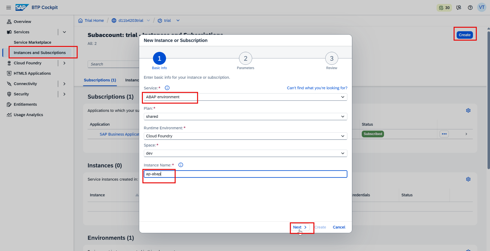
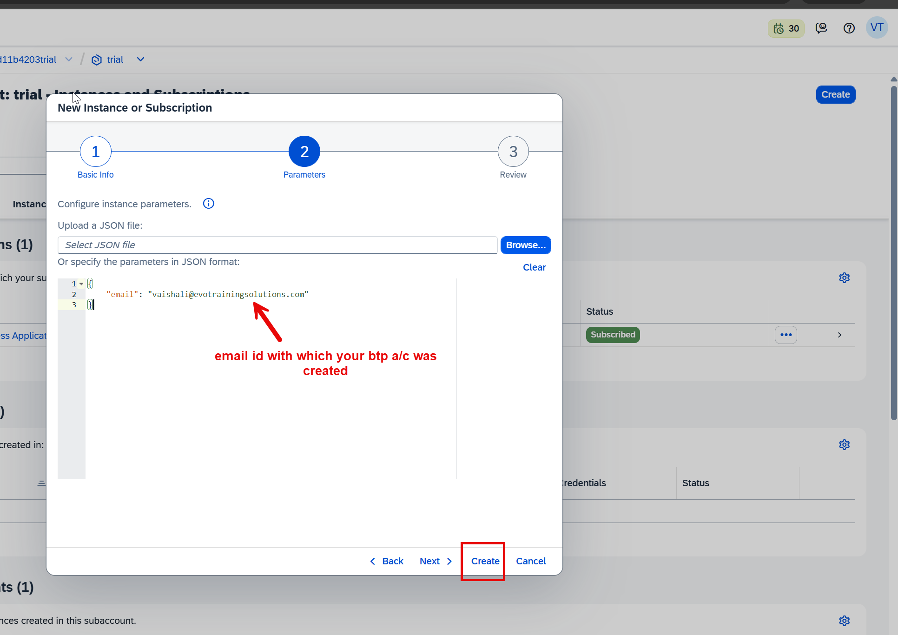
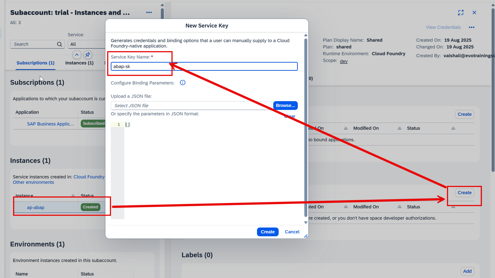
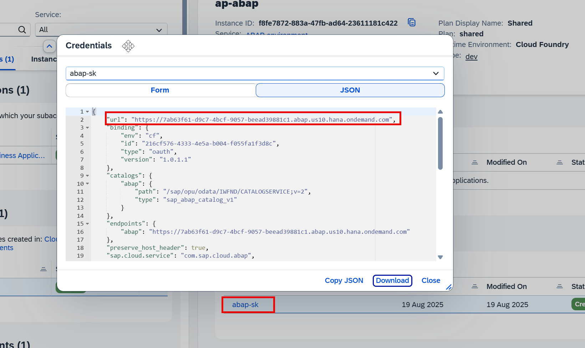
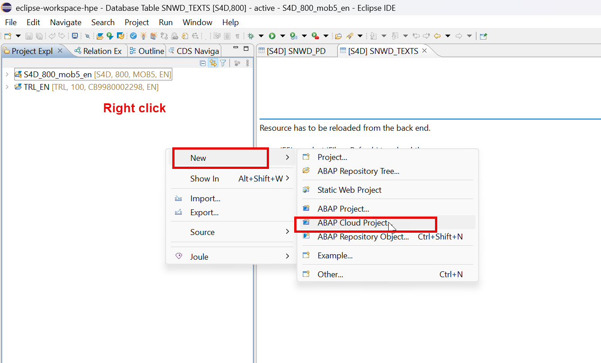
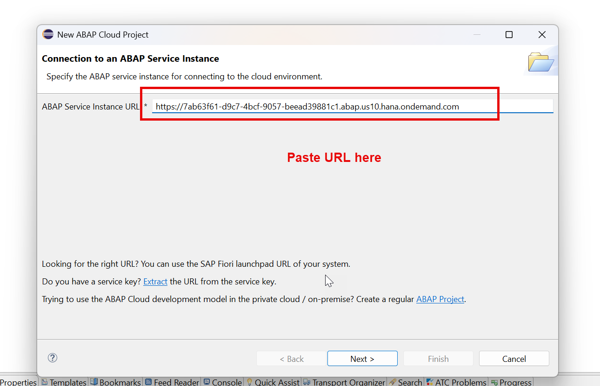
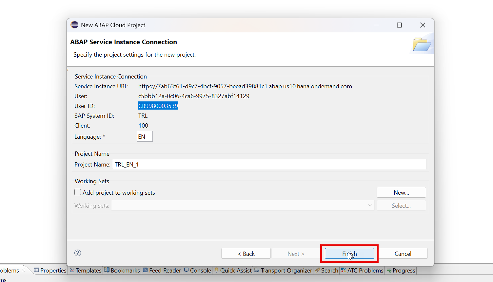

# Day 1 - Getting Your Own SAP Cloud System

> **SAP account, BTP trial, ABAP Environment instance, service key and Eclipse + ADT**

> Phase A - Foundation (Days 1-2) - Get a free cloud ABAP system and learn to drive the tools.

**🎯 Goal of the day.** By the end of today you will have your own ABAP system running in the cloud and Eclipse connected to it.

---

## 📋 Cheat Sheet - keep this open

### Today's quick reference

| Thing | Value / Syntax |
|---|---|
| **SAP BTP trial cockpit** | https://cockpit.hanatrial.ondemand.com/trial/ |
| **Trial validity** | ABAP Environment trial instance stops after a few hours of idling - restart it from the cockpit. |
| **Eclipse project type** | File > New > Other > ABAP > **ABAP Cloud Project** |
| **Login type** | SAP BTP ABAP Environment uses **browser-based (SSO) logon**, not user/password in Eclipse. |

### Eclipse / ADT keys you will use constantly

| Key | Action |
|---|---|
| `Ctrl+Shift+A` | Search any object in the whole system |
| `Ctrl+F3` | Activate the current object |
| `Ctrl+1` | Quick fix - RAP generates code skeletons for you |
| `Ctrl+Space` | Code completion |
| `Ctrl+Click` | Navigate to the object under the cursor |
| `Ctrl+7` | Comment / uncomment a block |
| `F2` | Show a method signature |
| `F8` | Data preview (table / CDS entity) |
| `F9` | Run the class |

### The data-modelling ladder

```text
Domain                     <- the rules of a field (length, type)
   |
Data element               <- domain + name + labels (reusable)
   |
Database table             <- real rows in HANA
   |
Interface CDS entity  ZI_  <- readable names, reusable, the base layer
   |
Composite / Cube view      <- joins and measures
   |
Consumption view      ZC_  <- what a UI or report actually reads
```

---

## 🧱 What you will build today

- A free SAP Universal ID (your login for everything SAP).
- An SAP BTP **trial** subaccount.
- An **ABAP Environment** instance - this *is* your own ABAP server, running in SAP's data centre.
- A **service key** - the address + password Eclipse needs to reach that server.
- Eclipse with the **ADT** (ABAP Development Tools) plug-in, connected to your system.

## 🧠 Concepts first, in plain English

Read this before touching the keyboard. Every idea is explained the way you would explain it to a school student.

**SAP BTP**

Think of BTP as an *app store for cloud services*. You do not install anything; you 'subscribe' to a service and SAP switches it on for your account.

**Subaccount**

A folder inside your BTP account. Everything you switch on lives inside a subaccount, so your stuff stays separate from everyone else's.

**ABAP Environment instance**

A real ABAP server, but you never see the hardware. SAP runs it; you only get a web address to it.

**Service key**

A small JSON file containing a URL and credentials. It is exactly like the Wi-Fi name + password you type into a new phone - it is how a tool proves it is allowed in.

**Eclipse + ADT**

Eclipse is the code editor. ADT is the plug-in that teaches Eclipse how to talk to an ABAP server. Without ADT, Eclipse has no idea what ABAP is.

---

## 🛠️ Hands-on, step by step

Create an SAP Account

🔗 <https://sap.com>

Login to SAP BTP a/c

🔗 <https://cockpit.hanatrial.ondemand.com/trial/>

Create ABAP instance in cloud

### Step 1. Now we subscribe the ABAP environment










### Step 2. Open service key and copy URL




### Step 3. Now as a BTP ABAP developer/ S/4HANA developer we use a tool called Eclipse + ADT (ABAP Dev tool)









---

---

## ⚠️ Traps and tips

- Keep the service key in a text file on your laptop. You will paste the URL into Eclipse and later into BAS.
- If the instance shows *stopped*, start it from the BTP cockpit before opening Eclipse - otherwise the logon just times out.

---

[⬅️ Summary](00_SUMMARY.md) | [🏠 Summary](00_SUMMARY.md) | [📋 Master Cheat Sheet](00_MASTER_CHEAT_SHEET.md) | [Day 2 ➡️](Day02_Eclipse_Packages_Classes_Tables.md)
