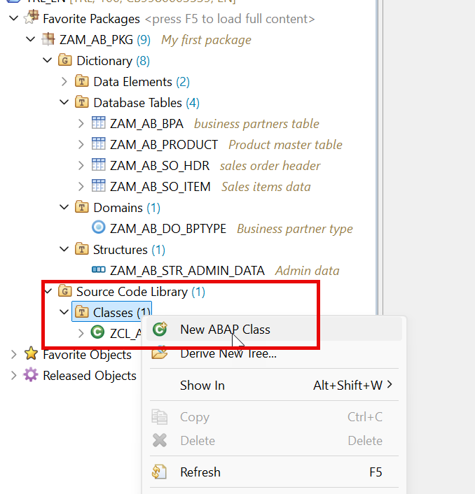
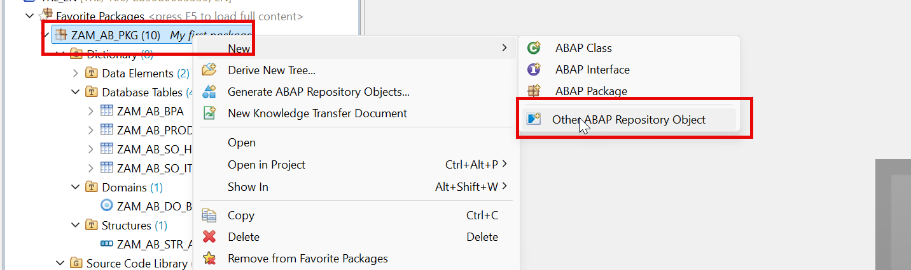
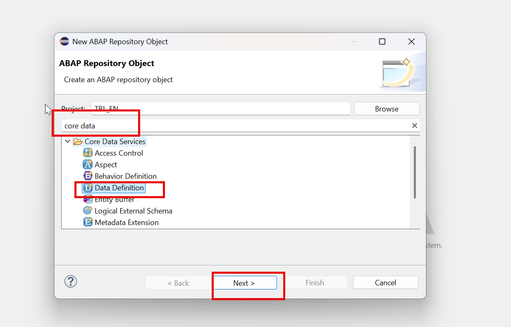
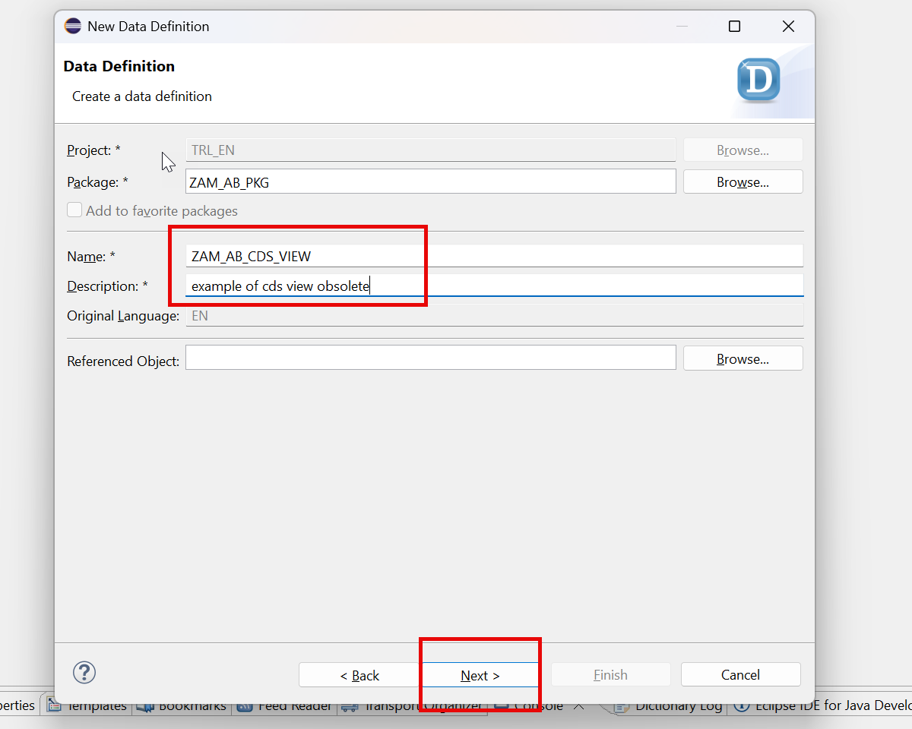
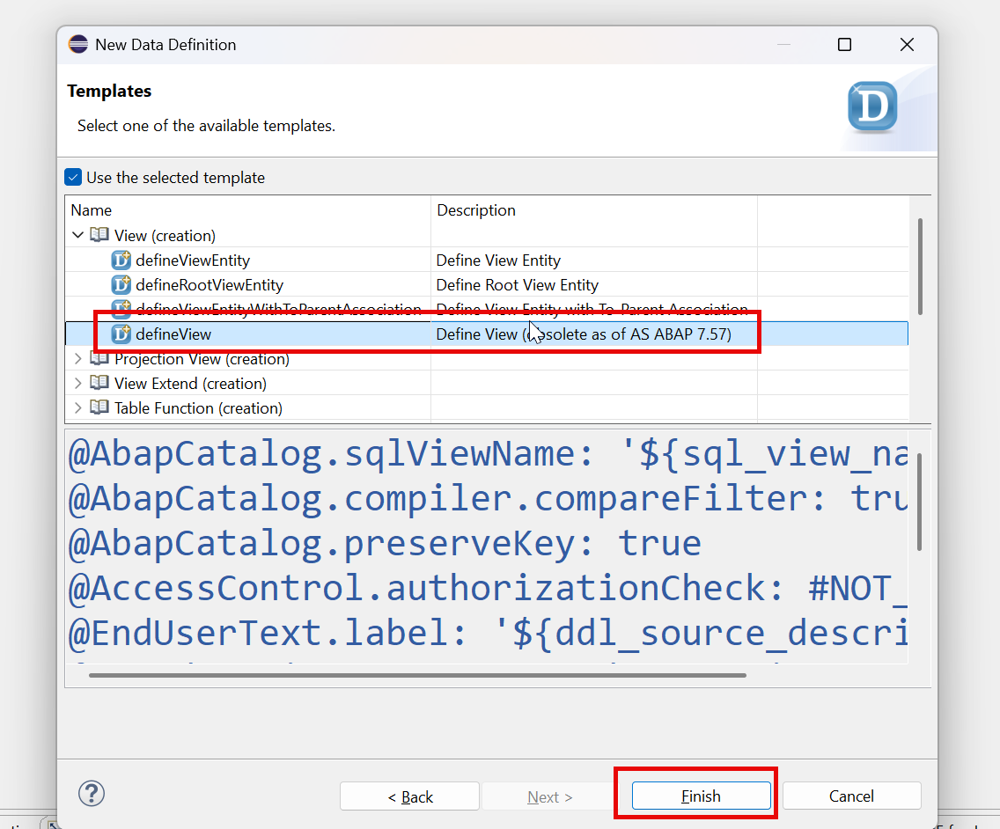
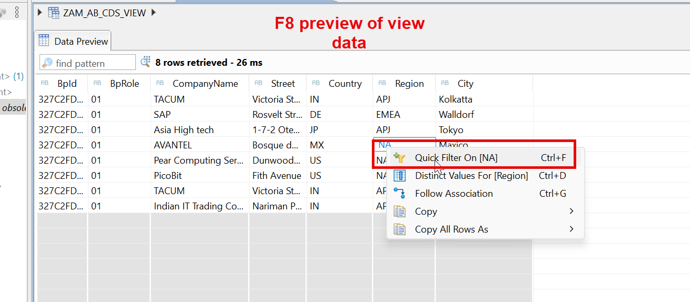
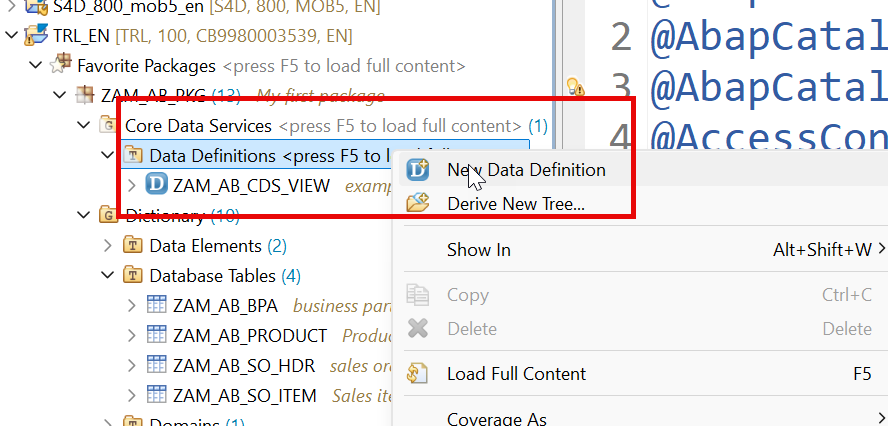
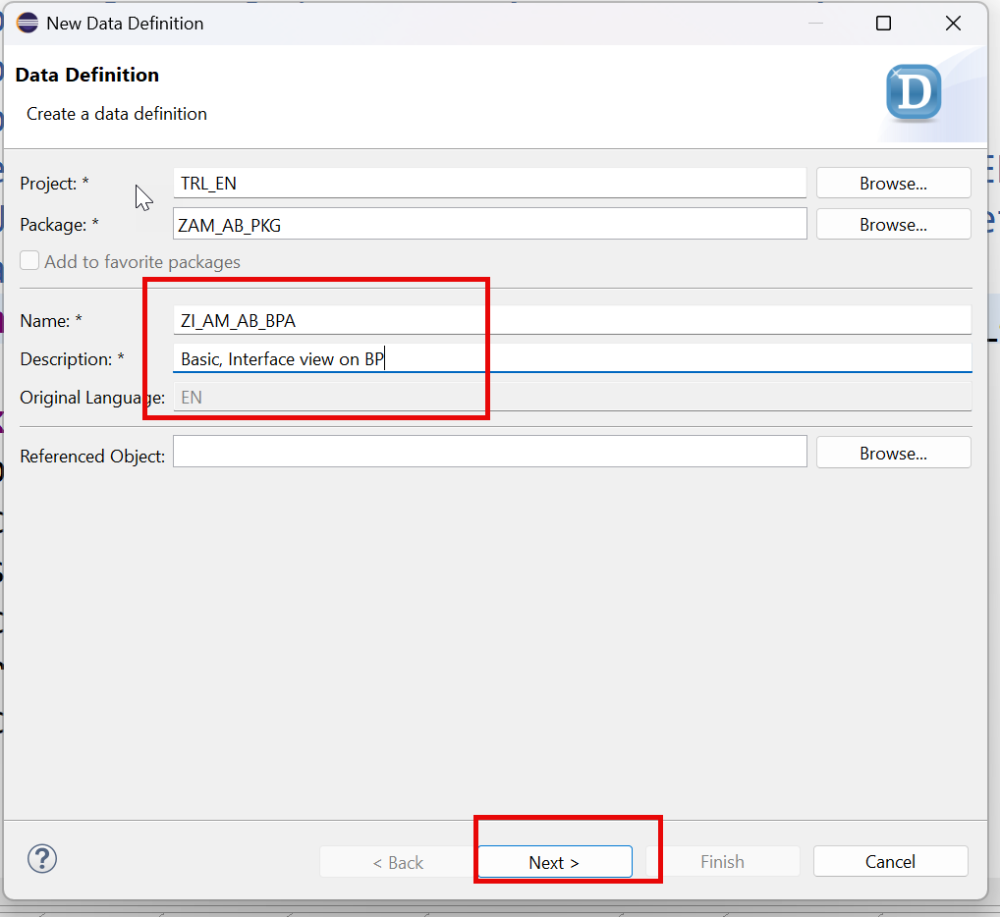
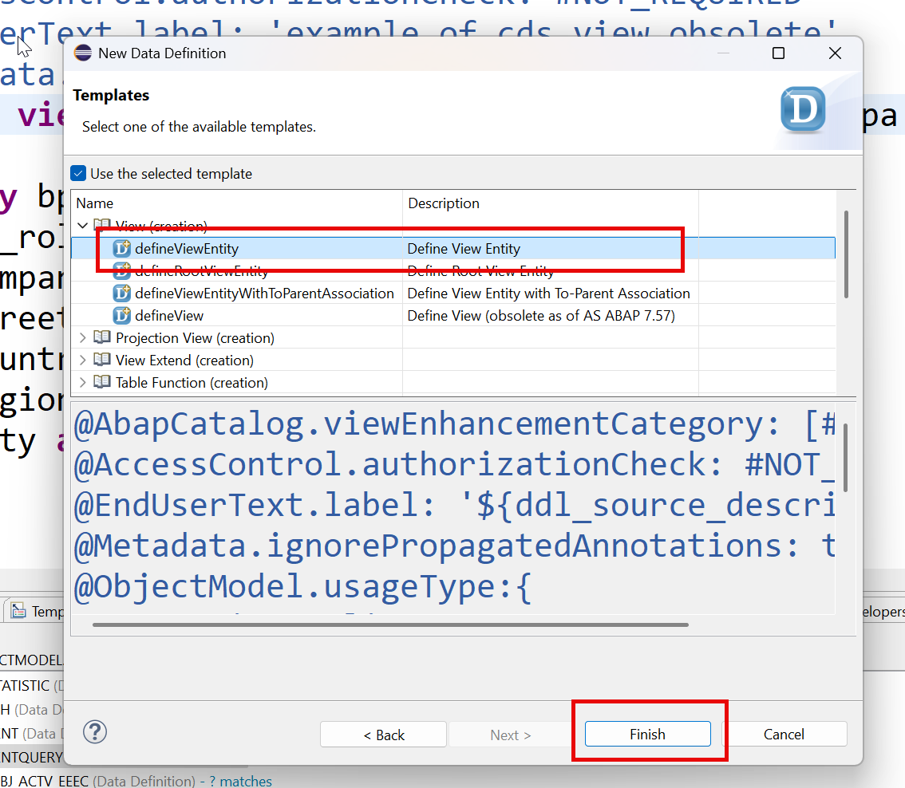
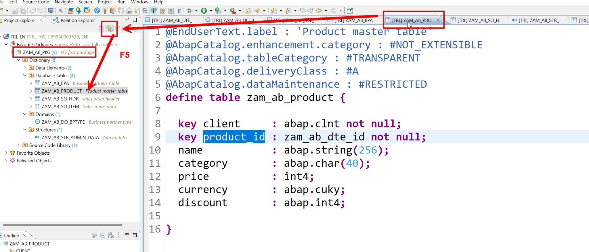

# Day 3 - Filling Data and Writing Your First CDS Views

> **Sample data generator, the obsolete CDS View, and modern CDS Entities with associations**

> Phase B - Data Modelling (Days 3-5) - Build tables, CDS views/entities, analytics and push-down logic.

**🎯 Goal of the day.** Load test data, then learn the difference between the old `define view` and the modern `define view entity`.

---

## 📋 Cheat Sheet - keep this open

### Today's quick reference

| Thing | Value / Syntax |
|---|---|
| `F8` | Data preview on a CDS entity |
| **F5 in Project Explorer** | Refresh - loads all objects of your package |
| **`define view entity`** | Modern CDS - use this |
| **`define view`** | Obsolete CDS View - learn it, do not use it |
| **Annotation docs** | https://help.sap.com/docs/SAP_NETWEAVER_750/cc0c305d2fab47bd808adcad3ca7ee9d/5e5d319bd1a74552b99a36dfc739f74d.html |
| **Naming used here** | `ZI_` = interface/basic view, `ZC_` = consumption view, `ZI_CO_` = cube |

### Eclipse / ADT keys you will use constantly

| Key | Action |
|---|---|
| `Ctrl+Shift+A` | Search any object in the whole system |
| `Ctrl+F3` | Activate the current object |
| `Ctrl+1` | Quick fix - RAP generates code skeletons for you |
| `Ctrl+Space` | Code completion |
| `Ctrl+Click` | Navigate to the object under the cursor |
| `Ctrl+7` | Comment / uncomment a block |
| `F2` | Show a method signature |
| `F9` | Run the class |

### The data-modelling ladder

```text
Domain                     <- the rules of a field (length, type)
   |
Data element               <- domain + name + labels (reusable)
   |
Database table             <- real rows in HANA
   |
Interface CDS entity  ZI_  <- readable names, reusable, the base layer
   |
Composite / Cube view      <- joins and measures
   |
Consumption view      ZC_  <- what a UI or report actually reads
```

---

## 🧱 What you will build today

- A **data builder class** (`zcl_am_ab_data_builder`) that fills your tables with sample rows.
- One **legacy CDS View** - built only so you can see *why* SAP replaced it.
- **CDS Entities** for Business Partner, Product and Sales Order.
- A **composite view** that joins master data with transaction data using **associations**.

## 🧠 Concepts first, in plain English

Read this before touching the keyboard. Every idea is explained the way you would explain it to a school student.

**CDS**

*Core Data Services*. A way of writing a database view as source code you can activate, version and transport - instead of clicking around in a GUI.

**Legacy `define view`**

The first attempt. It quietly created **three** objects: your definition, an `@AbapCatalog.sqlViewName` object, and a DDIC view. Two of the three were useless. That is why SAP replaced it.

**`define view entity`**

The modern one. One name, one object, faster, stricter. **Always use this.**

**Interface view (`ZI_`)**

The reusable, 'raw' layer. Renames technical columns into readable names. Nobody outside your project should care about it, but everything is built on it.

**Association**

A *lazy join*. You declare the relationship once (`_Items`), and the database only joins when somebody actually asks for those fields. A normal JOIN always pays the cost; an association pays only when used.

**`composition` vs `association`**

A composition is 'part of' (a sales order *item* cannot live without its order). An association is 'related to' (an order *refers to* a customer who exists independently).

**Annotation (`@...`)**

A sticky note on your code. It does not change the data; it tells other tools how to treat it - what label to show, whether to check authorisations, how to aggregate.

---

## 🛠️ Hands-on, step by step

### Step 1. Sample data generator class




**📄 ABAP Class** - copy the block below exactly as it is:

```abap
CLASS zcl_am_ab_data_builder DEFINITION
 PUBLIC
 FINAL
 CREATE PUBLIC .
 PUBLIC SECTION.
   INTERFACES if_oo_adt_classrun .
 PROTECTED SECTION.
 PRIVATE SECTION.
   METHODS fill_transaction_data.
   METHODS fill_master_data.
   METHODS flush.
ENDCLASS.
CLASS zcl_am_ab_data_builder IMPLEMENTATION.
 METHOD if_oo_adt_classrun~main.
   flush( ).
   fill_master_data( ).
   fill_transaction_data(  ).
   out->write(
     EXPORTING
       data   = 'processing is completed successfully!'
*        name   =
*      RECEIVING
*        output =
   ).
 ENDMETHOD.
 METHOD fill_master_data.
   data : lt_bp type table of zam_ab_bpa,
          lt_prod type table of zam_ab_product.
   append value #(
                   bp_id = cl_uuid_factory=>create_system_uuid( )->create_uuid_c32( )
                   bp_role = '01'
                   company_name = 'TACUM'
                   street = 'Victoria Street'
                   city = 'Kolkatta'
                   country = 'IN'
                   region = 'APJ'
                   )
                   to lt_bp.
   append value #(
                   bp_id = cl_uuid_factory=>create_system_uuid( )->create_uuid_c32( )
                   bp_role = '01'
                   company_name = 'SAP'
                   street = 'Rosvelt Street Road'
                   city = 'Walldorf'
                   country = 'DE'
                   region = 'EMEA'
                   )
                   to lt_bp.
   append value #(
                   bp_id = cl_uuid_factory=>create_system_uuid( )->create_uuid_c32( )
                   bp_role = '01'
                   company_name = 'Asia High tech'
                   street = '1-7-2 Otemachi'
                   city = 'Tokyo'
                   country = 'JP'
                   region = 'APJ'
                   )
                   to lt_bp.
   append value #(
                   bp_id = cl_uuid_factory=>create_system_uuid( )->create_uuid_c32( )
                   bp_role = '01'
                   company_name = 'AVANTEL'
                   street = 'Bosque de Duraznos'
                   city = 'Maxico'
                   country = 'MX'
                   region = 'NA'
                   )
                   to lt_bp.
   append value #(
                   bp_id = cl_uuid_factory=>create_system_uuid( )->create_uuid_c32( )
                   bp_role = '01'
                   company_name = 'Pear Computing Services'
                   street = 'Dunwoody Xing'
                   city = 'Atlanta, Georgia'
                   country = 'US'
                   region = 'NA'
                   )
                   to lt_bp.
   append value #(
                   bp_id = cl_uuid_factory=>create_system_uuid( )->create_uuid_c32( )
                   bp_role = '01'
                   company_name = 'PicoBit'
                   street = 'Fith Avenue'
                   city = 'New York City'
                   country = 'US'
                   region = 'NA'
                   )
                   to lt_bp.
   append value #(
                   bp_id = cl_uuid_factory=>create_system_uuid( )->create_uuid_c32( )
                   bp_role = '01'
                   company_name = 'TACUM'
                   street = 'Victoria Street'
                   city = 'Kolkatta'
                   country = 'IN'
                   region = 'APJ'
                   )
                   to lt_bp.
   append value #(
                   bp_id = cl_uuid_factory=>create_system_uuid( )->create_uuid_c32( )
                   bp_role = '01'
                   company_name = 'Indian IT Trading Company'
                   street = 'Nariman Point'
                   city = 'Mumbai'
                   country = 'IN'
                   region = 'APJ'
                   )
                   to lt_bp.
  append value #(
                   product_id = cl_uuid_factory=>create_system_uuid( )->create_uuid_c32( )
                   name = 'Blaster Extreme'
                   category = 'Speakers'
                   price = 1500
                   currency = 'INR'
                   discount = 3
                   )
                   to lt_prod.
   append value #(
                   product_id = cl_uuid_factory=>create_system_uuid( )->create_uuid_c32( )
                   name = 'Sound Booster'
                   category = 'Speakers'
                   price = 2500
                   currency = 'INR'
                   discount = 2
                   )
                   to lt_prod.
   append value #(
                   product_id = cl_uuid_factory=>create_system_uuid( )->create_uuid_c32( )
                   name = 'Smart Office'
                   category = 'Software'
                   price = 1540
                   currency = 'INR'
                   discount = 32
                   )
                   to lt_prod.
   append value #(
                   product_id = cl_uuid_factory=>create_system_uuid( )->create_uuid_c32( )
                   name = 'Smart Design'
                   category = 'Software'
                   price = 2400
                   currency = 'INR'
                   discount = 12
                   )
                   to lt_prod.
   append value #(
                   product_id = cl_uuid_factory=>create_system_uuid( )->create_uuid_c32( )
                   name = 'Transcend Carry pocket'
                   category = 'PCs'
                   price = 14000
                   currency = 'INR'
                   discount = 7
                   )
                   to lt_prod.
   append value #(
                   product_id = cl_uuid_factory=>create_system_uuid( )->create_uuid_c32( )
                   name = 'Gaming Monster Pro'
                   category = 'PCs'
                   price = 15500
                   currency = 'INR'
                   discount = 8
                   )
                   to lt_prod.
    insert zam_ab_bpa from table @lt_bp.
    insert zam_ab_product from table @lt_prod.
 ENDMETHOD.
 METHOD fill_transaction_data.
   data : o_rand type REF TO cl_abap_random_int,
          n type i,
          seed type i,
          lv_date type timestamp,
          lv_ord_id type zam_ab_dte_id,
          lt_so type table of zam_ab_so_hdr,
          lt_so_i type table of zam_ab_so_item.
   seed = cl_abap_random=>seed( ).
   cl_abap_random_int=>create(
     EXPORTING
       seed = seed
       min  = 1
       max  = 7
     RECEIVING
       prng = o_rand
   ).
   get time stamp FIELD lv_date.
   select * from zam_ab_bpa into table @data(lt_bpa).
   select * from zam_ab_product into table @data(lt_prod).
   do 50 times.
       lv_ord_id = cl_uuid_factory=>create_system_uuid( )->create_uuid_c32(  ).
       n = o_rand->get_next( ).
       read table lt_bpa into data(ls_bp) index n.
       append value #(
               order_id = lv_ord_id
               order_no = sy-index
               buyer = ls_bp-bp_id
               gross_amount = 10 * n
               currency_code = 'EUR'
               created_by = sy-uname
               created_on = lv_date
               changed_by = sy-uname
               changed_on = lv_date
        ) to lt_so.
       do 2 times.
           read table lt_prod into data(ls_prod) index n.
           append value #(
               item_id = cl_uuid_factory=>create_system_uuid( )->create_uuid_c32(  )
               order_id = lv_ord_id
               product = ls_prod-product_id
               qty =  n
               uom = 'EA'
               amount =  n * ls_prod-price
               currency = ls_prod-currency
        ) to lt_so_i.
       enddo.
   enddo.
   insert zam_ab_so_hdr from table @lt_so.
   insert zam_ab_so_item from table @lt_so_i.
 ENDMETHOD.
 METHOD flush.
   delete from : zam_ab_bpa, zam_ab_product, zam_ab_so_hdr, zam_ab_so_item.
 ENDMETHOD.
ENDCLASS.
```

<details>
<summary>💡 What the important lines mean (click to open)</summary>

| Line / keyword | What it does |
|---|---|
| `INTERFACES if_oo_adt_classrun` | Gives your class a Run button. Implement `~main`, press **F9**, and output appears in the Eclipse console. The cloud replacement for `WRITE`. |
| `out->write( ... )` | Prints to the Eclipse console. The cloud version of the classic `WRITE` statement. |
| `INTERFACES` | Promises this class implements an interface's methods. |
| `CREATE PUBLIC` | Anyone may instantiate this class. |
| `FINAL` | Nobody may inherit from this class. |

</details>

### Step 2. Working with CDS Views











**📄 CDS View (obsolete)** - copy the block below exactly as it is:

```cds
@AbapCatalog.sqlViewName: 'ZAMABCDSVIEW'
@AbapCatalog.compiler.compareFilter: true
@AbapCatalog.preserveKey: true
@AccessControl.authorizationCheck: #NOT_REQUIRED
@EndUserText.label: 'example of cds view obsolete'
@Metadata.ignorePropagatedAnnotations: true
define view ZAM_AB_CDS_VIEW as select from zam_ab_bpa
{
   key bp_id as BpId,
   bp_role as BpRole,
   company_name as CompanyName,
   street as Street,
   country as Country,
   region as Region,
   city as City   
}
```

<details>
<summary>💡 What the important lines mean (click to open)</summary>

| Line / keyword | What it does |
|---|---|
| `@AbapCatalog.sqlViewName` | **Obsolete.** The old `define view` needed a second, separate SQL view name. Modern `define view entity` does not - which is exactly why SAP replaced it. |
| `@AbapCatalog.compiler.compareFilter` | An old optimiser hint for path expressions. Only exists on legacy CDS Views. |
| `@AbapCatalog.preserveKey` | Legacy flag: keep my declared key instead of letting the generated view invent one. |
| `@AccessControl.authorizationCheck: #NOT_REQUIRED` | Skip the DCL authorisation check. Fine while learning - **never** on real customer data. |
| `@EndUserText.label` | The human-readable description shown in tools and on screen. |
| `@Metadata.ignorePropagatedAnnotations` | `true` = ignore annotations inherited from the views underneath, so you start with a clean slate. |
| `define view` | The **obsolete** CDS View. Kept here only so you can see the difference. |

</details>

> **Q: So when we call this view from program, other view, which name shall we use??**  
> Ans: the definition name ZAM_AB_CDS_VIEW,

> **Q: So whats the use of the other name**  
> Ans:  No use 🙁

> **Q: We just saw that system creates a DDIC view also, whats the use of that DDIC view**  
> Ans: No use 🙁

> **Q: Why SAP came up with multiple names of same object and these objects which are of no use?**  
> Ans: When SAP came up with this concept, they did not think of it properly. When customers asked whats the use of those extra object, SAP came with better version of CDS views → CDS entities

> **Q: Performance improvement annotations**  

🔗 <https://youtu.be/5aBWsSN9iHg>




Annotation documentation : https://help.sap.com/docs/SAP_NETWEAVER_750/cc0c305d2fab47bd808adcad3ca7ee9d/5e5d319bd1a74552b99a36dfc739f74d.html

### Step 3. Working with CDS entities









**📄 CDS View Entity** - copy the block below exactly as it is:

```cds
@AbapCatalog.viewEnhancementCategory: [#NONE]
@AccessControl.authorizationCheck: #NOT_REQUIRED
@EndUserText.label: 'Basic, Interface view on BP'
@Metadata.ignorePropagatedAnnotations: true
@ObjectModel.usageType:{
   serviceQuality: #X,
   sizeCategory: #S,
   dataClass: #MASTER
}
@VDM.viewType: #BASIC
define view entity ZI_AM_AB_BPA as select from zam_ab_bpa
{
   key bp_id as BpId,
   bp_role as BpRole,
   company_name as CompanyName,
   street as Street,
   country as Country,
   region as Region,
   city as City   
}
```

<details>
<summary>💡 What the important lines mean (click to open)</summary>

| Line / keyword | What it does |
|---|---|
| `@AbapCatalog.viewEnhancementCategory: [#NONE]` | Says whether other people may extend this view. `[#NONE]` = closed, `[#PROJECTION_LIST]` = fields may be added. |
| `@AccessControl.authorizationCheck: #NOT_REQUIRED` | Skip the DCL authorisation check. Fine while learning - **never** on real customer data. |
| `@EndUserText.label` | The human-readable description shown in tools and on screen. |
| `@Metadata.ignorePropagatedAnnotations` | `true` = ignore annotations inherited from the views underneath, so you start with a clean slate. |
| `@ObjectModel.usageType` | Declares the view's role: `serviceQuality` (how polished it is), `sizeCategory` (expected row count), `dataClass` (master, transactional, mixed). |
| `@VDM.viewType` | Where the view sits in SAP's *Virtual Data Model*: `#BASIC` (raw), `#COMPOSITE` (combined), `#CONSUMPTION` (for a UI or report). |
| `define view entity` | The modern CDS entity - one object, one name, faster and stricter than the old `define view`. |
| `define view` | The **obsolete** CDS View. Kept here only so you can see the difference. |

</details>

### Step 4. Product CDS entity

**📄 CDS View Entity** - copy the block below exactly as it is:

```cds
@AbapCatalog.viewEnhancementCategory: [#NONE]
@AccessControl.authorizationCheck: #NOT_REQUIRED
@EndUserText.label: 'Basic, Interface view on Product'
@Metadata.ignorePropagatedAnnotations: true
@ObjectModel.usageType:{
   serviceQuality: #X,
   sizeCategory: #S,
   dataClass: #MIXED
}
@VDM.viewType: #BASIC
define view entity ZI_AM_AB_PRODUCT as select from zam_ab_product
{
   key product_id as ProductId,
   name as Name,
   category as Category,
   price as Price,
   currency as Currency,
   discount as Discount
}
```

<details>
<summary>💡 What the important lines mean (click to open)</summary>

| Line / keyword | What it does |
|---|---|
| `@AbapCatalog.viewEnhancementCategory: [#NONE]` | Says whether other people may extend this view. `[#NONE]` = closed, `[#PROJECTION_LIST]` = fields may be added. |
| `@AccessControl.authorizationCheck: #NOT_REQUIRED` | Skip the DCL authorisation check. Fine while learning - **never** on real customer data. |
| `@EndUserText.label` | The human-readable description shown in tools and on screen. |
| `@Metadata.ignorePropagatedAnnotations` | `true` = ignore annotations inherited from the views underneath, so you start with a clean slate. |
| `@ObjectModel.usageType` | Declares the view's role: `serviceQuality` (how polished it is), `sizeCategory` (expected row count), `dataClass` (master, transactional, mixed). |
| `@VDM.viewType` | Where the view sits in SAP's *Virtual Data Model*: `#BASIC` (raw), `#COMPOSITE` (combined), `#CONSUMPTION` (for a UI or report). |
| `define view entity` | The modern CDS entity - one object, one name, faster and stricter than the old `define view`. |
| `define view` | The **obsolete** CDS View. Kept here only so you can see the difference. |

</details>

### Step 5. Sales Order with items using Association

**📄 CDS View Entity** - copy the block below exactly as it is:

```cds
@AbapCatalog.viewEnhancementCategory: [#NONE]
@AccessControl.authorizationCheck: #NOT_REQUIRED
@EndUserText.label: 'Sales order Basic, interface'
@Metadata.ignorePropagatedAnnotations: true
@ObjectModel.usageType:{
   serviceQuality: #X,
   sizeCategory: #S,
   dataClass: #MIXED
}
@VDM.viewType: #BASIC
define view entity ZI_AM_AB_SALES as select from zam_ab_so_hdr as sls
association[0..*] to zam_ab_so_item as _Items on
$projection.OrderId = _Items.order_id
{
   key sls.order_id as OrderId,
   sls.order_no as OrderNo,
   sls.buyer as Buyer,
   @Semantics.amount.currencyCode: 'CurrencyCode'
   sls.gross_amount as GrossAmount,
   sls.currency_code as CurrencyCode,
   //exposed association - alias name of my item table
   _Items
}
```

<details>
<summary>💡 What the important lines mean (click to open)</summary>

| Line / keyword | What it does |
|---|---|
| `@AbapCatalog.viewEnhancementCategory: [#NONE]` | Says whether other people may extend this view. `[#NONE]` = closed, `[#PROJECTION_LIST]` = fields may be added. |
| `@AccessControl.authorizationCheck: #NOT_REQUIRED` | Skip the DCL authorisation check. Fine while learning - **never** on real customer data. |
| `@EndUserText.label` | The human-readable description shown in tools and on screen. |
| `@Metadata.ignorePropagatedAnnotations` | `true` = ignore annotations inherited from the views underneath, so you start with a clean slate. |
| `@ObjectModel.usageType` | Declares the view's role: `serviceQuality` (how polished it is), `sizeCategory` (expected row count), `dataClass` (master, transactional, mixed). |
| `@VDM.viewType` | Where the view sits in SAP's *Virtual Data Model*: `#BASIC` (raw), `#COMPOSITE` (combined), `#CONSUMPTION` (for a UI or report). |
| `define view entity` | The modern CDS entity - one object, one name, faster and stricter than the old `define view`. |
| `define view` | The **obsolete** CDS View. Kept here only so you can see the difference. |
| `association to` | A reusable, lazily-evaluated relationship. Cheaper than a JOIN because it only runs when used. |

</details>

### Step 6. Composite view - combination of master and transaction data

**📄 CDS View Entity** - copy the block below exactly as it is:

```cds
@AbapCatalog.viewEnhancementCategory: [#NONE]
@AccessControl.authorizationCheck: #NOT_REQUIRED
@EndUserText.label: 'Composite, Cube, Interface view for sales'
@Metadata.ignorePropagatedAnnotations: true
@ObjectModel.usageType:{
   serviceQuality: #X,
   sizeCategory: #S,
   dataClass: #MIXED
}
@VDM.viewType: #COMPOSITE
@Analytics.dataCategory: #CUBE
define view entity ZI_CO_AM_AB_SALES_CUBE as select from ZI_AM_AB_SALES
association[1] to ZI_AM_AB_BPA as _BusinessPartner on
$projection.Buyer = _BusinessPartner.BpId
association[1] to ZI_AM_AB_PRODUCT as _Product on
$projection.ProductId = _Product.ProductId
{
   key OrderId,
   key _Items.item_id as ItemId,
   OrderNo,
   Buyer,
   _Items.product as ProductId,
   @Semantics.quantity.unitOfMeasure: 'Uom'
   @DefaultAggregation: #SUM
   _Items.qty as Qty,
   _Items.uom as Uom,
   @Semantics.amount.currencyCode: 'Currency'
   @DefaultAggregation: #SUM
   _Items.amount as Amount,
   _Items.currency as Currency,
   _BusinessPartner,
   _Product
}
```

<details>
<summary>💡 What the important lines mean (click to open)</summary>

| Line / keyword | What it does |
|---|---|
| `@AbapCatalog.viewEnhancementCategory: [#NONE]` | Says whether other people may extend this view. `[#NONE]` = closed, `[#PROJECTION_LIST]` = fields may be added. |
| `@AccessControl.authorizationCheck: #NOT_REQUIRED` | Skip the DCL authorisation check. Fine while learning - **never** on real customer data. |
| `@EndUserText.label` | The human-readable description shown in tools and on screen. |
| `@Metadata.ignorePropagatedAnnotations` | `true` = ignore annotations inherited from the views underneath, so you start with a clean slate. |
| `@ObjectModel.usageType` | Declares the view's role: `serviceQuality` (how polished it is), `sizeCategory` (expected row count), `dataClass` (master, transactional, mixed). |
| `@VDM.viewType` | Where the view sits in SAP's *Virtual Data Model*: `#BASIC` (raw), `#COMPOSITE` (combined), `#CONSUMPTION` (for a UI or report). |
| `define view entity` | The modern CDS entity - one object, one name, faster and stricter than the old `define view`. |
| `define view` | The **obsolete** CDS View. Kept here only so you can see the difference. |
| `$projection.<Field>` | Refers to a field of the view you are currently writing (rather than of the joined source). |

</details>

[Optional]Link with editor and F5 to load all objects in my package




---

## 📦 Objects in your package after today

```text
$Z_AM_AB  (your package - replace _AB_ with your own initials)
  ├── zcl_am_ab_data_builder              ABAP class
  ├── ZAM_AB_CDS_VIEW                     CDS view (obsolete)
  ├── ZI_AM_AB_BPA                        CDS entity
  ├── ZI_AM_AB_PRODUCT                    CDS entity
  ├── ZI_AM_AB_SALES                      CDS entity
  ├── ZI_CO_AM_AB_SALES_CUBE              CDS entity
```

---

## ✅ Final version of all code from Day 3

Everything below is the **complete, unmodified** source from the training material, gathered in one place so you can copy it straight into Eclipse.

### 1. Sample data generator class - _ABAP Class_

```abap
CLASS zcl_am_ab_data_builder DEFINITION
 PUBLIC
 FINAL
 CREATE PUBLIC .
 PUBLIC SECTION.
   INTERFACES if_oo_adt_classrun .
 PROTECTED SECTION.
 PRIVATE SECTION.
   METHODS fill_transaction_data.
   METHODS fill_master_data.
   METHODS flush.
ENDCLASS.
CLASS zcl_am_ab_data_builder IMPLEMENTATION.
 METHOD if_oo_adt_classrun~main.
   flush( ).
   fill_master_data( ).
   fill_transaction_data(  ).
   out->write(
     EXPORTING
       data   = 'processing is completed successfully!'
*        name   =
*      RECEIVING
*        output =
   ).
 ENDMETHOD.
 METHOD fill_master_data.
   data : lt_bp type table of zam_ab_bpa,
          lt_prod type table of zam_ab_product.
   append value #(
                   bp_id = cl_uuid_factory=>create_system_uuid( )->create_uuid_c32( )
                   bp_role = '01'
                   company_name = 'TACUM'
                   street = 'Victoria Street'
                   city = 'Kolkatta'
                   country = 'IN'
                   region = 'APJ'
                   )
                   to lt_bp.
   append value #(
                   bp_id = cl_uuid_factory=>create_system_uuid( )->create_uuid_c32( )
                   bp_role = '01'
                   company_name = 'SAP'
                   street = 'Rosvelt Street Road'
                   city = 'Walldorf'
                   country = 'DE'
                   region = 'EMEA'
                   )
                   to lt_bp.
   append value #(
                   bp_id = cl_uuid_factory=>create_system_uuid( )->create_uuid_c32( )
                   bp_role = '01'
                   company_name = 'Asia High tech'
                   street = '1-7-2 Otemachi'
                   city = 'Tokyo'
                   country = 'JP'
                   region = 'APJ'
                   )
                   to lt_bp.
   append value #(
                   bp_id = cl_uuid_factory=>create_system_uuid( )->create_uuid_c32( )
                   bp_role = '01'
                   company_name = 'AVANTEL'
                   street = 'Bosque de Duraznos'
                   city = 'Maxico'
                   country = 'MX'
                   region = 'NA'
                   )
                   to lt_bp.
   append value #(
                   bp_id = cl_uuid_factory=>create_system_uuid( )->create_uuid_c32( )
                   bp_role = '01'
                   company_name = 'Pear Computing Services'
                   street = 'Dunwoody Xing'
                   city = 'Atlanta, Georgia'
                   country = 'US'
                   region = 'NA'
                   )
                   to lt_bp.
   append value #(
                   bp_id = cl_uuid_factory=>create_system_uuid( )->create_uuid_c32( )
                   bp_role = '01'
                   company_name = 'PicoBit'
                   street = 'Fith Avenue'
                   city = 'New York City'
                   country = 'US'
                   region = 'NA'
                   )
                   to lt_bp.
   append value #(
                   bp_id = cl_uuid_factory=>create_system_uuid( )->create_uuid_c32( )
                   bp_role = '01'
                   company_name = 'TACUM'
                   street = 'Victoria Street'
                   city = 'Kolkatta'
                   country = 'IN'
                   region = 'APJ'
                   )
                   to lt_bp.
   append value #(
                   bp_id = cl_uuid_factory=>create_system_uuid( )->create_uuid_c32( )
                   bp_role = '01'
                   company_name = 'Indian IT Trading Company'
                   street = 'Nariman Point'
                   city = 'Mumbai'
                   country = 'IN'
                   region = 'APJ'
                   )
                   to lt_bp.
  append value #(
                   product_id = cl_uuid_factory=>create_system_uuid( )->create_uuid_c32( )
                   name = 'Blaster Extreme'
                   category = 'Speakers'
                   price = 1500
                   currency = 'INR'
                   discount = 3
                   )
                   to lt_prod.
   append value #(
                   product_id = cl_uuid_factory=>create_system_uuid( )->create_uuid_c32( )
                   name = 'Sound Booster'
                   category = 'Speakers'
                   price = 2500
                   currency = 'INR'
                   discount = 2
                   )
                   to lt_prod.
   append value #(
                   product_id = cl_uuid_factory=>create_system_uuid( )->create_uuid_c32( )
                   name = 'Smart Office'
                   category = 'Software'
                   price = 1540
                   currency = 'INR'
                   discount = 32
                   )
                   to lt_prod.
   append value #(
                   product_id = cl_uuid_factory=>create_system_uuid( )->create_uuid_c32( )
                   name = 'Smart Design'
                   category = 'Software'
                   price = 2400
                   currency = 'INR'
                   discount = 12
                   )
                   to lt_prod.
   append value #(
                   product_id = cl_uuid_factory=>create_system_uuid( )->create_uuid_c32( )
                   name = 'Transcend Carry pocket'
                   category = 'PCs'
                   price = 14000
                   currency = 'INR'
                   discount = 7
                   )
                   to lt_prod.
   append value #(
                   product_id = cl_uuid_factory=>create_system_uuid( )->create_uuid_c32( )
                   name = 'Gaming Monster Pro'
                   category = 'PCs'
                   price = 15500
                   currency = 'INR'
                   discount = 8
                   )
                   to lt_prod.
    insert zam_ab_bpa from table @lt_bp.
    insert zam_ab_product from table @lt_prod.
 ENDMETHOD.
 METHOD fill_transaction_data.
   data : o_rand type REF TO cl_abap_random_int,
          n type i,
          seed type i,
          lv_date type timestamp,
          lv_ord_id type zam_ab_dte_id,
          lt_so type table of zam_ab_so_hdr,
          lt_so_i type table of zam_ab_so_item.
   seed = cl_abap_random=>seed( ).
   cl_abap_random_int=>create(
     EXPORTING
       seed = seed
       min  = 1
       max  = 7
     RECEIVING
       prng = o_rand
   ).
   get time stamp FIELD lv_date.
   select * from zam_ab_bpa into table @data(lt_bpa).
   select * from zam_ab_product into table @data(lt_prod).
   do 50 times.
       lv_ord_id = cl_uuid_factory=>create_system_uuid( )->create_uuid_c32(  ).
       n = o_rand->get_next( ).
       read table lt_bpa into data(ls_bp) index n.
       append value #(
               order_id = lv_ord_id
               order_no = sy-index
               buyer = ls_bp-bp_id
               gross_amount = 10 * n
               currency_code = 'EUR'
               created_by = sy-uname
               created_on = lv_date
               changed_by = sy-uname
               changed_on = lv_date
        ) to lt_so.
       do 2 times.
           read table lt_prod into data(ls_prod) index n.
           append value #(
               item_id = cl_uuid_factory=>create_system_uuid( )->create_uuid_c32(  )
               order_id = lv_ord_id
               product = ls_prod-product_id
               qty =  n
               uom = 'EA'
               amount =  n * ls_prod-price
               currency = ls_prod-currency
        ) to lt_so_i.
       enddo.
   enddo.
   insert zam_ab_so_hdr from table @lt_so.
   insert zam_ab_so_item from table @lt_so_i.
 ENDMETHOD.
 METHOD flush.
   delete from : zam_ab_bpa, zam_ab_product, zam_ab_so_hdr, zam_ab_so_item.
 ENDMETHOD.
ENDCLASS.
```

### 2. Working with CDS Views - _CDS View (obsolete)_

```cds
@AbapCatalog.sqlViewName: 'ZAMABCDSVIEW'
@AbapCatalog.compiler.compareFilter: true
@AbapCatalog.preserveKey: true
@AccessControl.authorizationCheck: #NOT_REQUIRED
@EndUserText.label: 'example of cds view obsolete'
@Metadata.ignorePropagatedAnnotations: true
define view ZAM_AB_CDS_VIEW as select from zam_ab_bpa
{
   key bp_id as BpId,
   bp_role as BpRole,
   company_name as CompanyName,
   street as Street,
   country as Country,
   region as Region,
   city as City   
}
```

### 3. Working with CDS entities - _CDS View Entity_

```cds
@AbapCatalog.viewEnhancementCategory: [#NONE]
@AccessControl.authorizationCheck: #NOT_REQUIRED
@EndUserText.label: 'Basic, Interface view on BP'
@Metadata.ignorePropagatedAnnotations: true
@ObjectModel.usageType:{
   serviceQuality: #X,
   sizeCategory: #S,
   dataClass: #MASTER
}
@VDM.viewType: #BASIC
define view entity ZI_AM_AB_BPA as select from zam_ab_bpa
{
   key bp_id as BpId,
   bp_role as BpRole,
   company_name as CompanyName,
   street as Street,
   country as Country,
   region as Region,
   city as City   
}
```

### 4. Product CDS entity - _CDS View Entity_

```cds
@AbapCatalog.viewEnhancementCategory: [#NONE]
@AccessControl.authorizationCheck: #NOT_REQUIRED
@EndUserText.label: 'Basic, Interface view on Product'
@Metadata.ignorePropagatedAnnotations: true
@ObjectModel.usageType:{
   serviceQuality: #X,
   sizeCategory: #S,
   dataClass: #MIXED
}
@VDM.viewType: #BASIC
define view entity ZI_AM_AB_PRODUCT as select from zam_ab_product
{
   key product_id as ProductId,
   name as Name,
   category as Category,
   price as Price,
   currency as Currency,
   discount as Discount
}
```

### 5. Sales Order with items using Association - _CDS View Entity_

```cds
@AbapCatalog.viewEnhancementCategory: [#NONE]
@AccessControl.authorizationCheck: #NOT_REQUIRED
@EndUserText.label: 'Sales order Basic, interface'
@Metadata.ignorePropagatedAnnotations: true
@ObjectModel.usageType:{
   serviceQuality: #X,
   sizeCategory: #S,
   dataClass: #MIXED
}
@VDM.viewType: #BASIC
define view entity ZI_AM_AB_SALES as select from zam_ab_so_hdr as sls
association[0..*] to zam_ab_so_item as _Items on
$projection.OrderId = _Items.order_id
{
   key sls.order_id as OrderId,
   sls.order_no as OrderNo,
   sls.buyer as Buyer,
   @Semantics.amount.currencyCode: 'CurrencyCode'
   sls.gross_amount as GrossAmount,
   sls.currency_code as CurrencyCode,
   //exposed association - alias name of my item table
   _Items
}
```

### 6. Composite view - combination of master and transaction data - _CDS View Entity_

```cds
@AbapCatalog.viewEnhancementCategory: [#NONE]
@AccessControl.authorizationCheck: #NOT_REQUIRED
@EndUserText.label: 'Composite, Cube, Interface view for sales'
@Metadata.ignorePropagatedAnnotations: true
@ObjectModel.usageType:{
   serviceQuality: #X,
   sizeCategory: #S,
   dataClass: #MIXED
}
@VDM.viewType: #COMPOSITE
@Analytics.dataCategory: #CUBE
define view entity ZI_CO_AM_AB_SALES_CUBE as select from ZI_AM_AB_SALES
association[1] to ZI_AM_AB_BPA as _BusinessPartner on
$projection.Buyer = _BusinessPartner.BpId
association[1] to ZI_AM_AB_PRODUCT as _Product on
$projection.ProductId = _Product.ProductId
{
   key OrderId,
   key _Items.item_id as ItemId,
   OrderNo,
   Buyer,
   _Items.product as ProductId,
   @Semantics.quantity.unitOfMeasure: 'Uom'
   @DefaultAggregation: #SUM
   _Items.qty as Qty,
   _Items.uom as Uom,
   @Semantics.amount.currencyCode: 'Currency'
   @DefaultAggregation: #SUM
   _Items.amount as Amount,
   _Items.currency as Currency,
   _BusinessPartner,
   _Product
}
```

---

## ⚠️ Traps and tips

- Run the data builder **before** previewing any view, otherwise you will stare at an empty result and think your view is broken.
- The Q&A in this chapter is from the live session - it is the fastest way to understand why two kinds of CDS exist.

---

[⬅️ Day 2](Day02_Eclipse_Packages_Classes_Tables.md) | [🏠 Summary](00_SUMMARY.md) | [📋 Master Cheat Sheet](00_MASTER_CHEAT_SHEET.md) | [Day 4 ➡️](Day04_Analytics_AMDP_Table_Functions.md)
