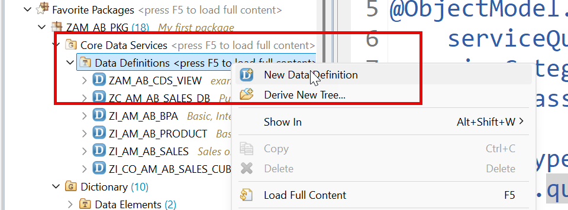
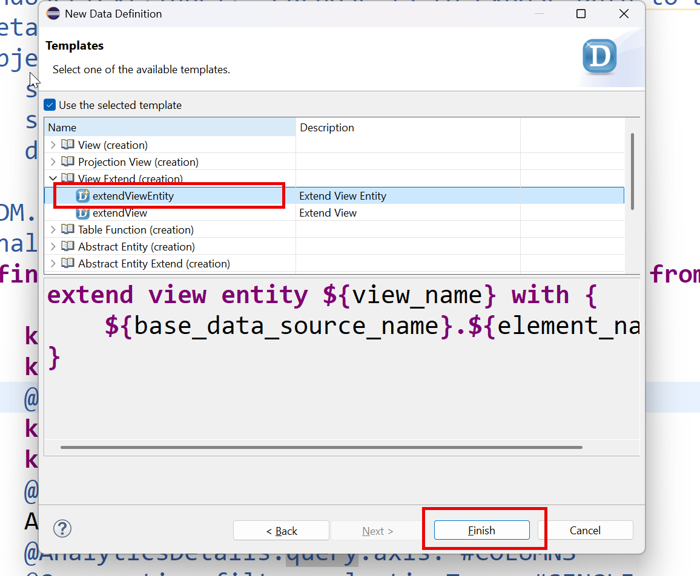
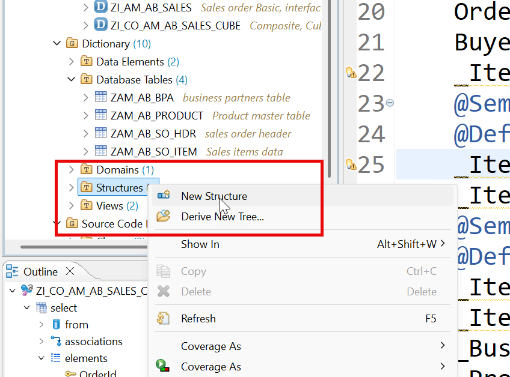
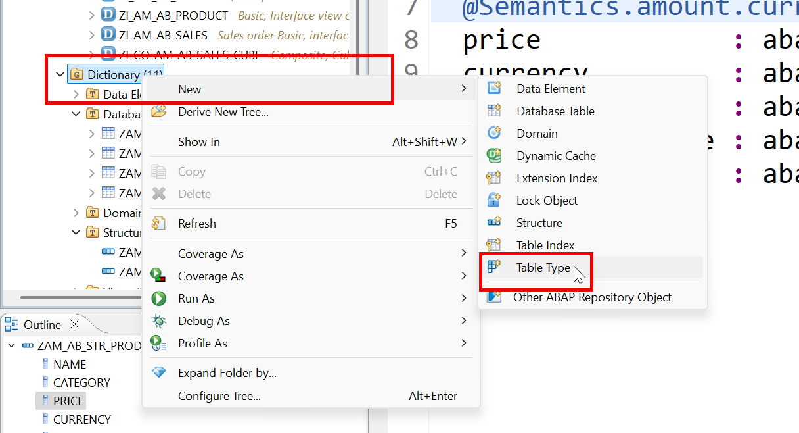
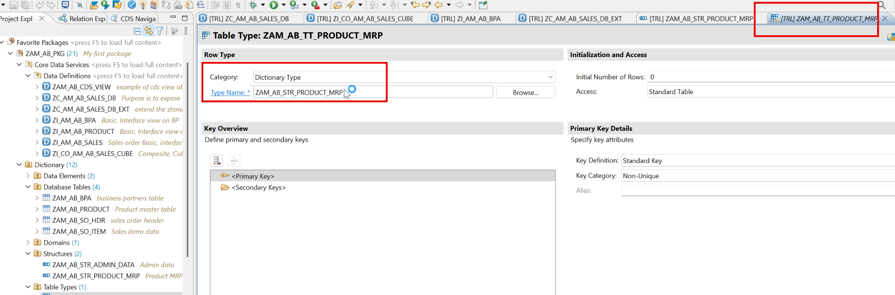
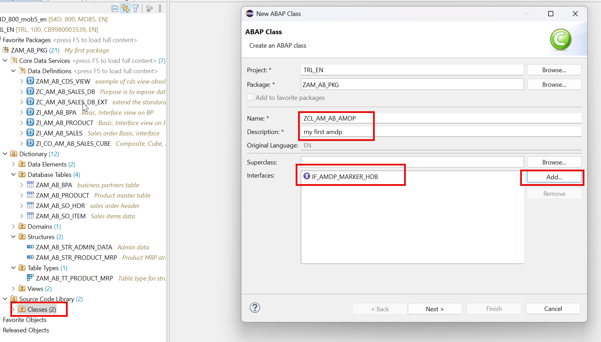
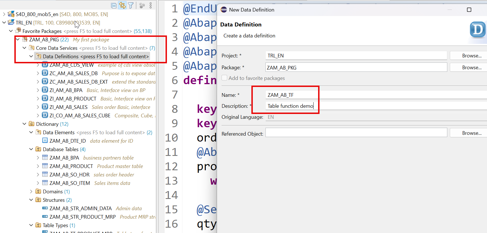
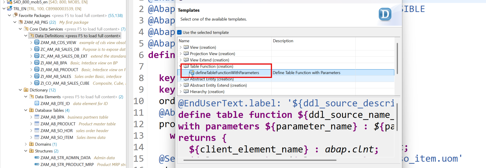

# Day 4 - Analytics Views, AMDP and Table Functions

> **Consumption views for analytics, extending a standard view, and pushing logic down into HANA**

> Phase B - Data Modelling (Days 3-5) - Build tables, CDS views/entities, analytics and push-down logic.

**🎯 Goal of the day.** Learn code push-down: move heavy calculation out of ABAP and into the HANA database.

---

## 📋 Cheat Sheet - keep this open

### Today's quick reference

| Thing | Value / Syntax |
|---|---|
| **AMDP method** | must be `CLASS-METHODS ... AMDP OPTIONS ... FOR TABLE FUNCTION <name>` |
| **AMDP marker** | `INTERFACES if_amdp_marker_hdb` |
| **Table function** | `define table function ZAM_AB_TF ... implemented by method <class>=><method>` |
| **Analytics stack** | Basic/Interface view -> Cube (`#CUBE`) -> Query (`@Analytics.query: true`) |
| `Extension` | `extend view entity <view> with { ... }` + target needs `@AbapCatalog.viewEnhancementCategory: [#PROJECTION_LIST]` |
| **MRP formula in this exercise** | Base Price - Discounts + GST (Laptop 12%, Printer 10%, Mice 18%) + Duty + Tariffs |

### Eclipse / ADT keys you will use constantly

| Key | Action |
|---|---|
| `Ctrl+Shift+A` | Search any object in the whole system |
| `Ctrl+F3` | Activate the current object |
| `Ctrl+1` | Quick fix - RAP generates code skeletons for you |
| `Ctrl+Space` | Code completion |
| `Ctrl+Click` | Navigate to the object under the cursor |
| `Ctrl+7` | Comment / uncomment a block |
| `F2` | Show a method signature |
| `F8` | Data preview (table / CDS entity) |
| `F9` | Run the class |

### The data-modelling ladder

```text
Domain                     <- the rules of a field (length, type)
   |
Data element               <- domain + name + labels (reusable)
   |
Database table             <- real rows in HANA
   |
Interface CDS entity  ZI_  <- readable names, reusable, the base layer
   |
Composite / Cube view      <- joins and measures
   |
Consumption view      ZC_  <- what a UI or report actually reads
```

---

## 🧱 What you will build today

- A **cube** and a **consumption/query view** for analytics.
- An **extension** of a standard view (`extend view entity`) - how you add fields without modifying SAP code.
- A **structure** and **table type** to carry results.
- An **AMDP** class that runs SQLScript inside HANA.
- A **table function** that you can then consume like a normal CDS entity.

## 🧠 Concepts first, in plain English

Read this before touching the keyboard. Every idea is explained the way you would explain it to a school student.

**Code push-down**

Instead of dragging a million rows up into ABAP and looping over them, you send the *calculation* down to the database where the data already lives. Like asking the librarian to count the books instead of carrying them all to your desk.

**Cube (`@Analytics.dataCategory: #CUBE`)**

A view marked as 'this is the number-crunching layer'. It knows which fields are measures (things to add up) and which are dimensions (things to group by).

**Query view (`@Analytics.query: true`)**

The top layer that analytics tools actually call. `@AnalyticsDetails.query.axis` decides whether a field appears in rows, columns or free characteristics.

**`extend view entity`**

Adds fields to somebody else's view **without touching their source code**. This is the clean-core way to extend SAP standard objects.

**AMDP**

*ABAP Managed Database Procedure*. A static method whose body is not ABAP but **SQLScript**. ABAP manages it (creates, transports, deletes it) but HANA runs it.

**`if_amdp_marker_hdb`**

A marker interface. It has no methods - it exists purely to tell the compiler 'this class contains HANA-specific code'.

**Table function**

A CDS entity whose data comes from an AMDP method instead of from tables. Best of both worlds: SQLScript power, but consumable in CDS like any view.

**`CLIENT INDEPENDENT`**

You take responsibility for the client column yourself. That is why the table function declares `p_clnt` and `@Environment.systemField: #CLIENT`.

---

## 🛠️ Hands-on, step by step

### Step 1. Create consumption view for analytics query

**📄 CDS View Entity** - copy the block below exactly as it is:

```cds
@AbapCatalog.viewEnhancementCategory: [#NONE]
@AccessControl.authorizationCheck: #NOT_REQUIRED
@EndUserText.label: 'Purpose is to expose data to analytics tools'
@Metadata.ignorePropagatedAnnotations: false
@ObjectModel.usageType:{
   serviceQuality: #X,
   sizeCategory: #S,
   dataClass: #MIXED
}
@VDM.viewType: #CONSUMPTION
@Analytics.query: true
define view entity ZC_AM_AB_SALES_DB as select from ZI_CO_AM_AB_SALES_CUBE
{
   key _Product.Category,
   key _Product.Name,
   @AnalyticsDetails.query.axis: #ROWS
   key _BusinessPartner.CompanyName,
   key _BusinessPartner.Country,
   @AnalyticsDetails.query.axis: #COLUMNS
   Amount as TotalSales,
   @AnalyticsDetails.query.axis: #COLUMNS
   @Consumption.filter.selectionType: #SINGLE
   Currency
}
```

<details>
<summary>💡 What the important lines mean (click to open)</summary>

| Line / keyword | What it does |
|---|---|
| `@AbapCatalog.viewEnhancementCategory: [#NONE]` | Says whether other people may extend this view. `[#NONE]` = closed, `[#PROJECTION_LIST]` = fields may be added. |
| `@AccessControl.authorizationCheck: #NOT_REQUIRED` | Skip the DCL authorisation check. Fine while learning - **never** on real customer data. |
| `@EndUserText.label` | The human-readable description shown in tools and on screen. |
| `@Metadata.ignorePropagatedAnnotations` | `true` = ignore annotations inherited from the views underneath, so you start with a clean slate. |
| `@ObjectModel.usageType` | Declares the view's role: `serviceQuality` (how polished it is), `sizeCategory` (expected row count), `dataClass` (master, transactional, mixed). |
| `@VDM.viewType` | Where the view sits in SAP's *Virtual Data Model*: `#BASIC` (raw), `#COMPOSITE` (combined), `#CONSUMPTION` (for a UI or report). |
| `define view entity` | The modern CDS entity - one object, one name, faster and stricter than the old `define view`. |
| `define view` | The **obsolete** CDS View. Kept here only so you can see the difference. |
| `@Consumption.filter` | Controls how the field behaves on the filter bar - single value, interval, mandatory, and so on. |

</details>

[Optional]Extension of standard view







**📄 CDS View Extension** - copy the block below exactly as it is:

```cds
extend view entity ZC_AM_AB_SALES_DB with {
   @Semantics.quantity.unitOfMeasure: 'ZZ_UnitOfMeasure'
   @AnalyticsDetails.query.axis: #COLUMNS
   ZI_CO_AM_AB_SALES_CUBE.Qty as ZZ_Quantity,
   ZI_CO_AM_AB_SALES_CUBE.Uom as ZZ_UnitOfMeasure
}
```

<details>
<summary>💡 What the important lines mean (click to open)</summary>

| Line / keyword | What it does |
|---|---|
| `extend view entity` | Adds fields to somebody else's view **without editing their source**. The clean-core way to extend. |
| `@Semantics.quantity.unitOfMeasure` | 'This number is a quantity, and that field holds its unit.' |
| `@AnalyticsDetails.query.axis` | Where a field lands in a report: `#ROWS`, `#COLUMNS` or `#FREE`. |

</details>

**📄 CDS View Entity** - copy the block below exactly as it is:

```cds
@AbapCatalog.viewEnhancementCategory: [#PROJECTION_LIST]
@AccessControl.authorizationCheck: #NOT_REQUIRED
@EndUserText.label: 'Purpose is to expose data to analytics tools'
@Metadata.ignorePropagatedAnnotations: false
@ObjectModel.usageType:{
   serviceQuality: #X,
   sizeCategory: #S,
   dataClass: #MIXED
}
@AbapCatalog.extensibility.extensible: true
@VDM.viewType: #CONSUMPTION
@Analytics.query: true
define view entity ZC_AM_AB_SALES_DB as select from ZI_CO_AM_AB_SALES_CUBE
{
   key _Product.Category,
   key _Product.Name,
   @AnalyticsDetails.query.axis: #ROWS
   key _BusinessPartner.CompanyName,
   key _BusinessPartner.Country,
   @AnalyticsDetails.query.axis: #COLUMNS
   Amount as TotalSales,
   @AnalyticsDetails.query.axis: #COLUMNS
   @Consumption.filter.selectionType: #SINGLE
   Currency
}
```

<details>
<summary>💡 What the important lines mean (click to open)</summary>

| Line / keyword | What it does |
|---|---|
| `@AbapCatalog.viewEnhancementCategory: [#NONE]` | Says whether other people may extend this view. `[#NONE]` = closed, `[#PROJECTION_LIST]` = fields may be added. |
| `@AccessControl.authorizationCheck: #NOT_REQUIRED` | Skip the DCL authorisation check. Fine while learning - **never** on real customer data. |
| `@EndUserText.label` | The human-readable description shown in tools and on screen. |
| `@Metadata.ignorePropagatedAnnotations` | `true` = ignore annotations inherited from the views underneath, so you start with a clean slate. |
| `@ObjectModel.usageType` | Declares the view's role: `serviceQuality` (how polished it is), `sizeCategory` (expected row count), `dataClass` (master, transactional, mixed). |
| `@VDM.viewType` | Where the view sits in SAP's *Virtual Data Model*: `#BASIC` (raw), `#COMPOSITE` (combined), `#CONSUMPTION` (for a UI or report). |
| `define view entity` | The modern CDS entity - one object, one name, faster and stricter than the old `define view`. |
| `define view` | The **obsolete** CDS View. Kept here only so you can see the difference. |
| `@Consumption.filter` | Controls how the field behaves on the filter bar - single value, interval, mandatory, and so on. |

</details>

### Step 2. Create Structure and Table type for the later usage in AMDP




**📄 DDIC Structure** - copy the block below exactly as it is:

```cds
@EndUserText.label : 'Product MRP structure'
@AbapCatalog.enhancement.category : #NOT_EXTENSIBLE
define structure zam_ab_str_product_mrp {
 name             : abap.char(256);
 category         : abap.char(40);
 @Semantics.amount.currencyCode : 'zam_ab_str_product_mrp.currency'
 price            : abap.curr(15,2);
 currency         : abap.cuky;
 discount         : abap.int4;
 discounted_price : abap.int4;
 final_mrp        : abap.int4;
}
```

<details>
<summary>💡 What the important lines mean (click to open)</summary>

| Line / keyword | What it does |
|---|---|
| `@AbapCatalog.enhancement.category : #NOT_EXTENSIBLE` | Nobody may bolt extra fields onto this table later. Declaring this is mandatory. |
| `define structure` | A field layout with **no** database table behind it - a shape you reuse inside other objects. |
| `@EndUserText.label` | The human-readable description shown in tools and on screen. |
| `@Semantics.amount.currencyCode` | 'This number is money, and that other field holds its currency.' Without it, amounts render as plain numbers. |
| `FINAL` | Nobody may inherit from this class. |

</details>






### Step 3. AMDP - ABAP Manage Data Procedure

### Step 4. SQL Script code, to push down data intensive logic native to DB, Static function in ABAP Class




**📄 ABAP Class** - copy the block below exactly as it is:

```abap
CLASS zcl_am_ab_amdp DEFINITION
 PUBLIC
 FINAL
 CREATE PUBLIC .
 PUBLIC SECTION.
   INTERFACES if_amdp_marker_hdb .
   INTERFACES if_oo_adt_classrun .
   CLASS-METHODS add_numbers AMDP OPTIONS CLIENT INDEPENDENT
                             IMPORTING value(a) TYPE i
                                       value(b) type i
                             EXPORTING
                                       value(result) TYPE i.
 PROTECTED SECTION.
 PRIVATE SECTION.
ENDCLASS.
CLASS zcl_am_ab_amdp IMPLEMENTATION.
 METHOD add_numbers by DATABASE PROCEDURE FOR HDB LANGUAGE SQLSCRIPT
 OPTIONS READ-ONLY.
   DECLARE x integer;
   DECLARE y INTEGER;
   x := a;
   y := b;
   result := :x + :y;
 ENDMETHOD.
 METHOD if_oo_adt_classrun~main.
   zcl_am_ab_amdp=>add_numbers(
     EXPORTING
       a      = 5
       b      =  10
     IMPORTING
       result = data(res)
   ).
  
   out->write(
     EXPORTING
       data   = res
*        name   =
*      RECEIVING
*        output =
   ).
 ENDMETHOD.
ENDCLASS.
```

<details>
<summary>💡 What the important lines mean (click to open)</summary>

| Line / keyword | What it does |
|---|---|
| `INTERFACES if_oo_adt_classrun` | Gives your class a Run button. Implement `~main`, press **F9**, and output appears in the Eclipse console. The cloud replacement for `WRITE`. |
| `INTERFACES if_amdp_marker_hdb` | A marker interface with no methods. It exists only to tell the compiler 'this class contains HANA SQLScript'. |
| `out->write( ... )` | Prints to the Eclipse console. The cloud version of the classic `WRITE` statement. |
| `CLASS-METHODS` | A static method - callable without creating an object. |
| `AMDP OPTIONS CLIENT INDEPENDENT` | Marks the method as an AMDP and states that you handle the client column yourself. |
| `BY DATABASE PROCEDURE FOR HDB LANGUAGE SQLSCRIPT` | Declares an AMDP procedure: managed by ABAP, executed inside HANA. |
| `INTERFACES` | Promises this class implements an interface's methods. |
| `CREATE PUBLIC` | Anyone may instantiate this class. |
| `FINAL` | Nobody may inherit from this class. |

</details>

### Step 5. AMDP to compute the MRP of product deep in HANA DB

MRP = Base Price - Discounts + GST_Tax (Laptop = 12%, Printers = 10%, Mice = 18%)+Duty+Tariffs

### Step 6. Push Down logic to HANA - Code Push Down

**📄 ABAP Class** - copy the block below exactly as it is:

```abap
CLASS zcl_am_ab_amdp DEFINITION
 PUBLIC
 FINAL
 CREATE PUBLIC .
 PUBLIC SECTION.
   INTERFACES if_amdp_marker_hdb .
   INTERFACES if_oo_adt_classrun .
   CLASS-METHODS add_numbers AMDP OPTIONS CLIENT INDEPENDENT
                             IMPORTING value(a) TYPE i
                                       value(b) type i
                             EXPORTING
                                       value(result) TYPE i.
   CLASS-METHODS get_customer_by_id AMDP OPTIONS CDS SESSION CLIENT DEPENDENT IMPORTING
                                       value(i_bp_id) TYPE zAM_AB_dte_id
                                    EXPORTING
                                       VALUE(e_res) TYPE zAM_AB_dte_id.
   CLASS-METHODS get_product_mrp AMDP OPTIONS CDS SESSION CLIENT DEPENDENT IMPORTING
                                   VALUE(i_tax) type i
                                 EXPORTING
                                   VALUE(otab) type zam_ab_tt_product_mrp.
 PROTECTED SECTION.
 PRIVATE SECTION.
ENDCLASS.
CLASS zcl_am_ab_amdp IMPLEMENTATION.
 METHOD add_numbers by DATABASE PROCEDURE FOR HDB LANGUAGE SQLSCRIPT
 OPTIONS READ-ONLY.
   DECLARE x integer;
   DECLARE y INTEGER;
   x := a;
   y := b;
   result := :x + :y;
 ENDMETHOD.
 METHOD if_oo_adt_classrun~main.
   zcl_am_ab_amdp=>get_product_mrp(
     EXPORTING
       i_tax = 10
     IMPORTING
       otab  = data(lt_products)
   ).
   out->write(
     EXPORTING
       data   = lt_products
*        name   =
*      RECEIVING
*        output =
   ).
 ENDMETHOD.
 METHOD get_customer_by_id BY DATABASE PROCEDURE FOR HDB LANGUAGE SQLSCRIPT
                           options read-only
                            USING zAM_AB_bpa.
   select company_name into e_res from zAM_AB_bpa where bp_id = :i_bp_id;
 ENDMETHOD.
 METHOD get_product_mrp BY DATABASE PROCEDURE FOR HDB LANGUAGE SQLSCRIPT
                           options read-only
                           USING zAM_AB_product.
*   declare variables
   declare lv_Count integer;
   declare i integer;
   declare lv_mrp bigint;
   declare lv_price_d integer;
*   get all the products in a implicit table (like a internal table in abap)
   lt_prod = select * from zAM_AB_product;
*   get the record count of the table records
   lv_count := record_count( :lt_prod );
*   loop at each record one by one and calculate the price after discount (dbtable)
   for i in 1..:lv_count do
*   calculate the MRP based on input tax
       lv_price_d := :lt_prod.price[i] * ( 100 - :lt_prod.discount[i] ) / 100;
       lv_mrp := :lv_price_d * ( 100 + :i_tax ) / 100;
*   if the MRP is more than 15k, an additional 10% discount to be applied
       if lv_mrp > 15000 then
           lv_mrp := :lv_mrp * 0.90;
       END IF ;
*   fill the otab for result (like in abap we fill another internal table with data)
       :otab.insert( (
                         :lt_prod.name[i],
                         :lt_prod.category[i],
                         :lt_prod.price[i],
                         :lt_prod.currency[i],
                         :lt_prod.discount[i],
                         :lv_price_d,
                         :lv_mrp
                     ), i );
   END FOR ;
 ENDMETHOD.
ENDCLASS.
```

<details>
<summary>💡 What the important lines mean (click to open)</summary>

| Line / keyword | What it does |
|---|---|
| `INTERFACES if_oo_adt_classrun` | Gives your class a Run button. Implement `~main`, press **F9**, and output appears in the Eclipse console. The cloud replacement for `WRITE`. |
| `INTERFACES if_amdp_marker_hdb` | A marker interface with no methods. It exists only to tell the compiler 'this class contains HANA SQLScript'. |
| `out->write( ... )` | Prints to the Eclipse console. The cloud version of the classic `WRITE` statement. |
| `CLASS-METHODS` | A static method - callable without creating an object. |
| `AMDP OPTIONS CLIENT INDEPENDENT` | Marks the method as an AMDP and states that you handle the client column yourself. |
| `BY DATABASE PROCEDURE FOR HDB LANGUAGE SQLSCRIPT` | Declares an AMDP procedure: managed by ABAP, executed inside HANA. |
| `INTERFACES` | Promises this class implements an interface's methods. |
| `CREATE PUBLIC` | Anyone may instantiate this class. |
| `FINAL` | Nobody may inherit from this class. |

</details>

### Step 7. Create table function and implementation







**📄 CDS Table Function** - copy the block below exactly as it is:

```cds
@EndUserText.label: 'Table function demo - Total Sales per Customer Ranked'
define table function ZAM_AB_TF
with parameters
@Environment.systemField: #CLIENT
p_clnt : abap.clnt
returns {
 client : abap.clnt;
 company_name: abap.char(256);
 total_sales: abap.curr(15,2);
 currency_code: abap.cuky(5);
 customer_rank: abap.int4; 
}
implemented by method zcl_AM_AB_amdp=>get_total_sales;
```

<details>
<summary>💡 What the important lines mean (click to open)</summary>

| Line / keyword | What it does |
|---|---|
| `define table` | Creates a real database table in HANA the moment you activate it. |
| `abap.clnt` | The client data type (a 3-character tenant number). |
| `@EndUserText.label` | The human-readable description shown in tools and on screen. |
| `define table function` | A CDS entity whose data is produced by an AMDP method. You can `SELECT` from it like any view. |
| `implemented by method` | Names the AMDP class and method that actually fills this table function. |
| `@Environment.systemField: #CLIENT` | Fills a parameter from a system value, so the caller does not have to pass the client. |

</details>

**📄 ABAP Class** - copy the block below exactly as it is:

```abap
CLASS zcl_am_ab_amdp DEFINITION
 PUBLIC
 FINAL
 CREATE PUBLIC .
 PUBLIC SECTION.
   INTERFACES if_amdp_marker_hdb .
   INTERFACES if_oo_adt_classrun .
   CLASS-METHODS add_numbers AMDP OPTIONS CLIENT INDEPENDENT
                             IMPORTING value(a) TYPE i
                                       value(b) type i
                             EXPORTING
                                       value(result) TYPE i.
   CLASS-METHODS get_customer_by_id AMDP OPTIONS CDS SESSION CLIENT DEPENDENT IMPORTING
                                       value(i_bp_id) TYPE zAM_AB_dte_id
                                    EXPORTING
                                       VALUE(e_res) TYPE zAM_AB_dte_id.
   CLASS-METHODS get_product_mrp AMDP OPTIONS CDS SESSION CLIENT DEPENDENT IMPORTING
                                   VALUE(i_tax) type i
                                 EXPORTING
                                   VALUE(otab) type zam_ab_tt_product_mrp.
  
  
   CLASS-METHODS get_total_sales
                               for table FUNCTION ZAM_AB_TF.
 PROTECTED SECTION.
 PRIVATE SECTION.
ENDCLASS.
CLASS zcl_am_ab_amdp IMPLEMENTATION.
 METHOD get_total_sales by DATABASE FUNCTION FOR HDB LANGUAGE SQLSCRIPT
                       OPTIONS READ-ONLY
                       USING zAM_AB_bpa zAM_AB_so_hdr zAM_AB_so_item
 .
   return select
           bpa.client,
           bpa.company_name,
           sum( item.amount ) as total_sales,
           item.currency as currency_code,
           RANK ( ) OVER ( order by sum( item.amount ) desc ) as customer_rank
    from zAM_AB_bpa as bpa
   INNER join zAM_AB_so_hdr as sls
   on bpa.bp_id = sls.buyer
   inner join zAM_AB_so_item as item
   on sls.order_id = item.order_id
   group by bpa.client,
           bpa.company_name,
           item.currency ;
 ENDMETHOD.
  METHOD add_numbers by DATABASE PROCEDURE FOR HDB LANGUAGE SQLSCRIPT
 OPTIONS READ-ONLY.
   DECLARE x integer;
   DECLARE y INTEGER;
   x := a;
   y := b;
   result := :x + :y;
 ENDMETHOD.
 METHOD if_oo_adt_classrun~main.
   zcl_am_ab_amdp=>get_product_mrp(
     EXPORTING
       i_tax = 10
     IMPORTING
       otab  = data(lt_products)
   ).
   out->write(
     EXPORTING
       data   = lt_products
*        name   =
*      RECEIVING
*        output =
   ).
 ENDMETHOD.
 METHOD get_customer_by_id BY DATABASE PROCEDURE FOR HDB LANGUAGE SQLSCRIPT
                           options read-only
                            USING zAM_AB_bpa.
   select company_name into e_res from zAM_AB_bpa where bp_id = :i_bp_id;
 ENDMETHOD.
 METHOD get_product_mrp BY DATABASE PROCEDURE FOR HDB LANGUAGE SQLSCRIPT
                           options read-only
                           USING zAM_AB_product.
*   declare variables
   declare lv_Count integer;
   declare i integer;
   declare lv_mrp bigint;
   declare lv_price_d integer;
*   get all the products in a implicit table (like a internal table in abap)
   lt_prod = select * from zAM_AB_product;
*   get the record count of the table records
   lv_count := record_count( :lt_prod );
*   loop at each record one by one and calculate the price after discount (dbtable)
   for i in 1..:lv_count do
*   calculate the MRP based on input tax
       lv_price_d := :lt_prod.price[i] * ( 100 - :lt_prod.discount[i] ) / 100;
       lv_mrp := :lv_price_d * ( 100 + :i_tax ) / 100;
*   if the MRP is more than 15k, an additional 10% discount to be applied
       if lv_mrp > 15000 then
           lv_mrp := :lv_mrp * 0.90;
       END IF ;
*   fill the otab for result (like in abap we fill another internal table with data)
       :otab.insert( (
                         :lt_prod.name[i],
                         :lt_prod.category[i],
                         :lt_prod.price[i],
                         :lt_prod.currency[i],
                         :lt_prod.discount[i],
                         :lv_price_d,
                         :lv_mrp
                     ), i );
   END FOR ;
 ENDMETHOD.
ENDCLASS.
```

<details>
<summary>💡 What the important lines mean (click to open)</summary>

| Line / keyword | What it does |
|---|---|
| `INTERFACES if_oo_adt_classrun` | Gives your class a Run button. Implement `~main`, press **F9**, and output appears in the Eclipse console. The cloud replacement for `WRITE`. |
| `INTERFACES if_amdp_marker_hdb` | A marker interface with no methods. It exists only to tell the compiler 'this class contains HANA SQLScript'. |
| `out->write( ... )` | Prints to the Eclipse console. The cloud version of the classic `WRITE` statement. |
| `CLASS-METHODS` | A static method - callable without creating an object. |
| `AMDP OPTIONS CLIENT INDEPENDENT` | Marks the method as an AMDP and states that you handle the client column yourself. |
| `BY DATABASE PROCEDURE / FUNCTION` | The method body is **SQLScript**, not ABAP. ABAP manages it; HANA runs it. |
| `BY DATABASE PROCEDURE FOR HDB LANGUAGE SQLSCRIPT` | Declares an AMDP procedure: managed by ABAP, executed inside HANA. |
| `INTERFACES` | Promises this class implements an interface's methods. |
| `CREATE PUBLIC` | Anyone may instantiate this class. |

</details>

---

## 📦 Objects in your package after today

```text
$Z_AM_AB  (your package - replace _AB_ with your own initials)
  ├── ZC_AM_AB_SALES_DB                   CDS entity
  ├── zam_ab_str_product_mrp              Structure
  ├── zcl_am_ab_amdp                      ABAP class
  ├── ZAM_AB_TF                           Table function
```

---

## ✅ Final version of all code from Day 4

Everything below is the **complete, unmodified** source from the training material, gathered in one place so you can copy it straight into Eclipse.

### 1. Create consumption view for analytics query - _CDS View Entity_

```cds
@AbapCatalog.viewEnhancementCategory: [#NONE]
@AccessControl.authorizationCheck: #NOT_REQUIRED
@EndUserText.label: 'Purpose is to expose data to analytics tools'
@Metadata.ignorePropagatedAnnotations: false
@ObjectModel.usageType:{
   serviceQuality: #X,
   sizeCategory: #S,
   dataClass: #MIXED
}
@VDM.viewType: #CONSUMPTION
@Analytics.query: true
define view entity ZC_AM_AB_SALES_DB as select from ZI_CO_AM_AB_SALES_CUBE
{
   key _Product.Category,
   key _Product.Name,
   @AnalyticsDetails.query.axis: #ROWS
   key _BusinessPartner.CompanyName,
   key _BusinessPartner.Country,
   @AnalyticsDetails.query.axis: #COLUMNS
   Amount as TotalSales,
   @AnalyticsDetails.query.axis: #COLUMNS
   @Consumption.filter.selectionType: #SINGLE
   Currency
}
```

### 2. Create consumption view for analytics query - _CDS View Extension_

```cds
extend view entity ZC_AM_AB_SALES_DB with {
   @Semantics.quantity.unitOfMeasure: 'ZZ_UnitOfMeasure'
   @AnalyticsDetails.query.axis: #COLUMNS
   ZI_CO_AM_AB_SALES_CUBE.Qty as ZZ_Quantity,
   ZI_CO_AM_AB_SALES_CUBE.Uom as ZZ_UnitOfMeasure
}
```

### 3. Create consumption view for analytics query - _CDS View Entity_

```cds
@AbapCatalog.viewEnhancementCategory: [#PROJECTION_LIST]
@AccessControl.authorizationCheck: #NOT_REQUIRED
@EndUserText.label: 'Purpose is to expose data to analytics tools'
@Metadata.ignorePropagatedAnnotations: false
@ObjectModel.usageType:{
   serviceQuality: #X,
   sizeCategory: #S,
   dataClass: #MIXED
}
@AbapCatalog.extensibility.extensible: true
@VDM.viewType: #CONSUMPTION
@Analytics.query: true
define view entity ZC_AM_AB_SALES_DB as select from ZI_CO_AM_AB_SALES_CUBE
{
   key _Product.Category,
   key _Product.Name,
   @AnalyticsDetails.query.axis: #ROWS
   key _BusinessPartner.CompanyName,
   key _BusinessPartner.Country,
   @AnalyticsDetails.query.axis: #COLUMNS
   Amount as TotalSales,
   @AnalyticsDetails.query.axis: #COLUMNS
   @Consumption.filter.selectionType: #SINGLE
   Currency
}
```

### 4. Create Structure and Table type for the later usage in AMDP - _DDIC Structure_

```cds
@EndUserText.label : 'Product MRP structure'
@AbapCatalog.enhancement.category : #NOT_EXTENSIBLE
define structure zam_ab_str_product_mrp {
 name             : abap.char(256);
 category         : abap.char(40);
 @Semantics.amount.currencyCode : 'zam_ab_str_product_mrp.currency'
 price            : abap.curr(15,2);
 currency         : abap.cuky;
 discount         : abap.int4;
 discounted_price : abap.int4;
 final_mrp        : abap.int4;
}
```

### 5. SQL Script code, to push down data intensive logic native to DB, Static function in ABAP Class - _ABAP Class_

```abap
CLASS zcl_am_ab_amdp DEFINITION
 PUBLIC
 FINAL
 CREATE PUBLIC .
 PUBLIC SECTION.
   INTERFACES if_amdp_marker_hdb .
   INTERFACES if_oo_adt_classrun .
   CLASS-METHODS add_numbers AMDP OPTIONS CLIENT INDEPENDENT
                             IMPORTING value(a) TYPE i
                                       value(b) type i
                             EXPORTING
                                       value(result) TYPE i.
 PROTECTED SECTION.
 PRIVATE SECTION.
ENDCLASS.
CLASS zcl_am_ab_amdp IMPLEMENTATION.
 METHOD add_numbers by DATABASE PROCEDURE FOR HDB LANGUAGE SQLSCRIPT
 OPTIONS READ-ONLY.
   DECLARE x integer;
   DECLARE y INTEGER;
   x := a;
   y := b;
   result := :x + :y;
 ENDMETHOD.
 METHOD if_oo_adt_classrun~main.
   zcl_am_ab_amdp=>add_numbers(
     EXPORTING
       a      = 5
       b      =  10
     IMPORTING
       result = data(res)
   ).
  
   out->write(
     EXPORTING
       data   = res
*        name   =
*      RECEIVING
*        output =
   ).
 ENDMETHOD.
ENDCLASS.
```

### 6. Push Down logic to HANA - Code Push Down - _ABAP Class_

```abap
CLASS zcl_am_ab_amdp DEFINITION
 PUBLIC
 FINAL
 CREATE PUBLIC .
 PUBLIC SECTION.
   INTERFACES if_amdp_marker_hdb .
   INTERFACES if_oo_adt_classrun .
   CLASS-METHODS add_numbers AMDP OPTIONS CLIENT INDEPENDENT
                             IMPORTING value(a) TYPE i
                                       value(b) type i
                             EXPORTING
                                       value(result) TYPE i.
   CLASS-METHODS get_customer_by_id AMDP OPTIONS CDS SESSION CLIENT DEPENDENT IMPORTING
                                       value(i_bp_id) TYPE zAM_AB_dte_id
                                    EXPORTING
                                       VALUE(e_res) TYPE zAM_AB_dte_id.
   CLASS-METHODS get_product_mrp AMDP OPTIONS CDS SESSION CLIENT DEPENDENT IMPORTING
                                   VALUE(i_tax) type i
                                 EXPORTING
                                   VALUE(otab) type zam_ab_tt_product_mrp.
 PROTECTED SECTION.
 PRIVATE SECTION.
ENDCLASS.
CLASS zcl_am_ab_amdp IMPLEMENTATION.
 METHOD add_numbers by DATABASE PROCEDURE FOR HDB LANGUAGE SQLSCRIPT
 OPTIONS READ-ONLY.
   DECLARE x integer;
   DECLARE y INTEGER;
   x := a;
   y := b;
   result := :x + :y;
 ENDMETHOD.
 METHOD if_oo_adt_classrun~main.
   zcl_am_ab_amdp=>get_product_mrp(
     EXPORTING
       i_tax = 10
     IMPORTING
       otab  = data(lt_products)
   ).
   out->write(
     EXPORTING
       data   = lt_products
*        name   =
*      RECEIVING
*        output =
   ).
 ENDMETHOD.
 METHOD get_customer_by_id BY DATABASE PROCEDURE FOR HDB LANGUAGE SQLSCRIPT
                           options read-only
                            USING zAM_AB_bpa.
   select company_name into e_res from zAM_AB_bpa where bp_id = :i_bp_id;
 ENDMETHOD.
 METHOD get_product_mrp BY DATABASE PROCEDURE FOR HDB LANGUAGE SQLSCRIPT
                           options read-only
                           USING zAM_AB_product.
*   declare variables
   declare lv_Count integer;
   declare i integer;
   declare lv_mrp bigint;
   declare lv_price_d integer;
*   get all the products in a implicit table (like a internal table in abap)
   lt_prod = select * from zAM_AB_product;
*   get the record count of the table records
   lv_count := record_count( :lt_prod );
*   loop at each record one by one and calculate the price after discount (dbtable)
   for i in 1..:lv_count do
*   calculate the MRP based on input tax
       lv_price_d := :lt_prod.price[i] * ( 100 - :lt_prod.discount[i] ) / 100;
       lv_mrp := :lv_price_d * ( 100 + :i_tax ) / 100;
*   if the MRP is more than 15k, an additional 10% discount to be applied
       if lv_mrp > 15000 then
           lv_mrp := :lv_mrp * 0.90;
       END IF ;
*   fill the otab for result (like in abap we fill another internal table with data)
       :otab.insert( (
                         :lt_prod.name[i],
                         :lt_prod.category[i],
                         :lt_prod.price[i],
                         :lt_prod.currency[i],
                         :lt_prod.discount[i],
                         :lv_price_d,
                         :lv_mrp
                     ), i );
   END FOR ;
 ENDMETHOD.
ENDCLASS.
```

### 7. Create table function and implementation - _CDS Table Function_

```cds
@EndUserText.label: 'Table function demo - Total Sales per Customer Ranked'
define table function ZAM_AB_TF
with parameters
@Environment.systemField: #CLIENT
p_clnt : abap.clnt
returns {
 client : abap.clnt;
 company_name: abap.char(256);
 total_sales: abap.curr(15,2);
 currency_code: abap.cuky(5);
 customer_rank: abap.int4; 
}
implemented by method zcl_AM_AB_amdp=>get_total_sales;
```

### 8. Create table function and implementation - _ABAP Class_

```abap
CLASS zcl_am_ab_amdp DEFINITION
 PUBLIC
 FINAL
 CREATE PUBLIC .
 PUBLIC SECTION.
   INTERFACES if_amdp_marker_hdb .
   INTERFACES if_oo_adt_classrun .
   CLASS-METHODS add_numbers AMDP OPTIONS CLIENT INDEPENDENT
                             IMPORTING value(a) TYPE i
                                       value(b) type i
                             EXPORTING
                                       value(result) TYPE i.
   CLASS-METHODS get_customer_by_id AMDP OPTIONS CDS SESSION CLIENT DEPENDENT IMPORTING
                                       value(i_bp_id) TYPE zAM_AB_dte_id
                                    EXPORTING
                                       VALUE(e_res) TYPE zAM_AB_dte_id.
   CLASS-METHODS get_product_mrp AMDP OPTIONS CDS SESSION CLIENT DEPENDENT IMPORTING
                                   VALUE(i_tax) type i
                                 EXPORTING
                                   VALUE(otab) type zam_ab_tt_product_mrp.
  
  
   CLASS-METHODS get_total_sales
                               for table FUNCTION ZAM_AB_TF.
 PROTECTED SECTION.
 PRIVATE SECTION.
ENDCLASS.
CLASS zcl_am_ab_amdp IMPLEMENTATION.
 METHOD get_total_sales by DATABASE FUNCTION FOR HDB LANGUAGE SQLSCRIPT
                       OPTIONS READ-ONLY
                       USING zAM_AB_bpa zAM_AB_so_hdr zAM_AB_so_item
 .
   return select
           bpa.client,
           bpa.company_name,
           sum( item.amount ) as total_sales,
           item.currency as currency_code,
           RANK ( ) OVER ( order by sum( item.amount ) desc ) as customer_rank
    from zAM_AB_bpa as bpa
   INNER join zAM_AB_so_hdr as sls
   on bpa.bp_id = sls.buyer
   inner join zAM_AB_so_item as item
   on sls.order_id = item.order_id
   group by bpa.client,
           bpa.company_name,
           item.currency ;
 ENDMETHOD.
  METHOD add_numbers by DATABASE PROCEDURE FOR HDB LANGUAGE SQLSCRIPT
 OPTIONS READ-ONLY.
   DECLARE x integer;
   DECLARE y INTEGER;
   x := a;
   y := b;
   result := :x + :y;
 ENDMETHOD.
 METHOD if_oo_adt_classrun~main.
   zcl_am_ab_amdp=>get_product_mrp(
     EXPORTING
       i_tax = 10
     IMPORTING
       otab  = data(lt_products)
   ).
   out->write(
     EXPORTING
       data   = lt_products
*        name   =
*      RECEIVING
*        output =
   ).
 ENDMETHOD.
 METHOD get_customer_by_id BY DATABASE PROCEDURE FOR HDB LANGUAGE SQLSCRIPT
                           options read-only
                            USING zAM_AB_bpa.
   select company_name into e_res from zAM_AB_bpa where bp_id = :i_bp_id;
 ENDMETHOD.
 METHOD get_product_mrp BY DATABASE PROCEDURE FOR HDB LANGUAGE SQLSCRIPT
                           options read-only
                           USING zAM_AB_product.
*   declare variables
   declare lv_Count integer;
   declare i integer;
   declare lv_mrp bigint;
   declare lv_price_d integer;
*   get all the products in a implicit table (like a internal table in abap)
   lt_prod = select * from zAM_AB_product;
*   get the record count of the table records
   lv_count := record_count( :lt_prod );
*   loop at each record one by one and calculate the price after discount (dbtable)
   for i in 1..:lv_count do
*   calculate the MRP based on input tax
       lv_price_d := :lt_prod.price[i] * ( 100 - :lt_prod.discount[i] ) / 100;
       lv_mrp := :lv_price_d * ( 100 + :i_tax ) / 100;
*   if the MRP is more than 15k, an additional 10% discount to be applied
       if lv_mrp > 15000 then
           lv_mrp := :lv_mrp * 0.90;
       END IF ;
*   fill the otab for result (like in abap we fill another internal table with data)
       :otab.insert( (
                         :lt_prod.name[i],
                         :lt_prod.category[i],
                         :lt_prod.price[i],
                         :lt_prod.currency[i],
                         :lt_prod.discount[i],
                         :lv_price_d,
                         :lv_mrp
                     ), i );
   END FOR ;
 ENDMETHOD.
ENDCLASS.
```

---

## ⚠️ Traps and tips

- SQLScript is **not** ABAP. It is case-sensitive about table names and it has no `SELECT SINGLE`.
- If an AMDP does not activate, 99% of the time it is a column name typo - HANA is unforgiving.

---

[⬅️ Day 3](Day03_Data_Generator_CDS_Views_And_Entities.md) | [🏠 Summary](00_SUMMARY.md) | [📋 Master Cheat Sheet](00_MASTER_CHEAT_SHEET.md) | [Day 5 ➡️](Day05_Table_Function_Fix_And_Consumption.md)
