# Day 6 - Modelling Your First RAP Business Object

> **Root + 2 children, projection layer, service definition, service binding and your first Fiori screen**

> Phase C - RAP Business Object (Days 6-8) - Model a real Travel business object and expose it as an OData service.

**🎯 Goal of the day.** Build the complete Travel business object and see it running as a Fiori Elements app - without writing one line of UI code.

---

## 📋 Cheat Sheet - keep this open

### Today's quick reference

| Thing | Value / Syntax |
|---|---|
| **BO layers** | DB tables -> Interface CDS -> Projection CDS -> Service Definition -> Service Binding -> MDE |
| `Composition` | `composition [0..*] of ZAM_AB_BOOKING as _Booking` |
| `Back-link` | `association to parent ZAM_AB_TRAVEL as _Travel on $projection.TravelId = _Travel.TravelId` |
| `Projection` | `define root view entity X as projection on Y` |
| **Expose in service** | `expose ZAM_AB_TRAVEL_PROCESSOR as Travel;` |
| **MDE header** | `@Metadata.layer: #CUSTOMER` + `annotate entity <projection> with { ... }` |
| **Allow an MDE** | the projection needs `@Metadata.allowExtensions: true` |
| **Key @UI ones** | `@UI.lineItem` = table column, `@UI.identification` = object page field, `@UI.selectionField` = filter bar, `@UI.facet` = section, `@UI.headerInfo` = title area |
| **Value help** | `@Consumption.valueHelpDefinition: [{ entity: { name: '...', element: '...' } }]` |
| `Text` | `@ObjectModel.text.element: ['Name']` |

### Eclipse / ADT keys you will use constantly

| Key | Action |
|---|---|
| `Ctrl+Shift+A` | Search any object in the whole system |
| `Ctrl+F3` | Activate the current object |
| `Ctrl+1` | Quick fix - RAP generates code skeletons for you |
| `Ctrl+Space` | Code completion |
| `Ctrl+Click` | Navigate to the object under the cursor |
| `Ctrl+7` | Comment / uncomment a block |
| `F2` | Show a method signature |
| `F8` | Data preview (table / CDS entity) |
| `F9` | Run the class |

### The RAP layer cake (memorise this)

```text
Database tables            <- where the data really sits
   |
Interface CDS entity       <- stable, reusable model       (ZAM_AB_TRAVEL)
   |
Behavior Definition        <- the rulebook                 (.bdef)
   |
Projection CDS entity      <- one app's view of the model  (ZAM_AB_TRAVEL_PROCESSOR)
   |
Projection BDEF            <- which rules this app may use
   |
Metadata Extension (MDE)   <- the screen layout, @UI.*
   |
Service Definition         <- which entities are allowed out
   |
Service Binding            <- the actual OData V2 / V4 URL
   |
Fiori Elements app         <- built from the annotations, no JavaScript needed
```

---

## 🧱 What you will build today

- **Interface layer**: `ZAM_AB_TRAVEL` (root), `ZAM_AB_BOOKING`, `ZAM_AB_BOOKSUPPL`.
- **Projection layer**: `ZAM_AB_TRAVEL_PROCESSOR`, `ZAM_AB_BOOKING_PROCESSOR`, `ZAM_AB_BOOKSUPPL_PROCESSOR`.
- A **service definition** `ZAM_AB_SD_TRAVEL_PROCESSOR` and a **service binding** (OData).
- A **metadata extension (MDE)** file that turns the raw service into a real Fiori screen.
- **Value help** and **text descriptions** for the ID fields.

## 🧠 Concepts first, in plain English

Read this before touching the keyboard. Every idea is explained the way you would explain it to a school student.

**RAP**

*RESTful Application Programming model*. SAP's standard way to build a transactional app. You describe your app in layers; RAP generates the plumbing (OData, drafts, locking, ETags).

**Business Object (BO)**

One real-world thing plus everything that belongs to it. A Travel Request has Bookings, and each Booking has Supplements. That whole tree is one BO.

**Root / child / composition**

The root is the trunk; children are branches. `composition of target *to*` means 'many children hang off me and they cannot exist without me'. `association to parent` points back up the tree.

**Why two layers?**

The **interface** layer (`ZI`/base) is the stable, reusable model. The **projection** layer is one specific app's view of it - Approver sees different fields than Processor. Change the app without touching the model.

**`as projection on`**

'Copy that entity, but I choose which fields to expose.' A window onto the model, not a copy of the data.

**Service definition**

The guest list: which entities are allowed out of the system, and under which public names.

**Service binding**

The door. Same guest list can be bound as OData V2 (older Fiori) or OData V4 (modern Fiori). Binding is where the URL actually gets created.

**Metadata Extension (MDE)**

A separate file full of `@UI.*` annotations. It says 'this field is a column, that one is a header, group these three together'. Fiori Elements reads it and *builds the screen for you*. Zero JavaScript.

**Why a separate MDE file?**

So UI decisions never pollute the data model. Same model, three MDEs, three different apps.

---

## 🛠️ Hands-on, step by step

### Step 1. model the RAP BO for Travel use case


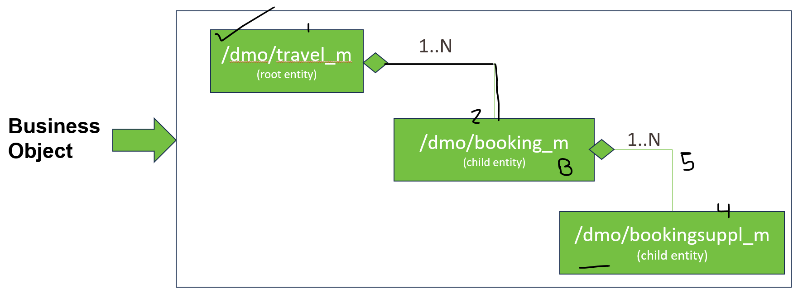

### Step 2. Root Entity


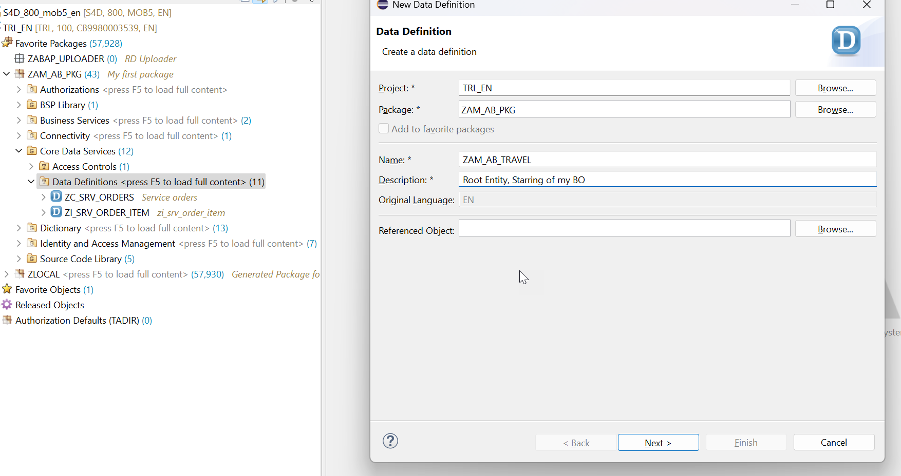


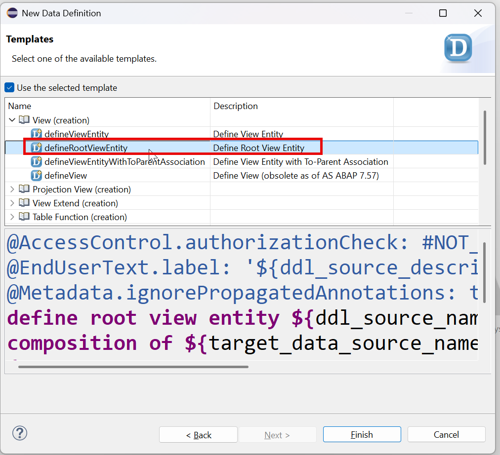

**📄 CDS View Entity** - copy the block below exactly as it is:

```cds
@AccessControl.authorizationCheck: #NOT_REQUIRED
@EndUserText.label: 'Root Entity, Starring of my BO'
@Metadata.ignorePropagatedAnnotations: true
@VDM.viewType: #COMPOSITE
define root view entity ZAM_AB_TRAVEL as select from /dmo/travel_m
--composition[0..*] of ZAM_AB_BOOKING as _Booking
--associations - lose coupling to get dependent data
association[1] to /DMO/I_Agency as _Agency on
   $projection.AgencyId = _Agency.AgencyID
association[1] to /DMO/I_Customer as _Customer on
   $projection.CustomerId = _Customer.CustomerID
association[1] to I_Currency as _Currency on
   $projection.CurrencyCode = _Currency.Currency
association[1..1] to /DMO/I_Overall_Status_VH as _OverallStatus on
   $projection.OverallStatus = _OverallStatus.OverallStatus
{
   key travel_id as TravelId,
   agency_id as AgencyId,
   customer_id as CustomerId,
   begin_date as BeginDate,
   end_date as EndDate,
   @Semantics.amount.currencyCode: 'CurrencyCode'
   booking_fee as BookingFee,
   @Semantics.amount.currencyCode: 'CurrencyCode'
   total_price as TotalPrice,
   currency_code as CurrencyCode,
   description as Description,
   overall_status as OverallStatus,
   created_by as CreatedBy,
   created_at as CreatedAt,
   last_changed_by as LastChangedBy,
   last_changed_at as LastChangedAt,
   _Booking,
    _Agency,
   _Customer,
   _Currency,
   _OverallStatus
   --_association_name // Make association public
}
```

<details>
<summary>💡 What the important lines mean (click to open)</summary>

| Line / keyword | What it does |
|---|---|
| `@AccessControl.authorizationCheck: #NOT_REQUIRED` | Skip the DCL authorisation check. Fine while learning - **never** on real customer data. |
| `@EndUserText.label` | The human-readable description shown in tools and on screen. |
| `@Metadata.ignorePropagatedAnnotations` | `true` = ignore annotations inherited from the views underneath, so you start with a clean slate. |
| `@VDM.viewType` | Where the view sits in SAP's *Virtual Data Model*: `#BASIC` (raw), `#COMPOSITE` (combined), `#CONSUMPTION` (for a UI or report). |
| `define root view entity` | The **top** of a RAP business object tree. Only the root can be exposed as the main entity of a service. |
| `association to` | A reusable, lazily-evaluated relationship. Cheaper than a JOIN because it only runs when used. |
| `$projection.<Field>` | Refers to a field of the view you are currently writing (rather than of the joined source). |
| `@Semantics.amount.currencyCode` | 'This number is money, and that other field holds its currency.' Without it, amounts render as plain numbers. |

</details>

### Step 3. First Child


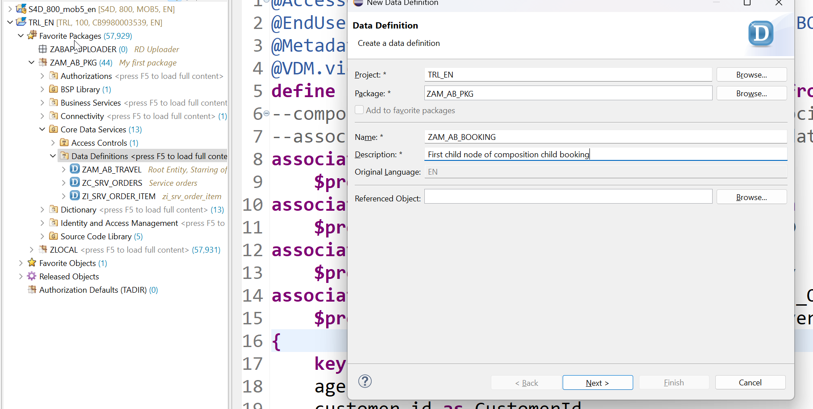

**📄 CDS View Entity** - copy the block below exactly as it is:

```cds
@AbapCatalog.viewEnhancementCategory: [#NONE]
@AccessControl.authorizationCheck: #NOT_REQUIRED
@EndUserText.label: 'First child node of composition child booking'
@Metadata.ignorePropagatedAnnotations: true
@ObjectModel.usageType:{
   serviceQuality: #X,
   sizeCategory: #S,
   dataClass: #MIXED
}
@VDM.viewType: #COMPOSITE
define view entity ZAM_AB_BOOKING as select from /dmo/booking_m
--composition[0..*] of ZAM_AB_BOOKSUPPL as _BookingSuppl
association to parent ZAM_AB_TRAVEL as _Travel
   on $projection.TravelId = _Travel.TravelId
association[1..1] to /DMO/I_Customer as _Customer on
   $projection.CustomerId = _Customer.CustomerID
association[1..1] to /DMO/I_Carrier as _Carrier on
   $projection.CarrierId = _Carrier.AirlineID
association[1..1] to /DMO/I_Connection as _Connection on
   $projection.CarrierId = _Connection.AirlineID and
   $projection.ConnectionId = _Connection.ConnectionID
association[1..1] to /DMO/I_Booking_Status_VH as _BookingStatus on
   $projection.BookingStatus = _BookingStatus.BookingStatus       
{
   key travel_id as TravelId,
   key booking_id as BookingId,
   booking_date as BookingDate,
   customer_id as CustomerId,
   carrier_id as CarrierId,
   connection_id as ConnectionId,
   flight_date as FlightDate,
   @Semantics.amount.currencyCode: 'CurrencyCode'
   flight_price as FlightPrice,
   currency_code as CurrencyCode,
   booking_status as BookingStatus,
   last_changed_at as LastChangedAt,
   _Customer,
   _Carrier,
   _Connection,
   _BookingStatus,
   _Travel,
   _BookingSuppl
}
```

<details>
<summary>💡 What the important lines mean (click to open)</summary>

| Line / keyword | What it does |
|---|---|
| `@AbapCatalog.viewEnhancementCategory: [#NONE]` | Says whether other people may extend this view. `[#NONE]` = closed, `[#PROJECTION_LIST]` = fields may be added. |
| `@AccessControl.authorizationCheck: #NOT_REQUIRED` | Skip the DCL authorisation check. Fine while learning - **never** on real customer data. |
| `@EndUserText.label` | The human-readable description shown in tools and on screen. |
| `@Metadata.ignorePropagatedAnnotations` | `true` = ignore annotations inherited from the views underneath, so you start with a clean slate. |
| `@ObjectModel.usageType` | Declares the view's role: `serviceQuality` (how polished it is), `sizeCategory` (expected row count), `dataClass` (master, transactional, mixed). |
| `@VDM.viewType` | Where the view sits in SAP's *Virtual Data Model*: `#BASIC` (raw), `#COMPOSITE` (combined), `#CONSUMPTION` (for a UI or report). |
| `define view entity` | The modern CDS entity - one object, one name, faster and stricter than the old `define view`. |
| `define view` | The **obsolete** CDS View. Kept here only so you can see the difference. |
| `association to parent` | The child's pointer back up to its parent. Every child in a RAP BO needs exactly one. |

</details>

### Step 4. Second Child


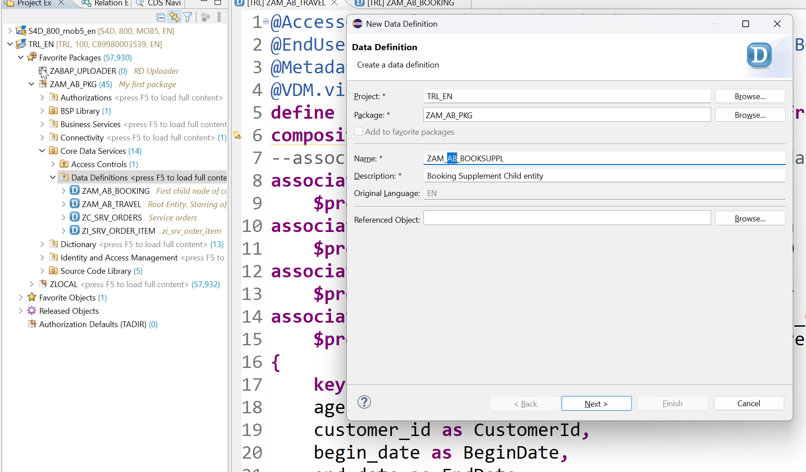

**📄 CDS View Entity** - copy the block below exactly as it is:

```cds
@AbapCatalog.viewEnhancementCategory: [#NONE]
@AccessControl.authorizationCheck: #NOT_REQUIRED
@EndUserText.label: 'Booking Supplement Child entity'
@Metadata.ignorePropagatedAnnotations: true
@ObjectModel.usageType:{
   serviceQuality: #X,
   sizeCategory: #S,
   dataClass: #MIXED
}
define view entity ZAM_AB_BOOKSUPPL as select from /dmo/booksuppl_m
association to parent ZAM_AB_BOOKING as _Booking on
   $projection.BookingId = _Booking.BookingId and
   $projection.TravelId = _Booking.TravelId
association[1..1] to ZAM_AB_TRAVEL as _Travel on
   $projection.TravelId = _Travel.TravelId
association[1..1] to /DMO/I_Supplement as _Product on
   $projection.SupplementId = _Product.SupplementID
association[1..*] to /DMO/I_SupplementText as _SupplementText on
   $projection.SupplementId = _SupplementText.SupplementID
{
   key travel_id as TravelId,
   key booking_id as BookingId,
   key booking_supplement_id as BookingSupplementId,
   supplement_id as SupplementId,
   @Semantics.amount.currencyCode: 'CurrencyCode'
   price as Price,
   currency_code as CurrencyCode,
   last_changed_at as LastChangedAt,
    _Travel,
   _Product,
   _SupplementText,
   _Booking
}
```

<details>
<summary>💡 What the important lines mean (click to open)</summary>

| Line / keyword | What it does |
|---|---|
| `@AbapCatalog.viewEnhancementCategory: [#NONE]` | Says whether other people may extend this view. `[#NONE]` = closed, `[#PROJECTION_LIST]` = fields may be added. |
| `@AccessControl.authorizationCheck: #NOT_REQUIRED` | Skip the DCL authorisation check. Fine while learning - **never** on real customer data. |
| `@EndUserText.label` | The human-readable description shown in tools and on screen. |
| `@Metadata.ignorePropagatedAnnotations` | `true` = ignore annotations inherited from the views underneath, so you start with a clean slate. |
| `@ObjectModel.usageType` | Declares the view's role: `serviceQuality` (how polished it is), `sizeCategory` (expected row count), `dataClass` (master, transactional, mixed). |
| `define view entity` | The modern CDS entity - one object, one name, faster and stricter than the old `define view`. |
| `define view` | The **obsolete** CDS View. Kept here only so you can see the difference. |
| `association to parent` | The child's pointer back up to its parent. Every child in a RAP BO needs exactly one. |
| `association to` | A reusable, lazily-evaluated relationship. Cheaper than a JOIN because it only runs when used. |

</details>

⇒ Uncomment the composition relationships in Travel and Booking and Reactivate them


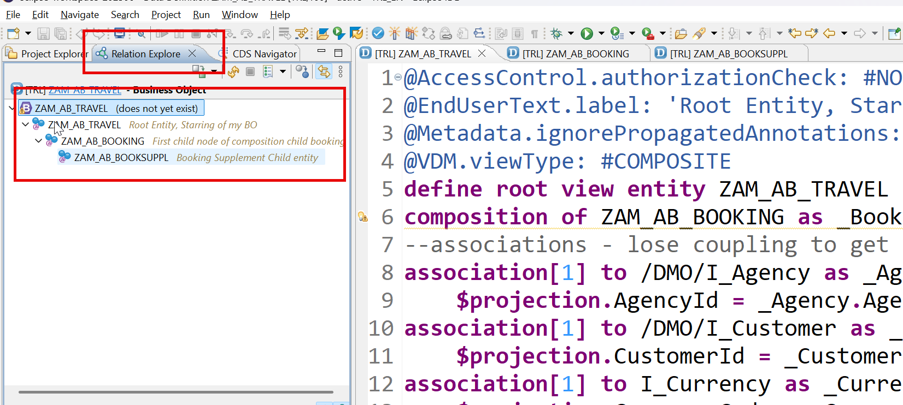

### Step 5. Create processor projection layer which has now 3 entities for processor


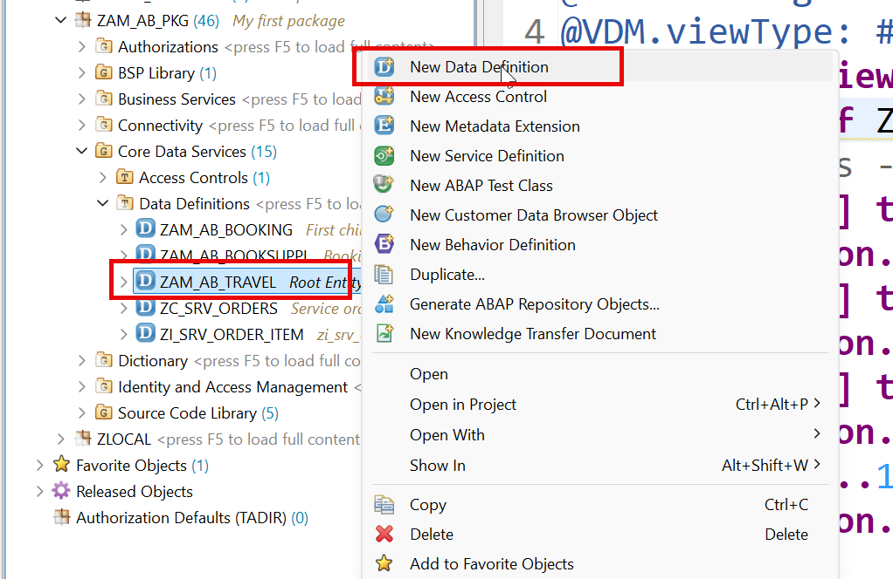


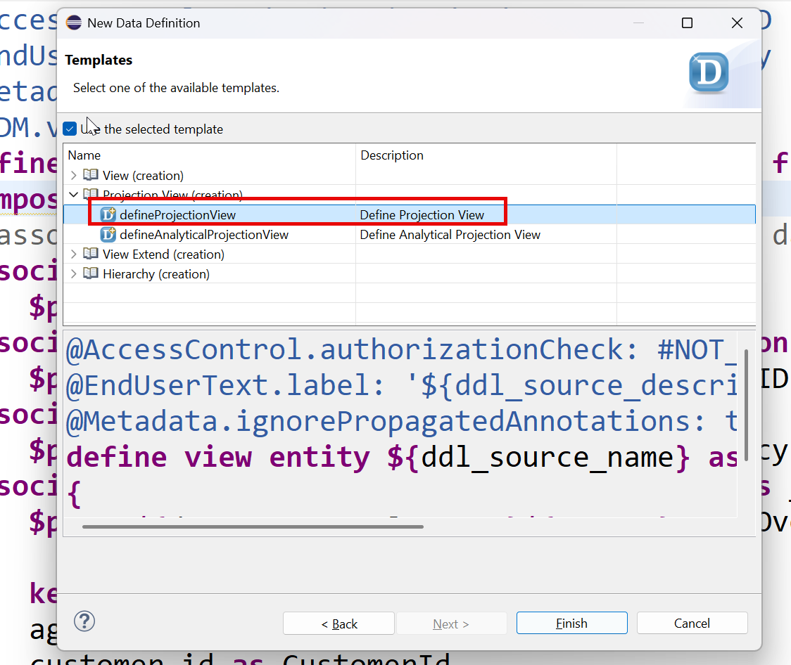

**📄 CDS Projection View** - copy the block below exactly as it is:

```cds
@AccessControl.authorizationCheck: #NOT_REQUIRED
@EndUserText.label: 'Projection for travel entity'
@Metadata.ignorePropagatedAnnotations: false
define root view entity ZAM_AB_TRAVEL_PROCESSOR as projection on ZAM_AB_TRAVEL
{
   key TravelId,
   AgencyId,
   CustomerId,
   BeginDate,
   EndDate,
   BookingFee,
   TotalPrice,
   CurrencyCode,
   Description,
   OverallStatus,
   CreatedBy,
   CreatedAt,
   LastChangedBy,
   LastChangedAt,
   /* Associations */
   _Agency,
   _Booking: redirected to composition child ZAM_AB_BOOKING_PROCESSOR,
   _Currency,
   _Customer,
   _OverallStatus
}
```

<details>
<summary>💡 What the important lines mean (click to open)</summary>

| Line / keyword | What it does |
|---|---|
| `@AccessControl.authorizationCheck: #NOT_REQUIRED` | Skip the DCL authorisation check. Fine while learning - **never** on real customer data. |
| `@EndUserText.label` | The human-readable description shown in tools and on screen. |
| `@Metadata.ignorePropagatedAnnotations` | `true` = ignore annotations inherited from the views underneath, so you start with a clean slate. |
| `define root view entity` | The **top** of a RAP business object tree. Only the root can be exposed as the main entity of a service. |
| `as projection on` | A window onto another entity: same data, but you choose which fields to expose. This is the projection layer. |

</details>

### Step 6. Repeat the process for Booking

**📄 CDS Projection View** - copy the block below exactly as it is:

```cds
@AccessControl.authorizationCheck: #NOT_REQUIRED
@EndUserText.label: 'Booking Process projection entity'
@Metadata.ignorePropagatedAnnotations: false
define view entity ZAM_AB_BOOKING_PROCESSOR as projection on ZAM_AB_BOOKING
{
   key TravelId,
   key BookingId,
   BookingDate,
   CustomerId,
   CarrierId,
   ConnectionId,
   FlightDate,
   FlightPrice,
   CurrencyCode,
   BookingStatus,
   LastChangedAt,
   /* Associations */
   _BookingStatus,
   _BookingSuppl: redirected to composition child ZAM_AB_BOOKSUPPL_PROCESSOR,
   _Carrier,
   _Connection,
   _Customer,
   _Travel :  redirected to parent ZAM_AB_TRAVEL_PROCESSOR
}
```

<details>
<summary>💡 What the important lines mean (click to open)</summary>

| Line / keyword | What it does |
|---|---|
| `@AccessControl.authorizationCheck: #NOT_REQUIRED` | Skip the DCL authorisation check. Fine while learning - **never** on real customer data. |
| `@EndUserText.label` | The human-readable description shown in tools and on screen. |
| `@Metadata.ignorePropagatedAnnotations` | `true` = ignore annotations inherited from the views underneath, so you start with a clean slate. |
| `define view entity` | The modern CDS entity - one object, one name, faster and stricter than the old `define view`. |
| `define view` | The **obsolete** CDS View. Kept here only so you can see the difference. |
| `as projection on` | A window onto another entity: same data, but you choose which fields to expose. This is the projection layer. |

</details>

### Step 7. Repeat the process for Booking Supplement

**📄 CDS Projection View** - copy the block below exactly as it is:

```cds
@AccessControl.authorizationCheck: #NOT_REQUIRED
@EndUserText.label: 'Booking Supplement projection'
@Metadata.ignorePropagatedAnnotations: false
define view entity ZAM_AB_BOOKSUPPL_PROCESSOR as projection on ZAM_AB_BOOKSUPPL
{
   key TravelId,
   key BookingId,
   key BookingSupplementId,
   SupplementId,
   Price,
   CurrencyCode,
   LastChangedAt,
   /* Associations */
   _Booking: redirected to parent ZAM_AB_BOOKING_PROCESSOR,
   _Product,
   _SupplementText,
   _Travel: redirected to ZAM_AB_TRAVEL_PROCESSOR
}
```

<details>
<summary>💡 What the important lines mean (click to open)</summary>

| Line / keyword | What it does |
|---|---|
| `@AccessControl.authorizationCheck: #NOT_REQUIRED` | Skip the DCL authorisation check. Fine while learning - **never** on real customer data. |
| `@EndUserText.label` | The human-readable description shown in tools and on screen. |
| `@Metadata.ignorePropagatedAnnotations` | `true` = ignore annotations inherited from the views underneath, so you start with a clean slate. |
| `define view entity` | The modern CDS entity - one object, one name, faster and stricter than the old `define view`. |
| `define view` | The **obsolete** CDS View. Kept here only so you can see the difference. |
| `as projection on` | A window onto another entity: same data, but you choose which fields to expose. This is the projection layer. |

</details>


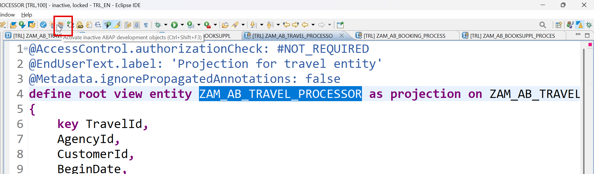

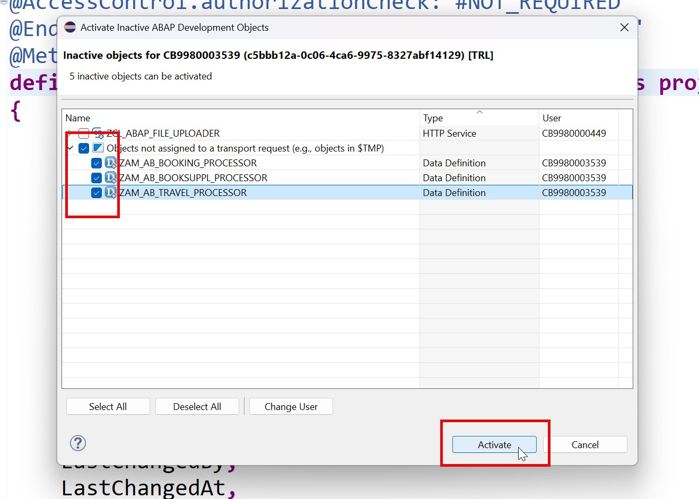

### Step 8. Service definition


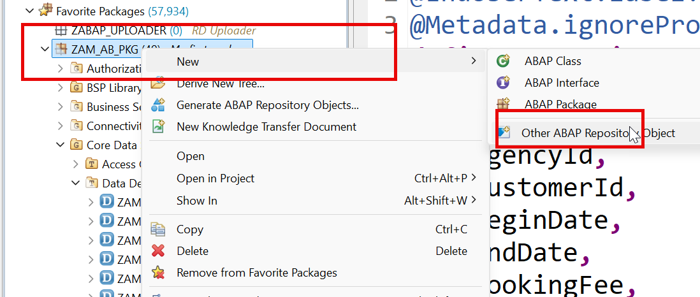


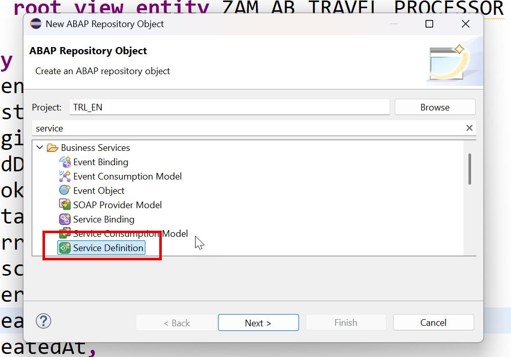

**📄 Service Definition** - copy the block below exactly as it is:

```cds
@EndUserText.label: 'Travel processor Service definition'
define service ZAM_AB_SD_TRAVEL_PROCESSOR {
 expose ZAM_AB_TRAVEL_PROCESSOR    as Travel;
 expose ZAM_AB_BOOKING_PROCESSOR   as Booking;
 expose ZAM_AB_BOOKSUPPL_PROCESSOR as BookSupplement;
 expose /DMO/I_Agency              as Agency;
 expose /DMO/I_Customer            as Customer;
 expose /DMO/I_Carrier             as Carrier;
 expose /DMO/I_Connection          as Connection;
 expose /DMO/I_Overall_Status_VH   as OverallStatus;
 expose /DMO/I_Booking_Status_VH   as BookingStatus;
}
```

<details>
<summary>💡 What the important lines mean (click to open)</summary>

| Line / keyword | What it does |
|---|---|
| `@EndUserText.label` | The human-readable description shown in tools and on screen. |
| `define service` | The guest list of your OData service: which entities may leave the system, and under which public names. |
| `expose <Entity> as <Name>` | Publishes one entity in the service under a public alias. The alias is what appears in the OData URL. |

</details>

### Step 9. Service binding


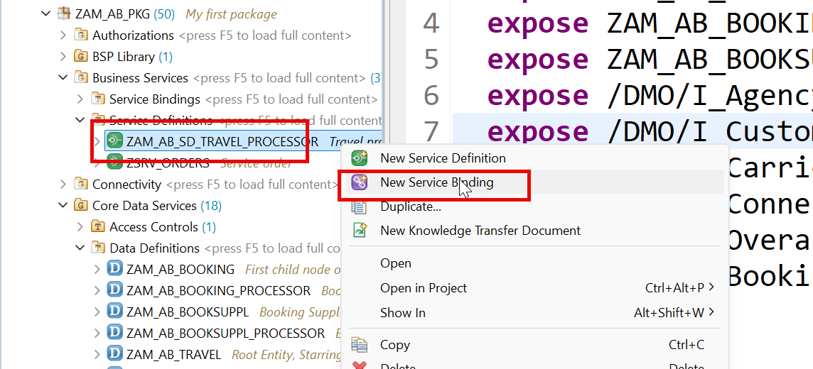

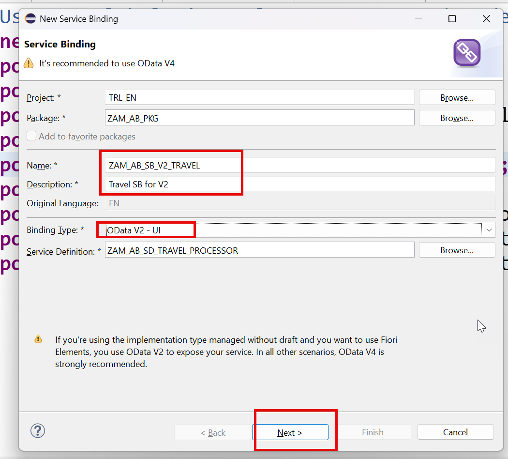

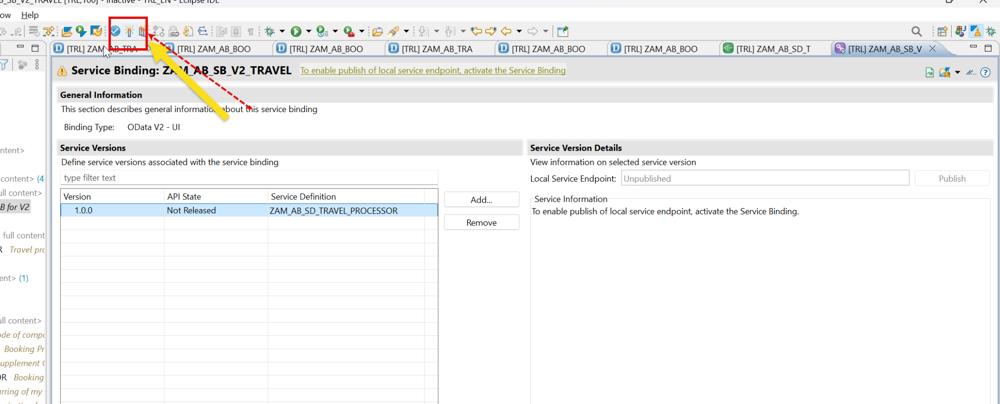

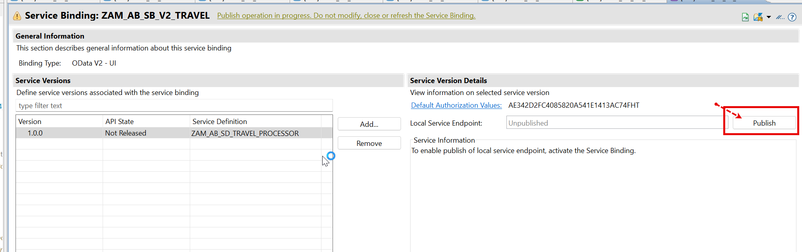

[Optional]Testing


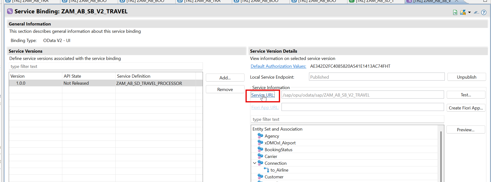


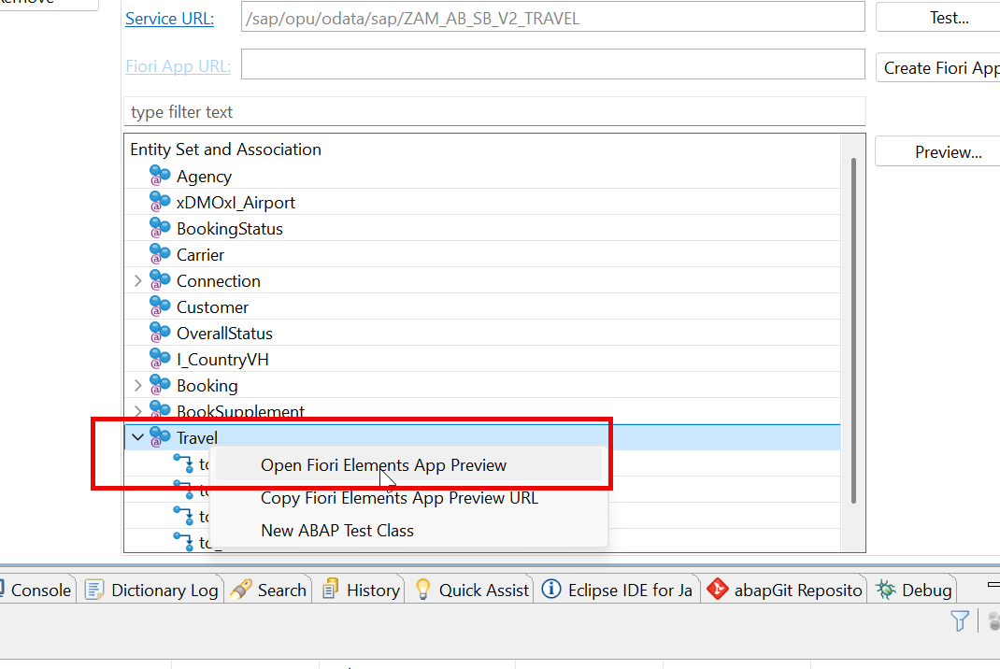

### Step 10. MDE file for create custom Fiori Application Screen (Display app only)


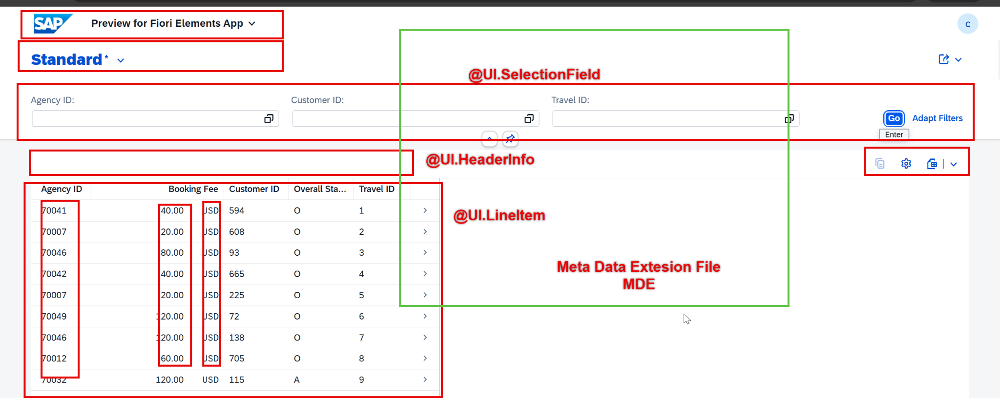


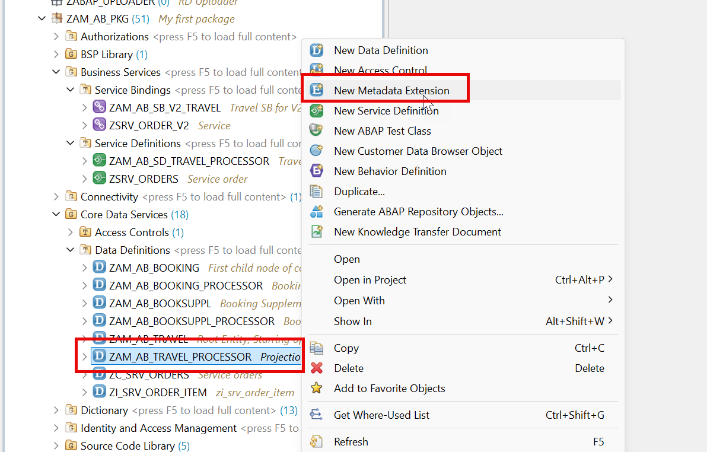

**📄 Metadata Extension (MDE)** - copy the block below exactly as it is:

```cds
@Metadata.layer: #CUSTOMER
@UI.headerInfo:{
   typeName: 'Travel',
   typeNamePlural: 'Travel Requests'  ,
   title: { value: 'TravelId' },
   description: { value: 'Description' } 
}
annotate entity ZAM_AB_TRAVEL_PROCESSOR
   with
{
   @UI.selectionField: [{ position: 10 }]
   @UI.lineItem: [{ position: 10 }]
   TravelId;
   @UI.selectionField: [{ position: 20 }]
   @UI.lineItem: [{ position: 20 }]
   AgencyId;
   @UI.selectionField: [{ position: 30 }]
   @UI.lineItem: [{ position: 30 }]
   CustomerId;
   @UI.selectionField: [{ position: 40 }]
   @UI.lineItem: [{ position: 40 }]
   BeginDate;
//    EndDate;
//    BookingFee;
   @UI.lineItem: [{ position: 50 }]
   TotalPrice;
//    CurrencyCode;
//    Description;
   @UI.lineItem: [{ position: 60 }]
   OverallStatus;
//    CreatedBy;
//    CreatedAt;
//    LastChangedBy;
//    LastChangedAt;
  
}
```

<details>
<summary>💡 What the important lines mean (click to open)</summary>

| Line / keyword | What it does |
|---|---|
| `@Metadata.layer: #CUSTOMER` | Which annotation layer this MDE belongs to. `#CUSTOMER` overrides `#CORE`, so the higher layer wins. |
| `@UI.headerInfo` | The object page's title area: what to call one record, many records, and which fields become the title and subtitle. |
| `@UI.lineItem` | 'Show this field as a **column in the list**.' `position` decides the order; leave gaps (10, 20, 30) so you can insert later. |
| `@UI.selectionField` | 'Put this field on the **filter bar** at the top of the list.' |
| `annotate entity <X> with { ... }` | The MDE header: 'the `@UI` annotations below belong to that entity'. Keeping them in a separate file keeps UI decisions out of the data model. |

</details>

**📄 CDS Projection View** - copy the block below exactly as it is:

```cds
@AccessControl.authorizationCheck: #NOT_REQUIRED
@EndUserText.label: 'Projection for travel entity'
@Metadata.ignorePropagatedAnnotations: false
@Metadata.allowExtensions: true
define root view entity ZAM_AB_TRAVEL_PROCESSOR as projection on ZAM_AB_TRAVEL
{
   key TravelId,
   AgencyId,
   CustomerId,
   BeginDate,
   EndDate,
   BookingFee,
   TotalPrice,
   CurrencyCode,
   Description,
   OverallStatus,
   CreatedBy,
   CreatedAt,
   LastChangedBy,
   LastChangedAt,
   /* Associations */
   _Agency,
   _Booking: redirected to composition child ZAM_AB_BOOKING_PROCESSOR,
   _Currency,
   _Customer,
   _OverallStatus
}
```

<details>
<summary>💡 What the important lines mean (click to open)</summary>

| Line / keyword | What it does |
|---|---|
| `@AccessControl.authorizationCheck: #NOT_REQUIRED` | Skip the DCL authorisation check. Fine while learning - **never** on real customer data. |
| `@EndUserText.label` | The human-readable description shown in tools and on screen. |
| `@Metadata.ignorePropagatedAnnotations` | `true` = ignore annotations inherited from the views underneath, so you start with a clean slate. |
| `@Metadata.allowExtensions: true` | Permits a separate Metadata Extension (MDE) file to attach `@UI` annotations to this entity. |
| `define root view entity` | The **top** of a RAP business object tree. Only the root can be exposed as the main entity of a service. |
| `as projection on` | A window onto another entity: same data, but you choose which fields to expose. This is the projection layer. |

</details>

### Step 11. Adding the features for Value help and description

**📄 CDS View Entity** - copy the block below exactly as it is:

```cds
@AccessControl.authorizationCheck: #NOT_REQUIRED
@EndUserText.label: 'Root Entity, Starring of my BO'
@Metadata.ignorePropagatedAnnotations: true
@VDM.viewType: #COMPOSITE
define root view entity ZAM_AB_TRAVEL as select from /dmo/travel_m
composition[0..*] of ZAM_AB_BOOKING as _Booking
--associations - lose coupling to get dependent data
association[1] to /DMO/I_Agency as _Agency on
   $projection.AgencyId = _Agency.AgencyID
association[1] to /DMO/I_Customer as _Customer on
   $projection.CustomerId = _Customer.CustomerID
association[1] to I_Currency as _Currency on
   $projection.CurrencyCode = _Currency.Currency
association[1..1] to /DMO/I_Overall_Status_VH as _OverallStatus on
   $projection.OverallStatus = _OverallStatus.OverallStatus
{
   @ObjectModel.text.element: [ 'Description' ]
   key travel_id as TravelId,
   @ObjectModel.text.element: [ 'AgencyName' ]
   @Consumption.valueHelpDefinition: [{
       entity.name: '/DMO/I_Agency',
       entity.element: 'AgencyID'
   }]
   agency_id as AgencyId,
   _Agency.Name as AgencyName,
   @ObjectModel.text.element: [ 'CustomerName' ]
   @Consumption.valueHelpDefinition: [{
       entity.name: '/DMO/I_Customer',
       entity.element: 'CustomerID'
   }]
   customer_id as CustomerId,
   _Customer.LastName as CustomerName,
   begin_date as BeginDate,
   end_date as EndDate,
   @Semantics.amount.currencyCode: 'CurrencyCode'
   booking_fee as BookingFee,
   @Semantics.amount.currencyCode: 'CurrencyCode'
   total_price as TotalPrice,
   @Consumption.valueHelpDefinition: [{
       entity.name: 'I_Currency',
       entity.element: 'Currency'
   }]
   currency_code as CurrencyCode,
   description as Description,
   @Consumption.valueHelpDefinition: [{
       entity.name: '/DMO/I_Overall_Status_VH',
       entity.element: 'OverallStatus'
   }]
   --@ObjectModel.foreignKey.association: '_OverallStatus'
   overall_status as OverallStatus,
   created_by as CreatedBy,
   created_at as CreatedAt,
   last_changed_by as LastChangedBy,
   last_changed_at as LastChangedAt,
   _Booking,
    _Agency,
   _Customer,
   _Currency,
   _OverallStatus
   --_association_name // Make association public
}
```

<details>
<summary>💡 What the important lines mean (click to open)</summary>

| Line / keyword | What it does |
|---|---|
| `@AccessControl.authorizationCheck: #NOT_REQUIRED` | Skip the DCL authorisation check. Fine while learning - **never** on real customer data. |
| `@EndUserText.label` | The human-readable description shown in tools and on screen. |
| `@Metadata.ignorePropagatedAnnotations` | `true` = ignore annotations inherited from the views underneath, so you start with a clean slate. |
| `@VDM.viewType` | Where the view sits in SAP's *Virtual Data Model*: `#BASIC` (raw), `#COMPOSITE` (combined), `#CONSUMPTION` (for a UI or report). |
| `define root view entity` | The **top** of a RAP business object tree. Only the root can be exposed as the main entity of a service. |
| `association to` | A reusable, lazily-evaluated relationship. Cheaper than a JOIN because it only runs when used. |
| `$projection.<Field>` | Refers to a field of the view you are currently writing (rather than of the joined source). |
| `@ObjectModel.text.element` | 'The readable name for this code lives in that field.' The UI shows the word, but still stores and filters on the code. |
| `@ObjectModel.foreignKey.association` | Tells the framework which association validates this foreign-key field. |

</details>

**📄 CDS Projection View** - copy the block below exactly as it is:

```cds
@AccessControl.authorizationCheck: #NOT_REQUIRED
@EndUserText.label: 'Projection for travel entity'
@Metadata.ignorePropagatedAnnotations: false
@Metadata.allowExtensions: true
define root view entity ZAM_AB_TRAVEL_PROCESSOR as projection on ZAM_AB_TRAVEL
{
   key TravelId,
   AgencyId,
   CustomerId,
   BeginDate,
   EndDate,
   BookingFee,
   TotalPrice,
   CurrencyCode,
   Description,
   OverallStatus,
   CreatedBy,
   CreatedAt,
   LastChangedBy,
   LastChangedAt,
   AgencyName,
   CustomerName,
   /* Associations */
   _Agency,
   _Booking: redirected to composition child ZAM_AB_BOOKING_PROCESSOR,
   _Currency,
   _Customer,
   _OverallStatus
}
```

<details>
<summary>💡 What the important lines mean (click to open)</summary>

| Line / keyword | What it does |
|---|---|
| `@AccessControl.authorizationCheck: #NOT_REQUIRED` | Skip the DCL authorisation check. Fine while learning - **never** on real customer data. |
| `@EndUserText.label` | The human-readable description shown in tools and on screen. |
| `@Metadata.ignorePropagatedAnnotations` | `true` = ignore annotations inherited from the views underneath, so you start with a clean slate. |
| `@Metadata.allowExtensions: true` | Permits a separate Metadata Extension (MDE) file to attach `@UI` annotations to this entity. |
| `define root view entity` | The **top** of a RAP business object tree. Only the root can be exposed as the main entity of a service. |
| `as projection on` | A window onto another entity: same data, but you choose which fields to expose. This is the projection layer. |

</details>

---

## 📦 Objects in your package after today

```text
$Z_AM_AB  (your package - replace _AB_ with your own initials)
  ├── ZAM_AB_TRAVEL                       CDS root entity
  ├── ZAM_AB_BOOKING                      CDS entity
  ├── ZAM_AB_BOOKSUPPL                    CDS entity
  ├── ZAM_AB_TRAVEL_PROCESSOR             CDS root entity
  ├── ZAM_AB_BOOKING_PROCESSOR            CDS entity
  ├── ZAM_AB_BOOKSUPPL_PROCESSOR          CDS entity
  ├── ZAM_AB_SD_TRAVEL_PROCESSOR          Service definition
```

---

## ✅ Final version of all code from Day 6

Everything below is the **complete, unmodified** source from the training material, gathered in one place so you can copy it straight into Eclipse.

### 1. Root Entity - _CDS View Entity_

```cds
@AccessControl.authorizationCheck: #NOT_REQUIRED
@EndUserText.label: 'Root Entity, Starring of my BO'
@Metadata.ignorePropagatedAnnotations: true
@VDM.viewType: #COMPOSITE
define root view entity ZAM_AB_TRAVEL as select from /dmo/travel_m
--composition[0..*] of ZAM_AB_BOOKING as _Booking
--associations - lose coupling to get dependent data
association[1] to /DMO/I_Agency as _Agency on
   $projection.AgencyId = _Agency.AgencyID
association[1] to /DMO/I_Customer as _Customer on
   $projection.CustomerId = _Customer.CustomerID
association[1] to I_Currency as _Currency on
   $projection.CurrencyCode = _Currency.Currency
association[1..1] to /DMO/I_Overall_Status_VH as _OverallStatus on
   $projection.OverallStatus = _OverallStatus.OverallStatus
{
   key travel_id as TravelId,
   agency_id as AgencyId,
   customer_id as CustomerId,
   begin_date as BeginDate,
   end_date as EndDate,
   @Semantics.amount.currencyCode: 'CurrencyCode'
   booking_fee as BookingFee,
   @Semantics.amount.currencyCode: 'CurrencyCode'
   total_price as TotalPrice,
   currency_code as CurrencyCode,
   description as Description,
   overall_status as OverallStatus,
   created_by as CreatedBy,
   created_at as CreatedAt,
   last_changed_by as LastChangedBy,
   last_changed_at as LastChangedAt,
   _Booking,
    _Agency,
   _Customer,
   _Currency,
   _OverallStatus
   --_association_name // Make association public
}
```

### 2. First Child - _CDS View Entity_

```cds
@AbapCatalog.viewEnhancementCategory: [#NONE]
@AccessControl.authorizationCheck: #NOT_REQUIRED
@EndUserText.label: 'First child node of composition child booking'
@Metadata.ignorePropagatedAnnotations: true
@ObjectModel.usageType:{
   serviceQuality: #X,
   sizeCategory: #S,
   dataClass: #MIXED
}
@VDM.viewType: #COMPOSITE
define view entity ZAM_AB_BOOKING as select from /dmo/booking_m
--composition[0..*] of ZAM_AB_BOOKSUPPL as _BookingSuppl
association to parent ZAM_AB_TRAVEL as _Travel
   on $projection.TravelId = _Travel.TravelId
association[1..1] to /DMO/I_Customer as _Customer on
   $projection.CustomerId = _Customer.CustomerID
association[1..1] to /DMO/I_Carrier as _Carrier on
   $projection.CarrierId = _Carrier.AirlineID
association[1..1] to /DMO/I_Connection as _Connection on
   $projection.CarrierId = _Connection.AirlineID and
   $projection.ConnectionId = _Connection.ConnectionID
association[1..1] to /DMO/I_Booking_Status_VH as _BookingStatus on
   $projection.BookingStatus = _BookingStatus.BookingStatus       
{
   key travel_id as TravelId,
   key booking_id as BookingId,
   booking_date as BookingDate,
   customer_id as CustomerId,
   carrier_id as CarrierId,
   connection_id as ConnectionId,
   flight_date as FlightDate,
   @Semantics.amount.currencyCode: 'CurrencyCode'
   flight_price as FlightPrice,
   currency_code as CurrencyCode,
   booking_status as BookingStatus,
   last_changed_at as LastChangedAt,
   _Customer,
   _Carrier,
   _Connection,
   _BookingStatus,
   _Travel,
   _BookingSuppl
}
```

### 3. Second Child - _CDS View Entity_

```cds
@AbapCatalog.viewEnhancementCategory: [#NONE]
@AccessControl.authorizationCheck: #NOT_REQUIRED
@EndUserText.label: 'Booking Supplement Child entity'
@Metadata.ignorePropagatedAnnotations: true
@ObjectModel.usageType:{
   serviceQuality: #X,
   sizeCategory: #S,
   dataClass: #MIXED
}
define view entity ZAM_AB_BOOKSUPPL as select from /dmo/booksuppl_m
association to parent ZAM_AB_BOOKING as _Booking on
   $projection.BookingId = _Booking.BookingId and
   $projection.TravelId = _Booking.TravelId
association[1..1] to ZAM_AB_TRAVEL as _Travel on
   $projection.TravelId = _Travel.TravelId
association[1..1] to /DMO/I_Supplement as _Product on
   $projection.SupplementId = _Product.SupplementID
association[1..*] to /DMO/I_SupplementText as _SupplementText on
   $projection.SupplementId = _SupplementText.SupplementID
{
   key travel_id as TravelId,
   key booking_id as BookingId,
   key booking_supplement_id as BookingSupplementId,
   supplement_id as SupplementId,
   @Semantics.amount.currencyCode: 'CurrencyCode'
   price as Price,
   currency_code as CurrencyCode,
   last_changed_at as LastChangedAt,
    _Travel,
   _Product,
   _SupplementText,
   _Booking
}
```

### 4. Create processor projection layer which has now 3 entities for processor - _CDS Projection View_

```cds
@AccessControl.authorizationCheck: #NOT_REQUIRED
@EndUserText.label: 'Projection for travel entity'
@Metadata.ignorePropagatedAnnotations: false
define root view entity ZAM_AB_TRAVEL_PROCESSOR as projection on ZAM_AB_TRAVEL
{
   key TravelId,
   AgencyId,
   CustomerId,
   BeginDate,
   EndDate,
   BookingFee,
   TotalPrice,
   CurrencyCode,
   Description,
   OverallStatus,
   CreatedBy,
   CreatedAt,
   LastChangedBy,
   LastChangedAt,
   /* Associations */
   _Agency,
   _Booking: redirected to composition child ZAM_AB_BOOKING_PROCESSOR,
   _Currency,
   _Customer,
   _OverallStatus
}
```

### 5. Repeat the process for Booking - _CDS Projection View_

```cds
@AccessControl.authorizationCheck: #NOT_REQUIRED
@EndUserText.label: 'Booking Process projection entity'
@Metadata.ignorePropagatedAnnotations: false
define view entity ZAM_AB_BOOKING_PROCESSOR as projection on ZAM_AB_BOOKING
{
   key TravelId,
   key BookingId,
   BookingDate,
   CustomerId,
   CarrierId,
   ConnectionId,
   FlightDate,
   FlightPrice,
   CurrencyCode,
   BookingStatus,
   LastChangedAt,
   /* Associations */
   _BookingStatus,
   _BookingSuppl: redirected to composition child ZAM_AB_BOOKSUPPL_PROCESSOR,
   _Carrier,
   _Connection,
   _Customer,
   _Travel :  redirected to parent ZAM_AB_TRAVEL_PROCESSOR
}
```

### 6. Repeat the process for Booking Supplement - _CDS Projection View_

```cds
@AccessControl.authorizationCheck: #NOT_REQUIRED
@EndUserText.label: 'Booking Supplement projection'
@Metadata.ignorePropagatedAnnotations: false
define view entity ZAM_AB_BOOKSUPPL_PROCESSOR as projection on ZAM_AB_BOOKSUPPL
{
   key TravelId,
   key BookingId,
   key BookingSupplementId,
   SupplementId,
   Price,
   CurrencyCode,
   LastChangedAt,
   /* Associations */
   _Booking: redirected to parent ZAM_AB_BOOKING_PROCESSOR,
   _Product,
   _SupplementText,
   _Travel: redirected to ZAM_AB_TRAVEL_PROCESSOR
}
```

### 7. Service definition - _Service Definition_

```cds
@EndUserText.label: 'Travel processor Service definition'
define service ZAM_AB_SD_TRAVEL_PROCESSOR {
 expose ZAM_AB_TRAVEL_PROCESSOR    as Travel;
 expose ZAM_AB_BOOKING_PROCESSOR   as Booking;
 expose ZAM_AB_BOOKSUPPL_PROCESSOR as BookSupplement;
 expose /DMO/I_Agency              as Agency;
 expose /DMO/I_Customer            as Customer;
 expose /DMO/I_Carrier             as Carrier;
 expose /DMO/I_Connection          as Connection;
 expose /DMO/I_Overall_Status_VH   as OverallStatus;
 expose /DMO/I_Booking_Status_VH   as BookingStatus;
}
```

### 8. MDE file for create custom Fiori Application Screen (Display app only) - _Metadata Extension (MDE)_

```cds
@Metadata.layer: #CUSTOMER
@UI.headerInfo:{
   typeName: 'Travel',
   typeNamePlural: 'Travel Requests'  ,
   title: { value: 'TravelId' },
   description: { value: 'Description' } 
}
annotate entity ZAM_AB_TRAVEL_PROCESSOR
   with
{
   @UI.selectionField: [{ position: 10 }]
   @UI.lineItem: [{ position: 10 }]
   TravelId;
   @UI.selectionField: [{ position: 20 }]
   @UI.lineItem: [{ position: 20 }]
   AgencyId;
   @UI.selectionField: [{ position: 30 }]
   @UI.lineItem: [{ position: 30 }]
   CustomerId;
   @UI.selectionField: [{ position: 40 }]
   @UI.lineItem: [{ position: 40 }]
   BeginDate;
//    EndDate;
//    BookingFee;
   @UI.lineItem: [{ position: 50 }]
   TotalPrice;
//    CurrencyCode;
//    Description;
   @UI.lineItem: [{ position: 60 }]
   OverallStatus;
//    CreatedBy;
//    CreatedAt;
//    LastChangedBy;
//    LastChangedAt;
  
}
```

### 9. MDE file for create custom Fiori Application Screen (Display app only) - _CDS Projection View_

```cds
@AccessControl.authorizationCheck: #NOT_REQUIRED
@EndUserText.label: 'Projection for travel entity'
@Metadata.ignorePropagatedAnnotations: false
@Metadata.allowExtensions: true
define root view entity ZAM_AB_TRAVEL_PROCESSOR as projection on ZAM_AB_TRAVEL
{
   key TravelId,
   AgencyId,
   CustomerId,
   BeginDate,
   EndDate,
   BookingFee,
   TotalPrice,
   CurrencyCode,
   Description,
   OverallStatus,
   CreatedBy,
   CreatedAt,
   LastChangedBy,
   LastChangedAt,
   /* Associations */
   _Agency,
   _Booking: redirected to composition child ZAM_AB_BOOKING_PROCESSOR,
   _Currency,
   _Customer,
   _OverallStatus
}
```

### 10. Adding the features for Value help and description - _CDS View Entity_

```cds
@AccessControl.authorizationCheck: #NOT_REQUIRED
@EndUserText.label: 'Root Entity, Starring of my BO'
@Metadata.ignorePropagatedAnnotations: true
@VDM.viewType: #COMPOSITE
define root view entity ZAM_AB_TRAVEL as select from /dmo/travel_m
composition[0..*] of ZAM_AB_BOOKING as _Booking
--associations - lose coupling to get dependent data
association[1] to /DMO/I_Agency as _Agency on
   $projection.AgencyId = _Agency.AgencyID
association[1] to /DMO/I_Customer as _Customer on
   $projection.CustomerId = _Customer.CustomerID
association[1] to I_Currency as _Currency on
   $projection.CurrencyCode = _Currency.Currency
association[1..1] to /DMO/I_Overall_Status_VH as _OverallStatus on
   $projection.OverallStatus = _OverallStatus.OverallStatus
{
   @ObjectModel.text.element: [ 'Description' ]
   key travel_id as TravelId,
   @ObjectModel.text.element: [ 'AgencyName' ]
   @Consumption.valueHelpDefinition: [{
       entity.name: '/DMO/I_Agency',
       entity.element: 'AgencyID'
   }]
   agency_id as AgencyId,
   _Agency.Name as AgencyName,
   @ObjectModel.text.element: [ 'CustomerName' ]
   @Consumption.valueHelpDefinition: [{
       entity.name: '/DMO/I_Customer',
       entity.element: 'CustomerID'
   }]
   customer_id as CustomerId,
   _Customer.LastName as CustomerName,
   begin_date as BeginDate,
   end_date as EndDate,
   @Semantics.amount.currencyCode: 'CurrencyCode'
   booking_fee as BookingFee,
   @Semantics.amount.currencyCode: 'CurrencyCode'
   total_price as TotalPrice,
   @Consumption.valueHelpDefinition: [{
       entity.name: 'I_Currency',
       entity.element: 'Currency'
   }]
   currency_code as CurrencyCode,
   description as Description,
   @Consumption.valueHelpDefinition: [{
       entity.name: '/DMO/I_Overall_Status_VH',
       entity.element: 'OverallStatus'
   }]
   --@ObjectModel.foreignKey.association: '_OverallStatus'
   overall_status as OverallStatus,
   created_by as CreatedBy,
   created_at as CreatedAt,
   last_changed_by as LastChangedBy,
   last_changed_at as LastChangedAt,
   _Booking,
    _Agency,
   _Customer,
   _Currency,
   _OverallStatus
   --_association_name // Make association public
}
```

### 11. Adding the features for Value help and description - _CDS Projection View_

```cds
@AccessControl.authorizationCheck: #NOT_REQUIRED
@EndUserText.label: 'Projection for travel entity'
@Metadata.ignorePropagatedAnnotations: false
@Metadata.allowExtensions: true
define root view entity ZAM_AB_TRAVEL_PROCESSOR as projection on ZAM_AB_TRAVEL
{
   key TravelId,
   AgencyId,
   CustomerId,
   BeginDate,
   EndDate,
   BookingFee,
   TotalPrice,
   CurrencyCode,
   Description,
   OverallStatus,
   CreatedBy,
   CreatedAt,
   LastChangedBy,
   LastChangedAt,
   AgencyName,
   CustomerName,
   /* Associations */
   _Agency,
   _Booking: redirected to composition child ZAM_AB_BOOKING_PROCESSOR,
   _Currency,
   _Customer,
   _OverallStatus
}
```

---

## ⚠️ Traps and tips

- Create the children first with the composition lines **commented out**, activate, then uncomment and re-activate. Otherwise you get a chicken-and-egg activation error.
- `#CUSTOMER` layer beats `#CORE` layer. If your annotation seems ignored, check which layer it is in.

---

[⬅️ Day 5](Day05_Table_Function_Fix_And_Consumption.md) | [🏠 Summary](00_SUMMARY.md) | [📋 Master Cheat Sheet](00_MASTER_CHEAT_SHEET.md) | [Day 7 ➡️](Day07_Fiori_UI_Annotations_And_Drilldown.md)
