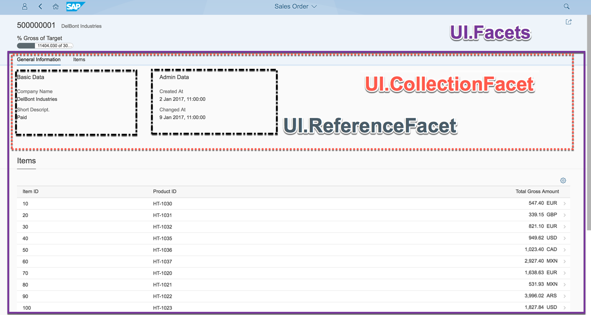
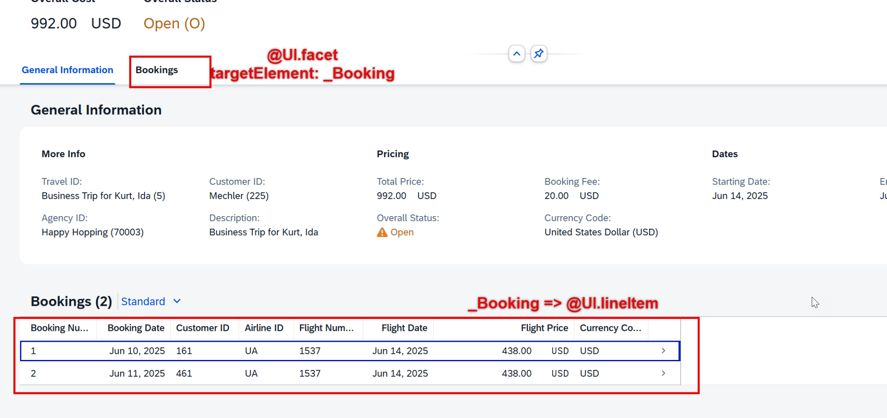
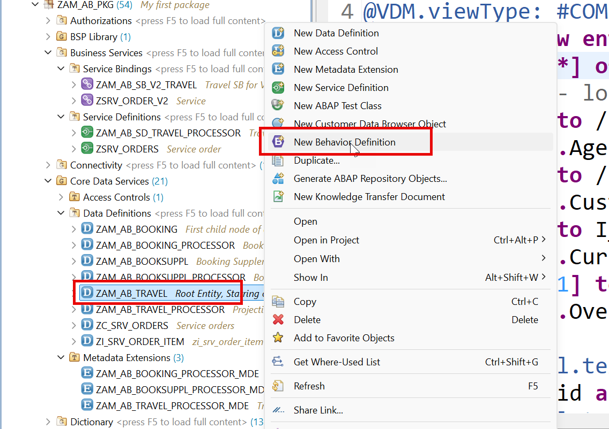

# Day 7 - Making the Fiori Screen Beautiful

> **Criticality and icons, dynamic status text, nested tables and 3-level drill-down**

> Phase C - RAP Business Object (Days 6-8) - Model a real Travel business object and expose it as an OData service.

**🎯 Goal of the day.** Turn a plain list into a proper Fiori app: coloured status icons, a bookings table inside Travel, and a third level of detail.

---

## 📋 Cheat Sheet - keep this open

### Today's quick reference

| Thing | Value / Syntax |
|---|---|
| **Table column** | `@UI.lineItem: [{ position: 10 }]` |
| **Filter field** | `@UI.selectionField: [{ position: 10 }]` |
| **Object page field** | `@UI.identification: [{ position: 10 }]` |
| **Group of fields** | `@UI.fieldGroup: [{ position: 10, qualifier: 'superman' }]` + a `#FIELDGROUP_REFERENCE` facet with the same `targetQualifier` |
| **Header KPI** | `@UI.dataPoint: { qualifier: 'MyTravelCost', title: '...' }` + a `#DATAPOINT_REFERENCE` facet with `purpose: #HEADER` |
| **Child table** | facet `type: #LINEITEM_REFERENCE`, `targetElement: '_Booking'` |
| `Criticality` | 0 none, 1 red, 2 yellow, 3 green |
| **Icon on status** | `criticality: '<field>'` + `criticalityRepresentation: #WITH_ICON` |

### Eclipse / ADT keys you will use constantly

| Key | Action |
|---|---|
| `Ctrl+Shift+A` | Search any object in the whole system |
| `Ctrl+F3` | Activate the current object |
| `Ctrl+1` | Quick fix - RAP generates code skeletons for you |
| `Ctrl+Space` | Code completion |
| `Ctrl+Click` | Navigate to the object under the cursor |
| `Ctrl+7` | Comment / uncomment a block |
| `F2` | Show a method signature |
| `F8` | Data preview (table / CDS entity) |
| `F9` | Run the class |

### The RAP layer cake (memorise this)

```text
Database tables            <- where the data really sits
   |
Interface CDS entity       <- stable, reusable model       (ZAM_AB_TRAVEL)
   |
Behavior Definition        <- the rulebook                 (.bdef)
   |
Projection CDS entity      <- one app's view of the model  (ZAM_AB_TRAVEL_PROCESSOR)
   |
Projection BDEF            <- which rules this app may use
   |
Metadata Extension (MDE)   <- the screen layout, @UI.*
   |
Service Definition         <- which entities are allowed out
   |
Service Binding            <- the actual OData V2 / V4 URL
   |
Fiori Elements app         <- built from the annotations, no JavaScript needed
```

---

## 🧱 What you will build today

- Enhanced **Travel MDE** with data points, criticality and header facets.
- A **status text** entity so the icon shows *words*, not codes.
- A **bookings table** embedded in the Travel object page.
- A **third-level drill-down**: Travel -> Booking -> Booking Supplement.

## 🧠 Concepts first, in plain English

Read this before touching the keyboard. Every idea is explained the way you would explain it to a school student.

**`@UI.dataPoint`**

A single highlighted number or status, usually in the header. `criticality` colours it: 1 = red, 2 = yellow, 3 = green.

**Criticality**

A traffic light for data. You give Fiori a number and it picks the colour and icon - you never write CSS.

**Why a text entity?**

The database stores `O` for Open. Users want to read 'Open'. A tiny text view maps code to word, and `@ObjectModel.text.element` links them, so the UI shows the word and still filters on the code.

**`@UI.facet` with `type: #LINEITEM_REFERENCE`**

'Put a *table* of my child entity here.' `targetElement: '_Booking'` names which association to follow.

**Drill-down levels**

Each level is just another projection + another MDE. Fiori Elements builds the navigation from the compositions automatically.

**`#COLLECTION` facet**

A container facet. Put other facets inside it with `parentId` and they render as a group of sections.

---

## 🛠️ Hands-on, step by step




**📄 Metadata Extension (MDE)** - copy the block below exactly as it is:

```cds
@Metadata.layer: #CUSTOMER
@UI.headerInfo:{
   typeName: 'Travel',
   typeNamePlural: 'Travel Requests'  ,
   title: { value: 'TravelId' },
   description: { value: 'Description' } 
}
annotate entity ZAM_AB_TRAVEL_PROCESSOR
   with
{
   --Second screen ( applies only and only on Object Page )
   @UI.facet: [
       {
           purpose: #STANDARD,
           type: #COLLECTION,
           id: 'spiderman',
           label: 'General Information',
           position: 10
       },
       {
           id: 'TravelBasic',
           purpose: #STANDARD,
           type: #IDENTIFICATION_REFERENCE,
           parentId: 'spiderman',
           position: 10,
           label: 'More Info'
       },
       {
           id: 'TravelDates',
           type: #FIELDGROUP_REFERENCE,
           purpose: #STANDARD,
           parentId: 'spiderman',
           label: 'Dates',
           position: 30,
           targetQualifier: 'superman'       
       },
       {
           id: 'Pricing',
           type: #FIELDGROUP_REFERENCE,
           purpose: #STANDARD,
           parentId: 'spiderman',
           label: 'Pricing',
           position: 20,
           targetQualifier: 'wonderwomen'       
       }
   ]
   @UI.selectionField: [{ position: 10 }]
   @UI.lineItem: [{ position: 10 }]
   @UI.identification: [{ position: 10 }]
   TravelId;
   @UI.selectionField: [{ position: 20 }]
   @UI.lineItem: [{ position: 20 }]
   @UI.identification: [{ position: 20 }]   
   AgencyId;
   @UI.selectionField: [{ position: 30 }]
   @UI.lineItem: [{ position: 30 }]
   @UI.identification: [{ position: 30 }]
   CustomerId;
   @UI.selectionField: [{ position: 40 }]
   @UI.lineItem: [{ position: 40 }]
   @UI.fieldGroup: [{ position: 10, qualifier: 'superman' }]
   BeginDate;
   @UI.fieldGroup: [{ position: 20, qualifier: 'superman' }]
   EndDate;
   @UI.fieldGroup: [{ position: 20, qualifier: 'wonderwomen' }]
   BookingFee;
   @UI.lineItem: [{ position: 50 }]
   @UI.fieldGroup: [{ position: 10, qualifier: 'wonderwomen' }]
   TotalPrice;
   @UI.fieldGroup: [{ position: 30, qualifier: 'wonderwomen' }]
   CurrencyCode;
   @UI.identification: [{ position: 40 }]
   Description;
   @UI.lineItem: [{ position: 60 }]
   @UI.fieldGroup: [{ position: 11, qualifier: 'wonderwomen' }]
   OverallStatus;
//    CreatedBy;
//    CreatedAt;
//    LastChangedBy;
//    LastChangedAt;
  
}
```

<details>
<summary>💡 What the important lines mean (click to open)</summary>

| Line / keyword | What it does |
|---|---|
| `@Metadata.layer: #CUSTOMER` | Which annotation layer this MDE belongs to. `#CUSTOMER` overrides `#CORE`, so the higher layer wins. |
| `@UI.headerInfo` | The object page's title area: what to call one record, many records, and which fields become the title and subtitle. |
| `@UI.facet` | The **layout plan** of the object page. Each facet is a section: `#IDENTIFICATION_REFERENCE` = a field block, `#LINEITEM_REFERENCE` = a child table, `#FIELDGROUP_REFERENCE` = a group of fields, `#COLLECTION` = a container for other facets. |
| `@UI.lineItem` | 'Show this field as a **column in the list**.' `position` decides the order; leave gaps (10, 20, 30) so you can insert later. |
| `@UI.identification` | 'Show this field on the **object page** (detail screen).' |
| `@UI.selectionField` | 'Put this field on the **filter bar** at the top of the list.' |
| `@UI.fieldGroup` | Groups fields under one heading. The `qualifier` name must match the `targetQualifier` of a `#FIELDGROUP_REFERENCE` facet. |
| `annotate entity <X> with { ... }` | The MDE header: 'the `@UI` annotations below belong to that entity'. Keeping them in a separate file keeps UI decisions out of the data model. |

</details>

### Step 1. Adding the text dynamically for icon

**📄 CDS View Entity** - copy the block below exactly as it is:

```cds
@AccessControl.authorizationCheck: #NOT_REQUIRED
@EndUserText.label: 'Root Entity, Starring of my BO'
@Metadata.ignorePropagatedAnnotations: true
@VDM.viewType: #COMPOSITE
define root view entity ZAM_AB_TRAVEL as select from /dmo/travel_m
composition[0..*] of ZAM_AB_BOOKING as _Booking
--associations - lose coupling to get dependent data
association[1] to /DMO/I_Agency as _Agency on
   $projection.AgencyId = _Agency.AgencyID
association[1] to /DMO/I_Customer as _Customer on
   $projection.CustomerId = _Customer.CustomerID
association[1] to I_Currency as _Currency on
   $projection.CurrencyCode = _Currency.Currency
association[1..1] to /DMO/I_Overall_Status_VH as _OverallStatus on
   $projection.OverallStatus = _OverallStatus.OverallStatus
{
   @ObjectModel.text.element: [ 'Description' ]
   key travel_id as TravelId,
   @ObjectModel.text.element: [ 'AgencyName' ]
   @Consumption.valueHelpDefinition: [{
       entity.name: '/DMO/I_Agency',
       entity.element: 'AgencyID'
   }]
   agency_id as AgencyId,
   _Agency.Name as AgencyName,
   @ObjectModel.text.element: [ 'CustomerName' ]
   @Consumption.valueHelpDefinition: [{
       entity.name: '/DMO/I_Customer',
       entity.element: 'CustomerID'
   }]
   customer_id as CustomerId,
   _Customer.LastName as CustomerName,
   begin_date as BeginDate,
   end_date as EndDate,
   @Semantics.amount.currencyCode: 'CurrencyCode'
   booking_fee as BookingFee,
   @Semantics.amount.currencyCode: 'CurrencyCode'
   total_price as TotalPrice,
   @Consumption.valueHelpDefinition: [{
       entity.name: 'I_Currency',
       entity.element: 'Currency'
   }]
   currency_code as CurrencyCode,
   description as Description,
   @Consumption.valueHelpDefinition: [{
       entity.name: '/DMO/I_Overall_Status_VH',
       entity.element: 'OverallStatus'
   }]
   --@ObjectModel.foreignKey.association: '_OverallStatus'
   @ObjectModel.text.element: [ 'OverallStatusText' ]
   overall_status as OverallStatus,
   created_by as CreatedBy,
   created_at as CreatedAt,
   last_changed_by as LastChangedBy,
   last_changed_at as LastChangedAt,
   case overall_status
       when 'O' then 'Open'
       when 'A' then 'Approved'
       when 'X' then 'Rejected'
       when 'R' then 'Released'
       else 'Unknown'
       end as OverallStatusText,
   case overall_status
       when 'O' then 2
       when 'A' then 3
       when 'X' then 1
       when 'R' then 3
       else 1
       end as IconColor,
   _Booking,
    _Agency,
   _Customer,
   _Currency,
   _OverallStatus
   --_association_name // Make association public
}
```

<details>
<summary>💡 What the important lines mean (click to open)</summary>

| Line / keyword | What it does |
|---|---|
| `@AccessControl.authorizationCheck: #NOT_REQUIRED` | Skip the DCL authorisation check. Fine while learning - **never** on real customer data. |
| `@EndUserText.label` | The human-readable description shown in tools and on screen. |
| `@Metadata.ignorePropagatedAnnotations` | `true` = ignore annotations inherited from the views underneath, so you start with a clean slate. |
| `@VDM.viewType` | Where the view sits in SAP's *Virtual Data Model*: `#BASIC` (raw), `#COMPOSITE` (combined), `#CONSUMPTION` (for a UI or report). |
| `define root view entity` | The **top** of a RAP business object tree. Only the root can be exposed as the main entity of a service. |
| `association to` | A reusable, lazily-evaluated relationship. Cheaper than a JOIN because it only runs when used. |
| `$projection.<Field>` | Refers to a field of the view you are currently writing (rather than of the joined source). |
| `@ObjectModel.text.element` | 'The readable name for this code lives in that field.' The UI shows the word, but still stores and filters on the code. |
| `@ObjectModel.foreignKey.association` | Tells the framework which association validates this foreign-key field. |

</details>

**📄 CDS Projection View** - copy the block below exactly as it is:

```cds
@AccessControl.authorizationCheck: #NOT_REQUIRED
@EndUserText.label: 'Projection for travel entity'
@Metadata.ignorePropagatedAnnotations: false
@Metadata.allowExtensions: true
define root view entity ZAM_AB_TRAVEL_PROCESSOR as projection on ZAM_AB_TRAVEL
{
   key TravelId,
   AgencyId,
   CustomerId,
   BeginDate,
   EndDate,
   BookingFee,
   TotalPrice,
   CurrencyCode,
   Description,
   OverallStatus,
   CreatedBy,
   CreatedAt,
   LastChangedBy,
   LastChangedAt,
   AgencyName,
   CustomerName,
   OverallStatusText,
   IconColor,
   /* Associations */
   _Agency,
   _Booking: redirected to composition child ZAM_AB_BOOKING_PROCESSOR,
   _Currency,
   _Customer,
   _OverallStatus
}
```

<details>
<summary>💡 What the important lines mean (click to open)</summary>

| Line / keyword | What it does |
|---|---|
| `@AccessControl.authorizationCheck: #NOT_REQUIRED` | Skip the DCL authorisation check. Fine while learning - **never** on real customer data. |
| `@EndUserText.label` | The human-readable description shown in tools and on screen. |
| `@Metadata.ignorePropagatedAnnotations` | `true` = ignore annotations inherited from the views underneath, so you start with a clean slate. |
| `@Metadata.allowExtensions: true` | Permits a separate Metadata Extension (MDE) file to attach `@UI` annotations to this entity. |
| `define root view entity` | The **top** of a RAP business object tree. Only the root can be exposed as the main entity of a service. |
| `as projection on` | A window onto another entity: same data, but you choose which fields to expose. This is the projection layer. |

</details>

**📄 Metadata Extension (MDE)** - copy the block below exactly as it is:

```cds
@Metadata.layer: #CUSTOMER
@UI.headerInfo:{
   typeName: 'Travel',
   typeNamePlural: 'Travel Requests'  ,
   title: { value: 'TravelId' },
   description: { value: 'Description' } 
}
annotate entity ZAM_AB_TRAVEL_PROCESSOR
   with
{
   --Second screen ( applies only and only on Object Page )
   @UI.facet: [
       {
           purpose: #STANDARD,
           type: #COLLECTION,
           id: 'spiderman',
           label: 'General Information',
           position: 10
       },
       {
           id: 'TravelBasic',
           purpose: #STANDARD,
           type: #IDENTIFICATION_REFERENCE,
           parentId: 'spiderman',
           position: 10,
           label: 'More Info'
       },
       {
           id: 'TravelDates',
           type: #FIELDGROUP_REFERENCE,
           purpose: #STANDARD,
           parentId: 'spiderman',
           label: 'Dates',
           position: 30,
           targetQualifier: 'superman'       
       },
       {
           id: 'Pricing',
           type: #FIELDGROUP_REFERENCE,
           purpose: #STANDARD,
           parentId: 'spiderman',
           label: 'Pricing',
           position: 20,
           targetQualifier: 'wonderwomen'       
       }
   ]
   @UI.selectionField: [{ position: 10 }]
   @UI.lineItem: [{ position: 10 }]
   @UI.identification: [{ position: 10 }]
   TravelId;
   @UI.selectionField: [{ position: 20 }]
   @UI.lineItem: [{ position: 20 }]
   @UI.identification: [{ position: 20 }]   
   AgencyId;
   @UI.selectionField: [{ position: 30 }]
   @UI.lineItem: [{ position: 30 }]
   @UI.identification: [{ position: 30 }]
   CustomerId;
   @UI.selectionField: [{ position: 40 }]
   @UI.lineItem: [{ position: 40 }]
   @UI.fieldGroup: [{ position: 10, qualifier: 'superman' }]
   BeginDate;
   @UI.fieldGroup: [{ position: 20, qualifier: 'superman' }]
   EndDate;
   @UI.fieldGroup: [{ position: 20, qualifier: 'wonderwomen' }]
   BookingFee;
   @UI.lineItem: [{ position: 50 }]
   @UI.fieldGroup: [{ position: 10, qualifier: 'wonderwomen' }]
   TotalPrice;
   @UI.fieldGroup: [{ position: 30, qualifier: 'wonderwomen' }]
   CurrencyCode;
   @UI.identification: [{ position: 40 }]
   Description;
   @UI.lineItem: [{ position: 60, criticality: 'IconColor' }]
   @UI.fieldGroup: [{ position: 11, qualifier: 'wonderwomen' }]
   OverallStatus;
//    CreatedBy;
//    CreatedAt;
//    LastChangedBy;
//    LastChangedAt;
  
}
```

<details>
<summary>💡 What the important lines mean (click to open)</summary>

| Line / keyword | What it does |
|---|---|
| `@Metadata.layer: #CUSTOMER` | Which annotation layer this MDE belongs to. `#CUSTOMER` overrides `#CORE`, so the higher layer wins. |
| `@UI.headerInfo` | The object page's title area: what to call one record, many records, and which fields become the title and subtitle. |
| `@UI.facet` | The **layout plan** of the object page. Each facet is a section: `#IDENTIFICATION_REFERENCE` = a field block, `#LINEITEM_REFERENCE` = a child table, `#FIELDGROUP_REFERENCE` = a group of fields, `#COLLECTION` = a container for other facets. |
| `@UI.lineItem` | 'Show this field as a **column in the list**.' `position` decides the order; leave gaps (10, 20, 30) so you can insert later. |
| `@UI.identification` | 'Show this field on the **object page** (detail screen).' |
| `@UI.selectionField` | 'Put this field on the **filter bar** at the top of the list.' |
| `@UI.fieldGroup` | Groups fields under one heading. The `qualifier` name must match the `targetQualifier` of a `#FIELDGROUP_REFERENCE` facet. |
| `criticality` | A traffic light for data: 0 neutral, 1 red, 2 yellow, 3 green. Fiori picks the colour and icon for you. |
| `annotate entity <X> with { ... }` | The MDE header: 'the `@UI` annotations below belong to that entity'. Keeping them in a separate file keeps UI decisions out of the data model. |

</details>

### Step 2. to add now the table for bookings under travel screen




### Step 3. Update booking MDE

**📄 Metadata Extension (MDE)** - copy the block below exactly as it is:

```cds
@Metadata.layer: #CUSTOMER
annotate entity ZAM_AB_BOOKING_PROCESSOR
   with
{
   --TravelId;
   @UI.lineItem: [{ position: 10 }]
   BookingId;
   @UI.lineItem: [{ position: 20 }]
   BookingDate;
   @UI.lineItem: [{ position: 30 }]
   CustomerId;
   @UI.lineItem: [{ position: 40 }]
   CarrierId;
   @UI.lineItem: [{ position: 50 }]
   ConnectionId;
   @UI.lineItem: [{ position: 60 }]
   FlightDate;
   @UI.lineItem: [{ position: 70 }]
   FlightPrice;
   @UI.lineItem: [{ position: 80 }]
   CurrencyCode;
//    BookingStatus;
//    LastChangedAt;
  
}
```

<details>
<summary>💡 What the important lines mean (click to open)</summary>

| Line / keyword | What it does |
|---|---|
| `@Metadata.layer: #CUSTOMER` | Which annotation layer this MDE belongs to. `#CUSTOMER` overrides `#CORE`, so the higher layer wins. |
| `@UI.lineItem` | 'Show this field as a **column in the list**.' `position` decides the order; leave gaps (10, 20, 30) so you can insert later. |
| `annotate entity <X> with { ... }` | The MDE header: 'the `@UI` annotations below belong to that entity'. Keeping them in a separate file keeps UI decisions out of the data model. |

</details>

### Step 4. Allow MDE

**📄 CDS Projection View** - copy the block below exactly as it is:

```cds
@AccessControl.authorizationCheck: #NOT_REQUIRED
@EndUserText.label: 'Booking Process projection entity'
@Metadata.ignorePropagatedAnnotations: false
@Metadata.allowExtensions: true
define view entity ZAM_AB_BOOKING_PROCESSOR as projection on ZAM_AB_BOOKING
{
   key TravelId,
   key BookingId,
   BookingDate,
   CustomerId,
   CarrierId,
   ConnectionId,
   FlightDate,
   FlightPrice,
   CurrencyCode,
   BookingStatus,
   LastChangedAt,
   /* Associations */
   _BookingStatus,
   _BookingSuppl: redirected to composition child ZAM_AB_BOOKSUPPL_PROCESSOR,
   _Carrier,
   _Connection,
   _Customer,
   _Travel :  redirected to parent ZAM_AB_TRAVEL_PROCESSOR
}
```

<details>
<summary>💡 What the important lines mean (click to open)</summary>

| Line / keyword | What it does |
|---|---|
| `@AccessControl.authorizationCheck: #NOT_REQUIRED` | Skip the DCL authorisation check. Fine while learning - **never** on real customer data. |
| `@EndUserText.label` | The human-readable description shown in tools and on screen. |
| `@Metadata.ignorePropagatedAnnotations` | `true` = ignore annotations inherited from the views underneath, so you start with a clean slate. |
| `@Metadata.allowExtensions: true` | Permits a separate Metadata Extension (MDE) file to attach `@UI` annotations to this entity. |
| `define view entity` | The modern CDS entity - one object, one name, faster and stricter than the old `define view`. |
| `define view` | The **obsolete** CDS View. Kept here only so you can see the difference. |
| `as projection on` | A window onto another entity: same data, but you choose which fields to expose. This is the projection layer. |

</details>

### Step 5. Link the booking table

**📄 Metadata Extension (MDE)** - copy the block below exactly as it is:

```cds
@Metadata.layer: #CUSTOMER
@UI.headerInfo:{
   typeName: 'Travel',
   typeNamePlural: 'Travel Requests'  ,
   title: { value: 'TravelId' },
   description: { value: 'Description' } 
}
annotate entity ZAM_AB_TRAVEL_PROCESSOR
   with
{
   --Second screen ( applies only and only on Object Page )
   @UI.facet: [
       {
           purpose: #STANDARD,
           type: #COLLECTION,
           id: 'spiderman',
           label: 'General Information',
           position: 10
       },
       {
           id: 'TravelBasic',
           purpose: #STANDARD,
           type: #IDENTIFICATION_REFERENCE,
           parentId: 'spiderman',
           position: 10,
           label: 'More Info'
       },
       {
           id: 'TravelDates',
           type: #FIELDGROUP_REFERENCE,
           purpose: #STANDARD,
           parentId: 'spiderman',
           label: 'Dates',
           position: 30,
           targetQualifier: 'superman'       
       },
       {
           id: 'Pricing',
           type: #FIELDGROUP_REFERENCE,
           purpose: #STANDARD,
           parentId: 'spiderman',
           label: 'Pricing',
           position: 20,
           targetQualifier: 'wonderwomen'       
       },
       {
           id: 'TotalPrice',
           purpose: #HEADER,
           type: #DATAPOINT_REFERENCE,
           position: 10,
           targetQualifier: 'MyTravelCost'
       },
       {
           id: 'TravelStatus',
           purpose: #HEADER,
           type: #DATAPOINT_REFERENCE,
           position: 20,
           targetQualifier: 'MyTravelStatus'
       },
       {
           id: 'bookingDetails',
           label: 'Bookings',
           purpose: #STANDARD,
           type: #LINEITEM_REFERENCE,
           targetElement: '_Booking',
           position: 20
       }
   ]
   @UI.selectionField: [{ position: 10 }]
   @UI.lineItem: [{ position: 10 }]
   @UI.identification: [{ position: 10 }]
   TravelId;
   @UI.selectionField: [{ position: 20 }]
   @UI.lineItem: [{ position: 20 }]
   @UI.identification: [{ position: 20 }]   
   AgencyId;
   @UI.selectionField: [{ position: 30 }]
   @UI.lineItem: [{ position: 30, importance: #HIGH }]
   @UI.identification: [{ position: 30 }]
   CustomerId;
   @UI.selectionField: [{ position: 40 }]
   @UI.lineItem: [{ position: 40 }]
   @UI.fieldGroup: [{ position: 10, qualifier: 'superman' }]
   BeginDate;
   @UI.fieldGroup: [{ position: 20, qualifier: 'superman' }]
   EndDate;
   @UI.fieldGroup: [{ position: 20, qualifier: 'wonderwomen' }]
   BookingFee;
   @UI.lineItem: [{ position: 50 }]
   @UI.fieldGroup: [{ position: 10, qualifier: 'wonderwomen' }]
   @UI.dataPoint: { qualifier: 'MyTravelCost', title: 'Overall Cost' }
   TotalPrice;
   @UI.fieldGroup: [{ position: 30, qualifier: 'wonderwomen' }]
   CurrencyCode;
   @UI.identification: [{ position: 40 }]
   Description;
   @UI.lineItem: [{ position: 60, criticality: 'IconColor' }]
   @UI.fieldGroup: [{ position: 11, qualifier: 'wonderwomen' }]
   @UI.dataPoint: { qualifier: 'MyTravelStatus', title: 'Overall Status' }
   OverallStatus;
//    CreatedBy;
//    CreatedAt;
//    LastChangedBy;
//    LastChangedAt;
  
}
```

<details>
<summary>💡 What the important lines mean (click to open)</summary>

| Line / keyword | What it does |
|---|---|
| `@Metadata.layer: #CUSTOMER` | Which annotation layer this MDE belongs to. `#CUSTOMER` overrides `#CORE`, so the higher layer wins. |
| `@UI.headerInfo` | The object page's title area: what to call one record, many records, and which fields become the title and subtitle. |
| `@UI.facet` | The **layout plan** of the object page. Each facet is a section: `#IDENTIFICATION_REFERENCE` = a field block, `#LINEITEM_REFERENCE` = a child table, `#FIELDGROUP_REFERENCE` = a group of fields, `#COLLECTION` = a container for other facets. |
| `@UI.lineItem` | 'Show this field as a **column in the list**.' `position` decides the order; leave gaps (10, 20, 30) so you can insert later. |
| `@UI.identification` | 'Show this field on the **object page** (detail screen).' |
| `@UI.selectionField` | 'Put this field on the **filter bar** at the top of the list.' |
| `@UI.fieldGroup` | Groups fields under one heading. The `qualifier` name must match the `targetQualifier` of a `#FIELDGROUP_REFERENCE` facet. |
| `@UI.dataPoint` | One highlighted value, usually a KPI in the header. `criticality` colours it: 1 red, 2 yellow, 3 green. |
| `criticality` | A traffic light for data: 0 neutral, 1 red, 2 yellow, 3 green. Fiori picks the colour and icon for you. |

</details>

### Step 6. Configure the 3rd level drill down to show booking details

### Step 7. Booking Processor MDE

**📄 Metadata Extension (MDE)** - copy the block below exactly as it is:

```cds
@Metadata.layer: #CUSTOMER
@UI.headerInfo:{
   typeName: 'Booking',
   typeNamePlural: 'Bookings',
   title: { value: 'BookingId' },
   description: { value: '_Carrier.Name' }
}
annotate entity ZAM_AB_BOOKING_PROCESSOR
   with
{
   @UI.facet: [
               {
                   purpose: #STANDARD,
                   type: #IDENTIFICATION_REFERENCE,
                   label: 'Booking Info',
                   position: 10
                },
                {
                   purpose: #STANDARD,
                   type: #LINEITEM_REFERENCE,
                   position: 20,
                   label: 'Supplements',
                   targetElement: '_BookingSuppl'
                }
   ]
   @UI.lineItem: [{ position: 10 }]
   @UI.identification: [{ position: 10 }]
   BookingId;
   @UI.lineItem: [{ position: 20 }]
   @UI.identification: [{ position: 20 }]
   BookingDate;
   @UI.lineItem: [{ position: 30 }]
   @UI.identification: [{ position: 30 }]
   CustomerId;
   @UI.lineItem: [{ position: 40 }]
   @UI.identification: [{ position: 40 }]
   CarrierId;
   @UI.lineItem: [{ position: 50 }]
   @UI.identification: [{ position: 50 }]
   ConnectionId;
   @UI.lineItem: [{ position: 60 }]
   @UI.identification: [{ position: 60 }]
   FlightDate;
   @UI.lineItem: [{ position: 70 }]
   @UI.identification: [{ position: 70 }]
   FlightPrice;
   @UI.identification: [{ position: 80 }]
   CurrencyCode;
   @UI.lineItem: [{ position: 80 }]
   @UI.identification: [{ position: 90 }]
   BookingStatus;
   @UI.identification: [{ position: 100 }]
   LastChangedAt;   
  
}
```

<details>
<summary>💡 What the important lines mean (click to open)</summary>

| Line / keyword | What it does |
|---|---|
| `@Metadata.layer: #CUSTOMER` | Which annotation layer this MDE belongs to. `#CUSTOMER` overrides `#CORE`, so the higher layer wins. |
| `@UI.headerInfo` | The object page's title area: what to call one record, many records, and which fields become the title and subtitle. |
| `@UI.facet` | The **layout plan** of the object page. Each facet is a section: `#IDENTIFICATION_REFERENCE` = a field block, `#LINEITEM_REFERENCE` = a child table, `#FIELDGROUP_REFERENCE` = a group of fields, `#COLLECTION` = a container for other facets. |
| `@UI.lineItem` | 'Show this field as a **column in the list**.' `position` decides the order; leave gaps (10, 20, 30) so you can insert later. |
| `@UI.identification` | 'Show this field on the **object page** (detail screen).' |
| `annotate entity <X> with { ... }` | The MDE header: 'the `@UI` annotations below belong to that entity'. Keeping them in a separate file keeps UI decisions out of the data model. |

</details>

### Step 8. Booking Supplement processor CDS Entity

**📄 CDS Projection View** - copy the block below exactly as it is:

```cds
@AccessControl.authorizationCheck: #NOT_REQUIRED
@EndUserText.label: 'Booking Supplement projection'
@Metadata.ignorePropagatedAnnotations: false
@Metadata.allowExtensions: true
define view entity ZAM_AB_BOOKSUPPL_PROCESSOR as projection on ZAM_AB_BOOKSUPPL
{
   key TravelId,
   key BookingId,
   key BookingSupplementId,
   SupplementId,
   Price,
   CurrencyCode,
   LastChangedAt,
   /* Associations */
   _Booking: redirected to parent ZAM_AB_BOOKING_PROCESSOR,
   _Product,
   _SupplementText,
   _Travel: redirected to ZAM_AB_TRAVEL_PROCESSOR
}
```

<details>
<summary>💡 What the important lines mean (click to open)</summary>

| Line / keyword | What it does |
|---|---|
| `@AccessControl.authorizationCheck: #NOT_REQUIRED` | Skip the DCL authorisation check. Fine while learning - **never** on real customer data. |
| `@EndUserText.label` | The human-readable description shown in tools and on screen. |
| `@Metadata.ignorePropagatedAnnotations` | `true` = ignore annotations inherited from the views underneath, so you start with a clean slate. |
| `@Metadata.allowExtensions: true` | Permits a separate Metadata Extension (MDE) file to attach `@UI` annotations to this entity. |
| `define view entity` | The modern CDS entity - one object, one name, faster and stricter than the old `define view`. |
| `define view` | The **obsolete** CDS View. Kept here only so you can see the difference. |
| `as projection on` | A window onto another entity: same data, but you choose which fields to expose. This is the projection layer. |

</details>

### Step 9. Booking Supplement Processor MDE

**📄 Metadata Extension (MDE)** - copy the block below exactly as it is:

```cds
@Metadata.layer: #CUSTOMER
@UI.headerInfo:{
   typeName: 'Supplement',
   typeNamePlural: 'Supplements',
   title: { value: 'BookingSupplementId' },
   description: { value: 'Price' }
}
annotate entity ZAM_AB_BOOKSUPPL_PROCESSOR
   with
{
   @UI.facet: [{
       purpose: #STANDARD,
       type: #IDENTIFICATION_REFERENCE,
       position: 10,
       label: 'Supplement Info'
    }]
   @UI.lineItem: [{ position: 10 }]
   @UI.identification: [{ position: 10 }]
   BookingSupplementId;
   @UI.lineItem: [{ position: 20 }]
   @UI.identification: [{ position: 20 }]
   SupplementId;
   @UI.lineItem: [{ position: 30 }]
   @UI.identification: [{ position: 30 }]
   Price;
   @UI.lineItem: [{ position: 40 }]
   @UI.identification: [{ position: 40 }]
   CurrencyCode;
   @UI.identification: [{ position: 50 }]
   LastChangedAt;
  
}
```

<details>
<summary>💡 What the important lines mean (click to open)</summary>

| Line / keyword | What it does |
|---|---|
| `@Metadata.layer: #CUSTOMER` | Which annotation layer this MDE belongs to. `#CUSTOMER` overrides `#CORE`, so the higher layer wins. |
| `@UI.headerInfo` | The object page's title area: what to call one record, many records, and which fields become the title and subtitle. |
| `@UI.facet` | The **layout plan** of the object page. Each facet is a section: `#IDENTIFICATION_REFERENCE` = a field block, `#LINEITEM_REFERENCE` = a child table, `#FIELDGROUP_REFERENCE` = a group of fields, `#COLLECTION` = a container for other facets. |
| `@UI.lineItem` | 'Show this field as a **column in the list**.' `position` decides the order; leave gaps (10, 20, 30) so you can insert later. |
| `@UI.identification` | 'Show this field on the **object page** (detail screen).' |
| `annotate entity <X> with { ... }` | The MDE header: 'the `@UI` annotations below belong to that entity'. Keeping them in a separate file keeps UI decisions out of the data model. |

</details>

### Step 10. Behavior Definition




---

## 📦 Objects in your package after today

```text
$Z_AM_AB  (your package - replace _AB_ with your own initials)
  ├── ZAM_AB_TRAVEL                       CDS root entity
  ├── ZAM_AB_TRAVEL_PROCESSOR             CDS root entity
  ├── ZAM_AB_BOOKING_PROCESSOR            CDS entity
  ├── ZAM_AB_BOOKSUPPL_PROCESSOR          CDS entity
```

---

## ✅ Final version of all code from Day 7

Everything below is the **complete, unmodified** source from the training material, gathered in one place so you can copy it straight into Eclipse.

### 1. Day 7 snippet - _Metadata Extension (MDE)_

```cds
@Metadata.layer: #CUSTOMER
@UI.headerInfo:{
   typeName: 'Travel',
   typeNamePlural: 'Travel Requests'  ,
   title: { value: 'TravelId' },
   description: { value: 'Description' } 
}
annotate entity ZAM_AB_TRAVEL_PROCESSOR
   with
{
   --Second screen ( applies only and only on Object Page )
   @UI.facet: [
       {
           purpose: #STANDARD,
           type: #COLLECTION,
           id: 'spiderman',
           label: 'General Information',
           position: 10
       },
       {
           id: 'TravelBasic',
           purpose: #STANDARD,
           type: #IDENTIFICATION_REFERENCE,
           parentId: 'spiderman',
           position: 10,
           label: 'More Info'
       },
       {
           id: 'TravelDates',
           type: #FIELDGROUP_REFERENCE,
           purpose: #STANDARD,
           parentId: 'spiderman',
           label: 'Dates',
           position: 30,
           targetQualifier: 'superman'       
       },
       {
           id: 'Pricing',
           type: #FIELDGROUP_REFERENCE,
           purpose: #STANDARD,
           parentId: 'spiderman',
           label: 'Pricing',
           position: 20,
           targetQualifier: 'wonderwomen'       
       }
   ]
   @UI.selectionField: [{ position: 10 }]
   @UI.lineItem: [{ position: 10 }]
   @UI.identification: [{ position: 10 }]
   TravelId;
   @UI.selectionField: [{ position: 20 }]
   @UI.lineItem: [{ position: 20 }]
   @UI.identification: [{ position: 20 }]   
   AgencyId;
   @UI.selectionField: [{ position: 30 }]
   @UI.lineItem: [{ position: 30 }]
   @UI.identification: [{ position: 30 }]
   CustomerId;
   @UI.selectionField: [{ position: 40 }]
   @UI.lineItem: [{ position: 40 }]
   @UI.fieldGroup: [{ position: 10, qualifier: 'superman' }]
   BeginDate;
   @UI.fieldGroup: [{ position: 20, qualifier: 'superman' }]
   EndDate;
   @UI.fieldGroup: [{ position: 20, qualifier: 'wonderwomen' }]
   BookingFee;
   @UI.lineItem: [{ position: 50 }]
   @UI.fieldGroup: [{ position: 10, qualifier: 'wonderwomen' }]
   TotalPrice;
   @UI.fieldGroup: [{ position: 30, qualifier: 'wonderwomen' }]
   CurrencyCode;
   @UI.identification: [{ position: 40 }]
   Description;
   @UI.lineItem: [{ position: 60 }]
   @UI.fieldGroup: [{ position: 11, qualifier: 'wonderwomen' }]
   OverallStatus;
//    CreatedBy;
//    CreatedAt;
//    LastChangedBy;
//    LastChangedAt;
  
}
```

### 2. Adding the text dynamically for icon - _CDS View Entity_

```cds
@AccessControl.authorizationCheck: #NOT_REQUIRED
@EndUserText.label: 'Root Entity, Starring of my BO'
@Metadata.ignorePropagatedAnnotations: true
@VDM.viewType: #COMPOSITE
define root view entity ZAM_AB_TRAVEL as select from /dmo/travel_m
composition[0..*] of ZAM_AB_BOOKING as _Booking
--associations - lose coupling to get dependent data
association[1] to /DMO/I_Agency as _Agency on
   $projection.AgencyId = _Agency.AgencyID
association[1] to /DMO/I_Customer as _Customer on
   $projection.CustomerId = _Customer.CustomerID
association[1] to I_Currency as _Currency on
   $projection.CurrencyCode = _Currency.Currency
association[1..1] to /DMO/I_Overall_Status_VH as _OverallStatus on
   $projection.OverallStatus = _OverallStatus.OverallStatus
{
   @ObjectModel.text.element: [ 'Description' ]
   key travel_id as TravelId,
   @ObjectModel.text.element: [ 'AgencyName' ]
   @Consumption.valueHelpDefinition: [{
       entity.name: '/DMO/I_Agency',
       entity.element: 'AgencyID'
   }]
   agency_id as AgencyId,
   _Agency.Name as AgencyName,
   @ObjectModel.text.element: [ 'CustomerName' ]
   @Consumption.valueHelpDefinition: [{
       entity.name: '/DMO/I_Customer',
       entity.element: 'CustomerID'
   }]
   customer_id as CustomerId,
   _Customer.LastName as CustomerName,
   begin_date as BeginDate,
   end_date as EndDate,
   @Semantics.amount.currencyCode: 'CurrencyCode'
   booking_fee as BookingFee,
   @Semantics.amount.currencyCode: 'CurrencyCode'
   total_price as TotalPrice,
   @Consumption.valueHelpDefinition: [{
       entity.name: 'I_Currency',
       entity.element: 'Currency'
   }]
   currency_code as CurrencyCode,
   description as Description,
   @Consumption.valueHelpDefinition: [{
       entity.name: '/DMO/I_Overall_Status_VH',
       entity.element: 'OverallStatus'
   }]
   --@ObjectModel.foreignKey.association: '_OverallStatus'
   @ObjectModel.text.element: [ 'OverallStatusText' ]
   overall_status as OverallStatus,
   created_by as CreatedBy,
   created_at as CreatedAt,
   last_changed_by as LastChangedBy,
   last_changed_at as LastChangedAt,
   case overall_status
       when 'O' then 'Open'
       when 'A' then 'Approved'
       when 'X' then 'Rejected'
       when 'R' then 'Released'
       else 'Unknown'
       end as OverallStatusText,
   case overall_status
       when 'O' then 2
       when 'A' then 3
       when 'X' then 1
       when 'R' then 3
       else 1
       end as IconColor,
   _Booking,
    _Agency,
   _Customer,
   _Currency,
   _OverallStatus
   --_association_name // Make association public
}
```

### 3. Adding the text dynamically for icon - _CDS Projection View_

```cds
@AccessControl.authorizationCheck: #NOT_REQUIRED
@EndUserText.label: 'Projection for travel entity'
@Metadata.ignorePropagatedAnnotations: false
@Metadata.allowExtensions: true
define root view entity ZAM_AB_TRAVEL_PROCESSOR as projection on ZAM_AB_TRAVEL
{
   key TravelId,
   AgencyId,
   CustomerId,
   BeginDate,
   EndDate,
   BookingFee,
   TotalPrice,
   CurrencyCode,
   Description,
   OverallStatus,
   CreatedBy,
   CreatedAt,
   LastChangedBy,
   LastChangedAt,
   AgencyName,
   CustomerName,
   OverallStatusText,
   IconColor,
   /* Associations */
   _Agency,
   _Booking: redirected to composition child ZAM_AB_BOOKING_PROCESSOR,
   _Currency,
   _Customer,
   _OverallStatus
}
```

### 4. Adding the text dynamically for icon - _Metadata Extension (MDE)_

```cds
@Metadata.layer: #CUSTOMER
@UI.headerInfo:{
   typeName: 'Travel',
   typeNamePlural: 'Travel Requests'  ,
   title: { value: 'TravelId' },
   description: { value: 'Description' } 
}
annotate entity ZAM_AB_TRAVEL_PROCESSOR
   with
{
   --Second screen ( applies only and only on Object Page )
   @UI.facet: [
       {
           purpose: #STANDARD,
           type: #COLLECTION,
           id: 'spiderman',
           label: 'General Information',
           position: 10
       },
       {
           id: 'TravelBasic',
           purpose: #STANDARD,
           type: #IDENTIFICATION_REFERENCE,
           parentId: 'spiderman',
           position: 10,
           label: 'More Info'
       },
       {
           id: 'TravelDates',
           type: #FIELDGROUP_REFERENCE,
           purpose: #STANDARD,
           parentId: 'spiderman',
           label: 'Dates',
           position: 30,
           targetQualifier: 'superman'       
       },
       {
           id: 'Pricing',
           type: #FIELDGROUP_REFERENCE,
           purpose: #STANDARD,
           parentId: 'spiderman',
           label: 'Pricing',
           position: 20,
           targetQualifier: 'wonderwomen'       
       }
   ]
   @UI.selectionField: [{ position: 10 }]
   @UI.lineItem: [{ position: 10 }]
   @UI.identification: [{ position: 10 }]
   TravelId;
   @UI.selectionField: [{ position: 20 }]
   @UI.lineItem: [{ position: 20 }]
   @UI.identification: [{ position: 20 }]   
   AgencyId;
   @UI.selectionField: [{ position: 30 }]
   @UI.lineItem: [{ position: 30 }]
   @UI.identification: [{ position: 30 }]
   CustomerId;
   @UI.selectionField: [{ position: 40 }]
   @UI.lineItem: [{ position: 40 }]
   @UI.fieldGroup: [{ position: 10, qualifier: 'superman' }]
   BeginDate;
   @UI.fieldGroup: [{ position: 20, qualifier: 'superman' }]
   EndDate;
   @UI.fieldGroup: [{ position: 20, qualifier: 'wonderwomen' }]
   BookingFee;
   @UI.lineItem: [{ position: 50 }]
   @UI.fieldGroup: [{ position: 10, qualifier: 'wonderwomen' }]
   TotalPrice;
   @UI.fieldGroup: [{ position: 30, qualifier: 'wonderwomen' }]
   CurrencyCode;
   @UI.identification: [{ position: 40 }]
   Description;
   @UI.lineItem: [{ position: 60, criticality: 'IconColor' }]
   @UI.fieldGroup: [{ position: 11, qualifier: 'wonderwomen' }]
   OverallStatus;
//    CreatedBy;
//    CreatedAt;
//    LastChangedBy;
//    LastChangedAt;
  
}
```

### 5. Update booking MDE - _Metadata Extension (MDE)_

```cds
@Metadata.layer: #CUSTOMER
annotate entity ZAM_AB_BOOKING_PROCESSOR
   with
{
   --TravelId;
   @UI.lineItem: [{ position: 10 }]
   BookingId;
   @UI.lineItem: [{ position: 20 }]
   BookingDate;
   @UI.lineItem: [{ position: 30 }]
   CustomerId;
   @UI.lineItem: [{ position: 40 }]
   CarrierId;
   @UI.lineItem: [{ position: 50 }]
   ConnectionId;
   @UI.lineItem: [{ position: 60 }]
   FlightDate;
   @UI.lineItem: [{ position: 70 }]
   FlightPrice;
   @UI.lineItem: [{ position: 80 }]
   CurrencyCode;
//    BookingStatus;
//    LastChangedAt;
  
}
```

### 6. Allow MDE - _CDS Projection View_

```cds
@AccessControl.authorizationCheck: #NOT_REQUIRED
@EndUserText.label: 'Booking Process projection entity'
@Metadata.ignorePropagatedAnnotations: false
@Metadata.allowExtensions: true
define view entity ZAM_AB_BOOKING_PROCESSOR as projection on ZAM_AB_BOOKING
{
   key TravelId,
   key BookingId,
   BookingDate,
   CustomerId,
   CarrierId,
   ConnectionId,
   FlightDate,
   FlightPrice,
   CurrencyCode,
   BookingStatus,
   LastChangedAt,
   /* Associations */
   _BookingStatus,
   _BookingSuppl: redirected to composition child ZAM_AB_BOOKSUPPL_PROCESSOR,
   _Carrier,
   _Connection,
   _Customer,
   _Travel :  redirected to parent ZAM_AB_TRAVEL_PROCESSOR
}
```

### 7. Link the booking table - _Metadata Extension (MDE)_

```cds
@Metadata.layer: #CUSTOMER
@UI.headerInfo:{
   typeName: 'Travel',
   typeNamePlural: 'Travel Requests'  ,
   title: { value: 'TravelId' },
   description: { value: 'Description' } 
}
annotate entity ZAM_AB_TRAVEL_PROCESSOR
   with
{
   --Second screen ( applies only and only on Object Page )
   @UI.facet: [
       {
           purpose: #STANDARD,
           type: #COLLECTION,
           id: 'spiderman',
           label: 'General Information',
           position: 10
       },
       {
           id: 'TravelBasic',
           purpose: #STANDARD,
           type: #IDENTIFICATION_REFERENCE,
           parentId: 'spiderman',
           position: 10,
           label: 'More Info'
       },
       {
           id: 'TravelDates',
           type: #FIELDGROUP_REFERENCE,
           purpose: #STANDARD,
           parentId: 'spiderman',
           label: 'Dates',
           position: 30,
           targetQualifier: 'superman'       
       },
       {
           id: 'Pricing',
           type: #FIELDGROUP_REFERENCE,
           purpose: #STANDARD,
           parentId: 'spiderman',
           label: 'Pricing',
           position: 20,
           targetQualifier: 'wonderwomen'       
       },
       {
           id: 'TotalPrice',
           purpose: #HEADER,
           type: #DATAPOINT_REFERENCE,
           position: 10,
           targetQualifier: 'MyTravelCost'
       },
       {
           id: 'TravelStatus',
           purpose: #HEADER,
           type: #DATAPOINT_REFERENCE,
           position: 20,
           targetQualifier: 'MyTravelStatus'
       },
       {
           id: 'bookingDetails',
           label: 'Bookings',
           purpose: #STANDARD,
           type: #LINEITEM_REFERENCE,
           targetElement: '_Booking',
           position: 20
       }
   ]
   @UI.selectionField: [{ position: 10 }]
   @UI.lineItem: [{ position: 10 }]
   @UI.identification: [{ position: 10 }]
   TravelId;
   @UI.selectionField: [{ position: 20 }]
   @UI.lineItem: [{ position: 20 }]
   @UI.identification: [{ position: 20 }]   
   AgencyId;
   @UI.selectionField: [{ position: 30 }]
   @UI.lineItem: [{ position: 30, importance: #HIGH }]
   @UI.identification: [{ position: 30 }]
   CustomerId;
   @UI.selectionField: [{ position: 40 }]
   @UI.lineItem: [{ position: 40 }]
   @UI.fieldGroup: [{ position: 10, qualifier: 'superman' }]
   BeginDate;
   @UI.fieldGroup: [{ position: 20, qualifier: 'superman' }]
   EndDate;
   @UI.fieldGroup: [{ position: 20, qualifier: 'wonderwomen' }]
   BookingFee;
   @UI.lineItem: [{ position: 50 }]
   @UI.fieldGroup: [{ position: 10, qualifier: 'wonderwomen' }]
   @UI.dataPoint: { qualifier: 'MyTravelCost', title: 'Overall Cost' }
   TotalPrice;
   @UI.fieldGroup: [{ position: 30, qualifier: 'wonderwomen' }]
   CurrencyCode;
   @UI.identification: [{ position: 40 }]
   Description;
   @UI.lineItem: [{ position: 60, criticality: 'IconColor' }]
   @UI.fieldGroup: [{ position: 11, qualifier: 'wonderwomen' }]
   @UI.dataPoint: { qualifier: 'MyTravelStatus', title: 'Overall Status' }
   OverallStatus;
//    CreatedBy;
//    CreatedAt;
//    LastChangedBy;
//    LastChangedAt;
  
}
```

### 8. Booking Processor MDE - _Metadata Extension (MDE)_

```cds
@Metadata.layer: #CUSTOMER
@UI.headerInfo:{
   typeName: 'Booking',
   typeNamePlural: 'Bookings',
   title: { value: 'BookingId' },
   description: { value: '_Carrier.Name' }
}
annotate entity ZAM_AB_BOOKING_PROCESSOR
   with
{
   @UI.facet: [
               {
                   purpose: #STANDARD,
                   type: #IDENTIFICATION_REFERENCE,
                   label: 'Booking Info',
                   position: 10
                },
                {
                   purpose: #STANDARD,
                   type: #LINEITEM_REFERENCE,
                   position: 20,
                   label: 'Supplements',
                   targetElement: '_BookingSuppl'
                }
   ]
   @UI.lineItem: [{ position: 10 }]
   @UI.identification: [{ position: 10 }]
   BookingId;
   @UI.lineItem: [{ position: 20 }]
   @UI.identification: [{ position: 20 }]
   BookingDate;
   @UI.lineItem: [{ position: 30 }]
   @UI.identification: [{ position: 30 }]
   CustomerId;
   @UI.lineItem: [{ position: 40 }]
   @UI.identification: [{ position: 40 }]
   CarrierId;
   @UI.lineItem: [{ position: 50 }]
   @UI.identification: [{ position: 50 }]
   ConnectionId;
   @UI.lineItem: [{ position: 60 }]
   @UI.identification: [{ position: 60 }]
   FlightDate;
   @UI.lineItem: [{ position: 70 }]
   @UI.identification: [{ position: 70 }]
   FlightPrice;
   @UI.identification: [{ position: 80 }]
   CurrencyCode;
   @UI.lineItem: [{ position: 80 }]
   @UI.identification: [{ position: 90 }]
   BookingStatus;
   @UI.identification: [{ position: 100 }]
   LastChangedAt;   
  
}
```

### 9. Booking Supplement processor CDS Entity - _CDS Projection View_

```cds
@AccessControl.authorizationCheck: #NOT_REQUIRED
@EndUserText.label: 'Booking Supplement projection'
@Metadata.ignorePropagatedAnnotations: false
@Metadata.allowExtensions: true
define view entity ZAM_AB_BOOKSUPPL_PROCESSOR as projection on ZAM_AB_BOOKSUPPL
{
   key TravelId,
   key BookingId,
   key BookingSupplementId,
   SupplementId,
   Price,
   CurrencyCode,
   LastChangedAt,
   /* Associations */
   _Booking: redirected to parent ZAM_AB_BOOKING_PROCESSOR,
   _Product,
   _SupplementText,
   _Travel: redirected to ZAM_AB_TRAVEL_PROCESSOR
}
```

### 10. Booking Supplement Processor MDE - _Metadata Extension (MDE)_

```cds
@Metadata.layer: #CUSTOMER
@UI.headerInfo:{
   typeName: 'Supplement',
   typeNamePlural: 'Supplements',
   title: { value: 'BookingSupplementId' },
   description: { value: 'Price' }
}
annotate entity ZAM_AB_BOOKSUPPL_PROCESSOR
   with
{
   @UI.facet: [{
       purpose: #STANDARD,
       type: #IDENTIFICATION_REFERENCE,
       position: 10,
       label: 'Supplement Info'
    }]
   @UI.lineItem: [{ position: 10 }]
   @UI.identification: [{ position: 10 }]
   BookingSupplementId;
   @UI.lineItem: [{ position: 20 }]
   @UI.identification: [{ position: 20 }]
   SupplementId;
   @UI.lineItem: [{ position: 30 }]
   @UI.identification: [{ position: 30 }]
   Price;
   @UI.lineItem: [{ position: 40 }]
   @UI.identification: [{ position: 40 }]
   CurrencyCode;
   @UI.identification: [{ position: 50 }]
   LastChangedAt;
  
}
```

---

## ⚠️ Traps and tips

- `position` values control order. Leave gaps (10, 20, 30) so you can insert later without renumbering everything.
- The qualifier names in this material (`superman`, `wonderwomen`, `spiderman`) are just labels the trainer picked - any name works, they only need to match between the field group and the facet.

---

[⬅️ Day 6](Day06_RAP_Business_Object_And_First_Fiori_App.md) | [🏠 Summary](00_SUMMARY.md) | [📋 Master Cheat Sheet](00_MASTER_CHEAT_SHEET.md) | [Day 8 ➡️](Day08_Behavior_Definition_EML_Class_Pool.md)
