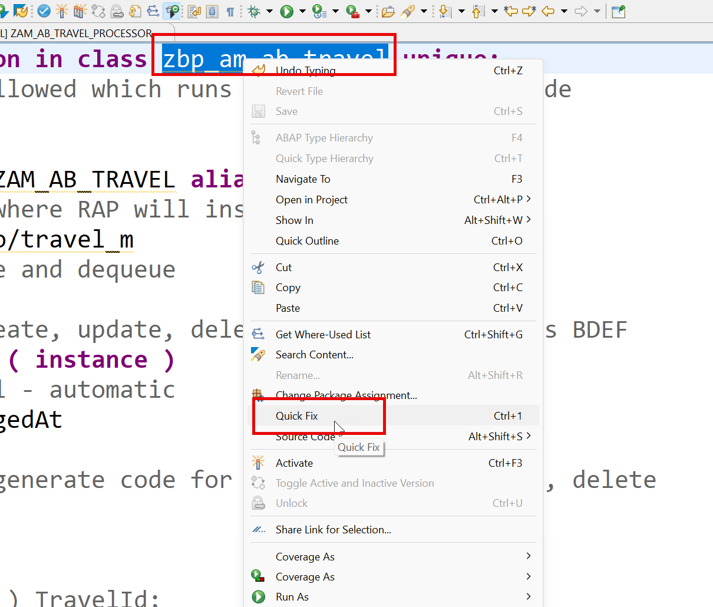
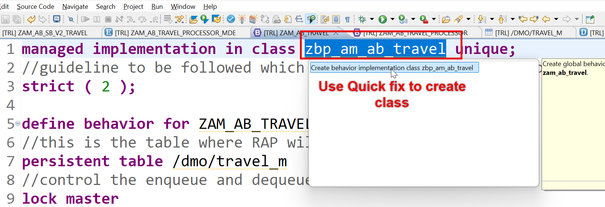
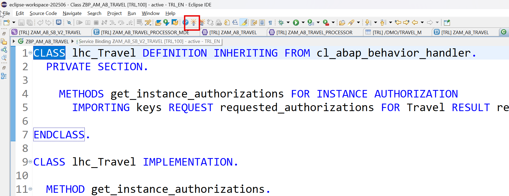
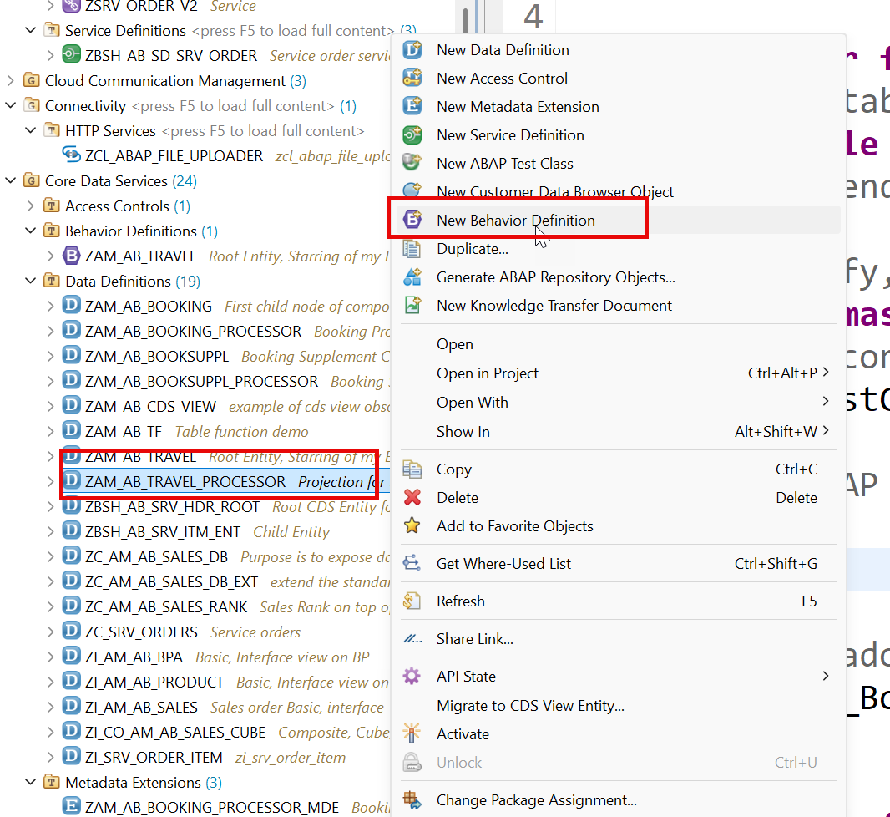
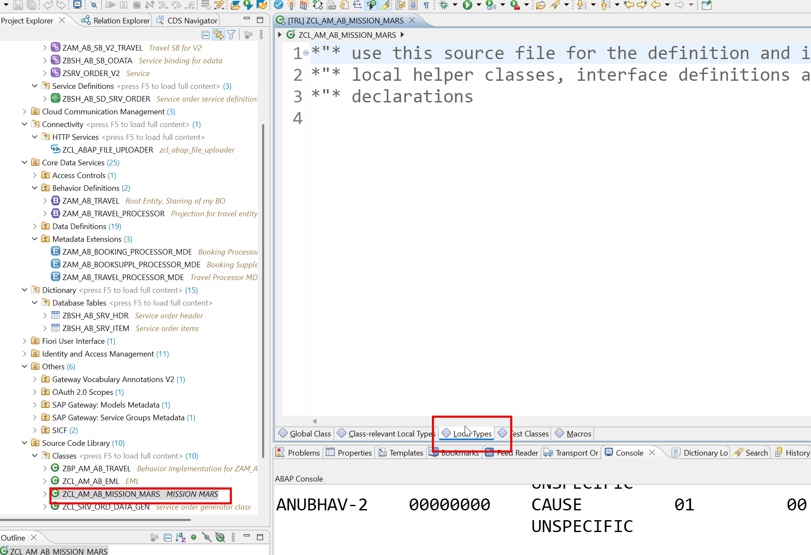

# Day 8 - Behavior Definition, EML and Class Pools

> **Making the app writable: BDEF, mapping, projection BDEF, EML and local classes**

> Phase C - RAP Business Object (Days 6-8) - Model a real Travel business object and expose it as an OData service.

**🎯 Goal of the day.** Move from a read-only app to a fully writable one, and learn to call a RAP BO from ABAP code.

---

## 📋 Cheat Sheet - keep this open

### Today's quick reference

| Thing | Value / Syntax |
|---|---|
| **BDEF header** | `managed implementation in class zbp_am_ab_travel unique;` + `strict ( 2 );` |
| `Operations` | `create; update; delete;` |
| **Field flags** | `field ( readonly ) TravelId;` / `field ( mandatory )` / `field ( numbering : managed )` |
| `Mapping` | `mapping for zam_ab_travel { TravelId = travel_id; ... }` |
| **Child link** | `association _Booking { create; }` |
| **Projection BDEF** | `projection; use create; use update; use delete; use association _Booking { create; }` |
| **EML read** | `READ ENTITIES OF <bo> ENTITY <e> FIELDS ( ... ) WITH VALUE #( ( key = ... ) ) RESULT DATA(lt) FAILED DATA(lf) REPORTED DATA(lr).` |
| **EML write** | `MODIFY ENTITIES OF <bo> ENTITY <e> CREATE FIELDS ( ... ) WITH ... ` then `COMMIT ENTITIES.` |
| **Quick fix** | put the cursor on the error, press **Ctrl+1** |

### Eclipse / ADT keys you will use constantly

| Key | Action |
|---|---|
| `Ctrl+Shift+A` | Search any object in the whole system |
| `Ctrl+F3` | Activate the current object |
| `Ctrl+1` | Quick fix - RAP generates code skeletons for you |
| `Ctrl+Space` | Code completion |
| `Ctrl+Click` | Navigate to the object under the cursor |
| `Ctrl+7` | Comment / uncomment a block |
| `F2` | Show a method signature |
| `F8` | Data preview (table / CDS entity) |
| `F9` | Run the class |

### The RAP layer cake (memorise this)

```text
Database tables            <- where the data really sits
   |
Interface CDS entity       <- stable, reusable model       (ZAM_AB_TRAVEL)
   |
Behavior Definition        <- the rulebook                 (.bdef)
   |
Projection CDS entity      <- one app's view of the model  (ZAM_AB_TRAVEL_PROCESSOR)
   |
Projection BDEF            <- which rules this app may use
   |
Metadata Extension (MDE)   <- the screen layout, @UI.*
   |
Service Definition         <- which entities are allowed out
   |
Service Binding            <- the actual OData V2 / V4 URL
   |
Fiori Elements app         <- built from the annotations, no JavaScript needed
```

---

## 🧱 What you will build today

- The **Behavior Definition (BDEF)** for Travel with `managed` implementation and field mapping.
- The generated **behavior implementation class** (`zbp_am_ab_travel`).
- A **projection BDEF** for the processor layer.
- An **EML** class that reads, creates and modifies the BO from plain ABAP.
- A **class pool** demo (`zcl_am_ab_mission_mars`) showing local classes and orchestration.

## 🧠 Concepts first, in plain English

Read this before touching the keyboard. Every idea is explained the way you would explain it to a school student.

**Behavior Definition (BDEF)**

The rulebook: can users create? update? delete? which fields are read-only? A `.bdef` file sits next to your CDS entity and RAP obeys it.

**`managed`**

RAP writes the INSERT/UPDATE/DELETE for you. You only write the *special* logic. The opposite is `unmanaged`, where you write everything (see Day 16-17).

**`mapping for <table>`**

Your CDS field is `TravelId`; the table column is `travel_id`. The mapping block is the translation table so RAP can save your data.

**Behavior Implementation (BIMP)**

The class where your custom logic lives. RAP generates the skeleton; you fill in the methods. Handler classes inherit from `cl_abap_behavior_handler`.

**Projection BDEF**

`projection;` + `use create;` / `use update;`. It re-publishes only the operations this particular app is allowed to use. The model may allow delete; the app may choose not to.

**`strict ( 2 )`**

Turn on the strictest syntax checks. It refuses to activate code that would break in a future release. Always switch it on.

**EML**

*Entity Manipulation Language*. `READ ENTITIES`, `MODIFY ENTITIES`, `COMMIT ENTITIES` - SQL-like statements for RAP objects. Never write directly to the table; go through EML so all your rules still run.

**Everything is a mass operation**

EML always works on **tables** of keys, never single records. Even reading one Travel uses `VALUE #( ( TravelId = '...' ) )`. This is why RAP is fast.

**Class pool**

One global class plus local helper classes in the same source file. Local classes are private to that file - great for helpers you never want anyone else to reuse.

---

## 🛠️ Hands-on, step by step

### Step 1. Adding BDEF (with best practice, mapping) & BDEF projection for processor

**📄 CDS View Entity** - copy the block below exactly as it is:

```cds
@AccessControl.authorizationCheck: #NOT_REQUIRED
@EndUserText.label: 'Root Entity, Starring of my BO'
@Metadata.ignorePropagatedAnnotations: true
@VDM.viewType: #COMPOSITE
define root view entity ZAM_AB_TRAVEL as select from /dmo/travel_m
composition[0..*] of ZAM_AB_BOOKING as _Booking
--associations - lose coupling to get dependent data
association[1] to /DMO/I_Agency as _Agency on
   $projection.AgencyId = _Agency.AgencyID
association[1] to /DMO/I_Customer as _Customer on
   $projection.CustomerId = _Customer.CustomerID
association[1] to I_Currency as _Currency on
   $projection.CurrencyCode = _Currency.Currency
association[1..1] to /DMO/I_Overall_Status_VH as _OverallStatus on
   $projection.OverallStatus = _OverallStatus.OverallStatus
{
   @ObjectModel.text.element: [ 'Description' ]
   key travel_id as TravelId,
   @ObjectModel.text.element: [ 'AgencyName' ]
   @Consumption.valueHelpDefinition: [{
       entity.name: '/DMO/I_Agency',
       entity.element: 'AgencyID'
   }]
   agency_id as AgencyId,
   _Agency.Name as AgencyName,
   @ObjectModel.text.element: [ 'CustomerName' ]
   @Consumption.valueHelpDefinition: [{
       entity.name: '/DMO/I_Customer',
       entity.element: 'CustomerID'
   }]
   customer_id as CustomerId,
   _Customer.LastName as CustomerName,
   begin_date as BeginDate,
   end_date as EndDate,
   @Semantics.amount.currencyCode: 'CurrencyCode'
   booking_fee as BookingFee,
   @Semantics.amount.currencyCode: 'CurrencyCode'
   total_price as TotalPrice,
   @Consumption.valueHelpDefinition: [{
       entity.name: 'I_Currency',
       entity.element: 'Currency'
   }]
   currency_code as CurrencyCode,
   description as Description,
   @Consumption.valueHelpDefinition: [{
       entity.name: '/DMO/I_Overall_Status_VH',
       entity.element: 'OverallStatus'
   }]
   --@ObjectModel.foreignKey.association: '_OverallStatus'
   @ObjectModel.text.element: [ 'OverallStatusText' ]
   overall_status as OverallStatus,
   @Semantics.user.createdBy: true
   created_by as CreatedBy,
   @Semantics.systemDateTime.createdAt: true
   created_at as CreatedAt,
   @Semantics.user.lastChangedBy: true
   last_changed_by as LastChangedBy,
   @Semantics.systemDateTime.lastChangedAt: true
   last_changed_at as LastChangedAt,
   case overall_status
       when 'O' then 'Open'
       when 'A' then 'Approved'
       when 'X' then 'Rejected'
       when 'R' then 'Released'
       else 'Unknown'
       end as OverallStatusText,
   case overall_status
       when 'O' then 2
       when 'A' then 3
       when 'X' then 1
       when 'R' then 3
       else 1
       end as IconColor,
   _Booking,
    _Agency,
   _Customer,
   _Currency,
   _OverallStatus
   --_association_name // Make association public
}
```

<details>
<summary>💡 What the important lines mean (click to open)</summary>

| Line / keyword | What it does |
|---|---|
| `@AccessControl.authorizationCheck: #NOT_REQUIRED` | Skip the DCL authorisation check. Fine while learning - **never** on real customer data. |
| `@EndUserText.label` | The human-readable description shown in tools and on screen. |
| `@Metadata.ignorePropagatedAnnotations` | `true` = ignore annotations inherited from the views underneath, so you start with a clean slate. |
| `@VDM.viewType` | Where the view sits in SAP's *Virtual Data Model*: `#BASIC` (raw), `#COMPOSITE` (combined), `#CONSUMPTION` (for a UI or report). |
| `define root view entity` | The **top** of a RAP business object tree. Only the root can be exposed as the main entity of a service. |
| `association to` | A reusable, lazily-evaluated relationship. Cheaper than a JOIN because it only runs when used. |
| `$projection.<Field>` | Refers to a field of the view you are currently writing (rather than of the joined source). |
| `@ObjectModel.text.element` | 'The readable name for this code lives in that field.' The UI shows the word, but still stores and filters on the code. |
| `@ObjectModel.foreignKey.association` | Tells the framework which association validates this foreign-key field. |

</details>

### Step 2. BDEF for Travel Scenario

**📄 Behavior Definition (BDEF)** - copy the block below exactly as it is:

```abap
managed implementation in class zbp_am_ab_travel unique;
//guideline to be followed which runs the BDEF in strict mode
strict ( 2 );
define behavior for ZAM_AB_TRAVEL alias Travel
//this is the table where RAP will insert our data
persistent table /dmo/travel_m
//control the enqueue and dequeue
lock master
//who can modify, create, update, delete our data using this BDEF
authorization master ( instance )
//concurrency control - automatic
etag master LastChangedAt
{
 //enabling RAP to generate code for us for create, update, delete
 create;
 update;
 delete;
 //field ( readonly ) TravelId;
 association _Booking { create; }
 //Since we use alias name in MDE (fiori sends) table has _ we need mapping
 mapping for /dmo/travel_m{
   TravelId = travel_id;
   AgencyId = agency_id;
   CustomerId = customer_id;
   BeginDate = begin_date;
   EndDate = end_date;
   TotalPrice = total_price;
   BookingFee = booking_fee;
   CurrencyCode = currency_code;
   Description = description;
   OverallStatus = overall_status;
   CreatedBy = created_by;
   LastChangedBy = last_changed_by;
   CreatedAt = created_at;
   LastChangedAt = last_changed_at;
 }
}
define behavior for ZAM_AB_BOOKING alias Booking
persistent table /dmo/booking_m
//child entities depends on the lock of root entity
lock dependent by _Travel
//auth depedent on the root entity
authorization dependent by _Travel
//concurrency at booking
etag master LastChangedAt
{
 update;
 delete;
 field ( readonly ) TravelId;
 association _Travel;
 association _BookingSuppl { create; }
 mapping for /dmo/booking_m{
   TravelId = travel_id;
   BookingId = booking_id;
   BookingDate = booking_date;
   CustomerId = customer_id;
   CarrierId = carrier_id;
   ConnectionId = connection_id;
   FlightDate = flight_date;
   FlightPrice = flight_price;
   CurrencyCode = currency_code;
   BookingStatus = booking_status;
   LastChangedAt = last_changed_at;
 }
}
define behavior for ZAM_AB_BOOKSUPPL alias BookingSuppl
persistent table /dmo/booksuppl_m
//child entities depends on the lock of root entity
lock dependent by _Travel
authorization dependent by _Travel
etag master LastChangedAt
{
 update;
 delete;
 field ( readonly ) TravelId, BookingId;
 association _Travel;
 association _Booking;
 mapping for /dmo/booksuppl_m{
   TravelId = travel_id;
   BookingId = booking_id;
   BookingSupplementId = booking_supplement_id;
   SupplementId = supplement_id;
   Price = price;
   CurrencyCode = currency_code;
   LastChangedAt = last_changed_at;
 }
}
```

<details>
<summary>💡 What the important lines mean (click to open)</summary>

| Line / keyword | What it does |
|---|---|
| `association to` | A reusable, lazily-evaluated relationship. Cheaper than a JOIN because it only runs when used. |
| `managed implementation in class ... unique` | RAP writes the INSERT/UPDATE/DELETE for you; your class only holds the special logic. |
| `strict ( 2 );` | Turns on the strictest syntax checks. It refuses code that would break in a future release - always switch it on. |
| `lock master` | 'I am the root - I own the lock for this whole business object.' Children use `lock dependent by _Travel`. |
| `lock dependent by` | 'I do not own a lock; ask my parent.' Standard for every child entity. |
| `authorization master ( instance )` | 'I decide the permissions for this whole BO.' `( instance )` means the decision is made per record, in code. |
| `authorization dependent by` | 'My permissions come from my parent.' |
| `etag master` | Names the field used for optimistic locking on this entity. |
| `field ( readonly )` | The user may look but not type. Enforced by the framework, not just hidden by the UI. |

</details>







### Step 3. Activate the class




### Step 4. Create projection for BDEF processor




**📄 Behavior Definition - projection (BDEF)** - copy the block below exactly as it is:

```abap
projection;
strict ( 2 );
define behavior for ZAM_AB_TRAVEL_PROCESSOR alias Travel
{
 use create;
 use update;
 use delete;
 use association _Booking { create; }
}
define behavior for ZAM_AB_BOOKING_PROCESSOR alias Booking
{
 use update;
 use delete;
 use association _Travel;
 use association _BookingSuppl { create; }
}
define behavior for ZAM_AB_BOOKSUPPL_PROCESSOR alias BookSuppl
{
 use update;
 use delete;
 use association _Travel;
 use association _Booking;
}
```

<details>
<summary>💡 What the important lines mean (click to open)</summary>

| Line / keyword | What it does |
|---|---|
| `association to` | A reusable, lazily-evaluated relationship. Cheaper than a JOIN because it only runs when used. |
| `projection;` | This BDEF describes a **projection** layer. It can only re-publish (`use`) what the interface BDEF already allows. |
| `strict ( 2 );` | Turns on the strictest syntax checks. It refuses code that would break in a future release - always switch it on. |
| `use association _Child { create; with draft; }` | Re-publishes a child in the projection and says whether the app may create children and whether they take part in the draft. |
| `define behavior for <Entity> alias <Alias>` | Opens the rulebook for one entity. The `alias` is the short name you use everywhere else in the BDEF. |

</details>

### Step 5. working with EML

**📄 ABAP Class** - copy the block below exactly as it is:

```abap
CLASS zcl_AM_AB_eml DEFINITION
 PUBLIC
 FINAL
 CREATE PUBLIC .
 PUBLIC SECTION.
   data : lv_opr type c VALUE 'R'.
   INTERFACES if_oo_adt_classrun .
 PROTECTED SECTION.
 PRIVATE SECTION.
ENDCLASS.
CLASS zcl_AM_AB_eml IMPLEMENTATION.
 METHOD if_oo_adt_classrun~main.
 case lv_opr.
       when 'R'.
           "all the ops on RAP BO are mass operations
           READ ENTITIES OF ZAM_AB_TRAVEL
           ENTITY Travel
           FIELDS ( travelid agencyid CustomerId OverallStatus ) WITH
           VALUE #( ( TravelId = '00000010' )
                    ( TravelId = '00000024' )
                    ( TravelId = '009595' )
                  )
           RESULT Data(lt_result)
           FAILED data(lt_failed)
           REPORTED DATA(lt_messages).
           out->write(
             EXPORTING
               data   = lt_result
           ).
           out->write(
             EXPORTING
               data   = lt_failed
           ).
       when 'C'.
           data(lv_description) = 'Anubhav Rocks with RAP'.
           data(lv_agency) = '070016'.
           data(lv_customer) = '000697'.
           MODIFY ENTITIES OF ZAM_AB_TRAVEL
           ENTITY Travel
           CREATE FIELDS ( TravelId AgencyId CurrencyCode BeginDate EndDate Description OverallStatus )
           WITH VALUE #(
                           (
                             %CID = 'ANUBHAV'
                             TravelId = '00012347'
                             AgencyId = lv_agency
                             CustomerId = lv_customer
                             BeginDate = cl_abap_context_info=>get_system_date( )
                             EndDate = cl_abap_context_info=>get_system_date( ) + 30
                             Description = lv_description
                             OverallStatus = 'O'
                            )
                           ( %CID = 'ANUBHAV-1'
                             TravelId = '00012358'
                             AgencyId = lv_agency
                             CustomerId = lv_customer
                             BeginDate = cl_abap_context_info=>get_system_date( )
                             EndDate = cl_abap_context_info=>get_system_date( ) + 30
                             Description = lv_description
                             OverallStatus = 'O'
                            )
                            (
                             %CID = 'ANUBHAV-2'
                             TravelId = '00000010'
                             AgencyId = lv_agency
                             CustomerId = lv_customer
                             BeginDate = cl_abap_context_info=>get_system_date( )
                             EndDate = cl_abap_context_info=>get_system_date( ) + 30
                             Description = lv_description
                             OverallStatus = 'O'
                            )
            )
            MAPPED data(lt_mapped)
            FAILED lt_failed
            REPORTED lt_messages.
            COMMIT ENTITIES.
            out->write(
             EXPORTING
               data   = lt_mapped
           ).
           out->write(
             EXPORTING
               data   = lt_failed
           ).
       when 'U'.
           lv_description = 'Wow, That was an update'.
           lv_agency = '070032'.
           MODIFY ENTITIES OF ZAM_AB_TRAVEL
           ENTITY Travel
           UPDATE FIELDS ( AgencyId Description )
           WITH VALUE #(
                           ( TravelId = '00012347'
                             AgencyId = lv_agency
                             Description = lv_description
                            )
                           ( TravelId = '00012358'
                             AgencyId = lv_agency
                             Description = lv_description
                            )
            )
            MAPPED lt_mapped
            FAILED lt_failed
            REPORTED lt_messages.
            COMMIT ENTITIES.
            out->write(
             EXPORTING
               data   = lt_mapped
           ).
           out->write(
             EXPORTING
               data   = lt_failed
           ).
       when 'D'.
       MODIFY ENTITIES OF ZAM_AB_TRAVEL
           ENTITY Travel
           DELETE FROM VALUE #(
                           ( TravelId = '00012347'
                            )
            )
            MAPPED lt_mapped
            FAILED lt_failed
            REPORTED lt_messages.
            COMMIT ENTITIES.
            out->write(
             EXPORTING
               data   = lt_mapped
           ).
           out->write(
             EXPORTING
               data   = lt_failed
           ).
   endcase.
 ENDMETHOD.
ENDCLASS.
```

<details>
<summary>💡 What the important lines mean (click to open)</summary>

| Line / keyword | What it does |
|---|---|
| `INTERFACES if_oo_adt_classrun` | Gives your class a Run button. Implement `~main`, press **F9**, and output appears in the Eclipse console. The cloud replacement for `WRITE`. |
| `out->write( ... )` | Prints to the Eclipse console. The cloud version of the classic `WRITE` statement. |
| `READ ENTITIES OF ... ENTITY ... FIELDS ( ... ) WITH ...` | EML read. Always a **mass** operation: you pass a *table* of keys and get a *table* of results, plus `FAILED` and `REPORTED`. |
| `MODIFY ENTITIES OF ... ENTITY ... CREATE/UPDATE/DELETE` | EML write. Goes through the business object, so every validation and determination still runs. |
| `COMMIT ENTITIES` | **This is what actually saves.** Forget it and your changes silently disappear. |
| `%cid` | *Content ID* - a temporary label for a record that does not have a key yet, so the caller can match responses to requests. |
| `INTERFACES` | Promises this class implements an interface's methods. |
| `CREATE PUBLIC` | Anyone may instantiate this class. |
| `FINAL` | Nobody may inherit from this class. |

</details>

### Step 6. Class pool concept




**📄 Source code** - copy the block below exactly as it is:

```abap
*"* use this source file for the definition and implementation of
*"* local helper classes, interface definitions and type
*"* declarations
CLASS zcl_earth DEFINITION.
 PUBLIC SECTION.
   METHODS start_engine returning VALUE(r_value) TYPE string.
   METHODS leave_orbit returning VALUE(r_value) TYPE string.
ENDCLASS.
CLASS zcl_earth IMPLEMENTATION.
 METHOD start_engine.
   r_value = 'We take off from planet earth for mission mars'.
 ENDMETHOD.
 METHOD leave_orbit.
   r_value = 'We leave earth Orbit'.
 ENDMETHOD.
ENDCLASS.
CLASS zcl_planet1 DEFINITION.
 PUBLIC SECTION.
   METHODS enter_orbit returning VALUE(r_value) TYPE string.
   METHODS leave_orbit returning VALUE(r_value) TYPE string.
ENDCLASS.
CLASS zcl_planet1 IMPLEMENTATION.
 METHOD enter_orbit.
   r_value = 'We enter planet 1 orbit'.
 ENDMETHOD.
 METHOD leave_orbit.
   r_value = 'We leave planet 1 Orbit'.
 ENDMETHOD.
ENDCLASS.
CLASS zcl_mars DEFINITION.
 PUBLIC SECTION.
   METHODS enter_orbit returning VALUE(r_value) TYPE string.
   METHODS explore_mars returning VALUE(r_value) TYPE string.
ENDCLASS.
CLASS zcl_mars IMPLEMENTATION.
 METHOD enter_orbit.
   r_value = 'We entered in Mars orbit'.
 ENDMETHOD.
 METHOD explore_mars.
   r_value = 'Roger! we found water'.
 ENDMETHOD.
ENDCLASS.
```

### Step 7. Global class code which orchestrate

**📄 ABAP Class** - copy the block below exactly as it is:

```abap
CLASS zcl_am_ab_mission_mars DEFINITION
 PUBLIC
 FINAL
 CREATE PUBLIC .
 PUBLIC SECTION.
 data: itab type table of string.
   INTERFACES if_oo_adt_classrun .
   methods reach_to_mars.
 PROTECTED SECTION.
 PRIVATE SECTION.
ENDCLASS.
CLASS zcl_am_ab_mission_mars IMPLEMENTATION.
METHOD if_oo_adt_classrun~main.
   me->reach_to_mars(  ).
   out->write(
         EXPORTING
           data   = itab
*            name   =
*          RECEIVING
*            output =
       ).
 ENDMETHOD.
 METHOD reach_to_mars.
   data lv_text type string.
   data(lo_earth) = new zcl_earth( ).
   data(lo_iplanet1) = new zcl_planet1(  ).
   data(lo_mars) = new zcl_mars( ).
   lv_text = lo_earth->start_engine( ).
   append lv_text to itab.
   lv_text = lo_earth->leave_orbit(  ).
   append lv_text to itab.
   lv_text = lo_iplanet1->enter_orbit( ).
   append lv_text to itab.
   lv_text = lo_iplanet1->leave_orbit(  ).
   append lv_text to itab.
   lv_text = lo_mars->enter_orbit( ).
   append lv_text to itab.
   lv_text = lo_mars->explore_mars( ).
   append lv_text to itab.
 ENDMETHOD.
ENDCLASS.
```

<details>
<summary>💡 What the important lines mean (click to open)</summary>

| Line / keyword | What it does |
|---|---|
| `INTERFACES if_oo_adt_classrun` | Gives your class a Run button. Implement `~main`, press **F9**, and output appears in the Eclipse console. The cloud replacement for `WRITE`. |
| `out->write( ... )` | Prints to the Eclipse console. The cloud version of the classic `WRITE` statement. |
| `INTERFACES` | Promises this class implements an interface's methods. |
| `CREATE PUBLIC` | Anyone may instantiate this class. |
| `FINAL` | Nobody may inherit from this class. |

</details>

Press f9

---

## 📦 Objects in your package after today

```text
$Z_AM_AB  (your package - replace _AB_ with your own initials)
  ├── ZAM_AB_TRAVEL                       CDS root entity
  ├── zcl_AM_AB_eml                       ABAP class
  ├── zcl_earth                           ABAP class
  ├── zcl_planet1                         ABAP class
  ├── zcl_mars                            ABAP class
  ├── zcl_am_ab_mission_mars              ABAP class
```

---

## ✅ Final version of all code from Day 8

Everything below is the **complete, unmodified** source from the training material, gathered in one place so you can copy it straight into Eclipse.

### 1. Adding BDEF (with best practice, mapping) & BDEF projection for processor - _CDS View Entity_

```cds
@AccessControl.authorizationCheck: #NOT_REQUIRED
@EndUserText.label: 'Root Entity, Starring of my BO'
@Metadata.ignorePropagatedAnnotations: true
@VDM.viewType: #COMPOSITE
define root view entity ZAM_AB_TRAVEL as select from /dmo/travel_m
composition[0..*] of ZAM_AB_BOOKING as _Booking
--associations - lose coupling to get dependent data
association[1] to /DMO/I_Agency as _Agency on
   $projection.AgencyId = _Agency.AgencyID
association[1] to /DMO/I_Customer as _Customer on
   $projection.CustomerId = _Customer.CustomerID
association[1] to I_Currency as _Currency on
   $projection.CurrencyCode = _Currency.Currency
association[1..1] to /DMO/I_Overall_Status_VH as _OverallStatus on
   $projection.OverallStatus = _OverallStatus.OverallStatus
{
   @ObjectModel.text.element: [ 'Description' ]
   key travel_id as TravelId,
   @ObjectModel.text.element: [ 'AgencyName' ]
   @Consumption.valueHelpDefinition: [{
       entity.name: '/DMO/I_Agency',
       entity.element: 'AgencyID'
   }]
   agency_id as AgencyId,
   _Agency.Name as AgencyName,
   @ObjectModel.text.element: [ 'CustomerName' ]
   @Consumption.valueHelpDefinition: [{
       entity.name: '/DMO/I_Customer',
       entity.element: 'CustomerID'
   }]
   customer_id as CustomerId,
   _Customer.LastName as CustomerName,
   begin_date as BeginDate,
   end_date as EndDate,
   @Semantics.amount.currencyCode: 'CurrencyCode'
   booking_fee as BookingFee,
   @Semantics.amount.currencyCode: 'CurrencyCode'
   total_price as TotalPrice,
   @Consumption.valueHelpDefinition: [{
       entity.name: 'I_Currency',
       entity.element: 'Currency'
   }]
   currency_code as CurrencyCode,
   description as Description,
   @Consumption.valueHelpDefinition: [{
       entity.name: '/DMO/I_Overall_Status_VH',
       entity.element: 'OverallStatus'
   }]
   --@ObjectModel.foreignKey.association: '_OverallStatus'
   @ObjectModel.text.element: [ 'OverallStatusText' ]
   overall_status as OverallStatus,
   @Semantics.user.createdBy: true
   created_by as CreatedBy,
   @Semantics.systemDateTime.createdAt: true
   created_at as CreatedAt,
   @Semantics.user.lastChangedBy: true
   last_changed_by as LastChangedBy,
   @Semantics.systemDateTime.lastChangedAt: true
   last_changed_at as LastChangedAt,
   case overall_status
       when 'O' then 'Open'
       when 'A' then 'Approved'
       when 'X' then 'Rejected'
       when 'R' then 'Released'
       else 'Unknown'
       end as OverallStatusText,
   case overall_status
       when 'O' then 2
       when 'A' then 3
       when 'X' then 1
       when 'R' then 3
       else 1
       end as IconColor,
   _Booking,
    _Agency,
   _Customer,
   _Currency,
   _OverallStatus
   --_association_name // Make association public
}
```

### 2. BDEF for Travel Scenario - _Behavior Definition (BDEF)_

```abap
managed implementation in class zbp_am_ab_travel unique;
//guideline to be followed which runs the BDEF in strict mode
strict ( 2 );
define behavior for ZAM_AB_TRAVEL alias Travel
//this is the table where RAP will insert our data
persistent table /dmo/travel_m
//control the enqueue and dequeue
lock master
//who can modify, create, update, delete our data using this BDEF
authorization master ( instance )
//concurrency control - automatic
etag master LastChangedAt
{
 //enabling RAP to generate code for us for create, update, delete
 create;
 update;
 delete;
 //field ( readonly ) TravelId;
 association _Booking { create; }
 //Since we use alias name in MDE (fiori sends) table has _ we need mapping
 mapping for /dmo/travel_m{
   TravelId = travel_id;
   AgencyId = agency_id;
   CustomerId = customer_id;
   BeginDate = begin_date;
   EndDate = end_date;
   TotalPrice = total_price;
   BookingFee = booking_fee;
   CurrencyCode = currency_code;
   Description = description;
   OverallStatus = overall_status;
   CreatedBy = created_by;
   LastChangedBy = last_changed_by;
   CreatedAt = created_at;
   LastChangedAt = last_changed_at;
 }
}
define behavior for ZAM_AB_BOOKING alias Booking
persistent table /dmo/booking_m
//child entities depends on the lock of root entity
lock dependent by _Travel
//auth depedent on the root entity
authorization dependent by _Travel
//concurrency at booking
etag master LastChangedAt
{
 update;
 delete;
 field ( readonly ) TravelId;
 association _Travel;
 association _BookingSuppl { create; }
 mapping for /dmo/booking_m{
   TravelId = travel_id;
   BookingId = booking_id;
   BookingDate = booking_date;
   CustomerId = customer_id;
   CarrierId = carrier_id;
   ConnectionId = connection_id;
   FlightDate = flight_date;
   FlightPrice = flight_price;
   CurrencyCode = currency_code;
   BookingStatus = booking_status;
   LastChangedAt = last_changed_at;
 }
}
define behavior for ZAM_AB_BOOKSUPPL alias BookingSuppl
persistent table /dmo/booksuppl_m
//child entities depends on the lock of root entity
lock dependent by _Travel
authorization dependent by _Travel
etag master LastChangedAt
{
 update;
 delete;
 field ( readonly ) TravelId, BookingId;
 association _Travel;
 association _Booking;
 mapping for /dmo/booksuppl_m{
   TravelId = travel_id;
   BookingId = booking_id;
   BookingSupplementId = booking_supplement_id;
   SupplementId = supplement_id;
   Price = price;
   CurrencyCode = currency_code;
   LastChangedAt = last_changed_at;
 }
}
```

### 3. Create projection for BDEF processor - _Behavior Definition - projection (BDEF)_

```abap
projection;
strict ( 2 );
define behavior for ZAM_AB_TRAVEL_PROCESSOR alias Travel
{
 use create;
 use update;
 use delete;
 use association _Booking { create; }
}
define behavior for ZAM_AB_BOOKING_PROCESSOR alias Booking
{
 use update;
 use delete;
 use association _Travel;
 use association _BookingSuppl { create; }
}
define behavior for ZAM_AB_BOOKSUPPL_PROCESSOR alias BookSuppl
{
 use update;
 use delete;
 use association _Travel;
 use association _Booking;
}
```

### 4. working with EML - _ABAP Class_

```abap
CLASS zcl_AM_AB_eml DEFINITION
 PUBLIC
 FINAL
 CREATE PUBLIC .
 PUBLIC SECTION.
   data : lv_opr type c VALUE 'R'.
   INTERFACES if_oo_adt_classrun .
 PROTECTED SECTION.
 PRIVATE SECTION.
ENDCLASS.
CLASS zcl_AM_AB_eml IMPLEMENTATION.
 METHOD if_oo_adt_classrun~main.
 case lv_opr.
       when 'R'.
           "all the ops on RAP BO are mass operations
           READ ENTITIES OF ZAM_AB_TRAVEL
           ENTITY Travel
           FIELDS ( travelid agencyid CustomerId OverallStatus ) WITH
           VALUE #( ( TravelId = '00000010' )
                    ( TravelId = '00000024' )
                    ( TravelId = '009595' )
                  )
           RESULT Data(lt_result)
           FAILED data(lt_failed)
           REPORTED DATA(lt_messages).
           out->write(
             EXPORTING
               data   = lt_result
           ).
           out->write(
             EXPORTING
               data   = lt_failed
           ).
       when 'C'.
           data(lv_description) = 'Anubhav Rocks with RAP'.
           data(lv_agency) = '070016'.
           data(lv_customer) = '000697'.
           MODIFY ENTITIES OF ZAM_AB_TRAVEL
           ENTITY Travel
           CREATE FIELDS ( TravelId AgencyId CurrencyCode BeginDate EndDate Description OverallStatus )
           WITH VALUE #(
                           (
                             %CID = 'ANUBHAV'
                             TravelId = '00012347'
                             AgencyId = lv_agency
                             CustomerId = lv_customer
                             BeginDate = cl_abap_context_info=>get_system_date( )
                             EndDate = cl_abap_context_info=>get_system_date( ) + 30
                             Description = lv_description
                             OverallStatus = 'O'
                            )
                           ( %CID = 'ANUBHAV-1'
                             TravelId = '00012358'
                             AgencyId = lv_agency
                             CustomerId = lv_customer
                             BeginDate = cl_abap_context_info=>get_system_date( )
                             EndDate = cl_abap_context_info=>get_system_date( ) + 30
                             Description = lv_description
                             OverallStatus = 'O'
                            )
                            (
                             %CID = 'ANUBHAV-2'
                             TravelId = '00000010'
                             AgencyId = lv_agency
                             CustomerId = lv_customer
                             BeginDate = cl_abap_context_info=>get_system_date( )
                             EndDate = cl_abap_context_info=>get_system_date( ) + 30
                             Description = lv_description
                             OverallStatus = 'O'
                            )
            )
            MAPPED data(lt_mapped)
            FAILED lt_failed
            REPORTED lt_messages.
            COMMIT ENTITIES.
            out->write(
             EXPORTING
               data   = lt_mapped
           ).
           out->write(
             EXPORTING
               data   = lt_failed
           ).
       when 'U'.
           lv_description = 'Wow, That was an update'.
           lv_agency = '070032'.
           MODIFY ENTITIES OF ZAM_AB_TRAVEL
           ENTITY Travel
           UPDATE FIELDS ( AgencyId Description )
           WITH VALUE #(
                           ( TravelId = '00012347'
                             AgencyId = lv_agency
                             Description = lv_description
                            )
                           ( TravelId = '00012358'
                             AgencyId = lv_agency
                             Description = lv_description
                            )
            )
            MAPPED lt_mapped
            FAILED lt_failed
            REPORTED lt_messages.
            COMMIT ENTITIES.
            out->write(
             EXPORTING
               data   = lt_mapped
           ).
           out->write(
             EXPORTING
               data   = lt_failed
           ).
       when 'D'.
       MODIFY ENTITIES OF ZAM_AB_TRAVEL
           ENTITY Travel
           DELETE FROM VALUE #(
                           ( TravelId = '00012347'
                            )
            )
            MAPPED lt_mapped
            FAILED lt_failed
            REPORTED lt_messages.
            COMMIT ENTITIES.
            out->write(
             EXPORTING
               data   = lt_mapped
           ).
           out->write(
             EXPORTING
               data   = lt_failed
           ).
   endcase.
 ENDMETHOD.
ENDCLASS.
```

### 5. Class pool concept - _Source code_

```abap
*"* use this source file for the definition and implementation of
*"* local helper classes, interface definitions and type
*"* declarations
CLASS zcl_earth DEFINITION.
 PUBLIC SECTION.
   METHODS start_engine returning VALUE(r_value) TYPE string.
   METHODS leave_orbit returning VALUE(r_value) TYPE string.
ENDCLASS.
CLASS zcl_earth IMPLEMENTATION.
 METHOD start_engine.
   r_value = 'We take off from planet earth for mission mars'.
 ENDMETHOD.
 METHOD leave_orbit.
   r_value = 'We leave earth Orbit'.
 ENDMETHOD.
ENDCLASS.
CLASS zcl_planet1 DEFINITION.
 PUBLIC SECTION.
   METHODS enter_orbit returning VALUE(r_value) TYPE string.
   METHODS leave_orbit returning VALUE(r_value) TYPE string.
ENDCLASS.
CLASS zcl_planet1 IMPLEMENTATION.
 METHOD enter_orbit.
   r_value = 'We enter planet 1 orbit'.
 ENDMETHOD.
 METHOD leave_orbit.
   r_value = 'We leave planet 1 Orbit'.
 ENDMETHOD.
ENDCLASS.
CLASS zcl_mars DEFINITION.
 PUBLIC SECTION.
   METHODS enter_orbit returning VALUE(r_value) TYPE string.
   METHODS explore_mars returning VALUE(r_value) TYPE string.
ENDCLASS.
CLASS zcl_mars IMPLEMENTATION.
 METHOD enter_orbit.
   r_value = 'We entered in Mars orbit'.
 ENDMETHOD.
 METHOD explore_mars.
   r_value = 'Roger! we found water'.
 ENDMETHOD.
ENDCLASS.
```

### 6. Global class code which orchestrate - _ABAP Class_

```abap
CLASS zcl_am_ab_mission_mars DEFINITION
 PUBLIC
 FINAL
 CREATE PUBLIC .
 PUBLIC SECTION.
 data: itab type table of string.
   INTERFACES if_oo_adt_classrun .
   methods reach_to_mars.
 PROTECTED SECTION.
 PRIVATE SECTION.
ENDCLASS.
CLASS zcl_am_ab_mission_mars IMPLEMENTATION.
METHOD if_oo_adt_classrun~main.
   me->reach_to_mars(  ).
   out->write(
         EXPORTING
           data   = itab
*            name   =
*          RECEIVING
*            output =
       ).
 ENDMETHOD.
 METHOD reach_to_mars.
   data lv_text type string.
   data(lo_earth) = new zcl_earth( ).
   data(lo_iplanet1) = new zcl_planet1(  ).
   data(lo_mars) = new zcl_mars( ).
   lv_text = lo_earth->start_engine( ).
   append lv_text to itab.
   lv_text = lo_earth->leave_orbit(  ).
   append lv_text to itab.
   lv_text = lo_iplanet1->enter_orbit( ).
   append lv_text to itab.
   lv_text = lo_iplanet1->leave_orbit(  ).
   append lv_text to itab.
   lv_text = lo_mars->enter_orbit( ).
   append lv_text to itab.
   lv_text = lo_mars->explore_mars( ).
   append lv_text to itab.
 ENDMETHOD.
ENDCLASS.
```

---

## ⚠️ Traps and tips

- After changing a BDEF, use **Ctrl+1** on the red marker - RAP generates all the empty methods for you. Never type them by hand.
- `COMMIT ENTITIES` is what actually saves. Forget it and your changes silently vanish.

---

[⬅️ Day 7](Day07_Fiori_UI_Annotations_And_Drilldown.md) | [🏠 Summary](00_SUMMARY.md) | [📋 Master Cheat Sheet](00_MASTER_CHEAT_SHEET.md) | [Day 9 ➡️](Day09_Early_Numbering_And_Feature_Control.md)
