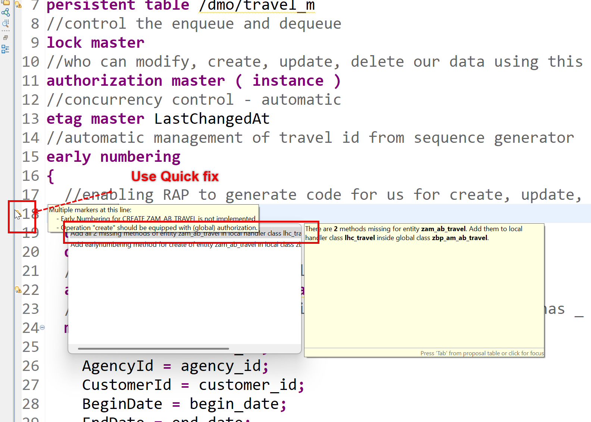
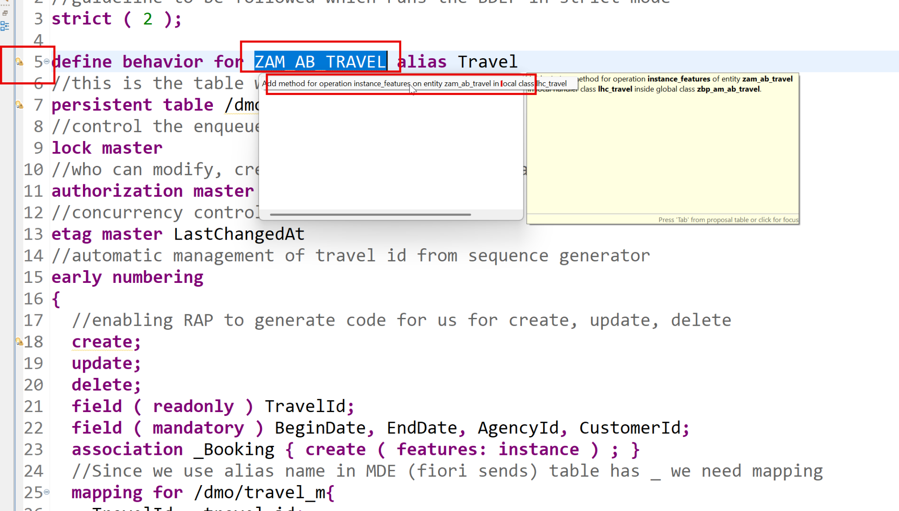

# Day 9 - Numbering, Read-Only Fields and Feature Control

> **Early numbering, dynamic feature control and factory data actions**

> Phase D - Business Logic (Days 9-12) - Add numbering, actions, determinations, validations, drafts and authorisations.

**🎯 Goal of the day.** Let the system generate IDs, and make buttons and fields appear or disappear based on the data.

---

## 📋 Cheat Sheet - keep this open

### Today's quick reference

| Thing | Value / Syntax |
|---|---|
| **Early numbering** | BDEF: `early numbering;` + `field ( numbering : managed ) TravelId;` |
| `Read-only` | `field ( readonly ) TotalPrice, OverallStatus;` |
| **Dynamic features** | `update ( features : instance ); delete ( features : instance );` |
| **Feature constants** | `if_abap_behv=>fc-o-enabled` / `fc-o-disabled` (operations), `fc-f-read-only` / `fc-f-mandatory` (fields) |
| **Factory action** | `factory action copyTravel [1];` |
| **Generate methods** | Ctrl+1 on the BDEF warning |

### Eclipse / ADT keys you will use constantly

| Key | Action |
|---|---|
| `Ctrl+Shift+A` | Search any object in the whole system |
| `Ctrl+F3` | Activate the current object |
| `Ctrl+1` | Quick fix - RAP generates code skeletons for you |
| `Ctrl+Space` | Code completion |
| `Ctrl+Click` | Navigate to the object under the cursor |
| `Ctrl+7` | Comment / uncomment a block |
| `F2` | Show a method signature |
| `F8` | Data preview (table / CDS entity) |
| `F9` | Run the class |

### The RAP layer cake (memorise this)

```text
Database tables            <- where the data really sits
   |
Interface CDS entity       <- stable, reusable model       (ZAM_AB_TRAVEL)
   |
Behavior Definition        <- the rulebook                 (.bdef)
   |
Projection CDS entity      <- one app's view of the model  (ZAM_AB_TRAVEL_PROCESSOR)
   |
Projection BDEF            <- which rules this app may use
   |
Metadata Extension (MDE)   <- the screen layout, @UI.*
   |
Service Definition         <- which entities are allowed out
   |
Service Binding            <- the actual OData V2 / V4 URL
   |
Fiori Elements app         <- built from the annotations, no JavaScript needed
```

---

## 🧱 What you will build today

- Interface entity updated for numbering.
- BDEF with `field ( numbering : managed )` / `readonly` and `early numbering`.
- The **`earlynumbering_create`** implementation.
- **`get_instance_features`** - dynamic feature control.
- A **factory data action** skeleton.

## 🧠 Concepts first, in plain English

Read this before touching the keyboard. Every idea is explained the way you would explain it to a school student.

**Early vs late numbering**

**Early**: the ID is assigned the moment the user starts creating (they can see it on screen). **Late**: the ID appears only at save. Early is friendlier; use it when the user needs to quote the number.

**`field ( numbering : managed )`**

'The system owns this field, not the user.' Combine with `readonly` so the UI greys it out.

**Number ranges vs `MAX`**

This exercise reads the current maximum and adds one. Simple and readable. Real production systems use a number range object so two users never collide.

**Static vs dynamic feature control**

**Static** in the BDEF: 'delete is never allowed'. **Dynamic** in code: 'delete is allowed *only while the status is Open*'. Dynamic needs `( features : instance )`.

**`get_instance_features`**

RAP calls this method before drawing the screen and asks 'for *this specific record*, what should be enabled?'. You answer with `if_abap_behv=>fc-o-enabled` or `-disabled`.

**Factory action**

An action that *produces* instances rather than changing one - for example 'copy this Travel into a new one'. Declared with `result [1] $self`.

---

## 🛠️ Hands-on, step by step

### Step 1. Generating early numbering for travel, booking along with make them read only, enable value help for booking

**📄 CDS View Entity** - copy the block below exactly as it is:

```cds
@AbapCatalog.viewEnhancementCategory: [#NONE]
@AccessControl.authorizationCheck: #NOT_REQUIRED
@EndUserText.label: 'First child node of composition child booking'
@Metadata.ignorePropagatedAnnotations: true
@ObjectModel.usageType:{
   serviceQuality: #X,
   sizeCategory: #S,
   dataClass: #MIXED
}
@VDM.viewType: #COMPOSITE
define view entity ZAM_AB_BOOKING as select from /dmo/booking_m
composition[0..*] of ZAM_AB_BOOKSUPPL as _BookingSuppl
association to parent ZAM_AB_TRAVEL as _Travel
   on $projection.TravelId = _Travel.TravelId
association[1..1] to /DMO/I_Customer as _Customer on
   $projection.CustomerId = _Customer.CustomerID
association[1..1] to /DMO/I_Carrier as _Carrier on
   $projection.CarrierId = _Carrier.AirlineID
association[1..1] to /DMO/I_Connection as _Connection on
   $projection.CarrierId = _Connection.AirlineID and
   $projection.ConnectionId = _Connection.ConnectionID
association[1..1] to /DMO/I_Booking_Status_VH as _BookingStatus on
   $projection.BookingStatus = _BookingStatus.BookingStatus       
{
   key travel_id as TravelId,
   key booking_id as BookingId,
   booking_date as BookingDate,
   @Consumption.valueHelpDefinition: [{
       entity.name: '/DMO/I_Customer',
       entity.element: 'CustomerID'
   }]
   customer_id as CustomerId,
   @Consumption.valueHelpDefinition: [{
       entity.name: '/DMO/I_Carrier',
       entity.element: 'AirlineID'
   }]
   carrier_id as CarrierId,
   @Consumption.valueHelpDefinition: [{
       entity.name: '/DMO/I_Connection',
       entity.element: 'ConnectionID',
       additionalBinding: [{
           localElement: 'CarrierId',
           element: 'AirlineID'
       }]
   }]
   connection_id as ConnectionId,
   flight_date as FlightDate,
   @Semantics.amount.currencyCode: 'CurrencyCode'
   flight_price as FlightPrice,
   @Consumption.valueHelpDefinition: [{
       entity.name: 'I_Currency',
       entity.element: 'Currency'
   }]
   currency_code as CurrencyCode,
   @Consumption.valueHelpDefinition: [{
       entity.name: '/DMO/I_Booking_Status_VH',
       entity.element: 'BookingStatus'
   }]
   booking_status as BookingStatus,
   last_changed_at as LastChangedAt,
   _Customer,
   _Carrier,
   _Connection,
   _BookingStatus,
   _Travel,
   _BookingSuppl
}
```

<details>
<summary>💡 What the important lines mean (click to open)</summary>

| Line / keyword | What it does |
|---|---|
| `@AbapCatalog.viewEnhancementCategory: [#NONE]` | Says whether other people may extend this view. `[#NONE]` = closed, `[#PROJECTION_LIST]` = fields may be added. |
| `@AccessControl.authorizationCheck: #NOT_REQUIRED` | Skip the DCL authorisation check. Fine while learning - **never** on real customer data. |
| `@EndUserText.label` | The human-readable description shown in tools and on screen. |
| `@Metadata.ignorePropagatedAnnotations` | `true` = ignore annotations inherited from the views underneath, so you start with a clean slate. |
| `@ObjectModel.usageType` | Declares the view's role: `serviceQuality` (how polished it is), `sizeCategory` (expected row count), `dataClass` (master, transactional, mixed). |
| `@VDM.viewType` | Where the view sits in SAP's *Virtual Data Model*: `#BASIC` (raw), `#COMPOSITE` (combined), `#CONSUMPTION` (for a UI or report). |
| `define view entity` | The modern CDS entity - one object, one name, faster and stricter than the old `define view`. |
| `define view` | The **obsolete** CDS View. Kept here only so you can see the difference. |
| `association to parent` | The child's pointer back up to its parent. Every child in a RAP BO needs exactly one. |

</details>

### Step 2. Make fields read only on UI and Adding early numbering keyword for entities - Behavior Definition

**📄 Behavior Definition (BDEF)** - copy the block below exactly as it is:

```abap
managed implementation in class zbp_am_ab_travel unique;
//guideline to be followed which runs the BDEF in strict mode
strict ( 2 );
define behavior for ZAM_AB_TRAVEL alias Travel
//this is the table where RAP will insert our data
persistent table /dmo/travel_m
//control the enqueue and dequeue
lock master
//who can modify, create, update, delete our data using this BDEF
authorization master ( instance )
//concurrency control - automatic
etag master LastChangedAt
//automatic management of travel id from sequence generator
early numbering
{
 //enabling RAP to generate code for us for create, update, delete
 create;
 update;
 delete;
 field ( readonly ) TravelId;
 association _Booking { create; }
 //Since we use alias name in MDE (fiori sends) table has _ we need mapping
 mapping for /dmo/travel_m{
   TravelId = travel_id;
   AgencyId = agency_id;
   CustomerId = customer_id;
   BeginDate = begin_date;
   EndDate = end_date;
   TotalPrice = total_price;
   BookingFee = booking_fee;
   CurrencyCode = currency_code;
   Description = description;
   OverallStatus = overall_status;
   CreatedBy = created_by;
   LastChangedBy = last_changed_by;
   CreatedAt = created_at;
   LastChangedAt = last_changed_at;
 }
}
define behavior for ZAM_AB_BOOKING alias Booking
persistent table /dmo/booking_m
//child entities depends on the lock of root entity
lock dependent by _Travel
//auth depedent on the root entity
authorization dependent by _Travel
//concurrency at booking
etag master LastChangedAt
//automatic management of booking id from sequence generator
early numbering
{
 update;
 delete;
 field ( readonly ) TravelId, BookingId;
 association _Travel;
 association _BookingSuppl { create; }
 mapping for /dmo/booking_m{
   TravelId = travel_id;
   BookingId = booking_id;
   BookingDate = booking_date;
   CustomerId = customer_id;
   CarrierId = carrier_id;
   ConnectionId = connection_id;
   FlightDate = flight_date;
   FlightPrice = flight_price;
   CurrencyCode = currency_code;
   BookingStatus = booking_status;
   LastChangedAt = last_changed_at;
 }
}
define behavior for ZAM_AB_BOOKSUPPL alias BookingSuppl
persistent table /dmo/booksuppl_m
//child entities depends on the lock of root entity
lock dependent by _Travel
authorization dependent by _Travel
etag master LastChangedAt
{
 update;
 delete;
 field ( readonly ) TravelId, BookingId;
 association _Travel;
 association _Booking;
 mapping for /dmo/booksuppl_m{
   TravelId = travel_id;
   BookingId = booking_id;
   BookingSupplementId = booking_supplement_id;
   SupplementId = supplement_id;
   Price = price;
   CurrencyCode = currency_code;
   LastChangedAt = last_changed_at;
 }
}
```

<details>
<summary>💡 What the important lines mean (click to open)</summary>

| Line / keyword | What it does |
|---|---|
| `association to` | A reusable, lazily-evaluated relationship. Cheaper than a JOIN because it only runs when used. |
| `managed implementation in class ... unique` | RAP writes the INSERT/UPDATE/DELETE for you; your class only holds the special logic. |
| `strict ( 2 );` | Turns on the strictest syntax checks. It refuses code that would break in a future release - always switch it on. |
| `lock master` | 'I am the root - I own the lock for this whole business object.' Children use `lock dependent by _Travel`. |
| `lock dependent by` | 'I do not own a lock; ask my parent.' Standard for every child entity. |
| `authorization master ( instance )` | 'I decide the permissions for this whole BO.' `( instance )` means the decision is made per record, in code. |
| `authorization dependent by` | 'My permissions come from my parent.' |
| `etag master` | Names the field used for optimistic locking on this entity. |
| `early numbering` | The key is assigned as soon as the user starts creating, so they can see it on screen immediately. |

</details>

### Step 3. Use quick fix to generate code skeleton methods




### Step 4. Integrate method code

**📄 ABAP Method Implementation** - copy the block below exactly as it is:

```abap
METHOD earlynumbering_create.
   data: entity type STRUCTURE FOR CREATE zam_ab_travel,
         travel_id_max type /dmo/travel_id.
   ""Step 1: Ensure that Travel id is not set for the record which is coming
   loop at entities into entity where TravelId is not initial.
       APPEND CORRESPONDING #( entity ) to mapped-travel.
   ENDLOOP.
   data(entities_wo_travelid) = entities.
   delete entities_wo_travelid where TravelId is not INITIAL.
   ""Step 2: Get the seuquence numbers from the SNRO
   try.
       cl_numberrange_runtime=>number_get(
         EXPORTING
           nr_range_nr       = '01'
           object            = CONV #( '/DMO/TRAVL' )
           quantity          =  conv #( lines( entities_wo_travelid ) )
         IMPORTING
           number            = data(number_range_key)
           returncode        = data(number_range_return_code)
           returned_quantity = data(number_range_returned_quantity)
       ).
*        CATCH cx_nr_object_not_found.
*        CATCH cx_number_ranges.
     catch cx_number_ranges into data(lx_number_ranges).
       ""Step 3: If there is an exception, we will throw the error
       loop at entities_wo_travelid into entity.
           append value #( %cid = entity-%cid %key = entity-%key %msg = lx_number_ranges )
               to reported-travel.
           append value #( %cid = entity-%cid %key = entity-%key ) to failed-travel.
       ENDLOOP.
       exit.
   endtry.
   case number_range_return_code.
       when '1'.
           ""Step 4: Handle especial cases where the number range exceed critical %
           loop at entities_wo_travelid into entity.
               append value #( %cid = entity-%cid %key = entity-%key
                               %msg = new /dmo/cm_flight_messages(
                                           textid = /dmo/cm_flight_messages=>number_range_depleted
                                           severity = if_abap_behv_message=>severity-warning
                               ) )
                   to reported-travel.
           ENDLOOP.
       when '2' OR '3'.
           ""Step 5: The number range return last number, or number exhaused
           append value #( %cid = entity-%cid %key = entity-%key
                               %msg = new /dmo/cm_flight_messages(
                                           textid = /dmo/cm_flight_messages=>not_sufficient_numbers
                                           severity = if_abap_behv_message=>severity-warning
                               ) )
                   to reported-travel.
           append value #( %cid = entity-%cid
                           %key = entity-%key
                           %fail-cause = if_abap_behv=>cause-conflict
                            ) to failed-travel.
   ENDCASE.
   ""Step 6: Final check for all numbers
   ASSERT number_range_returned_quantity = lines( entities_wo_travelid ).
   ""Step 7: Loop over the incoming travel data and asign the numbers from number range and
   ""        return MAPPED data which will then go to RAP framework
   travel_id_max = number_range_key - number_range_returned_quantity.
   loop at entities_wo_travelid into entity.
       travel_id_max += 1.
       entity-TravelId = travel_id_max.
       reported-%other = VALUE #( ( new_message_with_text(
                                severity = if_abap_behv_message=>severity-success
                                text     = 'Travel id has been created now!' ) ) ).
       append value #( %cid = entity-%cid
                       %key = entity-%key ) to mapped-travel.
   ENDLOOP.
 ENDMETHOD.
 METHOD earlynumbering_cba_Booking.
    data max_booking_id type /dmo/booking_id.
   ""Step 1: get all the travel requests and their booking data
   read ENTITIES OF zam_ab_travel in local mode
       ENTITY travel by \_Booking
       from CORRESPONDING #( entities )
       link data(bookings).
   ""Loop at unique travel ids
   loop at entities ASSIGNING FIELD-SYMBOL(<travel_group>) GROUP BY <travel_group>-TravelId.
   ""Step 2: get the highest booking number which is already there
       loop at bookings into data(ls_booking) using key entity
           where source-TravelId = <travel_group>-TravelId.
               if max_booking_id < ls_booking-target-BookingId.
                   max_booking_id = ls_booking-target-BookingId.
               ENDIF.
       ENDLOOP.
   ""Step 3: get the asigned booking numbers for incoming request
       loop at entities into data(ls_entity) using key entity
           where TravelId = <travel_group>-TravelId.
               loop at ls_entity-%target into data(ls_target).
                   if max_booking_id < ls_target-BookingId.
                       max_booking_id = ls_target-BookingId.
                   ENDIF.
               ENDLOOP.
       ENDLOOP.
   ""Step 4: loop over all the entities of travel with same travel id
       loop at entities ASSIGNING FIELD-SYMBOL(<travel>)
           USING KEY entity where TravelId = <travel_group>-TravelId.
   ""Step 5: assign new booking IDs to the booking entity inside each travel
           LOOP at <travel>-%target ASSIGNING FIELD-SYMBOL(<booking_wo_numbers>).
               append CORRESPONDING #( <booking_wo_numbers> ) to mapped-booking
               ASSIGNING FIELD-SYMBOL(<mapped_booking>).
               if <mapped_booking>-BookingId is INITIAL.
                   max_booking_id += 10.
                   <mapped_booking>-BookingId = max_booking_id.
               ENDIF.
           ENDLOOP.
       ENDLOOP.
   ENDLOOP.
 ENDMETHOD.
```

<details>
<summary>💡 What the important lines mean (click to open)</summary>

| Line / keyword | What it does |
|---|---|
| `corresponding { ... }` | Inside a mapping, maps the remaining fields by matching names. |
| `READ ENTITIES OF ... ENTITY ... FIELDS ( ... ) WITH ...` | EML read. Always a **mass** operation: you pass a *table* of keys and get a *table* of results, plus `FAILED` and `REPORTED`. |
| `IN LOCAL MODE` | Skip authorisation and feature checks. Correct inside a behavior implementation, because RAP already checked before calling you. |
| `%cid` | *Content ID* - a temporary label for a record that does not have a key yet, so the caller can match responses to requests. |
| `%msg` | The message object you attach to a `reported` entry so the user sees a proper error text. |
| `%key` | Just the business key part of an instance. |
| `new_message_with_text( severity = ... text = ... )` | Builds a message on the fly from free text - handy in training, but real apps should use a message class so texts are translatable. |
| `failed-<alias>` | The table of records that could **not** be processed. RAP is a mass framework, so failures are per record, not one exception. |
| `reported-<alias>` | The table of messages to show the user. |

</details>

Tesing 🙂

### Step 5. Dynamic feature control

**📄 Behavior Definition (BDEF)** - copy the block below exactly as it is:

```abap
managed implementation in class zbp_am_ab_travel unique;
//guideline to be followed which runs the BDEF in strict mode
strict ( 2 );
define behavior for ZAM_AB_TRAVEL alias Travel
//this is the table where RAP will insert our data
persistent table /dmo/travel_m
//control the enqueue and dequeue
lock master
//who can modify, create, update, delete our data using this BDEF
authorization master ( instance )
//concurrency control - automatic
etag master LastChangedAt
//automatic management of travel id from sequence generator
early numbering
{
 //enabling RAP to generate code for us for create, update, delete
 create;
 update;
 delete;
 field ( readonly ) TravelId;
 field ( mandatory ) BeginDate, EndDate, AgencyId, CustomerId;
 association _Booking { create ( features: instance ) ; }
 //Since we use alias name in MDE (fiori sends) table has _ we need mapping
 mapping for /dmo/travel_m{
   TravelId = travel_id;
   AgencyId = agency_id;
   CustomerId = customer_id;
   BeginDate = begin_date;
   EndDate = end_date;
   TotalPrice = total_price;
   BookingFee = booking_fee;
   CurrencyCode = currency_code;
   Description = description;
   OverallStatus = overall_status;
   CreatedBy = created_by;
   LastChangedBy = last_changed_by;
   CreatedAt = created_at;
   LastChangedAt = last_changed_at;
 }
}
define behavior for ZAM_AB_BOOKING alias Booking
persistent table /dmo/booking_m
//child entities depends on the lock of root entity
lock dependent by _Travel
//auth depedent on the root entity
authorization dependent by _Travel
//concurrency at booking
etag master LastChangedAt
//automatic management of booking id from sequence generator
early numbering
{
 update;
 delete;
 field ( readonly ) TravelId, BookingId;
 association _Travel;
 association _BookingSuppl { create; }
 mapping for /dmo/booking_m{
   TravelId = travel_id;
   BookingId = booking_id;
   BookingDate = booking_date;
   CustomerId = customer_id;
   CarrierId = carrier_id;
   ConnectionId = connection_id;
   FlightDate = flight_date;
   FlightPrice = flight_price;
   CurrencyCode = currency_code;
   BookingStatus = booking_status;
   LastChangedAt = last_changed_at;
 }
}
define behavior for ZAM_AB_BOOKSUPPL alias BookingSuppl
persistent table /dmo/booksuppl_m
//child entities depends on the lock of root entity
lock dependent by _Travel
authorization dependent by _Travel
etag master LastChangedAt
{
 update;
 delete;
 field ( readonly ) TravelId, BookingId;
 association _Travel;
 association _Booking;
 mapping for /dmo/booksuppl_m{
   TravelId = travel_id;
   BookingId = booking_id;
   BookingSupplementId = booking_supplement_id;
   SupplementId = supplement_id;
   Price = price;
   CurrencyCode = currency_code;
   LastChangedAt = last_changed_at;
 }
}
```

<details>
<summary>💡 What the important lines mean (click to open)</summary>

| Line / keyword | What it does |
|---|---|
| `association to` | A reusable, lazily-evaluated relationship. Cheaper than a JOIN because it only runs when used. |
| `managed implementation in class ... unique` | RAP writes the INSERT/UPDATE/DELETE for you; your class only holds the special logic. |
| `strict ( 2 );` | Turns on the strictest syntax checks. It refuses code that would break in a future release - always switch it on. |
| `lock master` | 'I am the root - I own the lock for this whole business object.' Children use `lock dependent by _Travel`. |
| `lock dependent by` | 'I do not own a lock; ask my parent.' Standard for every child entity. |
| `authorization master ( instance )` | 'I decide the permissions for this whole BO.' `( instance )` means the decision is made per record, in code. |
| `authorization dependent by` | 'My permissions come from my parent.' |
| `etag master` | Names the field used for optimistic locking on this entity. |
| `early numbering` | The key is assigned as soon as the user starts creating, so they can see it on screen immediately. |

</details>

### Step 6. Quick fix




### Step 7. Implementation

**📄 ABAP Method Implementation** - copy the block below exactly as it is:

```abap
 METHOD get_instance_features.
   "Step 1: Read the travel data with status
   READ ENTITIES OF zam_ab_travel in local mode
       ENTITY travel
           FIELDS ( travelid overallstatus )
           with     CORRESPONDING #( keys )
       RESULT data(travels)
       FAILED failed.
   "Step 2: return the result with booking creation possible or not
   read table travels into data(ls_travel) index 1.
   if ( ls_travel-OverallStatus = 'X' ).
       data(lv_allow) = if_abap_behv=>fc-o-disabled.
   else.
       lv_allow = if_abap_behv=>fc-o-enabled.
   ENDIF.
   result = value #( for travel in travels
                       ( %tky = travel-%tky
                         %assoc-_Booking = lv_allow
                       )
                   ).
 ENDMETHOD.
```

<details>
<summary>💡 What the important lines mean (click to open)</summary>

| Line / keyword | What it does |
|---|---|
| `corresponding { ... }` | Inside a mapping, maps the remaining fields by matching names. |
| `READ ENTITIES OF ... ENTITY ... FIELDS ( ... ) WITH ...` | EML read. Always a **mass** operation: you pass a *table* of keys and get a *table* of results, plus `FAILED` and `REPORTED`. |
| `IN LOCAL MODE` | Skip authorisation and feature checks. Correct inside a behavior implementation, because RAP already checked before calling you. |
| `%tky` | *Transactional key* - the complete key of one instance, including its draft flag. Match records on this inside handlers. |
| `if_abap_behv=>fc-o-enabled / -disabled` | Feature-control constants for **operations and actions** (`o` = operation). |
| `METHOD get_instance_features` | RAP calls this per record before drawing the screen: 'for *this* row, what should be enabled?' |

</details>

### Step 8. Working with factory data actions

**📄 Behavior Definition (BDEF)** - copy the block below exactly as it is:

```abap
managed implementation in class zbp_am_ab_travel unique;
//guideline to be followed which runs the BDEF in strict mode
strict ( 2 );
define behavior for ZAM_AB_TRAVEL alias Travel
//this is the table where RAP will insert our data
persistent table /dmo/travel_m
//control the enqueue and dequeue
lock master
//who can modify, create, update, delete our data using this BDEF
authorization master ( instance )
//concurrency control - automatic
etag master LastChangedAt
//automatic management of travel id from sequence generator
early numbering
{
 //enabling RAP to generate code for us for create, update, delete
 create;
 update;
 delete;
 field ( readonly ) TravelId;
 field ( mandatory ) BeginDate, EndDate, AgencyId, CustomerId;
 association _Booking { create ( features: instance ) ; }
 //Adding a instance based factory data action to copy my travel
 //itinerary based on exisiting travel
 factory action copyTravel [1];
 //Since we use alias name in MDE (fiori sends) table has _ we need mapping
 mapping for /dmo/travel_m{
   TravelId = travel_id;
   AgencyId = agency_id;
   CustomerId = customer_id;
   BeginDate = begin_date;
   EndDate = end_date;
   TotalPrice = total_price;
   BookingFee = booking_fee;
   CurrencyCode = currency_code;
   Description = description;
   OverallStatus = overall_status;
   CreatedBy = created_by;
   LastChangedBy = last_changed_by;
   CreatedAt = created_at;
   LastChangedAt = last_changed_at;
 }
}
define behavior for ZAM_AB_BOOKING alias Booking
persistent table /dmo/booking_m
//child entities depends on the lock of root entity
lock dependent by _Travel
//auth depedent on the root entity
authorization dependent by _Travel
//concurrency at booking
etag master LastChangedAt
//automatic management of booking id from sequence generator
early numbering
{
 update;
 delete;
 field ( readonly ) TravelId, BookingId;
 association _Travel;
 association _BookingSuppl { create; }
 mapping for /dmo/booking_m{
   TravelId = travel_id;
   BookingId = booking_id;
   BookingDate = booking_date;
   CustomerId = customer_id;
   CarrierId = carrier_id;
   ConnectionId = connection_id;
   FlightDate = flight_date;
   FlightPrice = flight_price;
   CurrencyCode = currency_code;
   BookingStatus = booking_status;
   LastChangedAt = last_changed_at;
 }
}
define behavior for ZAM_AB_BOOKSUPPL alias BookingSuppl
persistent table /dmo/booksuppl_m
//child entities depends on the lock of root entity
lock dependent by _Travel
authorization dependent by _Travel
etag master LastChangedAt
{
 update;
 delete;
 field ( readonly ) TravelId, BookingId;
 association _Travel;
 association _Booking;
 mapping for /dmo/booksuppl_m{
   TravelId = travel_id;
   BookingId = booking_id;
   BookingSupplementId = booking_supplement_id;
   SupplementId = supplement_id;
   Price = price;
   CurrencyCode = currency_code;
   LastChangedAt = last_changed_at;
 }
}
```

<details>
<summary>💡 What the important lines mean (click to open)</summary>

| Line / keyword | What it does |
|---|---|
| `association to` | A reusable, lazily-evaluated relationship. Cheaper than a JOIN because it only runs when used. |
| `managed implementation in class ... unique` | RAP writes the INSERT/UPDATE/DELETE for you; your class only holds the special logic. |
| `strict ( 2 );` | Turns on the strictest syntax checks. It refuses code that would break in a future release - always switch it on. |
| `lock master` | 'I am the root - I own the lock for this whole business object.' Children use `lock dependent by _Travel`. |
| `lock dependent by` | 'I do not own a lock; ask my parent.' Standard for every child entity. |
| `authorization master ( instance )` | 'I decide the permissions for this whole BO.' `( instance )` means the decision is made per record, in code. |
| `authorization dependent by` | 'My permissions come from my parent.' |
| `etag master` | Names the field used for optimistic locking on this entity. |
| `early numbering` | The key is assigned as soon as the user starts creating, so they can see it on screen immediately. |

</details>

Use quick fix next to data action.

---

## 📦 Objects in your package after today

```text
$Z_AM_AB  (your package - replace _AB_ with your own initials)
  ├── ZAM_AB_BOOKING                      CDS entity
```

---

## ✅ Final version of all code from Day 9

Everything below is the **complete, unmodified** source from the training material, gathered in one place so you can copy it straight into Eclipse.

### 1. Generating early numbering for travel, booking along with make them read only, enable value help for booking - _CDS View Entity_

```cds
@AbapCatalog.viewEnhancementCategory: [#NONE]
@AccessControl.authorizationCheck: #NOT_REQUIRED
@EndUserText.label: 'First child node of composition child booking'
@Metadata.ignorePropagatedAnnotations: true
@ObjectModel.usageType:{
   serviceQuality: #X,
   sizeCategory: #S,
   dataClass: #MIXED
}
@VDM.viewType: #COMPOSITE
define view entity ZAM_AB_BOOKING as select from /dmo/booking_m
composition[0..*] of ZAM_AB_BOOKSUPPL as _BookingSuppl
association to parent ZAM_AB_TRAVEL as _Travel
   on $projection.TravelId = _Travel.TravelId
association[1..1] to /DMO/I_Customer as _Customer on
   $projection.CustomerId = _Customer.CustomerID
association[1..1] to /DMO/I_Carrier as _Carrier on
   $projection.CarrierId = _Carrier.AirlineID
association[1..1] to /DMO/I_Connection as _Connection on
   $projection.CarrierId = _Connection.AirlineID and
   $projection.ConnectionId = _Connection.ConnectionID
association[1..1] to /DMO/I_Booking_Status_VH as _BookingStatus on
   $projection.BookingStatus = _BookingStatus.BookingStatus       
{
   key travel_id as TravelId,
   key booking_id as BookingId,
   booking_date as BookingDate,
   @Consumption.valueHelpDefinition: [{
       entity.name: '/DMO/I_Customer',
       entity.element: 'CustomerID'
   }]
   customer_id as CustomerId,
   @Consumption.valueHelpDefinition: [{
       entity.name: '/DMO/I_Carrier',
       entity.element: 'AirlineID'
   }]
   carrier_id as CarrierId,
   @Consumption.valueHelpDefinition: [{
       entity.name: '/DMO/I_Connection',
       entity.element: 'ConnectionID',
       additionalBinding: [{
           localElement: 'CarrierId',
           element: 'AirlineID'
       }]
   }]
   connection_id as ConnectionId,
   flight_date as FlightDate,
   @Semantics.amount.currencyCode: 'CurrencyCode'
   flight_price as FlightPrice,
   @Consumption.valueHelpDefinition: [{
       entity.name: 'I_Currency',
       entity.element: 'Currency'
   }]
   currency_code as CurrencyCode,
   @Consumption.valueHelpDefinition: [{
       entity.name: '/DMO/I_Booking_Status_VH',
       entity.element: 'BookingStatus'
   }]
   booking_status as BookingStatus,
   last_changed_at as LastChangedAt,
   _Customer,
   _Carrier,
   _Connection,
   _BookingStatus,
   _Travel,
   _BookingSuppl
}
```

### 2. Make fields read only on UI and Adding early numbering keyword for entities - Behavior Definition - _Behavior Definition (BDEF)_

```abap
managed implementation in class zbp_am_ab_travel unique;
//guideline to be followed which runs the BDEF in strict mode
strict ( 2 );
define behavior for ZAM_AB_TRAVEL alias Travel
//this is the table where RAP will insert our data
persistent table /dmo/travel_m
//control the enqueue and dequeue
lock master
//who can modify, create, update, delete our data using this BDEF
authorization master ( instance )
//concurrency control - automatic
etag master LastChangedAt
//automatic management of travel id from sequence generator
early numbering
{
 //enabling RAP to generate code for us for create, update, delete
 create;
 update;
 delete;
 field ( readonly ) TravelId;
 association _Booking { create; }
 //Since we use alias name in MDE (fiori sends) table has _ we need mapping
 mapping for /dmo/travel_m{
   TravelId = travel_id;
   AgencyId = agency_id;
   CustomerId = customer_id;
   BeginDate = begin_date;
   EndDate = end_date;
   TotalPrice = total_price;
   BookingFee = booking_fee;
   CurrencyCode = currency_code;
   Description = description;
   OverallStatus = overall_status;
   CreatedBy = created_by;
   LastChangedBy = last_changed_by;
   CreatedAt = created_at;
   LastChangedAt = last_changed_at;
 }
}
define behavior for ZAM_AB_BOOKING alias Booking
persistent table /dmo/booking_m
//child entities depends on the lock of root entity
lock dependent by _Travel
//auth depedent on the root entity
authorization dependent by _Travel
//concurrency at booking
etag master LastChangedAt
//automatic management of booking id from sequence generator
early numbering
{
 update;
 delete;
 field ( readonly ) TravelId, BookingId;
 association _Travel;
 association _BookingSuppl { create; }
 mapping for /dmo/booking_m{
   TravelId = travel_id;
   BookingId = booking_id;
   BookingDate = booking_date;
   CustomerId = customer_id;
   CarrierId = carrier_id;
   ConnectionId = connection_id;
   FlightDate = flight_date;
   FlightPrice = flight_price;
   CurrencyCode = currency_code;
   BookingStatus = booking_status;
   LastChangedAt = last_changed_at;
 }
}
define behavior for ZAM_AB_BOOKSUPPL alias BookingSuppl
persistent table /dmo/booksuppl_m
//child entities depends on the lock of root entity
lock dependent by _Travel
authorization dependent by _Travel
etag master LastChangedAt
{
 update;
 delete;
 field ( readonly ) TravelId, BookingId;
 association _Travel;
 association _Booking;
 mapping for /dmo/booksuppl_m{
   TravelId = travel_id;
   BookingId = booking_id;
   BookingSupplementId = booking_supplement_id;
   SupplementId = supplement_id;
   Price = price;
   CurrencyCode = currency_code;
   LastChangedAt = last_changed_at;
 }
}
```

### 3. Integrate method code - _ABAP Method Implementation_

```abap
METHOD earlynumbering_create.
   data: entity type STRUCTURE FOR CREATE zam_ab_travel,
         travel_id_max type /dmo/travel_id.
   ""Step 1: Ensure that Travel id is not set for the record which is coming
   loop at entities into entity where TravelId is not initial.
       APPEND CORRESPONDING #( entity ) to mapped-travel.
   ENDLOOP.
   data(entities_wo_travelid) = entities.
   delete entities_wo_travelid where TravelId is not INITIAL.
   ""Step 2: Get the seuquence numbers from the SNRO
   try.
       cl_numberrange_runtime=>number_get(
         EXPORTING
           nr_range_nr       = '01'
           object            = CONV #( '/DMO/TRAVL' )
           quantity          =  conv #( lines( entities_wo_travelid ) )
         IMPORTING
           number            = data(number_range_key)
           returncode        = data(number_range_return_code)
           returned_quantity = data(number_range_returned_quantity)
       ).
*        CATCH cx_nr_object_not_found.
*        CATCH cx_number_ranges.
     catch cx_number_ranges into data(lx_number_ranges).
       ""Step 3: If there is an exception, we will throw the error
       loop at entities_wo_travelid into entity.
           append value #( %cid = entity-%cid %key = entity-%key %msg = lx_number_ranges )
               to reported-travel.
           append value #( %cid = entity-%cid %key = entity-%key ) to failed-travel.
       ENDLOOP.
       exit.
   endtry.
   case number_range_return_code.
       when '1'.
           ""Step 4: Handle especial cases where the number range exceed critical %
           loop at entities_wo_travelid into entity.
               append value #( %cid = entity-%cid %key = entity-%key
                               %msg = new /dmo/cm_flight_messages(
                                           textid = /dmo/cm_flight_messages=>number_range_depleted
                                           severity = if_abap_behv_message=>severity-warning
                               ) )
                   to reported-travel.
           ENDLOOP.
       when '2' OR '3'.
           ""Step 5: The number range return last number, or number exhaused
           append value #( %cid = entity-%cid %key = entity-%key
                               %msg = new /dmo/cm_flight_messages(
                                           textid = /dmo/cm_flight_messages=>not_sufficient_numbers
                                           severity = if_abap_behv_message=>severity-warning
                               ) )
                   to reported-travel.
           append value #( %cid = entity-%cid
                           %key = entity-%key
                           %fail-cause = if_abap_behv=>cause-conflict
                            ) to failed-travel.
   ENDCASE.
   ""Step 6: Final check for all numbers
   ASSERT number_range_returned_quantity = lines( entities_wo_travelid ).
   ""Step 7: Loop over the incoming travel data and asign the numbers from number range and
   ""        return MAPPED data which will then go to RAP framework
   travel_id_max = number_range_key - number_range_returned_quantity.
   loop at entities_wo_travelid into entity.
       travel_id_max += 1.
       entity-TravelId = travel_id_max.
       reported-%other = VALUE #( ( new_message_with_text(
                                severity = if_abap_behv_message=>severity-success
                                text     = 'Travel id has been created now!' ) ) ).
       append value #( %cid = entity-%cid
                       %key = entity-%key ) to mapped-travel.
   ENDLOOP.
 ENDMETHOD.
 METHOD earlynumbering_cba_Booking.
    data max_booking_id type /dmo/booking_id.
   ""Step 1: get all the travel requests and their booking data
   read ENTITIES OF zam_ab_travel in local mode
       ENTITY travel by \_Booking
       from CORRESPONDING #( entities )
       link data(bookings).
   ""Loop at unique travel ids
   loop at entities ASSIGNING FIELD-SYMBOL(<travel_group>) GROUP BY <travel_group>-TravelId.
   ""Step 2: get the highest booking number which is already there
       loop at bookings into data(ls_booking) using key entity
           where source-TravelId = <travel_group>-TravelId.
               if max_booking_id < ls_booking-target-BookingId.
                   max_booking_id = ls_booking-target-BookingId.
               ENDIF.
       ENDLOOP.
   ""Step 3: get the asigned booking numbers for incoming request
       loop at entities into data(ls_entity) using key entity
           where TravelId = <travel_group>-TravelId.
               loop at ls_entity-%target into data(ls_target).
                   if max_booking_id < ls_target-BookingId.
                       max_booking_id = ls_target-BookingId.
                   ENDIF.
               ENDLOOP.
       ENDLOOP.
   ""Step 4: loop over all the entities of travel with same travel id
       loop at entities ASSIGNING FIELD-SYMBOL(<travel>)
           USING KEY entity where TravelId = <travel_group>-TravelId.
   ""Step 5: assign new booking IDs to the booking entity inside each travel
           LOOP at <travel>-%target ASSIGNING FIELD-SYMBOL(<booking_wo_numbers>).
               append CORRESPONDING #( <booking_wo_numbers> ) to mapped-booking
               ASSIGNING FIELD-SYMBOL(<mapped_booking>).
               if <mapped_booking>-BookingId is INITIAL.
                   max_booking_id += 10.
                   <mapped_booking>-BookingId = max_booking_id.
               ENDIF.
           ENDLOOP.
       ENDLOOP.
   ENDLOOP.
 ENDMETHOD.
```

### 4. Dynamic feature control - _Behavior Definition (BDEF)_

```abap
managed implementation in class zbp_am_ab_travel unique;
//guideline to be followed which runs the BDEF in strict mode
strict ( 2 );
define behavior for ZAM_AB_TRAVEL alias Travel
//this is the table where RAP will insert our data
persistent table /dmo/travel_m
//control the enqueue and dequeue
lock master
//who can modify, create, update, delete our data using this BDEF
authorization master ( instance )
//concurrency control - automatic
etag master LastChangedAt
//automatic management of travel id from sequence generator
early numbering
{
 //enabling RAP to generate code for us for create, update, delete
 create;
 update;
 delete;
 field ( readonly ) TravelId;
 field ( mandatory ) BeginDate, EndDate, AgencyId, CustomerId;
 association _Booking { create ( features: instance ) ; }
 //Since we use alias name in MDE (fiori sends) table has _ we need mapping
 mapping for /dmo/travel_m{
   TravelId = travel_id;
   AgencyId = agency_id;
   CustomerId = customer_id;
   BeginDate = begin_date;
   EndDate = end_date;
   TotalPrice = total_price;
   BookingFee = booking_fee;
   CurrencyCode = currency_code;
   Description = description;
   OverallStatus = overall_status;
   CreatedBy = created_by;
   LastChangedBy = last_changed_by;
   CreatedAt = created_at;
   LastChangedAt = last_changed_at;
 }
}
define behavior for ZAM_AB_BOOKING alias Booking
persistent table /dmo/booking_m
//child entities depends on the lock of root entity
lock dependent by _Travel
//auth depedent on the root entity
authorization dependent by _Travel
//concurrency at booking
etag master LastChangedAt
//automatic management of booking id from sequence generator
early numbering
{
 update;
 delete;
 field ( readonly ) TravelId, BookingId;
 association _Travel;
 association _BookingSuppl { create; }
 mapping for /dmo/booking_m{
   TravelId = travel_id;
   BookingId = booking_id;
   BookingDate = booking_date;
   CustomerId = customer_id;
   CarrierId = carrier_id;
   ConnectionId = connection_id;
   FlightDate = flight_date;
   FlightPrice = flight_price;
   CurrencyCode = currency_code;
   BookingStatus = booking_status;
   LastChangedAt = last_changed_at;
 }
}
define behavior for ZAM_AB_BOOKSUPPL alias BookingSuppl
persistent table /dmo/booksuppl_m
//child entities depends on the lock of root entity
lock dependent by _Travel
authorization dependent by _Travel
etag master LastChangedAt
{
 update;
 delete;
 field ( readonly ) TravelId, BookingId;
 association _Travel;
 association _Booking;
 mapping for /dmo/booksuppl_m{
   TravelId = travel_id;
   BookingId = booking_id;
   BookingSupplementId = booking_supplement_id;
   SupplementId = supplement_id;
   Price = price;
   CurrencyCode = currency_code;
   LastChangedAt = last_changed_at;
 }
}
```

### 5. Implementation - _ABAP Method Implementation_

```abap
 METHOD get_instance_features.
   "Step 1: Read the travel data with status
   READ ENTITIES OF zam_ab_travel in local mode
       ENTITY travel
           FIELDS ( travelid overallstatus )
           with     CORRESPONDING #( keys )
       RESULT data(travels)
       FAILED failed.
   "Step 2: return the result with booking creation possible or not
   read table travels into data(ls_travel) index 1.
   if ( ls_travel-OverallStatus = 'X' ).
       data(lv_allow) = if_abap_behv=>fc-o-disabled.
   else.
       lv_allow = if_abap_behv=>fc-o-enabled.
   ENDIF.
   result = value #( for travel in travels
                       ( %tky = travel-%tky
                         %assoc-_Booking = lv_allow
                       )
                   ).
 ENDMETHOD.
```

### 6. Working with factory data actions - _Behavior Definition (BDEF)_

```abap
managed implementation in class zbp_am_ab_travel unique;
//guideline to be followed which runs the BDEF in strict mode
strict ( 2 );
define behavior for ZAM_AB_TRAVEL alias Travel
//this is the table where RAP will insert our data
persistent table /dmo/travel_m
//control the enqueue and dequeue
lock master
//who can modify, create, update, delete our data using this BDEF
authorization master ( instance )
//concurrency control - automatic
etag master LastChangedAt
//automatic management of travel id from sequence generator
early numbering
{
 //enabling RAP to generate code for us for create, update, delete
 create;
 update;
 delete;
 field ( readonly ) TravelId;
 field ( mandatory ) BeginDate, EndDate, AgencyId, CustomerId;
 association _Booking { create ( features: instance ) ; }
 //Adding a instance based factory data action to copy my travel
 //itinerary based on exisiting travel
 factory action copyTravel [1];
 //Since we use alias name in MDE (fiori sends) table has _ we need mapping
 mapping for /dmo/travel_m{
   TravelId = travel_id;
   AgencyId = agency_id;
   CustomerId = customer_id;
   BeginDate = begin_date;
   EndDate = end_date;
   TotalPrice = total_price;
   BookingFee = booking_fee;
   CurrencyCode = currency_code;
   Description = description;
   OverallStatus = overall_status;
   CreatedBy = created_by;
   LastChangedBy = last_changed_by;
   CreatedAt = created_at;
   LastChangedAt = last_changed_at;
 }
}
define behavior for ZAM_AB_BOOKING alias Booking
persistent table /dmo/booking_m
//child entities depends on the lock of root entity
lock dependent by _Travel
//auth depedent on the root entity
authorization dependent by _Travel
//concurrency at booking
etag master LastChangedAt
//automatic management of booking id from sequence generator
early numbering
{
 update;
 delete;
 field ( readonly ) TravelId, BookingId;
 association _Travel;
 association _BookingSuppl { create; }
 mapping for /dmo/booking_m{
   TravelId = travel_id;
   BookingId = booking_id;
   BookingDate = booking_date;
   CustomerId = customer_id;
   CarrierId = carrier_id;
   ConnectionId = connection_id;
   FlightDate = flight_date;
   FlightPrice = flight_price;
   CurrencyCode = currency_code;
   BookingStatus = booking_status;
   LastChangedAt = last_changed_at;
 }
}
define behavior for ZAM_AB_BOOKSUPPL alias BookingSuppl
persistent table /dmo/booksuppl_m
//child entities depends on the lock of root entity
lock dependent by _Travel
authorization dependent by _Travel
etag master LastChangedAt
{
 update;
 delete;
 field ( readonly ) TravelId, BookingId;
 association _Travel;
 association _Booking;
 mapping for /dmo/booksuppl_m{
   TravelId = travel_id;
   BookingId = booking_id;
   BookingSupplementId = booking_supplement_id;
   SupplementId = supplement_id;
   Price = price;
   CurrencyCode = currency_code;
   LastChangedAt = last_changed_at;
 }
}
```

---

## ⚠️ Traps and tips

- `get_instance_features` must always fill `result` for every key you were given, or the UI will behave randomly.
- Read with `IN LOCAL MODE` inside behavior implementations - it skips authorisation checks you have already done.

---

[⬅️ Day 8](Day08_Behavior_Definition_EML_Class_Pool.md) | [🏠 Summary](00_SUMMARY.md) | [📋 Master Cheat Sheet](00_MASTER_CHEAT_SHEET.md) | [Day 10 ➡️](Day10_Actions_Determinations_Validations.md)
