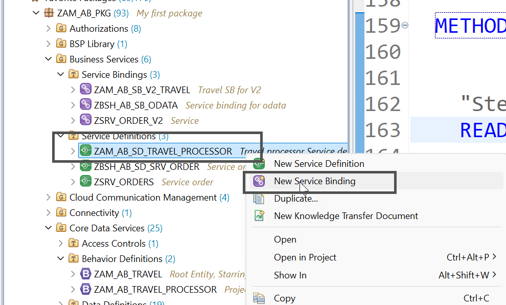
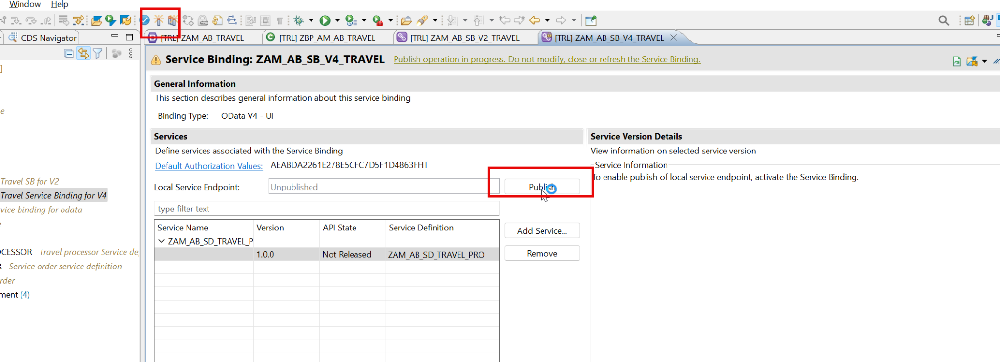
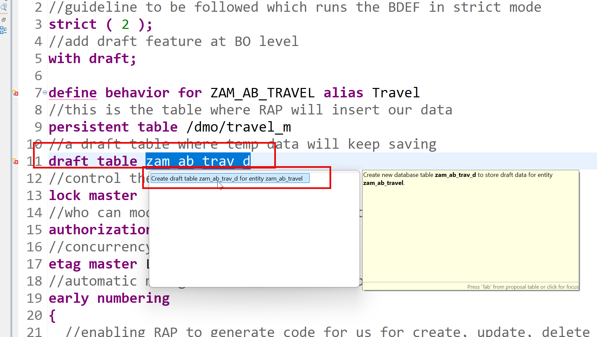
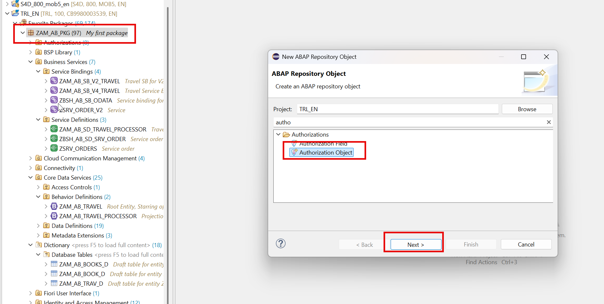
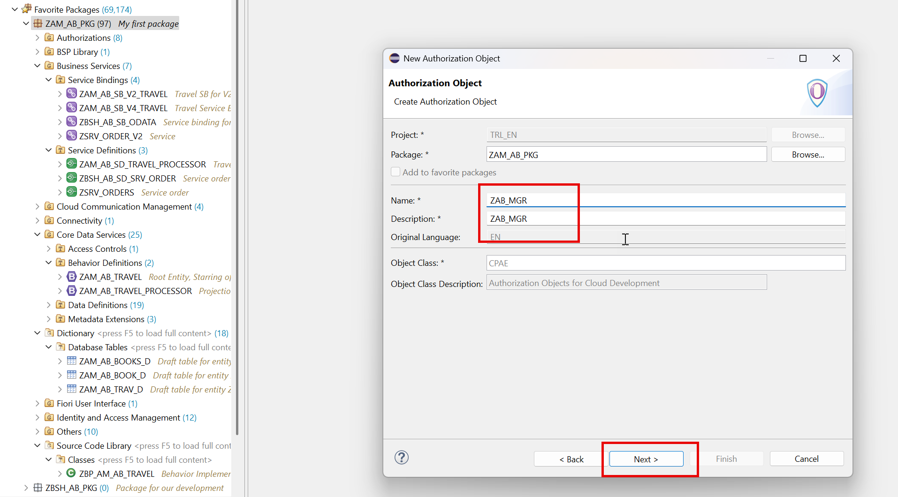

# Day 11 - OData V4, Side Effects, Draft and Authorisation

> **V4 service binding, side effects, full draft support and instance authorisation**

> Phase D - Business Logic (Days 9-12) - Add numbering, actions, determinations, validations, drafts and authorisations.

**🎯 Goal of the day.** Publish a modern V4 service, enable the draft (auto-save) mechanism, and control who may do what.

---

## 📋 Cheat Sheet - keep this open

### Today's quick reference

| Thing | Value / Syntax |
|---|---|
| **V4 binding** | Service Binding > Binding Type **OData V4 - UI** |
| **Side effect** | `side effects { field BookingFee affects field TotalPrice; }` |
| **Enable draft** | `with draft;` on the entity + `draft table zam_ab_travel_d;` + `total etag LastChangedAt;` |
| **Draft in projection** | `use draft;` + `use action Prepare/Edit/Resume/Activate/Discard;` |
| **Draft on child** | `use association _Booking { create; with draft; }` |
| **Auth in BDEF** | `authorization master ( instance )` / `( global )` |
| **Auth check** | `AUTHORITY-CHECK OBJECT 'Z...' ID 'ACTVT' FIELD '02'.` |
| `Docs` | https://help.sap.com/docs/abap-cloud/abap-rap/develop |

### Eclipse / ADT keys you will use constantly

| Key | Action |
|---|---|
| `Ctrl+Shift+A` | Search any object in the whole system |
| `Ctrl+F3` | Activate the current object |
| `Ctrl+1` | Quick fix - RAP generates code skeletons for you |
| `Ctrl+Space` | Code completion |
| `Ctrl+Click` | Navigate to the object under the cursor |
| `Ctrl+7` | Comment / uncomment a block |
| `F2` | Show a method signature |
| `F8` | Data preview (table / CDS entity) |
| `F9` | Run the class |

### The RAP layer cake (memorise this)

```text
Database tables            <- where the data really sits
   |
Interface CDS entity       <- stable, reusable model       (ZAM_AB_TRAVEL)
   |
Behavior Definition        <- the rulebook                 (.bdef)
   |
Projection CDS entity      <- one app's view of the model  (ZAM_AB_TRAVEL_PROCESSOR)
   |
Projection BDEF            <- which rules this app may use
   |
Metadata Extension (MDE)   <- the screen layout, @UI.*
   |
Service Definition         <- which entities are allowed out
   |
Service Binding            <- the actual OData V2 / V4 URL
   |
Fiori Elements app         <- built from the annotations, no JavaScript needed
```

---

## 🧱 What you will build today

- A second **service binding** using **OData V4 - UI**.
- **Side effects** in the BDEF.
- Full **draft** support, including the draft tables and the draft actions in the projection.
- **Authorisation objects** and the **`get_instance_authorizations`** implementation.

## 🧠 Concepts first, in plain English

Read this before touching the keyboard. Every idea is explained the way you would explain it to a school student.

**OData V2 vs V4**

V2 is the older protocol; V4 is smaller, faster and required for modern Fiori Elements features (including draft in the new templates). Same service definition - just a different binding.

**Side effect**

'When field A changes, please re-read field B from the server.' Without it the user changes the fee and the total price stays stale until they refresh.

**Draft**

Auto-save. Fiori writes every keystroke into a shadow *draft table*, so the user can close the browser and come back. Only when they press **Save** does the row move to the real table.

**Draft tables**

Every draft-enabled entity needs its own draft table, created for you by a quick fix. **You must activate each one** - a forgotten draft table is the single most common draft error.

**Draft actions**

`Prepare`, `Edit`, `Activate`, `Discard`, `Resume` - RAP provides them; you just `use` them in the projection so the app gets the Edit/Save/Cancel buttons.

**`total etag`**

A change-detection stamp. If two people edit the same Travel, the second save is rejected because the stamp no longer matches. Draft needs one.

**Authorisation object**

A permission slip with fields, e.g. 'activity = 02 (change), agency = 070016'. A user either has it or does not.

**`get_instance_authorizations`**

'Is *this* user allowed to touch *this* record?'. Runs per record. `get_global_authorizations` answers the cheaper question 'may this user create at all?'.

---

## 🛠️ Hands-on, step by step

### Step 1. Create Odata V4




### Step 2. Activate and Publish




### Step 3. We will now add the side effect

**📄 Behavior Definition (BDEF)** - copy the block below exactly as it is:

```abap
managed implementation in class zbp_am_ab_travel unique;
//guideline to be followed which runs the BDEF in strict mode
strict ( 2 );
define behavior for ZAM_AB_TRAVEL alias Travel
//this is the table where RAP will insert our data
persistent table /dmo/travel_m
//control the enqueue and dequeue
lock master
//who can modify, create, update, delete our data using this BDEF
authorization master ( instance )
//concurrency control - automatic
etag master LastChangedAt
//automatic management of travel id from sequence generator
early numbering
{
 //enabling RAP to generate code for us for create, update, delete
 create;
 update;
 delete;
 field ( readonly ) TravelId;
 field ( mandatory ) BeginDate, EndDate, AgencyId, CustomerId;
 association _Booking { create ( features: instance ) ; }
 //Adding a instance based factory data action to copy my travel
 //itinerary based on exisiting travel
 factory action copyTravel [1];
 //its a piece of code which is intented to be only
 //consumed within our RAP BO
 internal action reCalcTotalPrice;
 //Define determination to execute the code when
 //booking fee or curr code changes so we calc total price
 determination calculateTotalPrice on modify
           { create; field BookingFee, CurrencyCode; }
 //Side effects
  //create a new determine action
 determine action validationCustomer { validation validateHeaderData; }
  //Adding side-effect which inform RAP to reaload the total price if the booking
 //fee has been changed on the Frontend
 side effects {
   field BookingFee affects field TotalPrice;
   field CurrencyCode affects field TotalPrice;
   determine action validationCustomer executed on field CustomerId affects messages;
 }
 //Checking custom business object rules
 validation validateHeaderData on save {create; field CustomerId, BeginDate, EndDate;}
 //Since we use alias name in MDE (fiori sends) table has _ we need mapping
 mapping for /dmo/travel_m{
   TravelId = travel_id;
   AgencyId = agency_id;
   CustomerId = customer_id;
   BeginDate = begin_date;
   EndDate = end_date;
   TotalPrice = total_price;
   BookingFee = booking_fee;
   CurrencyCode = currency_code;
   Description = description;
   OverallStatus = overall_status;
   CreatedBy = created_by;
   LastChangedBy = last_changed_by;
   CreatedAt = created_at;
   LastChangedAt = last_changed_at;
 }
}
define behavior for ZAM_AB_BOOKING alias Booking
persistent table /dmo/booking_m
//child entities depends on the lock of root entity
lock dependent by _Travel
//auth depedent on the root entity
authorization dependent by _Travel
//concurrency at booking
etag master LastChangedAt
//automatic management of booking id from sequence generator
early numbering
{
 update;
 delete;
 field ( readonly ) TravelId, BookingId;
 association _Travel;
 association _BookingSuppl { create; }
 mapping for /dmo/booking_m{
   TravelId = travel_id;
   BookingId = booking_id;
   BookingDate = booking_date;
   CustomerId = customer_id;
   CarrierId = carrier_id;
   ConnectionId = connection_id;
   FlightDate = flight_date;
   FlightPrice = flight_price;
   CurrencyCode = currency_code;
   BookingStatus = booking_status;
   LastChangedAt = last_changed_at;
 }
}
define behavior for ZAM_AB_BOOKSUPPL alias BookingSuppl
persistent table /dmo/booksuppl_m
//child entities depends on the lock of root entity
lock dependent by _Travel
authorization dependent by _Travel
etag master LastChangedAt
{
 update;
 delete;
 field ( readonly ) TravelId, BookingId;
 association _Travel;
 association _Booking;
 mapping for /dmo/booksuppl_m{
   TravelId = travel_id;
   BookingId = booking_id;
   BookingSupplementId = booking_supplement_id;
   SupplementId = supplement_id;
   Price = price;
   CurrencyCode = currency_code;
   LastChangedAt = last_changed_at;
 }
}
```

<details>
<summary>💡 What the important lines mean (click to open)</summary>

| Line / keyword | What it does |
|---|---|
| `association to` | A reusable, lazily-evaluated relationship. Cheaper than a JOIN because it only runs when used. |
| `managed implementation in class ... unique` | RAP writes the INSERT/UPDATE/DELETE for you; your class only holds the special logic. |
| `strict ( 2 );` | Turns on the strictest syntax checks. It refuses code that would break in a future release - always switch it on. |
| `lock master` | 'I am the root - I own the lock for this whole business object.' Children use `lock dependent by _Travel`. |
| `lock dependent by` | 'I do not own a lock; ask my parent.' Standard for every child entity. |
| `authorization master ( instance )` | 'I decide the permissions for this whole BO.' `( instance )` means the decision is made per record, in code. |
| `authorization dependent by` | 'My permissions come from my parent.' |
| `etag master` | Names the field used for optimistic locking on this entity. |
| `early numbering` | The key is assigned as soon as the user starts creating, so they can see it on screen immediately. |

</details>

🔗 <https://help.sap.com/docs/abap-cloud/abap-rap/develop>

### Step 4. Adding Draft support to App

**📄 Behavior Definition (BDEF)** - copy the block below exactly as it is:

```abap
managed implementation in class zbp_am_ab_travel unique;
//guideline to be followed which runs the BDEF in strict mode
strict ( 2 );
//add draft feature at BO level
with draft;
define behavior for ZAM_AB_TRAVEL alias Travel
//this is the table where RAP will insert our data
persistent table /dmo/travel_m
//control the enqueue and dequeue
lock master
//mandatory to use total etag
total etag LastChangedAt
//who can modify, create, update, delete our data using this BDEF
authorization master ( instance )
//concurrency control - automatic
etag master LastChangedAt
//a draft table where temp data will keep saving
draft table zam_ab_trav_d
//automatic management of travel id from sequence generator
early numbering
{
 //enabling RAP to generate code for us for create, update, delete
 create;
 update;
 delete;
 field ( readonly ) TravelId;
 field ( mandatory ) BeginDate, EndDate, AgencyId, CustomerId;
 association _Booking { create ( features: instance ) ; with draft; }
 //to fulfil the ego of RAP framework
 //adding the draft actions
 draft determine action Prepare;
 draft action Edit;
 draft action Resume;
 draft action Activate;
 draft action Discard;
 //Adding a instance based factory data action to copy my travel
 //itinerary based on exisiting travel
 factory action copyTravel [1];
 //its a piece of code which is intented to be only
 //consumed within our RAP BO
 internal action reCalcTotalPrice;
 //Define determination to execute the code when
 //booking fee or curr code changes so we calc total price
 determination calculateTotalPrice on modify
           { create; field BookingFee, CurrencyCode; }
  //create a new determine action
 determine action validationCustomer { validation validateHeaderData; }
 //Adding side-effect which inform RAP to reaload the total price if the booking
 //fee has been changed on the Frontend
 //Side effects
 side effects {
   field BookingFee affects field TotalPrice;
   field CurrencyCode affects field TotalPrice;
   determine action validationCustomer executed on field CustomerId affects messages;
 }
 //Checking custom business object rules
 validation validateHeaderData on save {create; field CustomerId, BeginDate, EndDate;}
 //Since we use alias name in MDE (fiori sends) table has _ we need mapping
 mapping for /dmo/travel_m{
   TravelId = travel_id;
   AgencyId = agency_id;
   CustomerId = customer_id;
   BeginDate = begin_date;
   EndDate = end_date;
   TotalPrice = total_price;
   BookingFee = booking_fee;
   CurrencyCode = currency_code;
   Description = description;
   OverallStatus = overall_status;
   CreatedBy = created_by;
   LastChangedBy = last_changed_by;
   CreatedAt = created_at;
   LastChangedAt = last_changed_at;
 }
}
define behavior for ZAM_AB_BOOKING alias Booking
persistent table /dmo/booking_m
//child entities depends on the lock of root entity
lock dependent by _Travel
//auth depedent on the root entity
authorization dependent by _Travel
//concurrency at booking
etag master LastChangedAt
//add booking draft table and use quick fix to create
draft table zam_ab_book_d
//automatic management of booking id from sequence generator
early numbering
{
 update;
 delete;
 field ( readonly ) TravelId, BookingId;
 association _Travel;
 association _BookingSuppl { create; with draft; }
 mapping for /dmo/booking_m{
   TravelId = travel_id;
   BookingId = booking_id;
   BookingDate = booking_date;
   CustomerId = customer_id;
   CarrierId = carrier_id;
   ConnectionId = connection_id;
   FlightDate = flight_date;
   FlightPrice = flight_price;
   CurrencyCode = currency_code;
   BookingStatus = booking_status;
   LastChangedAt = last_changed_at;
 }
}
define behavior for ZAM_AB_BOOKSUPPL alias BookingSuppl
persistent table /dmo/booksuppl_m
//child entities depends on the lock of root entity
lock dependent by _Travel
authorization dependent by _Travel
etag master LastChangedAt
draft table zam_ab_books_d
{
 update;
 delete;
 field ( readonly ) TravelId, BookingId;
 association _Travel;
 association _Booking;
 mapping for /dmo/booksuppl_m{
   TravelId = travel_id;
   BookingId = booking_id;
   BookingSupplementId = booking_supplement_id;
   SupplementId = supplement_id;
   Price = price;
   CurrencyCode = currency_code;
   LastChangedAt = last_changed_at;
 }
}
```

<details>
<summary>💡 What the important lines mean (click to open)</summary>

| Line / keyword | What it does |
|---|---|
| `association to` | A reusable, lazily-evaluated relationship. Cheaper than a JOIN because it only runs when used. |
| `managed implementation in class ... unique` | RAP writes the INSERT/UPDATE/DELETE for you; your class only holds the special logic. |
| `strict ( 2 );` | Turns on the strictest syntax checks. It refuses code that would break in a future release - always switch it on. |
| `with draft;` | Switches on the draft (auto-save) mechanism for this entity. |
| `draft table <name>` | The shadow table that stores half-finished records. **Generate it with a quick fix and remember to activate it.** |
| `total etag <Field>` | The change-detection stamp. If someone else saved first, your save is rejected instead of silently overwriting them. |
| `lock master` | 'I am the root - I own the lock for this whole business object.' Children use `lock dependent by _Travel`. |
| `lock dependent by` | 'I do not own a lock; ask my parent.' Standard for every child entity. |
| `authorization master ( instance )` | 'I decide the permissions for this whole BO.' `( instance )` means the decision is made per record, in code. |

</details>

Add the draft table using quick fix

### Step 5. DO NOT FORGET to activate the draft table, Repeat same for booking and supplement draft tables




### Step 6. Expose the draft to processor projection

**📄 Behavior Definition - projection (BDEF)** - copy the block below exactly as it is:

```abap
projection;
strict ( 2 );
use draft;
define behavior for ZAM_AB_TRAVEL_PROCESSOR alias Travel
{
 use create;
 use update;
 use delete;
 use action Prepare;
 use action Edit;
 use action Resume;
 use action Activate;
 use action Discard;
 use action copyTravel;
 use association _Booking { create; with draft; }
}
define behavior for ZAM_AB_BOOKING_PROCESSOR alias Booking
{
 use update;
 use delete;
 use association _Travel;
 use association _BookingSuppl { create; with draft;}
}
define behavior for ZAM_AB_BOOKSUPPL_PROCESSOR alias BookSuppl
{
 use update;
 use delete;
 use association _Travel;
 use association _Booking;
}
```

<details>
<summary>💡 What the important lines mean (click to open)</summary>

| Line / keyword | What it does |
|---|---|
| `association to` | A reusable, lazily-evaluated relationship. Cheaper than a JOIN because it only runs when used. |
| `projection;` | This BDEF describes a **projection** layer. It can only re-publish (`use`) what the interface BDEF already allows. |
| `strict ( 2 );` | Turns on the strictest syntax checks. It refuses code that would break in a future release - always switch it on. |
| `with draft;` | Switches on the draft (auto-save) mechanism for this entity. |
| `use draft;` | Re-publishes the draft mechanism in the projection so the app gets Edit / Save / Cancel. |
| `use action <Name>` | Re-publishes an action in the projection. Without this line the button never appears, even if the action exists. |
| `use association _Child { create; with draft; }` | Re-publishes a child in the projection and says whether the app may create children and whether they take part in the draft. |
| `define behavior for <Entity> alias <Alias>` | Opens the rulebook for one entity. The `alias` is the short name you use everywhere else in the BDEF. |

</details>

### Step 7. Fix the dump

**📄 ABAP Method Implementation** - copy the block below exactly as it is:

```abap
METHOD earlynumbering_create.
   data: entity type STRUCTURE FOR CREATE zam_ab_travel,
         travel_id_max type /dmo/travel_id.
   ""Step 1: Ensure that Travel id is not set for the record which is coming
   loop at entities into entity where TravelId is not initial.
       APPEND CORRESPONDING #( entity ) to mapped-travel.
   ENDLOOP.
   data(entities_wo_travelid) = entities.
   delete entities_wo_travelid where TravelId is not INITIAL.
   ""Step 2: Get the seuquence numbers from the SNRO
   try.
       cl_numberrange_runtime=>number_get(
         EXPORTING
           nr_range_nr       = '01'
           object            = CONV #( '/DMO/TRAVL' )
           quantity          =  conv #( lines( entities_wo_travelid ) )
         IMPORTING
           number            = data(number_range_key)
           returncode        = data(number_range_return_code)
           returned_quantity = data(number_range_returned_quantity)
       ).
*        CATCH cx_nr_object_not_found.
*        CATCH cx_number_ranges.
     catch cx_number_ranges into data(lx_number_ranges).
       ""Step 3: If there is an exception, we will throw the error
       loop at entities_wo_travelid into entity.
           append value #( %cid = entity-%cid %key = entity-%key %msg = lx_number_ranges )
               to reported-travel.
           append value #( %cid = entity-%cid %key = entity-%key ) to failed-travel.
       ENDLOOP.
       exit.
   endtry.
   case number_range_return_code.
       when '1'.
           ""Step 4: Handle especial cases where the number range exceed critical %
           loop at entities_wo_travelid into entity.
               append value #( %cid = entity-%cid %key = entity-%key
                               %msg = new /dmo/cm_flight_messages(
                                           textid = /dmo/cm_flight_messages=>number_range_depleted
                                           severity = if_abap_behv_message=>severity-warning
                               ) )
                   to reported-travel.
           ENDLOOP.
       when '2' OR '3'.
           ""Step 5: The number range return last number, or number exhaused
           append value #( %cid = entity-%cid %key = entity-%key
                               %msg = new /dmo/cm_flight_messages(
                                           textid = /dmo/cm_flight_messages=>not_sufficient_numbers
                                           severity = if_abap_behv_message=>severity-warning
                               ) )
                   to reported-travel.
           append value #( %cid = entity-%cid
                           %key = entity-%key
                           %fail-cause = if_abap_behv=>cause-conflict
                            ) to failed-travel.
   ENDCASE.
   ""Step 6: Final check for all numbers
   ASSERT number_range_returned_quantity = lines( entities_wo_travelid ).
   ""Step 7: Loop over the incoming travel data and asign the numbers from number range and
   ""        return MAPPED data which will then go to RAP framework
   travel_id_max = number_range_key - number_range_returned_quantity.
   loop at entities_wo_travelid into entity.
       travel_id_max += 1.
       entity-TravelId = travel_id_max.
       reported-%other = VALUE #( ( new_message_with_text(
                                severity = if_abap_behv_message=>severity-success
                                text     = 'Travel id has been created now!' ) ) ).
       append value #( %cid = entity-%cid
                       %key = entity-%key
                       %is_draft = entity-%is_draft
                        ) to mapped-travel.
   ENDLOOP.
 ENDMETHOD.
 METHOD earlynumbering_cba_Booking.
    data max_booking_id type /dmo/booking_id.
   ""Step 1: get all the travel requests and their booking data
   read ENTITIES OF zam_ab_travel in local mode
       ENTITY travel by \_Booking
       from CORRESPONDING #( entities )
       link data(bookings).
   ""Loop at unique travel ids
   loop at entities ASSIGNING FIELD-SYMBOL(<travel_group>) GROUP BY <travel_group>-TravelId.
   ""Step 2: get the highest booking number which is already there
       loop at bookings into data(ls_booking) using key entity
           where source-TravelId = <travel_group>-TravelId.
               if max_booking_id < ls_booking-target-BookingId.
                   max_booking_id = ls_booking-target-BookingId.
               ENDIF.
       ENDLOOP.
   ""Step 3: get the asigned booking numbers for incoming request
       loop at entities into data(ls_entity) using key entity
           where TravelId = <travel_group>-TravelId.
               loop at ls_entity-%target into data(ls_target).
                   if max_booking_id < ls_target-BookingId.
                       max_booking_id = ls_target-BookingId.
                   ENDIF.
               ENDLOOP.
       ENDLOOP.
   ""Step 4: loop over all the entities of travel with same travel id
       loop at entities ASSIGNING FIELD-SYMBOL(<travel>)
           USING KEY entity where TravelId = <travel_group>-TravelId.
   ""Step 5: assign new booking IDs to the booking entity inside each travel
           LOOP at <travel>-%target ASSIGNING FIELD-SYMBOL(<booking_wo_numbers>).
               append CORRESPONDING #( <booking_wo_numbers> ) to mapped-booking
               ASSIGNING FIELD-SYMBOL(<mapped_booking>).
               if <mapped_booking>-BookingId is INITIAL.
                   max_booking_id += 10.
                   <mapped_booking>-BookingId = max_booking_id.
                   <mapped_booking>-%is_draft = <travel_group>-%is_draft.
               ENDIF.
           ENDLOOP.
       ENDLOOP.
   ENDLOOP.
 ENDMETHOD.
```

<details>
<summary>💡 What the important lines mean (click to open)</summary>

| Line / keyword | What it does |
|---|---|
| `corresponding { ... }` | Inside a mapping, maps the remaining fields by matching names. |
| `READ ENTITIES OF ... ENTITY ... FIELDS ( ... ) WITH ...` | EML read. Always a **mass** operation: you pass a *table* of keys and get a *table* of results, plus `FAILED` and `REPORTED`. |
| `IN LOCAL MODE` | Skip authorisation and feature checks. Correct inside a behavior implementation, because RAP already checked before calling you. |
| `%cid` | *Content ID* - a temporary label for a record that does not have a key yet, so the caller can match responses to requests. |
| `%msg` | The message object you attach to a `reported` entry so the user sees a proper error text. |
| `%key` | Just the business key part of an instance. |
| `new_message_with_text( severity = ... text = ... )` | Builds a message on the fly from free text - handy in training, but real apps should use a message class so texts are translatable. |
| `failed-<alias>` | The table of records that could **not** be processed. RAP is a mass framework, so failures are per record, not one exception. |
| `reported-<alias>` | The table of messages to show the user. |

</details>

### Step 8. Create auth objects







### Step 9. Code to check

**📄 ABAP Method Implementation** - copy the block below exactly as it is:

```abap
METHOD get_instance_authorizations.
   ""if i am manager, i can change the rejected travel data
   data : ls_result like line of result.
   "Step 1: Get the data of my instance
   READ ENTITIES OF zAM_AB_travel in LOCAL MODE
       ENTITY travel
           fields ( travelid OverallStatus )
               WITH CORRESPONDING #( keys )
                   RESULT data(lt_travel)
                   FAILED data(ls_failed).
   "Step 2: loop at the data
   loop at lt_travel into data(ls_travel).
       "Step 3: Check if the instance was having status = cancelled
       if ( ls_travel-OverallStatus = 'X' ).
           data(lv_auth) = abap_false.
           "Step 4: Check for authorization in org
           AUTHORITY-CHECK OBJECT 'ZAB_MGR'
               ID 'ACTVT' FIELD '02'.
           IF sy-subrc = 0.
               lv_auth = abap_true.
           ENDIF.
       else.
           lv_auth = abap_true.
       ENDIF.
       ls_result = value #( TravelId = ls_travel-TravelId
                            %update = COND #( when lv_auth eq abap_false
                                                   then if_abap_behv=>auth-unauthorized
                                                   else    if_abap_behv=>auth-allowed
                                            )
                            %action-copyTravel = COND #( when lv_auth eq abap_false
                                                   then if_abap_behv=>auth-unauthorized
                                                   else    if_abap_behv=>auth-allowed
                                            )
       ).
       ""Finally send the result out to RAP
       APPEND ls_result to result.
   ENDLOOP.
 ENDMETHOD.
```

<details>
<summary>💡 What the important lines mean (click to open)</summary>

| Line / keyword | What it does |
|---|---|
| `corresponding { ... }` | Inside a mapping, maps the remaining fields by matching names. |
| `READ ENTITIES OF ... ENTITY ... FIELDS ( ... ) WITH ...` | EML read. Always a **mass** operation: you pass a *table* of keys and get a *table* of results, plus `FAILED` and `REPORTED`. |
| `IN LOCAL MODE` | Skip authorisation and feature checks. Correct inside a behavior implementation, because RAP already checked before calling you. |
| `if_abap_behv=>auth-allowed / -unauthorized` | Authorisation constants returned from `get_instance_authorizations`. |
| `AUTHORITY-CHECK OBJECT` | The classic permission check: does this user hold this authorisation object with these field values? |
| `METHOD get_instance_authorizations` | RAP calls this per record: 'is this user allowed to touch *this* row?' |
| `FINAL` | Nobody may inherit from this class. |

</details>

---

---

## ✅ Final version of all code from Day 11

Everything below is the **complete, unmodified** source from the training material, gathered in one place so you can copy it straight into Eclipse.

### 1. We will now add the side effect - _Behavior Definition (BDEF)_

```abap
managed implementation in class zbp_am_ab_travel unique;
//guideline to be followed which runs the BDEF in strict mode
strict ( 2 );
define behavior for ZAM_AB_TRAVEL alias Travel
//this is the table where RAP will insert our data
persistent table /dmo/travel_m
//control the enqueue and dequeue
lock master
//who can modify, create, update, delete our data using this BDEF
authorization master ( instance )
//concurrency control - automatic
etag master LastChangedAt
//automatic management of travel id from sequence generator
early numbering
{
 //enabling RAP to generate code for us for create, update, delete
 create;
 update;
 delete;
 field ( readonly ) TravelId;
 field ( mandatory ) BeginDate, EndDate, AgencyId, CustomerId;
 association _Booking { create ( features: instance ) ; }
 //Adding a instance based factory data action to copy my travel
 //itinerary based on exisiting travel
 factory action copyTravel [1];
 //its a piece of code which is intented to be only
 //consumed within our RAP BO
 internal action reCalcTotalPrice;
 //Define determination to execute the code when
 //booking fee or curr code changes so we calc total price
 determination calculateTotalPrice on modify
           { create; field BookingFee, CurrencyCode; }
 //Side effects
  //create a new determine action
 determine action validationCustomer { validation validateHeaderData; }
  //Adding side-effect which inform RAP to reaload the total price if the booking
 //fee has been changed on the Frontend
 side effects {
   field BookingFee affects field TotalPrice;
   field CurrencyCode affects field TotalPrice;
   determine action validationCustomer executed on field CustomerId affects messages;
 }
 //Checking custom business object rules
 validation validateHeaderData on save {create; field CustomerId, BeginDate, EndDate;}
 //Since we use alias name in MDE (fiori sends) table has _ we need mapping
 mapping for /dmo/travel_m{
   TravelId = travel_id;
   AgencyId = agency_id;
   CustomerId = customer_id;
   BeginDate = begin_date;
   EndDate = end_date;
   TotalPrice = total_price;
   BookingFee = booking_fee;
   CurrencyCode = currency_code;
   Description = description;
   OverallStatus = overall_status;
   CreatedBy = created_by;
   LastChangedBy = last_changed_by;
   CreatedAt = created_at;
   LastChangedAt = last_changed_at;
 }
}
define behavior for ZAM_AB_BOOKING alias Booking
persistent table /dmo/booking_m
//child entities depends on the lock of root entity
lock dependent by _Travel
//auth depedent on the root entity
authorization dependent by _Travel
//concurrency at booking
etag master LastChangedAt
//automatic management of booking id from sequence generator
early numbering
{
 update;
 delete;
 field ( readonly ) TravelId, BookingId;
 association _Travel;
 association _BookingSuppl { create; }
 mapping for /dmo/booking_m{
   TravelId = travel_id;
   BookingId = booking_id;
   BookingDate = booking_date;
   CustomerId = customer_id;
   CarrierId = carrier_id;
   ConnectionId = connection_id;
   FlightDate = flight_date;
   FlightPrice = flight_price;
   CurrencyCode = currency_code;
   BookingStatus = booking_status;
   LastChangedAt = last_changed_at;
 }
}
define behavior for ZAM_AB_BOOKSUPPL alias BookingSuppl
persistent table /dmo/booksuppl_m
//child entities depends on the lock of root entity
lock dependent by _Travel
authorization dependent by _Travel
etag master LastChangedAt
{
 update;
 delete;
 field ( readonly ) TravelId, BookingId;
 association _Travel;
 association _Booking;
 mapping for /dmo/booksuppl_m{
   TravelId = travel_id;
   BookingId = booking_id;
   BookingSupplementId = booking_supplement_id;
   SupplementId = supplement_id;
   Price = price;
   CurrencyCode = currency_code;
   LastChangedAt = last_changed_at;
 }
}
```

### 2. Adding Draft support to App - _Behavior Definition (BDEF)_

```abap
managed implementation in class zbp_am_ab_travel unique;
//guideline to be followed which runs the BDEF in strict mode
strict ( 2 );
//add draft feature at BO level
with draft;
define behavior for ZAM_AB_TRAVEL alias Travel
//this is the table where RAP will insert our data
persistent table /dmo/travel_m
//control the enqueue and dequeue
lock master
//mandatory to use total etag
total etag LastChangedAt
//who can modify, create, update, delete our data using this BDEF
authorization master ( instance )
//concurrency control - automatic
etag master LastChangedAt
//a draft table where temp data will keep saving
draft table zam_ab_trav_d
//automatic management of travel id from sequence generator
early numbering
{
 //enabling RAP to generate code for us for create, update, delete
 create;
 update;
 delete;
 field ( readonly ) TravelId;
 field ( mandatory ) BeginDate, EndDate, AgencyId, CustomerId;
 association _Booking { create ( features: instance ) ; with draft; }
 //to fulfil the ego of RAP framework
 //adding the draft actions
 draft determine action Prepare;
 draft action Edit;
 draft action Resume;
 draft action Activate;
 draft action Discard;
 //Adding a instance based factory data action to copy my travel
 //itinerary based on exisiting travel
 factory action copyTravel [1];
 //its a piece of code which is intented to be only
 //consumed within our RAP BO
 internal action reCalcTotalPrice;
 //Define determination to execute the code when
 //booking fee or curr code changes so we calc total price
 determination calculateTotalPrice on modify
           { create; field BookingFee, CurrencyCode; }
  //create a new determine action
 determine action validationCustomer { validation validateHeaderData; }
 //Adding side-effect which inform RAP to reaload the total price if the booking
 //fee has been changed on the Frontend
 //Side effects
 side effects {
   field BookingFee affects field TotalPrice;
   field CurrencyCode affects field TotalPrice;
   determine action validationCustomer executed on field CustomerId affects messages;
 }
 //Checking custom business object rules
 validation validateHeaderData on save {create; field CustomerId, BeginDate, EndDate;}
 //Since we use alias name in MDE (fiori sends) table has _ we need mapping
 mapping for /dmo/travel_m{
   TravelId = travel_id;
   AgencyId = agency_id;
   CustomerId = customer_id;
   BeginDate = begin_date;
   EndDate = end_date;
   TotalPrice = total_price;
   BookingFee = booking_fee;
   CurrencyCode = currency_code;
   Description = description;
   OverallStatus = overall_status;
   CreatedBy = created_by;
   LastChangedBy = last_changed_by;
   CreatedAt = created_at;
   LastChangedAt = last_changed_at;
 }
}
define behavior for ZAM_AB_BOOKING alias Booking
persistent table /dmo/booking_m
//child entities depends on the lock of root entity
lock dependent by _Travel
//auth depedent on the root entity
authorization dependent by _Travel
//concurrency at booking
etag master LastChangedAt
//add booking draft table and use quick fix to create
draft table zam_ab_book_d
//automatic management of booking id from sequence generator
early numbering
{
 update;
 delete;
 field ( readonly ) TravelId, BookingId;
 association _Travel;
 association _BookingSuppl { create; with draft; }
 mapping for /dmo/booking_m{
   TravelId = travel_id;
   BookingId = booking_id;
   BookingDate = booking_date;
   CustomerId = customer_id;
   CarrierId = carrier_id;
   ConnectionId = connection_id;
   FlightDate = flight_date;
   FlightPrice = flight_price;
   CurrencyCode = currency_code;
   BookingStatus = booking_status;
   LastChangedAt = last_changed_at;
 }
}
define behavior for ZAM_AB_BOOKSUPPL alias BookingSuppl
persistent table /dmo/booksuppl_m
//child entities depends on the lock of root entity
lock dependent by _Travel
authorization dependent by _Travel
etag master LastChangedAt
draft table zam_ab_books_d
{
 update;
 delete;
 field ( readonly ) TravelId, BookingId;
 association _Travel;
 association _Booking;
 mapping for /dmo/booksuppl_m{
   TravelId = travel_id;
   BookingId = booking_id;
   BookingSupplementId = booking_supplement_id;
   SupplementId = supplement_id;
   Price = price;
   CurrencyCode = currency_code;
   LastChangedAt = last_changed_at;
 }
}
```

### 3. Expose the draft to processor projection - _Behavior Definition - projection (BDEF)_

```abap
projection;
strict ( 2 );
use draft;
define behavior for ZAM_AB_TRAVEL_PROCESSOR alias Travel
{
 use create;
 use update;
 use delete;
 use action Prepare;
 use action Edit;
 use action Resume;
 use action Activate;
 use action Discard;
 use action copyTravel;
 use association _Booking { create; with draft; }
}
define behavior for ZAM_AB_BOOKING_PROCESSOR alias Booking
{
 use update;
 use delete;
 use association _Travel;
 use association _BookingSuppl { create; with draft;}
}
define behavior for ZAM_AB_BOOKSUPPL_PROCESSOR alias BookSuppl
{
 use update;
 use delete;
 use association _Travel;
 use association _Booking;
}
```

### 4. Fix the dump - _ABAP Method Implementation_

```abap
METHOD earlynumbering_create.
   data: entity type STRUCTURE FOR CREATE zam_ab_travel,
         travel_id_max type /dmo/travel_id.
   ""Step 1: Ensure that Travel id is not set for the record which is coming
   loop at entities into entity where TravelId is not initial.
       APPEND CORRESPONDING #( entity ) to mapped-travel.
   ENDLOOP.
   data(entities_wo_travelid) = entities.
   delete entities_wo_travelid where TravelId is not INITIAL.
   ""Step 2: Get the seuquence numbers from the SNRO
   try.
       cl_numberrange_runtime=>number_get(
         EXPORTING
           nr_range_nr       = '01'
           object            = CONV #( '/DMO/TRAVL' )
           quantity          =  conv #( lines( entities_wo_travelid ) )
         IMPORTING
           number            = data(number_range_key)
           returncode        = data(number_range_return_code)
           returned_quantity = data(number_range_returned_quantity)
       ).
*        CATCH cx_nr_object_not_found.
*        CATCH cx_number_ranges.
     catch cx_number_ranges into data(lx_number_ranges).
       ""Step 3: If there is an exception, we will throw the error
       loop at entities_wo_travelid into entity.
           append value #( %cid = entity-%cid %key = entity-%key %msg = lx_number_ranges )
               to reported-travel.
           append value #( %cid = entity-%cid %key = entity-%key ) to failed-travel.
       ENDLOOP.
       exit.
   endtry.
   case number_range_return_code.
       when '1'.
           ""Step 4: Handle especial cases where the number range exceed critical %
           loop at entities_wo_travelid into entity.
               append value #( %cid = entity-%cid %key = entity-%key
                               %msg = new /dmo/cm_flight_messages(
                                           textid = /dmo/cm_flight_messages=>number_range_depleted
                                           severity = if_abap_behv_message=>severity-warning
                               ) )
                   to reported-travel.
           ENDLOOP.
       when '2' OR '3'.
           ""Step 5: The number range return last number, or number exhaused
           append value #( %cid = entity-%cid %key = entity-%key
                               %msg = new /dmo/cm_flight_messages(
                                           textid = /dmo/cm_flight_messages=>not_sufficient_numbers
                                           severity = if_abap_behv_message=>severity-warning
                               ) )
                   to reported-travel.
           append value #( %cid = entity-%cid
                           %key = entity-%key
                           %fail-cause = if_abap_behv=>cause-conflict
                            ) to failed-travel.
   ENDCASE.
   ""Step 6: Final check for all numbers
   ASSERT number_range_returned_quantity = lines( entities_wo_travelid ).
   ""Step 7: Loop over the incoming travel data and asign the numbers from number range and
   ""        return MAPPED data which will then go to RAP framework
   travel_id_max = number_range_key - number_range_returned_quantity.
   loop at entities_wo_travelid into entity.
       travel_id_max += 1.
       entity-TravelId = travel_id_max.
       reported-%other = VALUE #( ( new_message_with_text(
                                severity = if_abap_behv_message=>severity-success
                                text     = 'Travel id has been created now!' ) ) ).
       append value #( %cid = entity-%cid
                       %key = entity-%key
                       %is_draft = entity-%is_draft
                        ) to mapped-travel.
   ENDLOOP.
 ENDMETHOD.
 METHOD earlynumbering_cba_Booking.
    data max_booking_id type /dmo/booking_id.
   ""Step 1: get all the travel requests and their booking data
   read ENTITIES OF zam_ab_travel in local mode
       ENTITY travel by \_Booking
       from CORRESPONDING #( entities )
       link data(bookings).
   ""Loop at unique travel ids
   loop at entities ASSIGNING FIELD-SYMBOL(<travel_group>) GROUP BY <travel_group>-TravelId.
   ""Step 2: get the highest booking number which is already there
       loop at bookings into data(ls_booking) using key entity
           where source-TravelId = <travel_group>-TravelId.
               if max_booking_id < ls_booking-target-BookingId.
                   max_booking_id = ls_booking-target-BookingId.
               ENDIF.
       ENDLOOP.
   ""Step 3: get the asigned booking numbers for incoming request
       loop at entities into data(ls_entity) using key entity
           where TravelId = <travel_group>-TravelId.
               loop at ls_entity-%target into data(ls_target).
                   if max_booking_id < ls_target-BookingId.
                       max_booking_id = ls_target-BookingId.
                   ENDIF.
               ENDLOOP.
       ENDLOOP.
   ""Step 4: loop over all the entities of travel with same travel id
       loop at entities ASSIGNING FIELD-SYMBOL(<travel>)
           USING KEY entity where TravelId = <travel_group>-TravelId.
   ""Step 5: assign new booking IDs to the booking entity inside each travel
           LOOP at <travel>-%target ASSIGNING FIELD-SYMBOL(<booking_wo_numbers>).
               append CORRESPONDING #( <booking_wo_numbers> ) to mapped-booking
               ASSIGNING FIELD-SYMBOL(<mapped_booking>).
               if <mapped_booking>-BookingId is INITIAL.
                   max_booking_id += 10.
                   <mapped_booking>-BookingId = max_booking_id.
                   <mapped_booking>-%is_draft = <travel_group>-%is_draft.
               ENDIF.
           ENDLOOP.
       ENDLOOP.
   ENDLOOP.
 ENDMETHOD.
```

### 5. Code to check - _ABAP Method Implementation_

```abap
METHOD get_instance_authorizations.
   ""if i am manager, i can change the rejected travel data
   data : ls_result like line of result.
   "Step 1: Get the data of my instance
   READ ENTITIES OF zAM_AB_travel in LOCAL MODE
       ENTITY travel
           fields ( travelid OverallStatus )
               WITH CORRESPONDING #( keys )
                   RESULT data(lt_travel)
                   FAILED data(ls_failed).
   "Step 2: loop at the data
   loop at lt_travel into data(ls_travel).
       "Step 3: Check if the instance was having status = cancelled
       if ( ls_travel-OverallStatus = 'X' ).
           data(lv_auth) = abap_false.
           "Step 4: Check for authorization in org
           AUTHORITY-CHECK OBJECT 'ZAB_MGR'
               ID 'ACTVT' FIELD '02'.
           IF sy-subrc = 0.
               lv_auth = abap_true.
           ENDIF.
       else.
           lv_auth = abap_true.
       ENDIF.
       ls_result = value #( TravelId = ls_travel-TravelId
                            %update = COND #( when lv_auth eq abap_false
                                                   then if_abap_behv=>auth-unauthorized
                                                   else    if_abap_behv=>auth-allowed
                                            )
                            %action-copyTravel = COND #( when lv_auth eq abap_false
                                                   then if_abap_behv=>auth-unauthorized
                                                   else    if_abap_behv=>auth-allowed
                                            )
       ).
       ""Finally send the result out to RAP
       APPEND ls_result to result.
   ENDLOOP.
 ENDMETHOD.
```

---

## ⚠️ Traps and tips

- **Activate every generated draft table.** Repeat it for Travel, Booking *and* Booking Supplement. A missing draft table gives a runtime dump that names nothing useful.
- If the app dumps right after enabling draft, check `earlynumbering_create` - the draft flow calls it differently.

---

[⬅️ Day 10](Day10_Actions_Determinations_Validations.md) | [🏠 Summary](00_SUMMARY.md) | [📋 Master Cheat Sheet](00_MASTER_CHEAT_SHEET.md) | [Day 12 ➡️](Day12_Precheck_Augment_Virtual_Elements_BAS.md)
