# Day 12 - Prechecks, Augment, Virtual Elements and BAS

> **Precheck with a reusable method, augment in the projection, calculated fields, and opening Business Application Studio**

> Phase D - Business Logic (Days 9-12) - Add numbering, actions, determinations, validations, drafts and authorisations.

**🎯 Goal of the day.** Learn the three remaining RAP hooks, then move to the tool you will build the real Fiori app in.

---

## 📋 Cheat Sheet - keep this open

### Today's quick reference

| Thing | Value / Syntax |
|---|---|
| **Precheck in BDEF** | `update ( precheck );` / `create ( precheck );` |
| **Precheck types** | `types: t_entity_create type table for create <bo>, t_entity_update type table for update <bo>, t_entity_rep type table for reported <bo>, t_entity_err type table for failed <bo>.` |
| `Augment` | `use create ( augment );` in the **projection** BDEF only |
| **Virtual element** | `@ObjectModel.virtualElementCalculatedBy: 'ABAP:ZCL_AM_AB_VE_CALC'` + `virtual <Field> : <type>` |
| **VE class interface** | `INTERFACES if_sadl_exit_calc_element_read` |
| `BAS` | BTP cockpit > Business Application Studio > Create Dev Space > type **SAP Fiori** |
| **cf login** | `cf login -a https://api.cf.us10-001.hana.ondemand.com --sso` |

### Eclipse / ADT keys you will use constantly

| Key | Action |
|---|---|
| `Ctrl+Shift+A` | Search any object in the whole system |
| `Ctrl+F3` | Activate the current object |
| `Ctrl+1` | Quick fix - RAP generates code skeletons for you |
| `Ctrl+Space` | Code completion |
| `Ctrl+Click` | Navigate to the object under the cursor |
| `Ctrl+7` | Comment / uncomment a block |
| `F2` | Show a method signature |
| `F8` | Data preview (table / CDS entity) |
| `F9` | Run the class |

### The RAP layer cake (memorise this)

```text
Database tables            <- where the data really sits
   |
Interface CDS entity       <- stable, reusable model       (ZAM_AB_TRAVEL)
   |
Behavior Definition        <- the rulebook                 (.bdef)
   |
Projection CDS entity      <- one app's view of the model  (ZAM_AB_TRAVEL_PROCESSOR)
   |
Projection BDEF            <- which rules this app may use
   |
Metadata Extension (MDE)   <- the screen layout, @UI.*
   |
Service Definition         <- which entities are allowed out
   |
Service Binding            <- the actual OData V2 / V4 URL
   |
Fiori Elements app         <- built from the annotations, no JavaScript needed
```

---

## 🧱 What you will build today

- **Precheck** for create and update, sharing one reusable method.
- **Augment** in the projection BDEF - filling projection-only fields.
- **Virtual elements** - fields that exist only at runtime, calculated by an ABAP class.
- A **Dev Space** in **SAP Business Application Studio (BAS)** connected to your Cloud Foundry account.

## 🧠 Concepts first, in plain English

Read this before touching the keyboard. Every idea is explained the way you would explain it to a school student.

**Precheck**

A bouncer standing *before* the door. It runs before RAP even puts the data into its buffer, so rubbish never gets in. A validation runs later, at save.

**Why a shared reuse method?**

`precheck_create` and `precheck_update` need almost identical checks. Writing the logic once in `precheck_anubhav_reuse` and calling it from both is simply good engineering.

**Augment**

Only exists in the **projection** layer. When the projection has a field the interface does not, augment lets you fill it during create. 'Take what the user typed on the app screen and map it into the model.'

**Virtual element**

A column that is **not stored anywhere**. `@ObjectModel.virtualElementCalculatedBy: 'ABAP:ZCL_...'` names a class that computes it every time somebody reads the entity. Great for 'days until travel' or a converted currency.

**Cost of virtual elements**

They cannot be filtered or sorted efficiently, because the database knows nothing about them. Use for display only.

**BAS**

*Business Application Studio* - VS Code in your browser, pre-loaded with SAP's Fiori generators. This is where the actual Fiori project (and any TypeScript) lives.

**Dev Space**

A container in BAS with a specific set of tools. Pick **SAP Fiori** as the type so the Fiori tools are already installed.

**`cf login`**

Cloud Foundry login from the terminal. BAS needs it before it can deploy anything to your subaccount.

---

## 🛠️ Hands-on, step by step


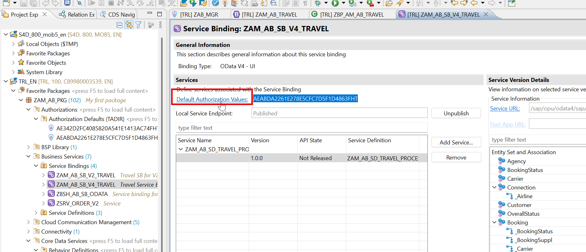


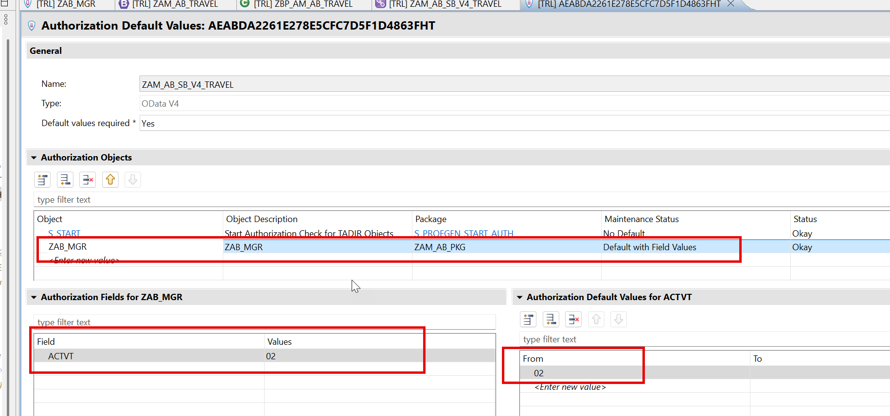

### Step 1. Precheck

**📄 Behavior Definition (BDEF)** - copy the block below exactly as it is:

```abap
managed implementation in class zbp_am_ab_travel unique;
//guideline to be followed which runs the BDEF in strict mode
strict@AbapCatalog.viewEnhancementCategory: [#NONE]
@AccessControl.authorizationCheck: #NOT_REQUIRED
@EndUserText.label: 'Customer Master data'
@Metadata.ignorePropagatedAnnotations: true
@ObjectModel.usageType:{
   serviceQuality: #X,
   sizeCategory: #S,
   dataClass: #MIXED
}
define view entity ZAM_AB_U_CUSTOMER as select from /dmo/customer
association[1] to I_Country as _Country
on $projection.CountryCode = _Country.Country
{
   key customer_id as CustomerId,
   first_name as FirstName,
   last_name as LastName,
   title as Title,
   concat(concat(title, concat(' ',first_name)),concat('', last_name)) as CustomerName,
   street as Street,
   postal_code as PostalCode,
   city as City,
   country_code as CountryCode,
   phone_number as PhoneNumber,
   email_address as EmailAddress,
   _Country
}EL alias Travel
//this is the table where RAP will insert our data
persistent table /dmo/travel_m
//control the enqueue and dequeue
lock master
//mandatory to use total etag
total etag LastChangedAt
//who can modify, create, update, delete our data using this BDEF
authorization master ( instance )
//concurrency control - automatic
etag master LastChangedAt
//a draft table where temp data will keep saving
draft table zam_ab_trav_d
//automatic management of travel id from sequence generator
early numbering
{
 //enabling RAP to generate code for us for create, update, delete
 create (precheck);
 update (precheck);
 delete;
 field ( readonly ) TravelId;
 field ( mandatory ) BeginDate, EndDate, AgencyId, CustomerId;
 association _Booking { create ( features: instance ) ; with draft; }
 //to fulfil the ego of RAP framework
 //adding the draft actions
 draft determine action Prepare;
 draft action Edit;
 draft action Resume;
 draft action Activate;
 draft action Discard;
 //Adding a instance based factory data action to copy my travel
 //itinerary based on exisiting travel
 factory action copyTravel [1];
 //its a piece of code which is intented to be only
 //consumed within our RAP BO
 internal action reCalcTotalPrice;
 //Define determination to execute the code when
 //booking fee or curr code changes so we calc total price
 determination calculateTotalPrice on modify
           { create; field BookingFee, CurrencyCode; }
  //create a new determine action
 determine action validationCustomer { validation validateHeaderData; }
 //Adding side-effect which inform RAP to reaload the total price if the booking
 //fee has been changed on the Frontend
 //Side effects
 side effects {
   field BookingFee affects field TotalPrice;
   field CurrencyCode affects field TotalPrice;
   determine action validationCustomer executed on field CustomerId affects messages;
 }
 //Checking custom business object rules
 validation validateHeaderData on save {create; field CustomerId, BeginDate, EndDate;}
 //Since we use alias name in MDE (fiori sends) table has _ we need mapping
 mapping for /dmo/travel_m{
   TravelId = travel_id;
   AgencyId = agency_id;
   CustomerId = customer_id;
   BeginDate = begin_date;
   EndDate = end_date;
   TotalPrice = total_price;
   BookingFee = booking_fee;
   CurrencyCode = currency_code;
   Description = description;
   OverallStatus = overall_status;
   CreatedBy = created_by;
   LastChangedBy = last_changed_by;
   CreatedAt = created_at;
   LastChangedAt = last_changed_at;
 }
}
define behavior for ZAM_AB_BOOKING alias Booking
persistent table /dmo/booking_m
//child entities depends on the lock of root entity
lock dependent by _Travel
//auth depedent on the root entity
authorization dependent by _Travel
//concurrency at booking
etag master LastChangedAt
//add booking draft table and use quick fix to create
draft table zam_ab_book_d
//automatic management of booking id from sequence generator
early numbering
{
 update;
 delete;
 field ( readonly ) TravelId, BookingId;
 association _Travel;
 association _BookingSuppl { create; with draft; }
 mapping for /dmo/booking_m{
   TravelId = travel_id;
   BookingId = booking_id;
   BookingDate = booking_date;
   CustomerId = customer_id;
   CarrierId = carrier_id;
   ConnectionId = connection_id;
   FlightDate = flight_date;
   FlightPrice = flight_price;
   CurrencyCode = currency_code;
   BookingStatus = booking_status;
   LastChangedAt = last_changed_at;
 }
}
define behavior for ZAM_AB_BOOKSUPPL alias BookingSuppl
persistent table /dmo/booksuppl_m
//child entities depends on the lock of root entity
lock dependent by _Travel
authorization dependent by _Travel
etag master LastChangedAt
draft table zam_ab_books_d
{
 update;
 delete;
 field ( readonly ) TravelId, BookingId;
 association _Travel;
 association _Booking;
 mapping for /dmo/booksuppl_m{
   TravelId = travel_id;
   BookingId = booking_id;
   BookingSupplementId = booking_supplement_id;
   SupplementId = supplement_id;
   Price = price;
   CurrencyCode = currency_code;
   LastChangedAt = last_changed_at;
 }
}
```

<details>
<summary>💡 What the important lines mean (click to open)</summary>

| Line / keyword | What it does |
|---|---|
| `@AbapCatalog.viewEnhancementCategory: [#NONE]` | Says whether other people may extend this view. `[#NONE]` = closed, `[#PROJECTION_LIST]` = fields may be added. |
| `@AccessControl.authorizationCheck: #NOT_REQUIRED` | Skip the DCL authorisation check. Fine while learning - **never** on real customer data. |
| `@EndUserText.label` | The human-readable description shown in tools and on screen. |
| `@Metadata.ignorePropagatedAnnotations` | `true` = ignore annotations inherited from the views underneath, so you start with a clean slate. |
| `@ObjectModel.usageType` | Declares the view's role: `serviceQuality` (how polished it is), `sizeCategory` (expected row count), `dataClass` (master, transactional, mixed). |
| `define view entity` | The modern CDS entity - one object, one name, faster and stricter than the old `define view`. |
| `define view` | The **obsolete** CDS View. Kept here only so you can see the difference. |
| `association to` | A reusable, lazily-evaluated relationship. Cheaper than a JOIN because it only runs when used. |
| `$projection.<Field>` | Refers to a field of the view you are currently writing (rather than of the joined source). |

</details>

### Step 2. Definition

**📄 Source code** - copy the block below exactly as it is:

```abap
   types:t_entity_create type table for create zAM_AB_travel,
         t_entity_update TYPE table for update zAM_AB_travel,
         t_entity_rep type table for REPORTED zAM_AB_travel,
         t_entity_err type table for FAILED zAM_AB_travel.

   methods precheck_anubhav_reuse
       importing
           entities_u type t_entity_update optional
           entities_c type t_entity_create optional
        exporting
           reported type t_entity_rep
           failed type t_entity_err.
```

<details>
<summary>💡 What the important lines mean (click to open)</summary>

| Line / keyword | What it does |
|---|---|
| `METHOD precheck_*` | Runs before the data enters RAP's buffer. Reject bad input here and it never gets in. |

</details>

### Step 3. Implementation

**📄 ABAP Method Implementation** - copy the block below exactly as it is:

```abap
 METHOD precheck_create.
   precheck_anubhav_reuse(
     EXPORTING
*        entities_u =
        entities_c = entities
     IMPORTING
       reported   = reported-travel
       failed     = failed-travel
   ).
 ENDMETHOD.

 METHOD precheck_update.
   precheck_anubhav_reuse(
     EXPORTING
         entities_u = entities
*         entities_c =
     IMPORTING
       reported   = reported-travel
       failed     = failed-travel
   ).
 ENDMETHOD.

 METHOD precheck_anubhav_reuse.
   ""Step 1: Data declaration
   data: entities type t_entity_update,
          operation type if_abap_behv=>t_char01,
          agencies type sorted table of /dmo/agency WITH UNIQUE KEY agency_id,
          customers type sorted table of /dmo/customer WITH UNIQUE key customer_id.
   ""Step 2: Check either entity_c was passed or entity_u was passed
   ASSERT not ( entities_c is initial equiv entities_u is initial ).
   ""Step 3: Perform validation only if agency OR customer was changed
   if entities_c is not initial.
       entities = CORRESPONDING #( entities_c ).
       operation = if_abap_behv=>op-m-create.
   else.
       entities = CORRESPONDING #( entities_u ).
       operation = if_abap_behv=>op-m-update.
   ENDIF.
   delete entities where %control-AgencyId = if_abap_behv=>mk-off and %control-CustomerId = if_abap_behv=>mk-off.
   ""Step 4: get all the unique agencies and customers in a table
   agencies = CORRESPONDING #( entities discarding DUPLICATES MAPPING agency_id = AgencyId EXCEPT * ).
   customers = CORRESPONDING #( entities discarding DUPLICATES MAPPING customer_id = CustomerId EXCEPT * ).
   ""Step 5: Select the agency and customer data from DB tables
   select from /dmo/agency fields agency_id, country_code
   for all ENTRIES IN @agencies where agency_id = @agencies-agency_id
   into table @data(agency_country_codes).
   select from /dmo/customer fields customer_id, country_code
   for all ENTRIES IN @customers where customer_id = @customers-customer_id
   into table @data(customer_country_codes).
   ""Step 6: Loop at incoming entities and compare each agency and customer country
   loop at entities into data(entity).
       read table agency_country_codes with key agency_id = entity-AgencyId into data(ls_agency).
       CHECK sy-subrc = 0.
       read table customer_country_codes with key customer_id = entity-CustomerId into data(ls_customer).
       CHECK sy-subrc = 0.
       if ls_agency-country_code <> ls_customer-country_code.
           ""Step 7: if country doesnt match, throw the error
           append value #(    %cid = cond #( when operation = if_abap_behv=>op-m-create then entity-%cid_ref )
                                     %is_draft = entity-%is_draft
                                     %fail-cause = if_abap_behv=>cause-conflict
             ) to failed.
           append value #(    %cid = cond #( when operation = if_abap_behv=>op-m-create then entity-%cid_ref )
                                     %is_draft = entity-%is_draft
                                     %msg = new /dmo/cm_flight_messages(
                                                                                             textid                = value #(
                                                                                                                                    msgid = 'SY'
                                                                                                                                    msgno = 499
                                                                                                                                    attr1 = 'The country codes for agency and customer not matching'
                                                                                                                                 )
                                                                                             agency_id             = entity-AgencyId
                                                                                             customer_id           = entity-CustomerId
                                                                                             severity  = if_abap_behv_message=>severity-error
                                                                                           )
                                     %element-agencyid = if_abap_behv=>mk-on
             ) to reported.
       ENDIF.
   ENDLOOP.
 ENDMETHOD.
```

<details>
<summary>💡 What the important lines mean (click to open)</summary>

| Line / keyword | What it does |
|---|---|
| `corresponding { ... }` | Inside a mapping, maps the remaining fields by matching names. |
| `validation ... on save` | A gatekeeper at save time. It may only accept or refuse - it must never change data. |
| `%cid` | *Content ID* - a temporary label for a record that does not have a key yet, so the caller can match responses to requests. |
| `%control` | One flag per field saying 'I really did supply this'. Distinguishes 'set to empty' from 'not sent at all'. |
| `%msg` | The message object you attach to a `reported` entry so the user sees a proper error text. |
| `failed-<alias>` | The table of records that could **not** be processed. RAP is a mass framework, so failures are per record, not one exception. |
| `reported-<alias>` | The table of messages to show the user. |
| `METHOD precheck_*` | Runs before the data enters RAP's buffer. Reject bad input here and it never gets in. |

</details>

### Step 4. Augment Feature

Note: Feature available only at projection layer

**📄 Behavior Definition - projection (BDEF)** - copy the block below exactly as it is:

```abap
projection;
strict ( 2 );
use draft;
define behavior for ZAM_AB_TRAVEL_PROCESSOR alias Travel
//create a new class for processor implementation
implementation in class zbp_AM_AB_travel_proc unique
{
 use create ( augment );
 use update;
 use delete;
 use action Prepare;
 use action Edit;
 use action Resume;
 use action Activate;
 use action Discard;
 use action copyTravel;
 use association _Booking { create; with draft; }
}
define behavior for ZAM_AB_BOOKING_PROCESSOR alias Booking
{
 use update;
 use delete;
 use association _Travel;
 use association _BookingSuppl { create; with draft;}
}
define behavior for ZAM_AB_BOOKSUPPL_PROCESSOR alias BookSuppl
{
 use update;
 use delete;
 use association _Travel;
 use association _Booking;
}
```

<details>
<summary>💡 What the important lines mean (click to open)</summary>

| Line / keyword | What it does |
|---|---|
| `association to` | A reusable, lazily-evaluated relationship. Cheaper than a JOIN because it only runs when used. |
| `projection;` | This BDEF describes a **projection** layer. It can only re-publish (`use`) what the interface BDEF already allows. |
| `strict ( 2 );` | Turns on the strictest syntax checks. It refuses code that would break in a future release - always switch it on. |
| `with draft;` | Switches on the draft (auto-save) mechanism for this entity. |
| `use create ( augment )` | Projection-only: lets you fill projection fields that the underlying model does not have. |
| `use draft;` | Re-publishes the draft mechanism in the projection so the app gets Edit / Save / Cancel. |
| `use action <Name>` | Re-publishes an action in the projection. Without this line the button never appears, even if the action exists. |
| `use association _Child { create; with draft; }` | Re-publishes a child in the projection and says whether the app may create children and whether they take part in the draft. |
| `define behavior for <Entity> alias <Alias>` | Opens the rulebook for one entity. The `alias` is the short name you use everywhere else in the BDEF. |

</details>

**📄 Behavior Implementation (local handler class)** - copy the block below exactly as it is:

```abap
CLASS lhc_Travel DEFINITION INHERITING FROM cl_abap_behavior_handler.
 PRIVATE SECTION.
   METHODS augment_create FOR MODIFY
     IMPORTING entities FOR CREATE Travel.
ENDCLASS.
CLASS lhc_Travel IMPLEMENTATION.
 METHOD augment_create.
    data: travel_create type table for create zAM_AB_travel.
    travel_create = CORRESPONDING #( entities ).
    loop at travel_create assigning field-symbol(<travel>).
       <travel>-AgencyId = '70003'.
       <travel>-OverallStatus = 'O'.
       <travel>-%control-AgencyId = if_abap_behv=>mk-on.
       <travel>-%control-OverallStatus = if_abap_behv=>mk-on.
    ENDLOOP.
    MODIFY augmenting entities of zAM_AB_travel
    entity travel
    create from travel_create.
 ENDMETHOD.
ENDCLASS.
```

<details>
<summary>💡 What the important lines mean (click to open)</summary>

| Line / keyword | What it does |
|---|---|
| `corresponding { ... }` | Inside a mapping, maps the remaining fields by matching names. |
| `INHERITING FROM cl_abap_behavior_handler` | The base class of every RAP handler. Its `FOR MODIFY` / `FOR READ` / `FOR LOCK` methods are how RAP calls your code. |
| `%control` | One flag per field saying 'I really did supply this'. Distinguishes 'set to empty' from 'not sent at all'. |

</details>

### Step 5. Working with Virtual Elements

### Step 6. Processor CDS entity

**📄 CDS Projection View** - copy the block below exactly as it is:

```cds
@AccessControl.authorizationCheck: #NOT_REQUIRED
@EndUserText.label: 'Projection for travel entity'
@Metadata.ignorePropagatedAnnotations: false
@Metadata.allowExtensions: true
define root view entity ZAM_AB_TRAVEL_PROCESSOR as projection on ZAM_AB_TRAVEL
{
   key TravelId,
   AgencyId,
   CustomerId,
   BeginDate,
   EndDate,
   BookingFee,
   TotalPrice,
   CurrencyCode,
   Description,
   OverallStatus,
   CreatedBy,
   CreatedAt,
   LastChangedBy,
   LastChangedAt,
   AgencyName,
   CustomerName,
   OverallStatusText,
   IconColor,
   @ObjectModel.virtualElementCalculatedBy: 'ABAP:ZCL_AM_AB_VE_CALC'
   @EndUserText.label: 'CO2 Tax'
   virtual CO2Tax : abap.int4,
   @ObjectModel.virtualElementCalculatedBy: 'ABAP:ZCL_AM_AB_VE_CALC'
   @EndUserText.label: 'Week Day'
   virtual dayOfTheFlight : abap.char( 9 ),
   /* Associations */
   _Agency,
   _Booking: redirected to composition child ZAM_AB_BOOKING_PROCESSOR,
   _Currency,
   _Customer,
   _OverallStatus
}
```

<details>
<summary>💡 What the important lines mean (click to open)</summary>

| Line / keyword | What it does |
|---|---|
| `@AccessControl.authorizationCheck: #NOT_REQUIRED` | Skip the DCL authorisation check. Fine while learning - **never** on real customer data. |
| `@EndUserText.label` | The human-readable description shown in tools and on screen. |
| `@Metadata.ignorePropagatedAnnotations` | `true` = ignore annotations inherited from the views underneath, so you start with a clean slate. |
| `@Metadata.allowExtensions: true` | Permits a separate Metadata Extension (MDE) file to attach `@UI` annotations to this entity. |
| `define root view entity` | The **top** of a RAP business object tree. Only the root can be exposed as the main entity of a service. |
| `as projection on` | A window onto another entity: same data, but you choose which fields to expose. This is the projection layer. |
| `virtual <Field>` | A field that is **never stored**. An ABAP class calculates it each time the entity is read. |
| `@ObjectModel.virtualElementCalculatedBy` | Names the ABAP class that computes a virtual element at runtime. |

</details>

### Step 7. A Class to implement code

**📄 ABAP Class** - copy the block below exactly as it is:

```abap
CLASS zcl_am_ab_ve_calc DEFINITION
 PUBLIC
 FINAL
 CREATE PUBLIC .
 PUBLIC SECTION.
   INTERFACES if_sadl_exit .
   INTERFACES if_sadl_exit_calc_element_read .
 PROTECTED SECTION.
 PRIVATE SECTION.
ENDCLASS.
CLASS zcl_am_ab_ve_calc IMPLEMENTATION.
 METHOD if_sadl_exit_calc_element_read~calculate.
   check not it_original_data is initial.
   data: lt_calc_data type standard table of zAM_AB_travel_processor with DEFAULT KEY,
         lv_rate type p DECIMALS 2 VALUE '0.025'.
    lt_calc_data = CORRESPONDING #( it_original_data ).
    loop at lt_calc_data ASSIGNING FIELD-SYMBOL(<fs_calc>).
       <fs_calc>-CO2Tax = <fs_calc>-TotalPrice * lv_rate.
       ""here you can call a BAPI and calculate some values and send those in VE
       <fs_calc>-dayOfTheFlight = 'Sunday'.
    ENDLOOP.
    ct_calculated_data = CORRESPONDING #(  lt_calc_data ).
 ENDMETHOD.
 METHOD if_sadl_exit_calc_element_read~get_calculation_info.
 ENDMETHOD.
ENDCLASS.
```

<details>
<summary>💡 What the important lines mean (click to open)</summary>

| Line / keyword | What it does |
|---|---|
| `corresponding { ... }` | Inside a mapping, maps the remaining fields by matching names. |
| `INTERFACES if_sadl_exit_calc_element_read` | The interface a virtual-element class implements to calculate fields at read time. |
| `INTERFACES` | Promises this class implements an interface's methods. |
| `CREATE PUBLIC` | Anyone may instantiate this class. |
| `FINAL` | Nobody may inherit from this class. |

</details>

### Step 8. Change in MDE to show 2 new columns

**📄 Metadata Extension (MDE)** - copy the block below exactly as it is:

```cds
@Metadata.layer: #CUSTOMER
@UI.headerInfo:{
   typeName: 'Travel',
   typeNamePlural: 'Travel Requests'  ,
   title: { value: 'TravelId' },
   description: { value: 'Description' } 
}
annotate entity ZAM_AB_TRAVEL_PROCESSOR
   with
{
   --Second screen ( applies only and only on Object Page )
   @UI.facet: [
       {
           purpose: #STANDARD,
           type: #COLLECTION,
           id: 'spiderman',
           label: 'General Information',
           position: 10
       },
       {
           id: 'TravelBasic',
           purpose: #STANDARD,
           type: #IDENTIFICATION_REFERENCE,
           parentId: 'spiderman',
           position: 10,
           label: 'More Info'
       },
       {
           id: 'TravelDates',
           type: #FIELDGROUP_REFERENCE,
           purpose: #STANDARD,
           parentId: 'spiderman',
           label: 'Dates',
           position: 30,
           targetQualifier: 'superman'       
       },
       {
           id: 'Pricing',
           type: #FIELDGROUP_REFERENCE,
           purpose: #STANDARD,
           parentId: 'spiderman',
           label: 'Pricing',
           position: 20,
           targetQualifier: 'wonderwomen'       
       },
       {
           id: 'TotalPrice',
           purpose: #HEADER,
           type: #DATAPOINT_REFERENCE,
           position: 10,
           targetQualifier: 'MyTravelCost'
       },
       {
           id: 'TravelStatus',
           purpose: #HEADER,
           type: #DATAPOINT_REFERENCE,
           position: 20,
           targetQualifier: 'MyTravelStatus'
       },
       {
           id: 'bookingDetails',
           label: 'Bookings',
           purpose: #STANDARD,
           type: #LINEITEM_REFERENCE,
           targetElement: '_Booking',
           position: 20
       }
   ]
   @UI.selectionField: [{ position: 10 }]
   @UI.lineItem: [{ position: 10 },
                  { type: #FOR_ACTION, dataAction: 'copyTravel', label: 'Copy kardo' }]
   @UI.identification: [{ position: 10 }]
   TravelId;
   @UI.selectionField: [{ position: 20 }]
   @UI.lineItem: [{ position: 20 }]
   @UI.identification: [{ position: 20 }]   
   AgencyId;
   @UI.selectionField: [{ position: 30 }]
   @UI.lineItem: [{ position: 30, importance: #HIGH }]
   @UI.identification: [{ position: 30 }]
   CustomerId;
   @UI.selectionField: [{ position: 40 }]
   @UI.lineItem: [{ position: 40 }]
   @UI.fieldGroup: [{ position: 10, qualifier: 'superman' }]
   BeginDate;
   @UI.fieldGroup: [{ position: 20, qualifier: 'superman' }]
   EndDate;
   @UI.fieldGroup: [{ position: 20, qualifier: 'wonderwomen' }]
   BookingFee;
   @UI.lineItem: [{ position: 50 }]
   @UI.fieldGroup: [{ position: 10, qualifier: 'wonderwomen' }]
   @UI.dataPoint: { qualifier: 'MyTravelCost', title: 'Overall Cost' }
   TotalPrice;
   @UI.fieldGroup: [{ position: 30, qualifier: 'wonderwomen' }]
   CurrencyCode;
   @UI.identification: [{ position: 40 }]
   Description;
   @UI.lineItem: [{ position: 60, criticality: 'IconColor' }]
   @UI.fieldGroup: [{ position: 11, qualifier: 'wonderwomen' }]
   @UI.dataPoint: { qualifier: 'MyTravelStatus', title: 'Overall Status' }
   OverallStatus;
   @UI.lineItem: [{ position: 70, importance: #HIGH }]
   CO2Tax;
   @UI.lineItem: [{ position: 80, importance: #HIGH }]
   dayOfTheFlight;
//    CreatedBy;
//    CreatedAt;
//    LastChangedBy;
//    LastChangedAt;
  
}
```

<details>
<summary>💡 What the important lines mean (click to open)</summary>

| Line / keyword | What it does |
|---|---|
| `@Metadata.layer: #CUSTOMER` | Which annotation layer this MDE belongs to. `#CUSTOMER` overrides `#CORE`, so the higher layer wins. |
| `@UI.headerInfo` | The object page's title area: what to call one record, many records, and which fields become the title and subtitle. |
| `@UI.facet` | The **layout plan** of the object page. Each facet is a section: `#IDENTIFICATION_REFERENCE` = a field block, `#LINEITEM_REFERENCE` = a child table, `#FIELDGROUP_REFERENCE` = a group of fields, `#COLLECTION` = a container for other facets. |
| `@UI.lineItem` | 'Show this field as a **column in the list**.' `position` decides the order; leave gaps (10, 20, 30) so you can insert later. |
| `@UI.identification` | 'Show this field on the **object page** (detail screen).' |
| `@UI.selectionField` | 'Put this field on the **filter bar** at the top of the list.' |
| `@UI.fieldGroup` | Groups fields under one heading. The `qualifier` name must match the `targetQualifier` of a `#FIELDGROUP_REFERENCE` facet. |
| `@UI.dataPoint` | One highlighted value, usually a KPI in the header. `criticality` colours it: 1 red, 2 yellow, 3 green. |
| `@UI.lineItem: [{ type: #FOR_ACTION, dataAction: '...' }]` | Puts a **button** on the screen that calls a RAP action. `dataAction` is the action name; `label` is what the user reads. |

</details>

### Step 9. Create Dev space in BAS tool


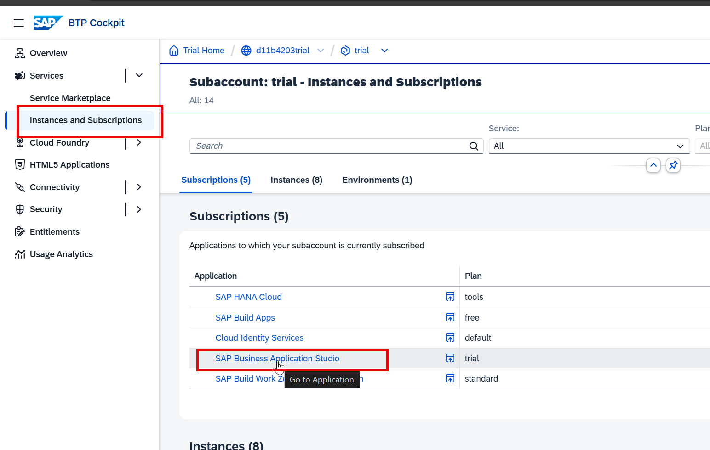

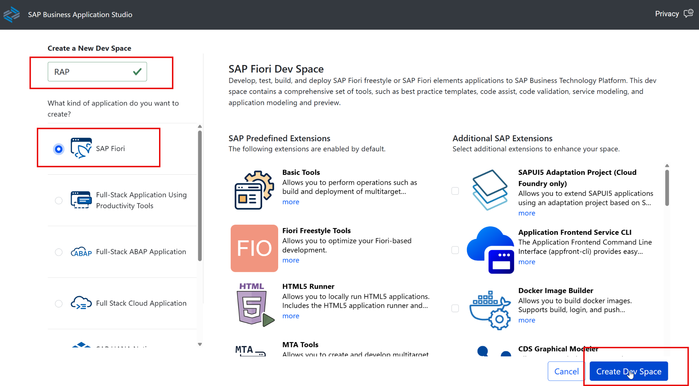


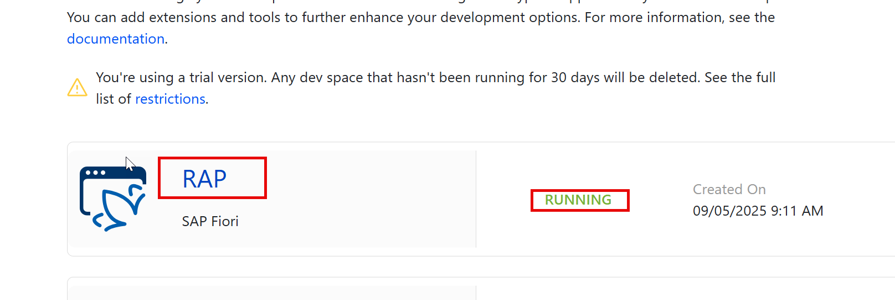

Open the terminal and run command

**📄 Terminal commands** - copy the block below exactly as it is:

```bash
cf login -a https://api.cf.us10-001.hana.ondemand.com --sso
```


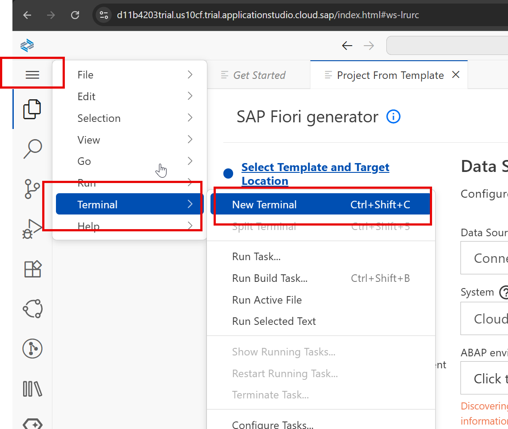


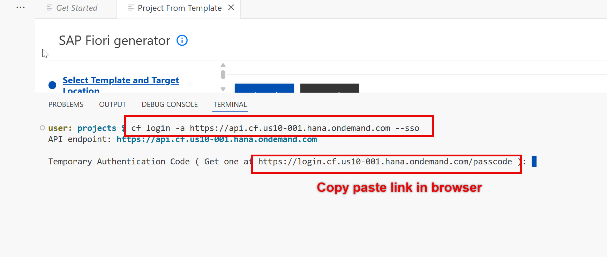

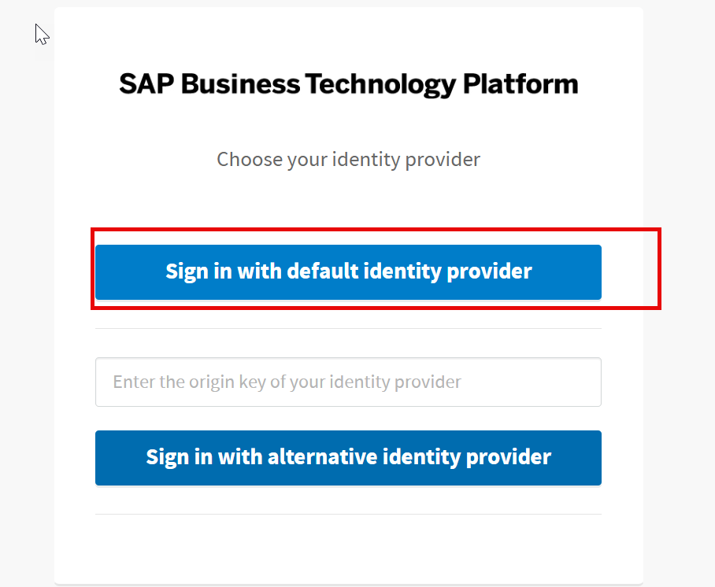

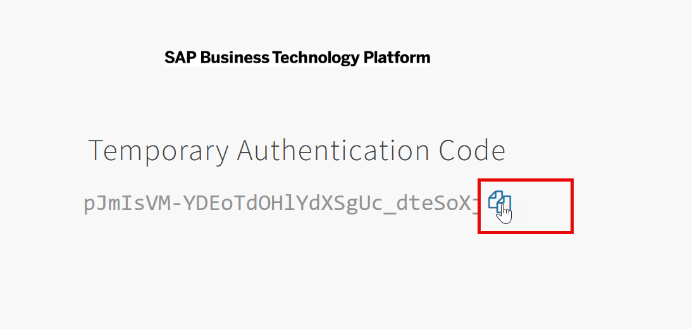

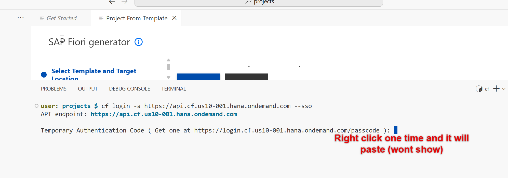


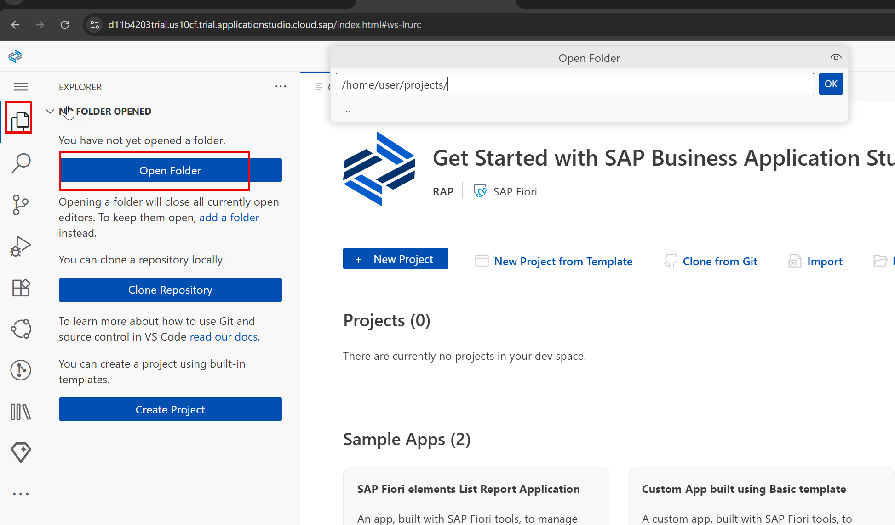

### Step 10. Choose project folder and click ok


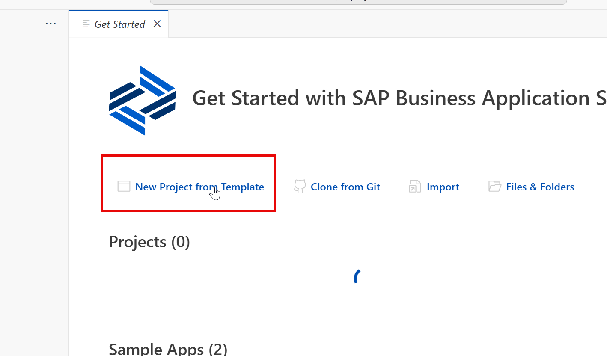


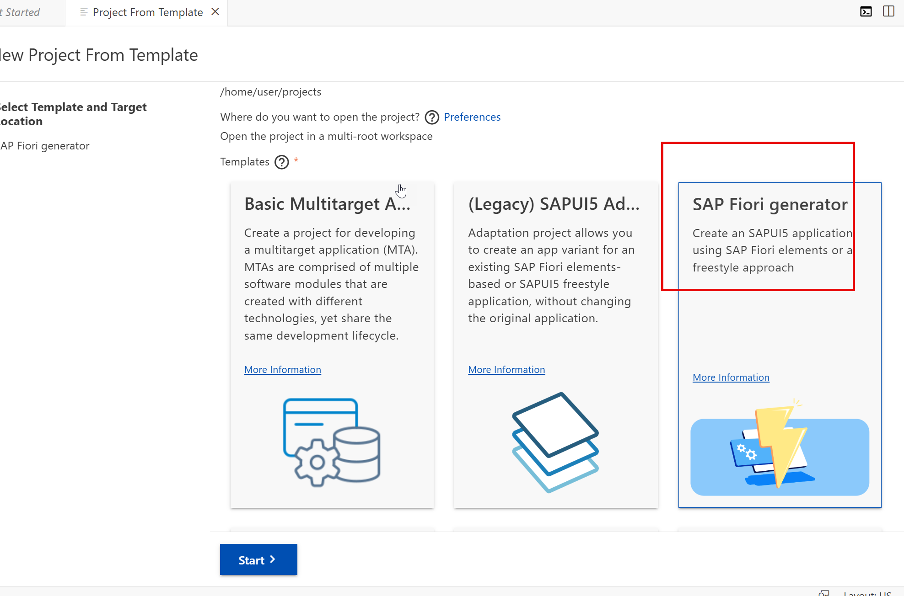

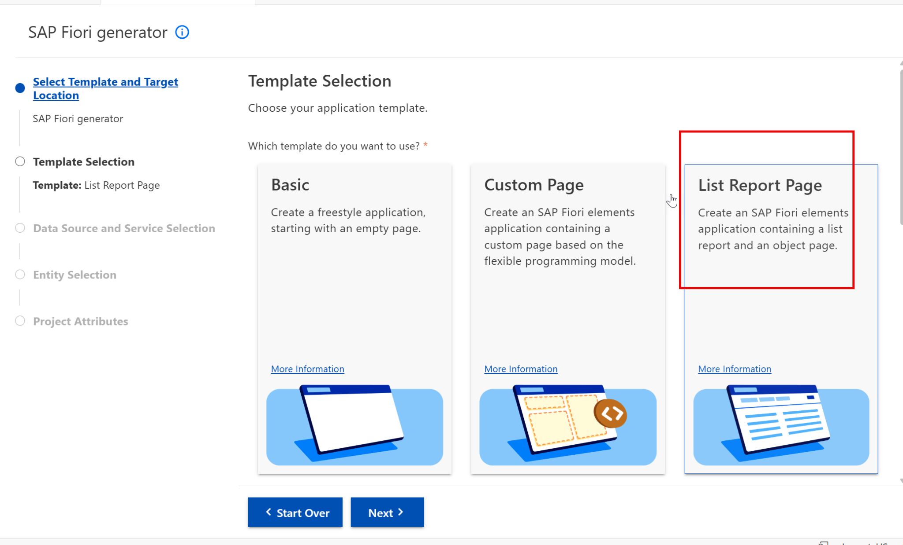

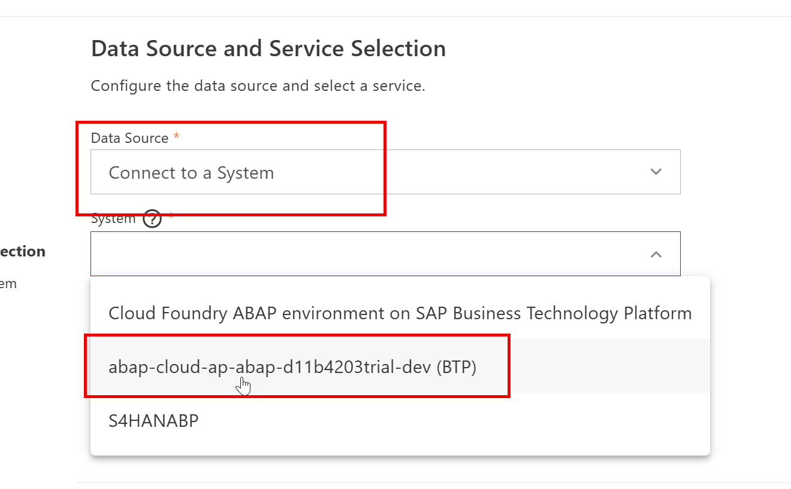

### Step 11. Choose the V4 service name taken from eclipse


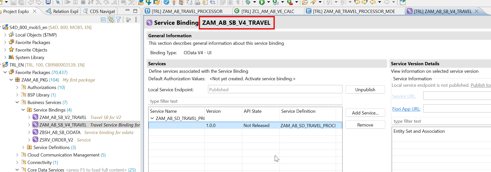

---

## 📦 Objects in your package after today

```text
$Z_AM_AB  (your package - replace _AB_ with your own initials)
  ├── ZAM_AB_U_CUSTOMER                   CDS entity
  ├── ZAM_AB_TRAVEL_PROCESSOR             CDS root entity
  ├── zcl_am_ab_ve_calc                   ABAP class
```

---

## ✅ Final version of all code from Day 12

Everything below is the **complete, unmodified** source from the training material, gathered in one place so you can copy it straight into Eclipse.

### 1. Precheck - _Behavior Definition (BDEF)_

```abap
managed implementation in class zbp_am_ab_travel unique;
//guideline to be followed which runs the BDEF in strict mode
strict@AbapCatalog.viewEnhancementCategory: [#NONE]
@AccessControl.authorizationCheck: #NOT_REQUIRED
@EndUserText.label: 'Customer Master data'
@Metadata.ignorePropagatedAnnotations: true
@ObjectModel.usageType:{
   serviceQuality: #X,
   sizeCategory: #S,
   dataClass: #MIXED
}
define view entity ZAM_AB_U_CUSTOMER as select from /dmo/customer
association[1] to I_Country as _Country
on $projection.CountryCode = _Country.Country
{
   key customer_id as CustomerId,
   first_name as FirstName,
   last_name as LastName,
   title as Title,
   concat(concat(title, concat(' ',first_name)),concat('', last_name)) as CustomerName,
   street as Street,
   postal_code as PostalCode,
   city as City,
   country_code as CountryCode,
   phone_number as PhoneNumber,
   email_address as EmailAddress,
   _Country
}EL alias Travel
//this is the table where RAP will insert our data
persistent table /dmo/travel_m
//control the enqueue and dequeue
lock master
//mandatory to use total etag
total etag LastChangedAt
//who can modify, create, update, delete our data using this BDEF
authorization master ( instance )
//concurrency control - automatic
etag master LastChangedAt
//a draft table where temp data will keep saving
draft table zam_ab_trav_d
//automatic management of travel id from sequence generator
early numbering
{
 //enabling RAP to generate code for us for create, update, delete
 create (precheck);
 update (precheck);
 delete;
 field ( readonly ) TravelId;
 field ( mandatory ) BeginDate, EndDate, AgencyId, CustomerId;
 association _Booking { create ( features: instance ) ; with draft; }
 //to fulfil the ego of RAP framework
 //adding the draft actions
 draft determine action Prepare;
 draft action Edit;
 draft action Resume;
 draft action Activate;
 draft action Discard;
 //Adding a instance based factory data action to copy my travel
 //itinerary based on exisiting travel
 factory action copyTravel [1];
 //its a piece of code which is intented to be only
 //consumed within our RAP BO
 internal action reCalcTotalPrice;
 //Define determination to execute the code when
 //booking fee or curr code changes so we calc total price
 determination calculateTotalPrice on modify
           { create; field BookingFee, CurrencyCode; }
  //create a new determine action
 determine action validationCustomer { validation validateHeaderData; }
 //Adding side-effect which inform RAP to reaload the total price if the booking
 //fee has been changed on the Frontend
 //Side effects
 side effects {
   field BookingFee affects field TotalPrice;
   field CurrencyCode affects field TotalPrice;
   determine action validationCustomer executed on field CustomerId affects messages;
 }
 //Checking custom business object rules
 validation validateHeaderData on save {create; field CustomerId, BeginDate, EndDate;}
 //Since we use alias name in MDE (fiori sends) table has _ we need mapping
 mapping for /dmo/travel_m{
   TravelId = travel_id;
   AgencyId = agency_id;
   CustomerId = customer_id;
   BeginDate = begin_date;
   EndDate = end_date;
   TotalPrice = total_price;
   BookingFee = booking_fee;
   CurrencyCode = currency_code;
   Description = description;
   OverallStatus = overall_status;
   CreatedBy = created_by;
   LastChangedBy = last_changed_by;
   CreatedAt = created_at;
   LastChangedAt = last_changed_at;
 }
}
define behavior for ZAM_AB_BOOKING alias Booking
persistent table /dmo/booking_m
//child entities depends on the lock of root entity
lock dependent by _Travel
//auth depedent on the root entity
authorization dependent by _Travel
//concurrency at booking
etag master LastChangedAt
//add booking draft table and use quick fix to create
draft table zam_ab_book_d
//automatic management of booking id from sequence generator
early numbering
{
 update;
 delete;
 field ( readonly ) TravelId, BookingId;
 association _Travel;
 association _BookingSuppl { create; with draft; }
 mapping for /dmo/booking_m{
   TravelId = travel_id;
   BookingId = booking_id;
   BookingDate = booking_date;
   CustomerId = customer_id;
   CarrierId = carrier_id;
   ConnectionId = connection_id;
   FlightDate = flight_date;
   FlightPrice = flight_price;
   CurrencyCode = currency_code;
   BookingStatus = booking_status;
   LastChangedAt = last_changed_at;
 }
}
define behavior for ZAM_AB_BOOKSUPPL alias BookingSuppl
persistent table /dmo/booksuppl_m
//child entities depends on the lock of root entity
lock dependent by _Travel
authorization dependent by _Travel
etag master LastChangedAt
draft table zam_ab_books_d
{
 update;
 delete;
 field ( readonly ) TravelId, BookingId;
 association _Travel;
 association _Booking;
 mapping for /dmo/booksuppl_m{
   TravelId = travel_id;
   BookingId = booking_id;
   BookingSupplementId = booking_supplement_id;
   SupplementId = supplement_id;
   Price = price;
   CurrencyCode = currency_code;
   LastChangedAt = last_changed_at;
 }
}
```

### 2. Definition - _Source code_

```abap
   types:t_entity_create type table for create zAM_AB_travel,
         t_entity_update TYPE table for update zAM_AB_travel,
         t_entity_rep type table for REPORTED zAM_AB_travel,
         t_entity_err type table for FAILED zAM_AB_travel.

   methods precheck_anubhav_reuse
       importing
           entities_u type t_entity_update optional
           entities_c type t_entity_create optional
        exporting
           reported type t_entity_rep
           failed type t_entity_err.
```

### 3. Implementation - _ABAP Method Implementation_

```abap
 METHOD precheck_create.
   precheck_anubhav_reuse(
     EXPORTING
*        entities_u =
        entities_c = entities
     IMPORTING
       reported   = reported-travel
       failed     = failed-travel
   ).
 ENDMETHOD.

 METHOD precheck_update.
   precheck_anubhav_reuse(
     EXPORTING
         entities_u = entities
*         entities_c =
     IMPORTING
       reported   = reported-travel
       failed     = failed-travel
   ).
 ENDMETHOD.

 METHOD precheck_anubhav_reuse.
   ""Step 1: Data declaration
   data: entities type t_entity_update,
          operation type if_abap_behv=>t_char01,
          agencies type sorted table of /dmo/agency WITH UNIQUE KEY agency_id,
          customers type sorted table of /dmo/customer WITH UNIQUE key customer_id.
   ""Step 2: Check either entity_c was passed or entity_u was passed
   ASSERT not ( entities_c is initial equiv entities_u is initial ).
   ""Step 3: Perform validation only if agency OR customer was changed
   if entities_c is not initial.
       entities = CORRESPONDING #( entities_c ).
       operation = if_abap_behv=>op-m-create.
   else.
       entities = CORRESPONDING #( entities_u ).
       operation = if_abap_behv=>op-m-update.
   ENDIF.
   delete entities where %control-AgencyId = if_abap_behv=>mk-off and %control-CustomerId = if_abap_behv=>mk-off.
   ""Step 4: get all the unique agencies and customers in a table
   agencies = CORRESPONDING #( entities discarding DUPLICATES MAPPING agency_id = AgencyId EXCEPT * ).
   customers = CORRESPONDING #( entities discarding DUPLICATES MAPPING customer_id = CustomerId EXCEPT * ).
   ""Step 5: Select the agency and customer data from DB tables
   select from /dmo/agency fields agency_id, country_code
   for all ENTRIES IN @agencies where agency_id = @agencies-agency_id
   into table @data(agency_country_codes).
   select from /dmo/customer fields customer_id, country_code
   for all ENTRIES IN @customers where customer_id = @customers-customer_id
   into table @data(customer_country_codes).
   ""Step 6: Loop at incoming entities and compare each agency and customer country
   loop at entities into data(entity).
       read table agency_country_codes with key agency_id = entity-AgencyId into data(ls_agency).
       CHECK sy-subrc = 0.
       read table customer_country_codes with key customer_id = entity-CustomerId into data(ls_customer).
       CHECK sy-subrc = 0.
       if ls_agency-country_code <> ls_customer-country_code.
           ""Step 7: if country doesnt match, throw the error
           append value #(    %cid = cond #( when operation = if_abap_behv=>op-m-create then entity-%cid_ref )
                                     %is_draft = entity-%is_draft
                                     %fail-cause = if_abap_behv=>cause-conflict
             ) to failed.
           append value #(    %cid = cond #( when operation = if_abap_behv=>op-m-create then entity-%cid_ref )
                                     %is_draft = entity-%is_draft
                                     %msg = new /dmo/cm_flight_messages(
                                                                                             textid                = value #(
                                                                                                                                    msgid = 'SY'
                                                                                                                                    msgno = 499
                                                                                                                                    attr1 = 'The country codes for agency and customer not matching'
                                                                                                                                 )
                                                                                             agency_id             = entity-AgencyId
                                                                                             customer_id           = entity-CustomerId
                                                                                             severity  = if_abap_behv_message=>severity-error
                                                                                           )
                                     %element-agencyid = if_abap_behv=>mk-on
             ) to reported.
       ENDIF.
   ENDLOOP.
 ENDMETHOD.
```

### 4. Augment Feature - _Behavior Definition - projection (BDEF)_

```abap
projection;
strict ( 2 );
use draft;
define behavior for ZAM_AB_TRAVEL_PROCESSOR alias Travel
//create a new class for processor implementation
implementation in class zbp_AM_AB_travel_proc unique
{
 use create ( augment );
 use update;
 use delete;
 use action Prepare;
 use action Edit;
 use action Resume;
 use action Activate;
 use action Discard;
 use action copyTravel;
 use association _Booking { create; with draft; }
}
define behavior for ZAM_AB_BOOKING_PROCESSOR alias Booking
{
 use update;
 use delete;
 use association _Travel;
 use association _BookingSuppl { create; with draft;}
}
define behavior for ZAM_AB_BOOKSUPPL_PROCESSOR alias BookSuppl
{
 use update;
 use delete;
 use association _Travel;
 use association _Booking;
}
```

### 5. Augment Feature - _Behavior Implementation (local handler class)_

```abap
CLASS lhc_Travel DEFINITION INHERITING FROM cl_abap_behavior_handler.
 PRIVATE SECTION.
   METHODS augment_create FOR MODIFY
     IMPORTING entities FOR CREATE Travel.
ENDCLASS.
CLASS lhc_Travel IMPLEMENTATION.
 METHOD augment_create.
    data: travel_create type table for create zAM_AB_travel.
    travel_create = CORRESPONDING #( entities ).
    loop at travel_create assigning field-symbol(<travel>).
       <travel>-AgencyId = '70003'.
       <travel>-OverallStatus = 'O'.
       <travel>-%control-AgencyId = if_abap_behv=>mk-on.
       <travel>-%control-OverallStatus = if_abap_behv=>mk-on.
    ENDLOOP.
    MODIFY augmenting entities of zAM_AB_travel
    entity travel
    create from travel_create.
 ENDMETHOD.
ENDCLASS.
```

### 6. Processor CDS entity - _CDS Projection View_

```cds
@AccessControl.authorizationCheck: #NOT_REQUIRED
@EndUserText.label: 'Projection for travel entity'
@Metadata.ignorePropagatedAnnotations: false
@Metadata.allowExtensions: true
define root view entity ZAM_AB_TRAVEL_PROCESSOR as projection on ZAM_AB_TRAVEL
{
   key TravelId,
   AgencyId,
   CustomerId,
   BeginDate,
   EndDate,
   BookingFee,
   TotalPrice,
   CurrencyCode,
   Description,
   OverallStatus,
   CreatedBy,
   CreatedAt,
   LastChangedBy,
   LastChangedAt,
   AgencyName,
   CustomerName,
   OverallStatusText,
   IconColor,
   @ObjectModel.virtualElementCalculatedBy: 'ABAP:ZCL_AM_AB_VE_CALC'
   @EndUserText.label: 'CO2 Tax'
   virtual CO2Tax : abap.int4,
   @ObjectModel.virtualElementCalculatedBy: 'ABAP:ZCL_AM_AB_VE_CALC'
   @EndUserText.label: 'Week Day'
   virtual dayOfTheFlight : abap.char( 9 ),
   /* Associations */
   _Agency,
   _Booking: redirected to composition child ZAM_AB_BOOKING_PROCESSOR,
   _Currency,
   _Customer,
   _OverallStatus
}
```

### 7. A Class to implement code - _ABAP Class_

```abap
CLASS zcl_am_ab_ve_calc DEFINITION
 PUBLIC
 FINAL
 CREATE PUBLIC .
 PUBLIC SECTION.
   INTERFACES if_sadl_exit .
   INTERFACES if_sadl_exit_calc_element_read .
 PROTECTED SECTION.
 PRIVATE SECTION.
ENDCLASS.
CLASS zcl_am_ab_ve_calc IMPLEMENTATION.
 METHOD if_sadl_exit_calc_element_read~calculate.
   check not it_original_data is initial.
   data: lt_calc_data type standard table of zAM_AB_travel_processor with DEFAULT KEY,
         lv_rate type p DECIMALS 2 VALUE '0.025'.
    lt_calc_data = CORRESPONDING #( it_original_data ).
    loop at lt_calc_data ASSIGNING FIELD-SYMBOL(<fs_calc>).
       <fs_calc>-CO2Tax = <fs_calc>-TotalPrice * lv_rate.
       ""here you can call a BAPI and calculate some values and send those in VE
       <fs_calc>-dayOfTheFlight = 'Sunday'.
    ENDLOOP.
    ct_calculated_data = CORRESPONDING #(  lt_calc_data ).
 ENDMETHOD.
 METHOD if_sadl_exit_calc_element_read~get_calculation_info.
 ENDMETHOD.
ENDCLASS.
```

### 8. Change in MDE to show 2 new columns - _Metadata Extension (MDE)_

```cds
@Metadata.layer: #CUSTOMER
@UI.headerInfo:{
   typeName: 'Travel',
   typeNamePlural: 'Travel Requests'  ,
   title: { value: 'TravelId' },
   description: { value: 'Description' } 
}
annotate entity ZAM_AB_TRAVEL_PROCESSOR
   with
{
   --Second screen ( applies only and only on Object Page )
   @UI.facet: [
       {
           purpose: #STANDARD,
           type: #COLLECTION,
           id: 'spiderman',
           label: 'General Information',
           position: 10
       },
       {
           id: 'TravelBasic',
           purpose: #STANDARD,
           type: #IDENTIFICATION_REFERENCE,
           parentId: 'spiderman',
           position: 10,
           label: 'More Info'
       },
       {
           id: 'TravelDates',
           type: #FIELDGROUP_REFERENCE,
           purpose: #STANDARD,
           parentId: 'spiderman',
           label: 'Dates',
           position: 30,
           targetQualifier: 'superman'       
       },
       {
           id: 'Pricing',
           type: #FIELDGROUP_REFERENCE,
           purpose: #STANDARD,
           parentId: 'spiderman',
           label: 'Pricing',
           position: 20,
           targetQualifier: 'wonderwomen'       
       },
       {
           id: 'TotalPrice',
           purpose: #HEADER,
           type: #DATAPOINT_REFERENCE,
           position: 10,
           targetQualifier: 'MyTravelCost'
       },
       {
           id: 'TravelStatus',
           purpose: #HEADER,
           type: #DATAPOINT_REFERENCE,
           position: 20,
           targetQualifier: 'MyTravelStatus'
       },
       {
           id: 'bookingDetails',
           label: 'Bookings',
           purpose: #STANDARD,
           type: #LINEITEM_REFERENCE,
           targetElement: '_Booking',
           position: 20
       }
   ]
   @UI.selectionField: [{ position: 10 }]
   @UI.lineItem: [{ position: 10 },
                  { type: #FOR_ACTION, dataAction: 'copyTravel', label: 'Copy kardo' }]
   @UI.identification: [{ position: 10 }]
   TravelId;
   @UI.selectionField: [{ position: 20 }]
   @UI.lineItem: [{ position: 20 }]
   @UI.identification: [{ position: 20 }]   
   AgencyId;
   @UI.selectionField: [{ position: 30 }]
   @UI.lineItem: [{ position: 30, importance: #HIGH }]
   @UI.identification: [{ position: 30 }]
   CustomerId;
   @UI.selectionField: [{ position: 40 }]
   @UI.lineItem: [{ position: 40 }]
   @UI.fieldGroup: [{ position: 10, qualifier: 'superman' }]
   BeginDate;
   @UI.fieldGroup: [{ position: 20, qualifier: 'superman' }]
   EndDate;
   @UI.fieldGroup: [{ position: 20, qualifier: 'wonderwomen' }]
   BookingFee;
   @UI.lineItem: [{ position: 50 }]
   @UI.fieldGroup: [{ position: 10, qualifier: 'wonderwomen' }]
   @UI.dataPoint: { qualifier: 'MyTravelCost', title: 'Overall Cost' }
   TotalPrice;
   @UI.fieldGroup: [{ position: 30, qualifier: 'wonderwomen' }]
   CurrencyCode;
   @UI.identification: [{ position: 40 }]
   Description;
   @UI.lineItem: [{ position: 60, criticality: 'IconColor' }]
   @UI.fieldGroup: [{ position: 11, qualifier: 'wonderwomen' }]
   @UI.dataPoint: { qualifier: 'MyTravelStatus', title: 'Overall Status' }
   OverallStatus;
   @UI.lineItem: [{ position: 70, importance: #HIGH }]
   CO2Tax;
   @UI.lineItem: [{ position: 80, importance: #HIGH }]
   dayOfTheFlight;
//    CreatedBy;
//    CreatedAt;
//    LastChangedBy;
//    LastChangedAt;
  
}
```

### 9. Create Dev space in BAS tool - _Terminal commands_

```bash
cf login -a https://api.cf.us10-001.hana.ondemand.com --sso
```

---

## ⚠️ Traps and tips

- Augment is a projection-only feature. Trying to use it in the interface BDEF will not activate.
- Note your API endpoint from the BTP cockpit *Overview* page - the region part (`us10-001`) differs per trial account.

---

[⬅️ Day 11](Day11_OData_V4_Draft_And_Authorisation.md) | [🏠 Summary](00_SUMMARY.md) | [📋 Master Cheat Sheet](00_MASTER_CHEAT_SHEET.md) | [Day 13 ➡️](Day13_Fiori_App_In_BAS_CIS_And_Work_Zone.md)
