# Day 14 - Deploying the App and Publishing It to the Launchpad

> **HTML5 repository deployment with managed approuter, then catalogs, groups, roles and Git**

> Phase E - Fiori & Deployment (Days 12-15) - Build the Fiori app in BAS, deploy it, publish it, and transport it.

**🎯 Goal of the day.** Get your app out of BAS and onto a real launchpad tile that a business user can click.

---

## 📋 Cheat Sheet - keep this open

### Today's quick reference

| Thing | Value / Syntax |
|---|---|
| **Add deploy config** | Ctrl+Shift+P > **Fiori: Add Deployment Configuration** |
| `Build` | `mbt build` |
| `Deploy` | `cf deploy mta_archives/<file>.mtar` |
| **Managed approuter** | choose it during Add Deployment Configuration - no separate approuter app needed |
| **Work Zone order** | Channel Manager scan -> Content Explorer -> Catalog -> Group -> Role -> assign to Site |
| **Git basics** | `cd <project>` / `git init` / `git add .` / `git commit -m "my first stable version"` |
| `Test` | site URL in an incognito window, logged in as the business user |

### Eclipse / ADT keys you will use constantly

| Key | Action |
|---|---|
| `Ctrl+Shift+A` | Search any object in the whole system |
| `Ctrl+F3` | Activate the current object |
| `Ctrl+1` | Quick fix - RAP generates code skeletons for you |
| `Ctrl+Space` | Code completion |
| `Ctrl+Click` | Navigate to the object under the cursor |
| `Ctrl+7` | Comment / uncomment a block |
| `F2` | Show a method signature |
| `F8` | Data preview (table / CDS entity) |
| `F9` | Run the class |

### The RAP layer cake (memorise this)

```text
Database tables            <- where the data really sits
   |
Interface CDS entity       <- stable, reusable model       (ZAM_AB_TRAVEL)
   |
Behavior Definition        <- the rulebook                 (.bdef)
   |
Projection CDS entity      <- one app's view of the model  (ZAM_AB_TRAVEL_PROCESSOR)
   |
Projection BDEF            <- which rules this app may use
   |
Metadata Extension (MDE)   <- the screen layout, @UI.*
   |
Service Definition         <- which entities are allowed out
   |
Service Binding            <- the actual OData V2 / V4 URL
   |
Fiori Elements app         <- built from the annotations, no JavaScript needed
```

---

## 🧱 What you will build today

- **Deployment configuration** (`xs-app.json`, `mta.yaml`) with **XSUAA**, **HTML5 repo** and **destination**.
- A build and deploy to the **HTML5 Application Repository** via the **managed approuter**.
- **Channel Manager** scan so Work Zone finds the app.
- A **catalog**, a **group** and a **role**, all assigned to your site.
- A **Git** repository for your Fiori code.

## 🧠 Concepts first, in plain English

Read this before touching the keyboard. Every idea is explained the way you would explain it to a school student.

**Why deploy at all?**

In BAS your app runs on *your* laptop's session. Deploying puts the files on SAP's servers so anyone with the URL and a role can use them.

**HTML5 Application Repository**

A file store for UI5 apps in BTP. Deployment uploads your built app there; the launchpad serves it from there.

**Approuter**

The traffic policeman. Requests hit the approuter first; it authenticates the user, then forwards data calls to your ABAP system through a **destination**. **Managed** approuter = Work Zone runs it for you, so you do not maintain a Node.js app.

**XSUAA**

The BTP authentication service. It issues the token that proves who the user is.

**Destination**

A named connection to a backend, with the URL and credentials stored safely in BTP - never in your code.

**`mta.yaml`**

*Multi-Target Application* descriptor. One file listing every piece your app needs (UI, uaa, destination) so `mbt build` can package them into one `.mtar` and deploy them together.

**Catalog / Group / Role**

Catalog = the shelf of available apps. Group = how tiles are arranged on screen. Role = who is allowed to see them. All three are needed.

**Channel Manager**

The Work Zone tool that scans the HTML5 repository for newly deployed apps. New app not showing up? Re-scan here first.

**Git**

A time machine for your code. `git init`, `git add .`, `git commit` snapshots the project so you can share it and roll back safely.

---

## 🛠️ Hands-on, step by step

### Step 1. Package and deploy our app to HTML5 Repository (uaa, html5–repo, destination) - Managed App Router


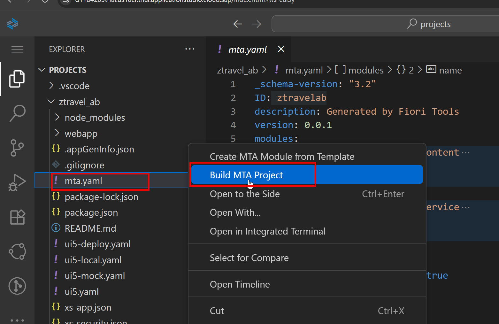


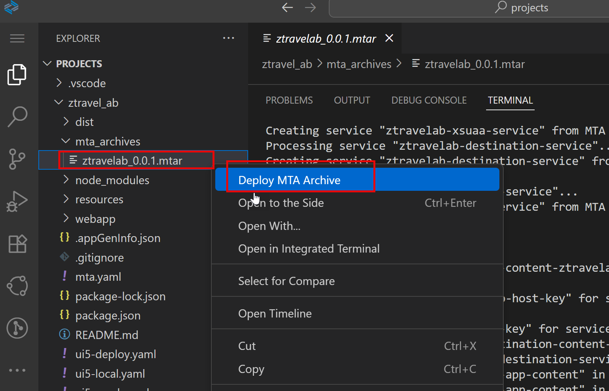

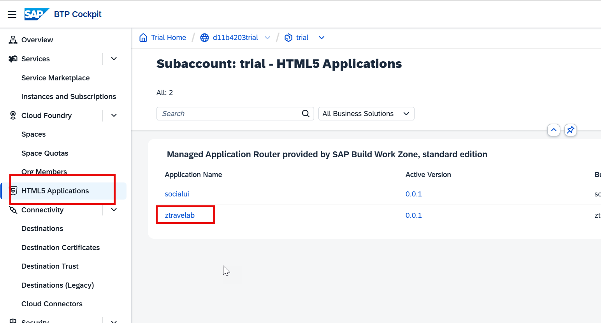

Integration with Build Workzone

### Step 2. Launch SAP Build workzone as Admin


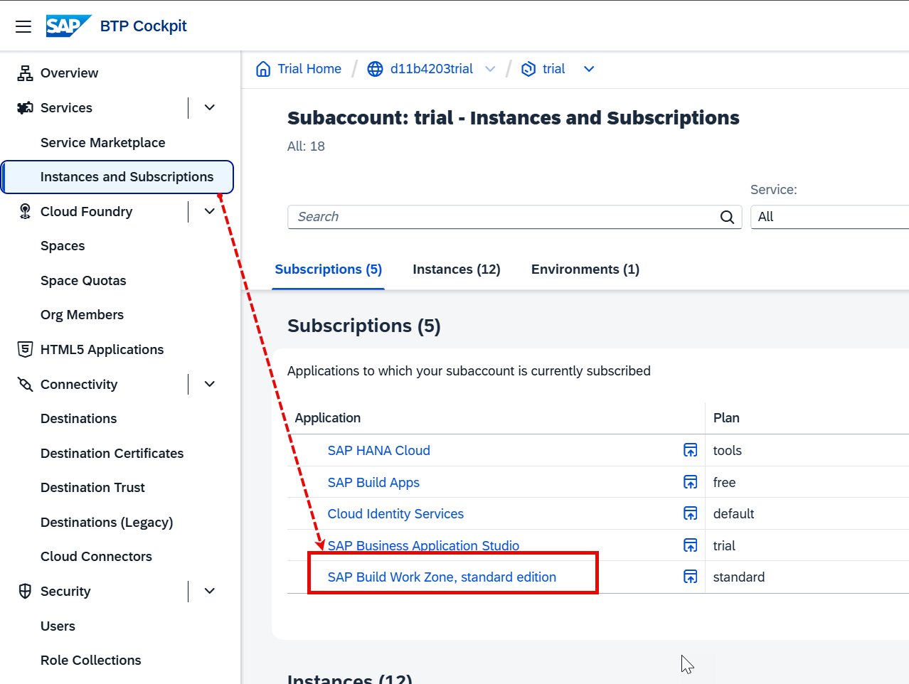

### Step 3. Open Channel manager to allow Build WZ to Scan repository for all new apps


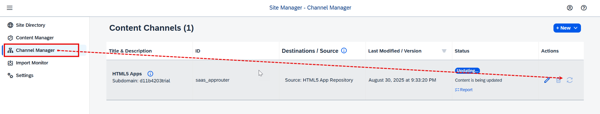

### Step 4. Now we will bring newly loaded apps to Build workzone


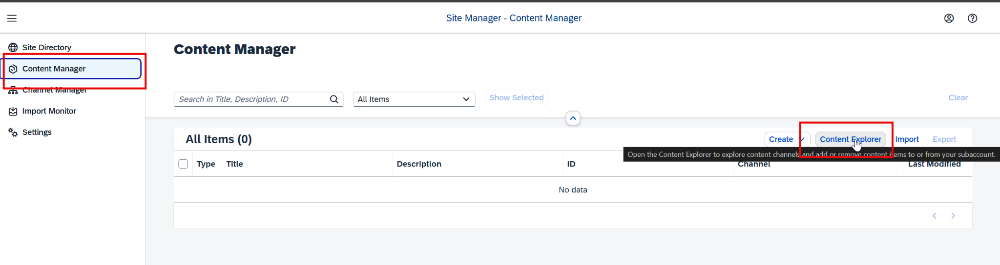


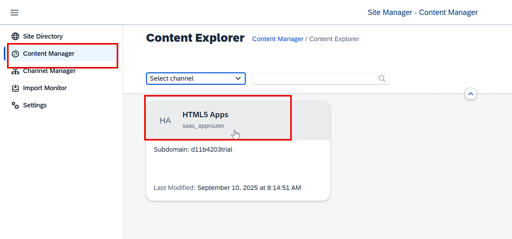

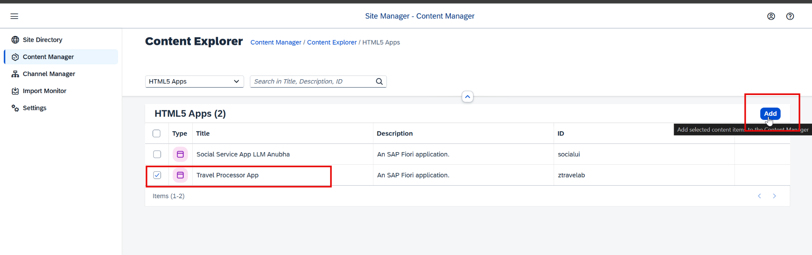

### Step 5. Next we will create catalog and Assign app to the same


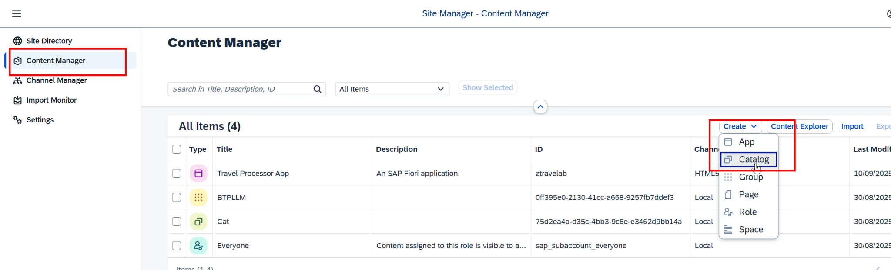


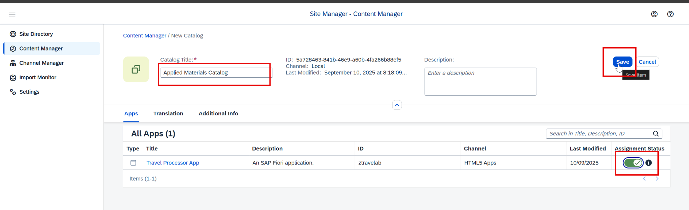

### Step 6. Create Group and Assign app to the same


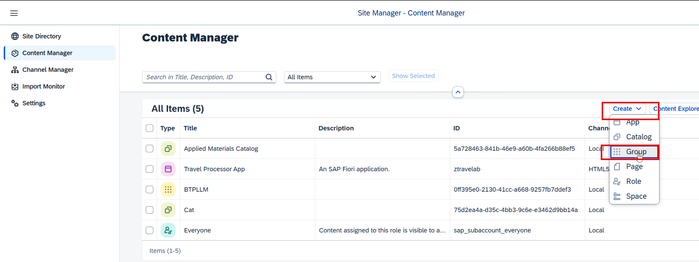

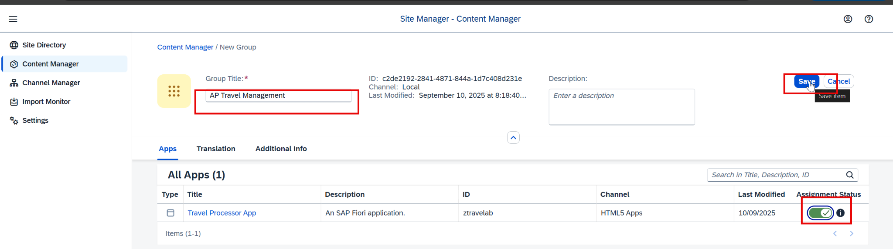

### Step 7. Create Role and Assign app to the same


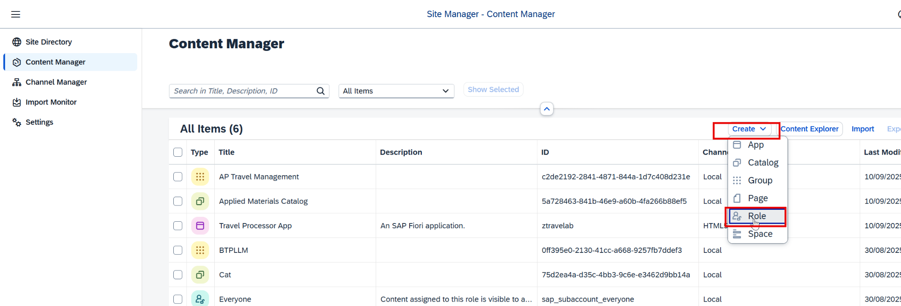

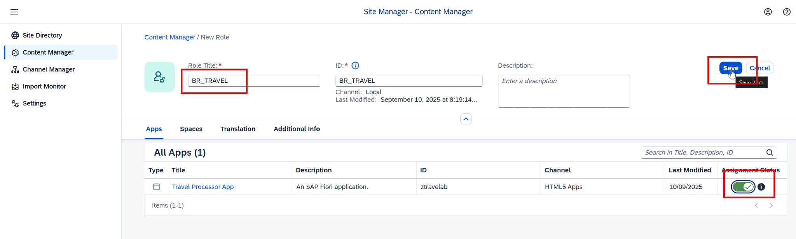

### Step 8. Assign the role to our site


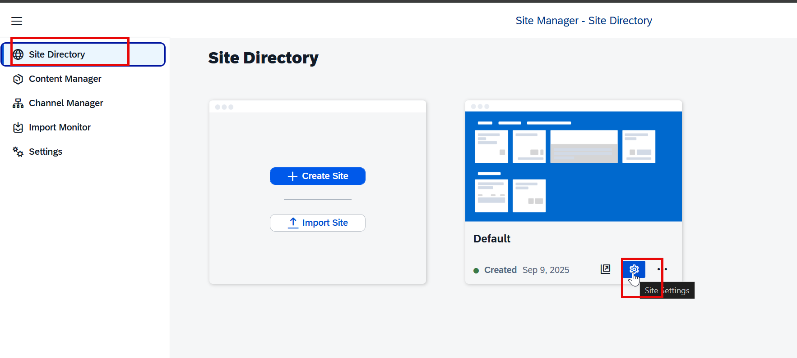

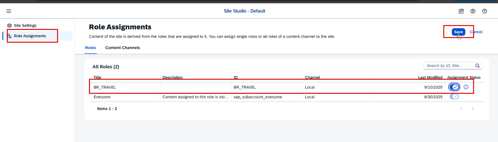

### Step 9. Testing


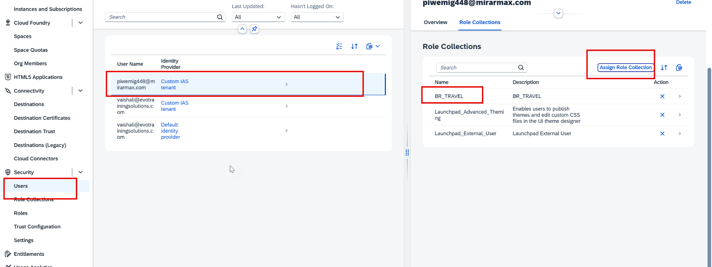

### Step 10. Get the site URL and launch in incognito window and login as business user


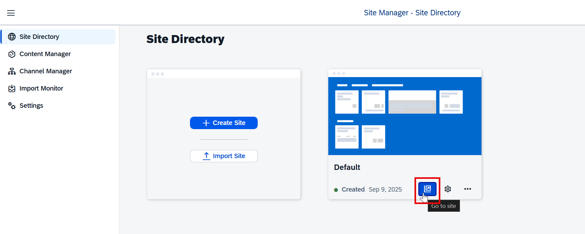

How to share my fiori code with fellow developers

### Step 11. Local version management

**📄 Terminal commands** - copy the block below exactly as it is:

```bash
cd <Your project Name>
git init
git add .
git commit -m “my first stable version”
```

You can check the commit branch, make some changes and compare the code.

---

---

## ✅ Final version of all code from Day 14

Everything below is the **complete, unmodified** source from the training material, gathered in one place so you can copy it straight into Eclipse.

### 1. Local version management - _Terminal commands_

```bash
cd <Your project Name>
git init
git add .
git commit -m “my first stable version”
```

---

## ⚠️ Traps and tips

- If the tile is missing: scan in Channel Manager, then check the app is in a catalog **and** a group **and** the role is assigned to the site. It is almost always the role.
- Commit **before** you add deployment configuration. If the generator makes a mess you can `git checkout .` and start over.

---

[⬅️ Day 13](Day13_Fiori_App_In_BAS_CIS_And_Work_Zone.md) | [🏠 Summary](00_SUMMARY.md) | [📋 Master Cheat Sheet](00_MASTER_CHEAT_SHEET.md) | [Day 15 ➡️](Day15_CICD_And_Transport_Management.md)
