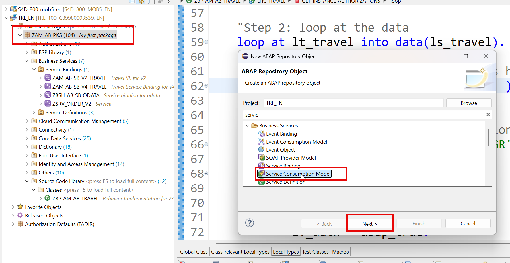
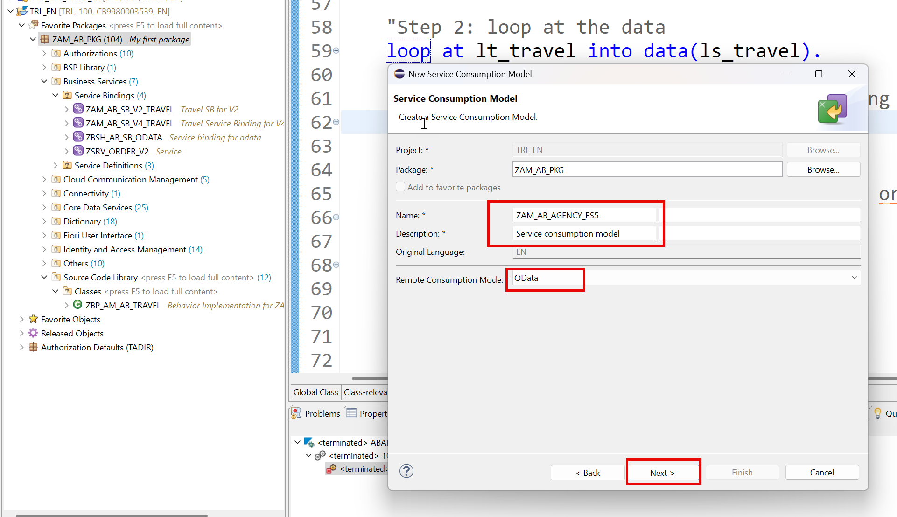
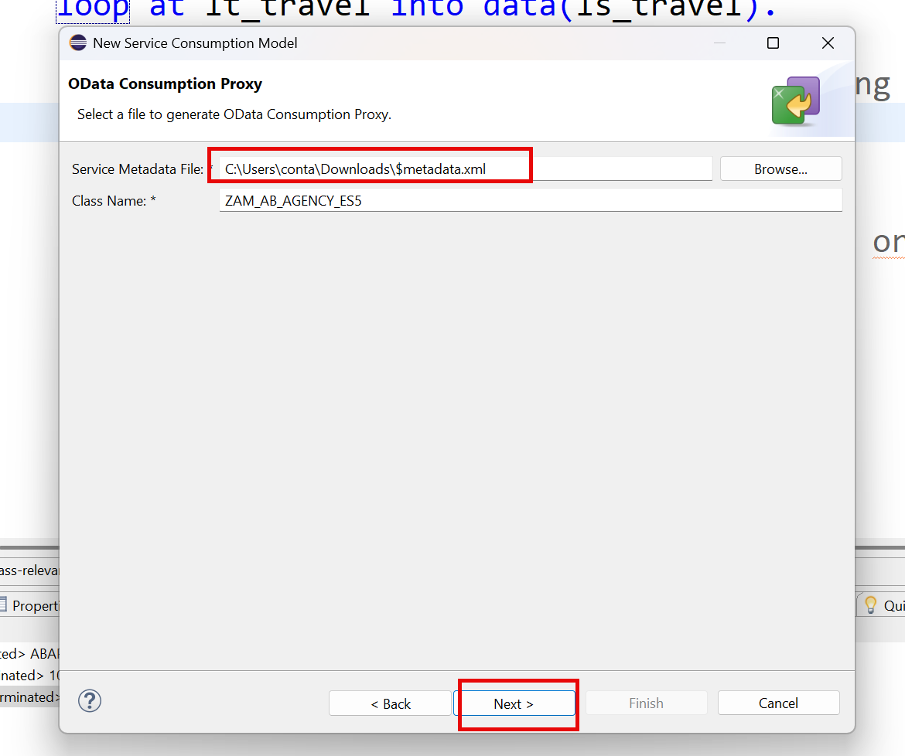
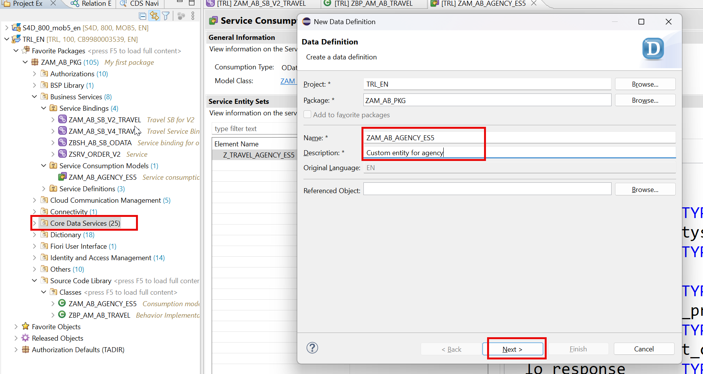
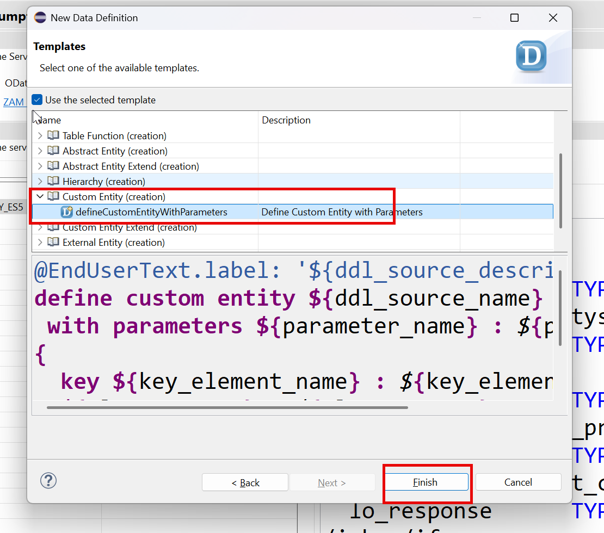
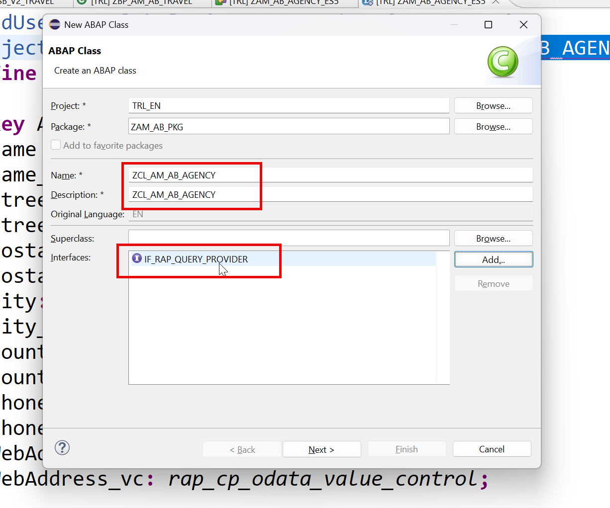
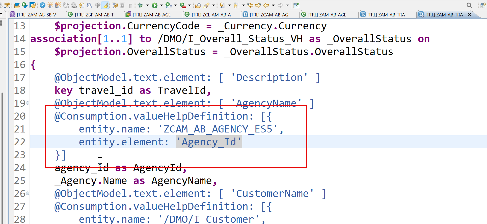
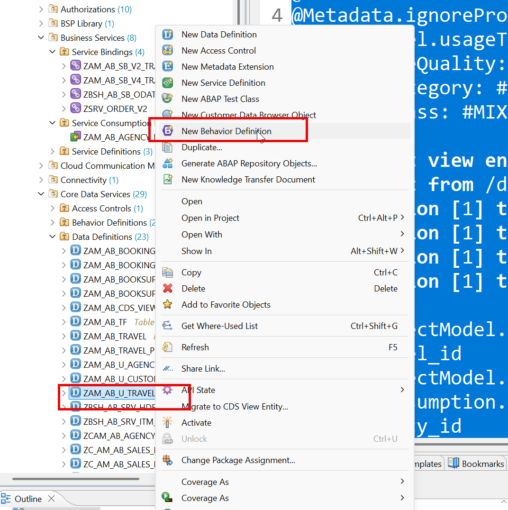
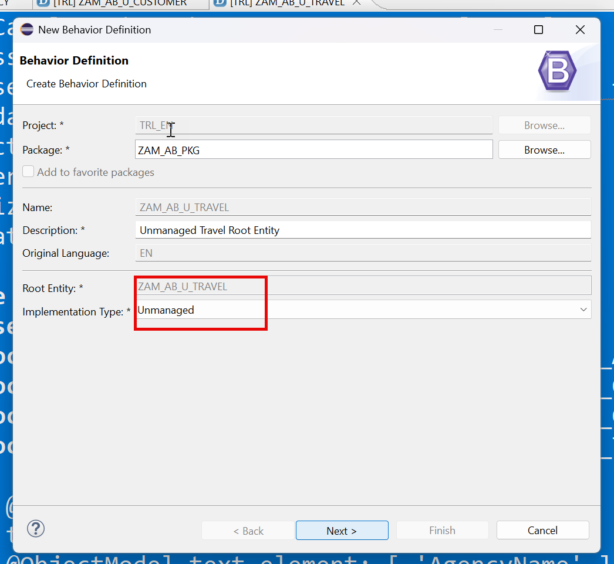
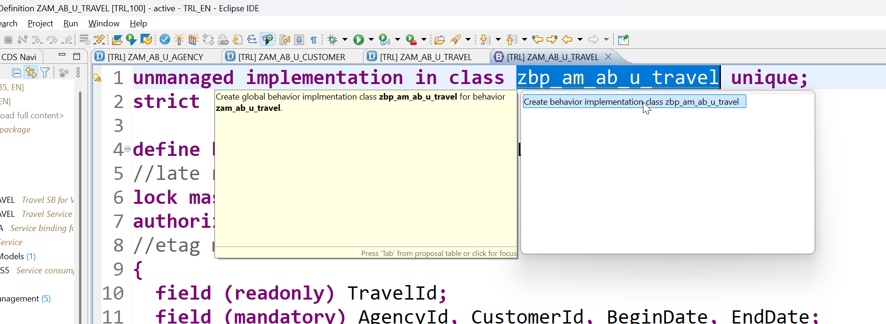

# Day 16 - Custom Entities and Unmanaged RAP

> **Reading data from an external OData service, and taking full control with unmanaged RAP**

> Phase F - Advanced RAP (Days 16-19) - Unmanaged RAP, external services, approver flow, attachments, clean core.

**🎯 Goal of the day.** Show data that does not live in your database, then write the save logic yourself.

---

## 📋 Cheat Sheet - keep this open

### Today's quick reference

| Thing | Value / Syntax |
|---|---|
| **ES5 metadata** | https://sapes5.sapdevcenter.com/sap/opu/odata/sap/ZAGENCYCDS_SRV/$metadata |
| **Save it** | Ctrl+S as `$metadata.xml`, then create a **Service Consumption Model** in ADT |
| **Custom entity** | `@ObjectModel.query.implementedBy: 'ABAP:ZCL_AM_AB_AGENCY'` + `define custom entity ...` |
| **Query class** | `INTERFACES if_rap_query_provider` -> `METHOD if_rap_query_provider~select` |
| **HTTP client** | `cl_http_destination_provider=>create_by_url( )` then `cl_web_http_client_manager=>create_by_http_destination( )` |
| `Proxy` | `/iwbep/cl_cp_factory_remote=>create_v2_remote_proxy( )` |
| **Value help** | `@Consumption.valueHelpDefinition: [{ entity: { name: 'ZCAM_AB_AGENCY_ES5', element: 'Agency_Id' } }]` |
| **Unmanaged BDEF** | `unmanaged implementation in class zbp_am_ab_u_travel unique;` |

### Eclipse / ADT keys you will use constantly

| Key | Action |
|---|---|
| `Ctrl+Shift+A` | Search any object in the whole system |
| `Ctrl+F3` | Activate the current object |
| `Ctrl+1` | Quick fix - RAP generates code skeletons for you |
| `Ctrl+Space` | Code completion |
| `Ctrl+Click` | Navigate to the object under the cursor |
| `Ctrl+7` | Comment / uncomment a block |
| `F2` | Show a method signature |
| `F8` | Data preview (table / CDS entity) |
| `F9` | Run the class |

### The RAP layer cake (memorise this)

```text
Database tables            <- where the data really sits
   |
Interface CDS entity       <- stable, reusable model       (ZAM_AB_TRAVEL)
   |
Behavior Definition        <- the rulebook                 (.bdef)
   |
Projection CDS entity      <- one app's view of the model  (ZAM_AB_TRAVEL_PROCESSOR)
   |
Projection BDEF            <- which rules this app may use
   |
Metadata Extension (MDE)   <- the screen layout, @UI.*
   |
Service Definition         <- which entities are allowed out
   |
Service Binding            <- the actual OData V2 / V4 URL
   |
Fiori Elements app         <- built from the annotations, no JavaScript needed
```

---

## 🧱 What you will build today

- A downloaded `$metadata.xml` and a generated **service consumption model**.
- A **custom entity** `ZCAM_AB_AGENCY_ES5` with no database table behind it.
- The class `zcl_am_ab_agency` implementing **`if_rap_query_provider`** to fetch remote data.
- The custom entity wired in as a **value help** for the Agency field.
- The start of an **unmanaged** RAP scenario: `ZAM_AB_U_TRAVEL`, `ZAM_AB_U_AGENCY`, `ZAM_AB_U_CUSTOMER` and their BDEF.

## 🧠 Concepts first, in plain English

Read this before touching the keyboard. Every idea is explained the way you would explain it to a school student.

**Custom entity**

A CDS entity with a shape but no storage. You declare the columns; an ABAP class supplies the rows at runtime. Perfect for data that lives in another system.

**`if_rap_query_provider`**

One method, `select`. RAP hands you the request (paging, filters, sort order, requested fields) and you hand back a table. You are the database.

**Paging (`top` / `skip`)**

The UI only asks for 30 rows at a time. `get_page_size()` and `get_offset()` tell you which 30. Honour them or you will fetch a million rows for nothing.

**Service consumption model**

Point ADT at a `$metadata.xml` and it generates strongly-typed ABAP proxy classes. No manual HTTP parsing, no XML fiddling.

**`_vc` value-control fields**

`rap_cp_odata_value_control` marks whether a remote field was actually sent. In OData, 'empty' and 'not supplied' are different things and this field records which.

**managed vs unmanaged**

**Managed**: RAP writes the database statements. **Unmanaged**: you write them - `create`, `update`, `delete`, `read`, `lock`, `save`, all by hand. Unmanaged exists for legacy code you cannot rewrite.

**When to use unmanaged**

Almost never for a new app. You use it when the data is already saved by an old function module that you must keep calling.

---

## 🛠️ Hands-on, step by step

Work with custom entities to replace standard agencies from external service

🔗 <https://sapes5.sapdevcenter.com/sap/opu/odata/sap/ZAGENCYCDS_SRV/$metadata>

Ctrl+S Save the metadata

### Step 1. Download metadata in your system as $metadata.xml









### Step 2. Create custom entity - ZCAM_AB_AGENCY_ES5







**📄 CDS Custom Entity** - copy the block below exactly as it is:

```cds
@EndUserText.label: 'Custom entity for agency'
@ObjectModel.query.implementedBy: 'ABAP:ZCL_AM_AB_AGENCY'
define custom entity ZCAM_AB_AGENCY_ES5
{
key Agency_Id : abap.char( 6 );
Name : abap.char( 31 );
Name_vc : rap_cp_odata_value_control;
Street: abap.char( 30 );
Street_vc: rap_cp_odata_value_control;
PostalCode: abap.char( 10 );
PostalCode_vc: rap_cp_odata_value_control;
City: abap.char( 25 );
City_vc: rap_cp_odata_value_control;
Country: abap.char( 3 );
Country_vc: rap_cp_odata_value_control;
PhoneNumber: abap.char( 30 );
PhoneNumber_vc: rap_cp_odata_value_control;
WebAddress: abap.char( 255 );
WebAddress_vc: rap_cp_odata_value_control;
}
```

<details>
<summary>💡 What the important lines mean (click to open)</summary>

| Line / keyword | What it does |
|---|---|
| `@EndUserText.label` | The human-readable description shown in tools and on screen. |
| `define custom entity` | A CDS entity with **no** table behind it - an ABAP class supplies the rows at runtime. |
| `@ObjectModel.query.implementedBy` | Names the class that supplies rows for a custom entity - the class replaces the database. |

</details>

### Step 3. Create a class which has the code to bring the data from external system




**📄 ABAP Class** - copy the block below exactly as it is:

```abap
CLASS zcl_am_ab_agency DEFINITION
 PUBLIC
 FINAL
 CREATE PUBLIC .
 PUBLIC SECTION.
   INTERFACES if_rap_query_provider .
 PROTECTED SECTION.
 PRIVATE SECTION.
ENDCLASS.
CLASS zcl_am_ab_agency IMPLEMENTATION.
 METHOD if_rap_query_provider~select.
 DATA:
     lt_business_data TYPE TABLE OF zam_ab_agency_es5=>tys_z_travel_agency_es_5_type,
     lo_http_client   TYPE REF TO if_web_http_client,
     lo_client_proxy  TYPE REF TO /iwbep/if_cp_client_proxy,
     lo_request       TYPE REF TO /iwbep/if_cp_request_read_list,
     lo_response      TYPE REF TO /iwbep/if_cp_response_read_lst.
       DATA(top)     = io_request->get_paging( )->get_page_size( ).
       DATA(skip)    = io_request->get_paging( )->get_offset( ).
       DATA(requested_fields)  = io_request->get_requested_elements( ).
       DATA(sort_order)    = io_request->get_sort_elements( ).
        TRY.
        " Create http client
        DATA(lv_http_destination) = cl_http_destination_provider=>create_by_url( i_url = 'https://sapes5.sapdevcenter.com/' ).
        lo_http_client = cl_web_http_client_manager=>create_by_http_destination( i_destination = lv_http_destination ).
        lo_client_proxy = /iwbep/cl_cp_factory_remote=>create_v2_remote_proxy(
          EXPORTING
             is_proxy_model_key       = VALUE #( repository_id       = 'DEFAULT'
                                                 proxy_model_id      = 'ZAM_AB_AGENCY_ES5'
                                                 proxy_model_version = '0001' )
            io_http_client             = lo_http_client
            iv_relative_service_root   = '/sap/opu/odata/sap/ZAGENCYCDS_SRV' ).
        ASSERT lo_http_client IS BOUND.
   " Navigate to the resource and create a request for the read operation
   lo_request = lo_client_proxy->create_resource_for_entity_set( 'Z_TRAVEL_AGENCY_ES_5' )->create_request_for_read( ).
     IF io_request->is_data_requested( ) = abap_true.
       lo_request->set_skip( CONV i( skip ) ).
       IF top > 0 .
         lo_request->set_top( CONV i( top ) ).
       ENDIF.
     ENDIF.
     IF io_request->is_total_numb_of_rec_requested(  ) = abap_true.
       lo_request->request_count(  ).
     ENDIF.
   lo_request->set_top( 50 )->set_skip( 0 ).
   " Execute the request and retrieve the business data
   lo_response = lo_request->execute( ).
   lo_response->get_business_data( IMPORTING et_business_data = lt_business_data ).
   IF io_request->is_total_numb_of_rec_requested(  ).
     io_response->set_total_number_of_records(  lo_response->get_count(  ) ).
   ENDIF.
   IF io_request->is_data_requested(  ).
     io_response->set_data( lt_business_data ).
   ENDIF.
   CATCH /iwbep/cx_cp_remote INTO DATA(lx_remote).
   " Handle remote Exception
   " It contains details about the problems of your http(s) connection
   CATCH /iwbep/cx_gateway INTO DATA(lx_gateway).
   " Handle Exception
   CATCH cx_web_http_client_error INTO DATA(lx_web_http_client_error).
   " Handle Exception
   RAISE SHORTDUMP lx_web_http_client_error.
   ENDTRY.
 ENDMETHOD.
ENDCLASS.
```

<details>
<summary>💡 What the important lines mean (click to open)</summary>

| Line / keyword | What it does |
|---|---|
| `INTERFACES if_rap_query_provider` | One method, `select`. RAP hands you the request and you hand back rows - your class *is* the database. |
| `cl_http_destination_provider=>create_by_url( )` | Builds the target address for an outbound HTTP call. |
| `cl_web_http_client_manager=>create_by_http_destination( )` | Creates the HTTP client that will actually make the call. |
| `/iwbep/cl_cp_factory_remote=>create_*_remote_proxy( )` | Creates a strongly-typed OData client proxy, so you never parse XML by hand. |
| `io_request->get_paging( )->get_page_size( )` | How many rows the UI asked for. Honour it, or you fetch a million rows for a screen that shows 30. |
| `io_request->get_paging( )->get_offset( )` | Which row to start from - the 'skip' half of paging. |
| `io_request->get_requested_elements( )` | Which fields the UI actually wants. Fetching only these keeps the call fast. |
| `io_response->set_total_number_of_records( )` | Tells the UI how many rows exist in total, so it can draw the scrollbar and the count. |
| `INTERFACES` | Promises this class implements an interface's methods. |

</details>

Next, we integrate custom entity with the Value help of the Agency field on UI

### Step 4. Now add the custom entity and integrate




### Step 5. Create scenario for unmanaged rap implementation

**📄 CDS View Entity** - copy the block below exactly as it is:

```cds
@AbapCatalog.viewEnhancementCategory: [#NONE]
@AccessControl.authorizationCheck: #NOT_REQUIRED
@EndUserText.label: 'Unamaged Agency View'
@Metadata.ignorePropagatedAnnotations: true
@ObjectModel.usageType:{
   serviceQuality: #X,
   sizeCategory: #S,
   dataClass: #MIXED
}
define view entity ZAM_AB_U_AGENCY as select from /dmo/agency
association[1] to I_Country as _Country on
$projection.CountryCode = _Country.Country
{
   key agency_id as AgencyId,
   name as Name,
   street as Street,
   postal_code as PostalCode,
   city as City,
   country_code as CountryCode,
   phone_number as PhoneNumber,
   email_address as EmailAddress,
   web_address as WebAddress,
   _Country
}
```

<details>
<summary>💡 What the important lines mean (click to open)</summary>

| Line / keyword | What it does |
|---|---|
| `@AbapCatalog.viewEnhancementCategory: [#NONE]` | Says whether other people may extend this view. `[#NONE]` = closed, `[#PROJECTION_LIST]` = fields may be added. |
| `@AccessControl.authorizationCheck: #NOT_REQUIRED` | Skip the DCL authorisation check. Fine while learning - **never** on real customer data. |
| `@EndUserText.label` | The human-readable description shown in tools and on screen. |
| `@Metadata.ignorePropagatedAnnotations` | `true` = ignore annotations inherited from the views underneath, so you start with a clean slate. |
| `@ObjectModel.usageType` | Declares the view's role: `serviceQuality` (how polished it is), `sizeCategory` (expected row count), `dataClass` (master, transactional, mixed). |
| `define view entity` | The modern CDS entity - one object, one name, faster and stricter than the old `define view`. |
| `define view` | The **obsolete** CDS View. Kept here only so you can see the difference. |
| `$projection.<Field>` | Refers to a field of the view you are currently writing (rather than of the joined source). |

</details>

**📄 CDS View Entity** - copy the block below exactly as it is:

```cds
@AbapCatalog.viewEnhancementCategory: [#NONE]
@AccessControl.authorizationCheck: #NOT_REQUIRED
@EndUserText.label: 'Customer Master data'
@Metadata.ignorePropagatedAnnotations: true
@ObjectModel.usageType:{
   serviceQuality: #X,
   sizeCategory: #S,
   dataClass: #MIXED
}
define view entity ZAM_AB_U_CUSTOMER as select from /dmo/customer
association[1] to I_Country as _Country
on $projection.CountryCode = _Country.Country
{
   key customer_id as CustomerId,
   first_name as FirstName,
   last_name as LastName,
   title as Title,
   concat(concat(title, concat(' ',first_name)),concat('', last_name)) as CustomerName,
   street as Street,
   postal_code as PostalCode,
   city as City,
   country_code as CountryCode,
   phone_number as PhoneNumber,
   email_address as EmailAddress,
   _Country
}
```

<details>
<summary>💡 What the important lines mean (click to open)</summary>

| Line / keyword | What it does |
|---|---|
| `@AbapCatalog.viewEnhancementCategory: [#NONE]` | Says whether other people may extend this view. `[#NONE]` = closed, `[#PROJECTION_LIST]` = fields may be added. |
| `@AccessControl.authorizationCheck: #NOT_REQUIRED` | Skip the DCL authorisation check. Fine while learning - **never** on real customer data. |
| `@EndUserText.label` | The human-readable description shown in tools and on screen. |
| `@Metadata.ignorePropagatedAnnotations` | `true` = ignore annotations inherited from the views underneath, so you start with a clean slate. |
| `@ObjectModel.usageType` | Declares the view's role: `serviceQuality` (how polished it is), `sizeCategory` (expected row count), `dataClass` (master, transactional, mixed). |
| `define view entity` | The modern CDS entity - one object, one name, faster and stricter than the old `define view`. |
| `define view` | The **obsolete** CDS View. Kept here only so you can see the difference. |
| `$projection.<Field>` | Refers to a field of the view you are currently writing (rather than of the joined source). |

</details>

**📄 CDS View Entity** - copy the block below exactly as it is:

```cds
@AbapCatalog.viewEnhancementCategory: [#NONE]
@AccessControl.authorizationCheck: #NOT_REQUIRED
@EndUserText.label: 'Root Travel Business Object for unmanaged scenario'
@Metadata.ignorePropagatedAnnotations: true
@ObjectModel.usageType:{
   serviceQuality: #X,
   sizeCategory: #S,
   dataClass: #MIXED
}
define root view entity ZAM_AB_U_TRAVEL
 as select from /dmo/travel as Travel
 association [1] to ZAM_AB_U_AGENCY         as _Agency       on $projection.AgencyId = _Agency.AgencyId
 association [1] to ZAM_AB_U_CUSTOMER       as _Customer     on $projection.CustomerId = _Customer.CustomerId
 association [1] to I_Currency              as _Currency     on $projection.CurrencyCode = _Currency.Currency
 association [1] to /DMO/I_Travel_Status_VH as _TravelStatus on $projection.Status = _TravelStatus.TravelStatus
{
     @ObjectModel.text.element: [ 'Memo' ]
 key travel_id                                                             as TravelId,
     @ObjectModel.text.element: [ 'AgencyName' ]
     @Consumption.valueHelpDefinition: [{ entity: { name: 'ZAM_AB_U_AGENCY', element: 'AgencyId' } }]
     agency_id                                                             as AgencyId,
     _Agency.Name                                                          as AgencyName,
     @ObjectModel.text.element: [ 'CustomerName' ]
     @Consumption.valueHelpDefinition: [{ entity: { name: 'ZAM_AB_U_CUSTOMER', element: 'CustomerId' } }]
     customer_id                                                           as CustomerId,
     _Customer.CustomerName                                                as CustomerName,
     begin_date                                                            as BeginDate,
     end_date                                                              as EndDate,
     @Semantics.amount.currencyCode: 'CurrencyCode'
     booking_fee                                                           as BookingFee,
     @Semantics.amount.currencyCode: 'CurrencyCode'
     total_price                                                           as TotalPrice,
     currency_code                                                         as CurrencyCode,
     description                                                           as Memo,
     @ObjectModel.text.element: [ 'TravelStatus' ]
     @Consumption.valueHelpDefinition: [{ entity: { name: '/DMO/I_Travel_Status_VH', element: 'Status' } }]
     status                                                                as Status,
     _TravelStatus._Text[Language = $session.system_language].TravelStatus as TravelStatus,
     createdby                                                             as Createdby,
     createdat                                                             as Createdat,
     lastchangedby                                                         as Lastchangedby,
     lastchangedat                                                         as Lastchangedat,
     _Agency,
     _Customer,
     _Currency,
     _TravelStatus
}
```

<details>
<summary>💡 What the important lines mean (click to open)</summary>

| Line / keyword | What it does |
|---|---|
| `@AbapCatalog.viewEnhancementCategory: [#NONE]` | Says whether other people may extend this view. `[#NONE]` = closed, `[#PROJECTION_LIST]` = fields may be added. |
| `@AccessControl.authorizationCheck: #NOT_REQUIRED` | Skip the DCL authorisation check. Fine while learning - **never** on real customer data. |
| `@EndUserText.label` | The human-readable description shown in tools and on screen. |
| `@Metadata.ignorePropagatedAnnotations` | `true` = ignore annotations inherited from the views underneath, so you start with a clean slate. |
| `@ObjectModel.usageType` | Declares the view's role: `serviceQuality` (how polished it is), `sizeCategory` (expected row count), `dataClass` (master, transactional, mixed). |
| `define root view entity` | The **top** of a RAP business object tree. Only the root can be exposed as the main entity of a service. |
| `association [0..1] to ...` | A lazy join to a **related but independent** object. The database only joins it when a query actually asks for those fields. |
| `association to` | A reusable, lazily-evaluated relationship. Cheaper than a JOIN because it only runs when used. |
| `$projection.<Field>` | Refers to a field of the view you are currently writing (rather than of the joined source). |

</details>

### Step 6. Create BDEF






**📄 Behavior Definition (BDEF)** - copy the block below exactly as it is:

```abap
unmanaged implementation in class zbp_am_ab_u_travel unique;
strict ( 2 );
define behavior for ZAM_AB_U_TRAVEL alias Travel
//late numbering
lock master
authorization master ( instance )
//etag master <field_name>
{
 field (readonly) TravelId;
 field (mandatory) AgencyId, CustomerId, BeginDate, EndDate;
 create;
 update;
 delete;
 action(features: instance) set_booked_status result[1] $self;
 mapping for /dmo/travel control /dmo/s_travel_intx
 {
   AgencyId = agency_id;
   BeginDate = begin_date;
   EndDate = end_date;
   CustomerId = customer_id;
   CurrencyCode = currency_code;
   BookingFee = booking_fee;
   TotalPrice = total_price;
   Status = status;
   Lastchangedat = lastchangedat;
   Createdat = createdat;
   TravelId = travel_id;
   Memo = description;
 }
}
```

<details>
<summary>💡 What the important lines mean (click to open)</summary>

| Line / keyword | What it does |
|---|---|
| `managed implementation in class ... unique` | RAP writes the INSERT/UPDATE/DELETE for you; your class only holds the special logic. |
| `unmanaged implementation in class ... unique` | **You** write every database operation yourself - create, update, delete, read, lock and save. |
| `strict ( 2 );` | Turns on the strictest syntax checks. It refuses code that would break in a future release - always switch it on. |
| `lock master` | 'I am the root - I own the lock for this whole business object.' Children use `lock dependent by _Travel`. |
| `authorization master ( instance )` | 'I decide the permissions for this whole BO.' `( instance )` means the decision is made per record, in code. |
| `etag master` | Names the field used for optimistic locking on this entity. |
| `mapping for <table>` | The translation table between your CDS field names (`TravelId`) and the database column names (`travel_id`). |
| `define behavior for <Entity> alias <Alias>` | Opens the rulebook for one entity. The `alias` is the short name you use everywhere else in the BDEF. |

</details>




---

## 📦 Objects in your package after today

```text
$Z_AM_AB  (your package - replace _AB_ with your own initials)
  ├── ZCAM_AB_AGENCY_ES5                  Custom entity
  ├── zcl_am_ab_agency                    ABAP class
  ├── ZAM_AB_U_AGENCY                     CDS entity
  ├── ZAM_AB_U_CUSTOMER                   CDS entity
  ├── ZAM_AB_U_TRAVEL                     CDS root entity
```

---

## ✅ Final version of all code from Day 16

Everything below is the **complete, unmodified** source from the training material, gathered in one place so you can copy it straight into Eclipse.

### 1. Create custom entity - ZCAM_AB_AGENCY_ES5 - _CDS Custom Entity_

```cds
@EndUserText.label: 'Custom entity for agency'
@ObjectModel.query.implementedBy: 'ABAP:ZCL_AM_AB_AGENCY'
define custom entity ZCAM_AB_AGENCY_ES5
{
key Agency_Id : abap.char( 6 );
Name : abap.char( 31 );
Name_vc : rap_cp_odata_value_control;
Street: abap.char( 30 );
Street_vc: rap_cp_odata_value_control;
PostalCode: abap.char( 10 );
PostalCode_vc: rap_cp_odata_value_control;
City: abap.char( 25 );
City_vc: rap_cp_odata_value_control;
Country: abap.char( 3 );
Country_vc: rap_cp_odata_value_control;
PhoneNumber: abap.char( 30 );
PhoneNumber_vc: rap_cp_odata_value_control;
WebAddress: abap.char( 255 );
WebAddress_vc: rap_cp_odata_value_control;
}
```

### 2. Create a class which has the code to bring the data from external system - _ABAP Class_

```abap
CLASS zcl_am_ab_agency DEFINITION
 PUBLIC
 FINAL
 CREATE PUBLIC .
 PUBLIC SECTION.
   INTERFACES if_rap_query_provider .
 PROTECTED SECTION.
 PRIVATE SECTION.
ENDCLASS.
CLASS zcl_am_ab_agency IMPLEMENTATION.
 METHOD if_rap_query_provider~select.
 DATA:
     lt_business_data TYPE TABLE OF zam_ab_agency_es5=>tys_z_travel_agency_es_5_type,
     lo_http_client   TYPE REF TO if_web_http_client,
     lo_client_proxy  TYPE REF TO /iwbep/if_cp_client_proxy,
     lo_request       TYPE REF TO /iwbep/if_cp_request_read_list,
     lo_response      TYPE REF TO /iwbep/if_cp_response_read_lst.
       DATA(top)     = io_request->get_paging( )->get_page_size( ).
       DATA(skip)    = io_request->get_paging( )->get_offset( ).
       DATA(requested_fields)  = io_request->get_requested_elements( ).
       DATA(sort_order)    = io_request->get_sort_elements( ).
        TRY.
        " Create http client
        DATA(lv_http_destination) = cl_http_destination_provider=>create_by_url( i_url = 'https://sapes5.sapdevcenter.com/' ).
        lo_http_client = cl_web_http_client_manager=>create_by_http_destination( i_destination = lv_http_destination ).
        lo_client_proxy = /iwbep/cl_cp_factory_remote=>create_v2_remote_proxy(
          EXPORTING
             is_proxy_model_key       = VALUE #( repository_id       = 'DEFAULT'
                                                 proxy_model_id      = 'ZAM_AB_AGENCY_ES5'
                                                 proxy_model_version = '0001' )
            io_http_client             = lo_http_client
            iv_relative_service_root   = '/sap/opu/odata/sap/ZAGENCYCDS_SRV' ).
        ASSERT lo_http_client IS BOUND.
   " Navigate to the resource and create a request for the read operation
   lo_request = lo_client_proxy->create_resource_for_entity_set( 'Z_TRAVEL_AGENCY_ES_5' )->create_request_for_read( ).
     IF io_request->is_data_requested( ) = abap_true.
       lo_request->set_skip( CONV i( skip ) ).
       IF top > 0 .
         lo_request->set_top( CONV i( top ) ).
       ENDIF.
     ENDIF.
     IF io_request->is_total_numb_of_rec_requested(  ) = abap_true.
       lo_request->request_count(  ).
     ENDIF.
   lo_request->set_top( 50 )->set_skip( 0 ).
   " Execute the request and retrieve the business data
   lo_response = lo_request->execute( ).
   lo_response->get_business_data( IMPORTING et_business_data = lt_business_data ).
   IF io_request->is_total_numb_of_rec_requested(  ).
     io_response->set_total_number_of_records(  lo_response->get_count(  ) ).
   ENDIF.
   IF io_request->is_data_requested(  ).
     io_response->set_data( lt_business_data ).
   ENDIF.
   CATCH /iwbep/cx_cp_remote INTO DATA(lx_remote).
   " Handle remote Exception
   " It contains details about the problems of your http(s) connection
   CATCH /iwbep/cx_gateway INTO DATA(lx_gateway).
   " Handle Exception
   CATCH cx_web_http_client_error INTO DATA(lx_web_http_client_error).
   " Handle Exception
   RAISE SHORTDUMP lx_web_http_client_error.
   ENDTRY.
 ENDMETHOD.
ENDCLASS.
```

### 3. Create scenario for unmanaged rap implementation - _CDS View Entity_

```cds
@AbapCatalog.viewEnhancementCategory: [#NONE]
@AccessControl.authorizationCheck: #NOT_REQUIRED
@EndUserText.label: 'Unamaged Agency View'
@Metadata.ignorePropagatedAnnotations: true
@ObjectModel.usageType:{
   serviceQuality: #X,
   sizeCategory: #S,
   dataClass: #MIXED
}
define view entity ZAM_AB_U_AGENCY as select from /dmo/agency
association[1] to I_Country as _Country on
$projection.CountryCode = _Country.Country
{
   key agency_id as AgencyId,
   name as Name,
   street as Street,
   postal_code as PostalCode,
   city as City,
   country_code as CountryCode,
   phone_number as PhoneNumber,
   email_address as EmailAddress,
   web_address as WebAddress,
   _Country
}
```

### 4. Create scenario for unmanaged rap implementation - _CDS View Entity_

```cds
@AbapCatalog.viewEnhancementCategory: [#NONE]
@AccessControl.authorizationCheck: #NOT_REQUIRED
@EndUserText.label: 'Customer Master data'
@Metadata.ignorePropagatedAnnotations: true
@ObjectModel.usageType:{
   serviceQuality: #X,
   sizeCategory: #S,
   dataClass: #MIXED
}
define view entity ZAM_AB_U_CUSTOMER as select from /dmo/customer
association[1] to I_Country as _Country
on $projection.CountryCode = _Country.Country
{
   key customer_id as CustomerId,
   first_name as FirstName,
   last_name as LastName,
   title as Title,
   concat(concat(title, concat(' ',first_name)),concat('', last_name)) as CustomerName,
   street as Street,
   postal_code as PostalCode,
   city as City,
   country_code as CountryCode,
   phone_number as PhoneNumber,
   email_address as EmailAddress,
   _Country
}
```

### 5. Create scenario for unmanaged rap implementation - _CDS View Entity_

```cds
@AbapCatalog.viewEnhancementCategory: [#NONE]
@AccessControl.authorizationCheck: #NOT_REQUIRED
@EndUserText.label: 'Root Travel Business Object for unmanaged scenario'
@Metadata.ignorePropagatedAnnotations: true
@ObjectModel.usageType:{
   serviceQuality: #X,
   sizeCategory: #S,
   dataClass: #MIXED
}
define root view entity ZAM_AB_U_TRAVEL
 as select from /dmo/travel as Travel
 association [1] to ZAM_AB_U_AGENCY         as _Agency       on $projection.AgencyId = _Agency.AgencyId
 association [1] to ZAM_AB_U_CUSTOMER       as _Customer     on $projection.CustomerId = _Customer.CustomerId
 association [1] to I_Currency              as _Currency     on $projection.CurrencyCode = _Currency.Currency
 association [1] to /DMO/I_Travel_Status_VH as _TravelStatus on $projection.Status = _TravelStatus.TravelStatus
{
     @ObjectModel.text.element: [ 'Memo' ]
 key travel_id                                                             as TravelId,
     @ObjectModel.text.element: [ 'AgencyName' ]
     @Consumption.valueHelpDefinition: [{ entity: { name: 'ZAM_AB_U_AGENCY', element: 'AgencyId' } }]
     agency_id                                                             as AgencyId,
     _Agency.Name                                                          as AgencyName,
     @ObjectModel.text.element: [ 'CustomerName' ]
     @Consumption.valueHelpDefinition: [{ entity: { name: 'ZAM_AB_U_CUSTOMER', element: 'CustomerId' } }]
     customer_id                                                           as CustomerId,
     _Customer.CustomerName                                                as CustomerName,
     begin_date                                                            as BeginDate,
     end_date                                                              as EndDate,
     @Semantics.amount.currencyCode: 'CurrencyCode'
     booking_fee                                                           as BookingFee,
     @Semantics.amount.currencyCode: 'CurrencyCode'
     total_price                                                           as TotalPrice,
     currency_code                                                         as CurrencyCode,
     description                                                           as Memo,
     @ObjectModel.text.element: [ 'TravelStatus' ]
     @Consumption.valueHelpDefinition: [{ entity: { name: '/DMO/I_Travel_Status_VH', element: 'Status' } }]
     status                                                                as Status,
     _TravelStatus._Text[Language = $session.system_language].TravelStatus as TravelStatus,
     createdby                                                             as Createdby,
     createdat                                                             as Createdat,
     lastchangedby                                                         as Lastchangedby,
     lastchangedat                                                         as Lastchangedat,
     _Agency,
     _Customer,
     _Currency,
     _TravelStatus
}
```

### 6. Create BDEF - _Behavior Definition (BDEF)_

```abap
unmanaged implementation in class zbp_am_ab_u_travel unique;
strict ( 2 );
define behavior for ZAM_AB_U_TRAVEL alias Travel
//late numbering
lock master
authorization master ( instance )
//etag master <field_name>
{
 field (readonly) TravelId;
 field (mandatory) AgencyId, CustomerId, BeginDate, EndDate;
 create;
 update;
 delete;
 action(features: instance) set_booked_status result[1] $self;
 mapping for /dmo/travel control /dmo/s_travel_intx
 {
   AgencyId = agency_id;
   BeginDate = begin_date;
   EndDate = end_date;
   CustomerId = customer_id;
   CurrencyCode = currency_code;
   BookingFee = booking_fee;
   TotalPrice = total_price;
   Status = status;
   Lastchangedat = lastchangedat;
   Createdat = createdat;
   TravelId = travel_id;
   Memo = description;
 }
}
```

---

## ⚠️ Traps and tips

- The ES5 demo system needs its own free account. If `select` returns nothing, test the URL in a browser first.
- A custom entity cannot be the root of a *writable* BO in this scenario - it is read-only by nature. That is why it is used for value help.

---

[⬅️ Day 15](Day15_CICD_And_Transport_Management.md) | [🏠 Summary](00_SUMMARY.md) | [📋 Master Cheat Sheet](00_MASTER_CHEAT_SHEET.md) | [Day 17 ➡️](Day17_Unmanaged_RAP_Complete.md)
