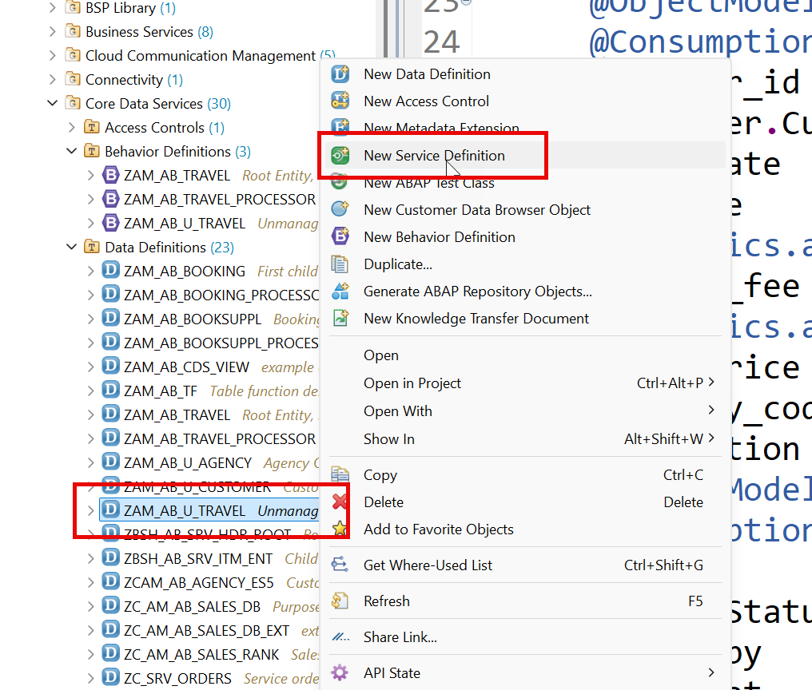
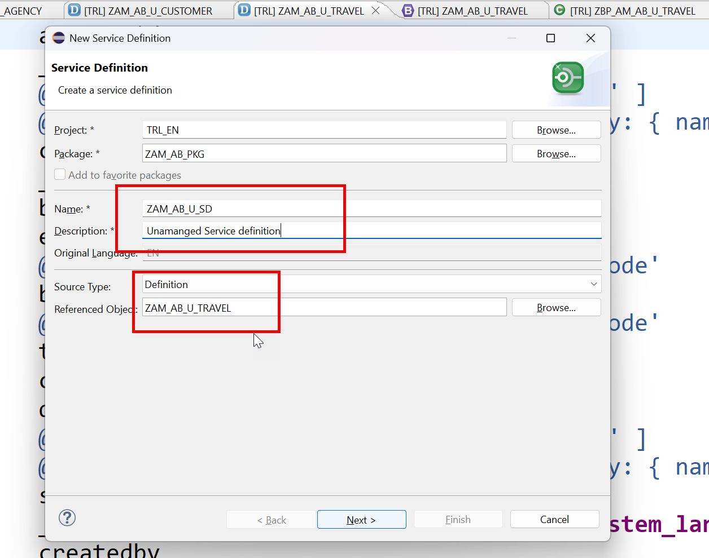
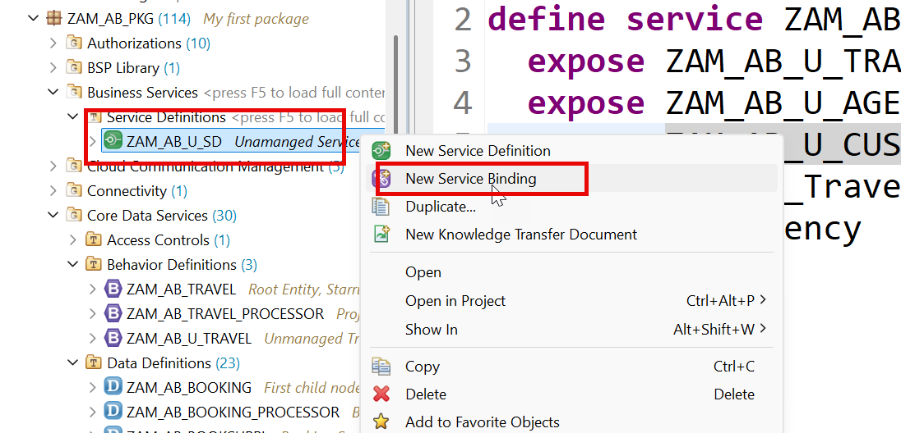
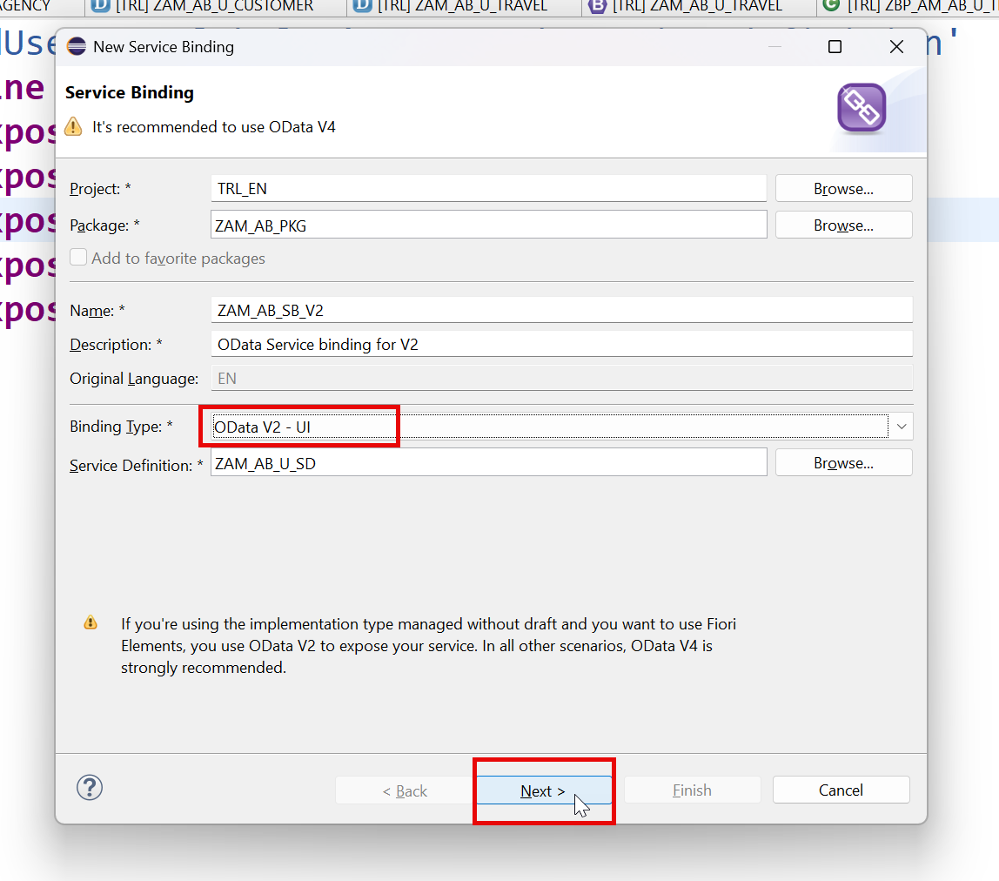
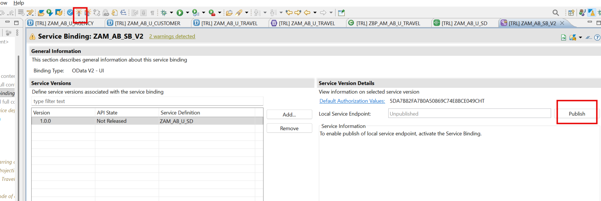
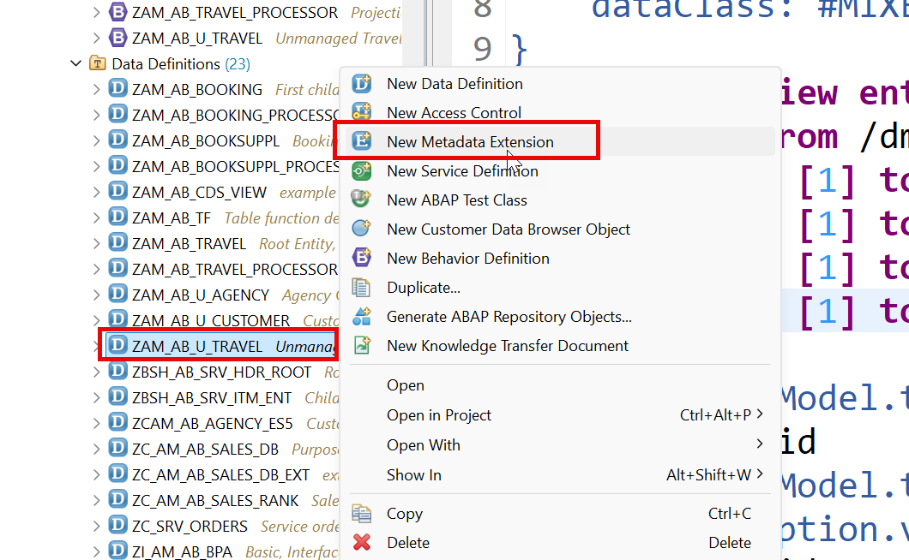
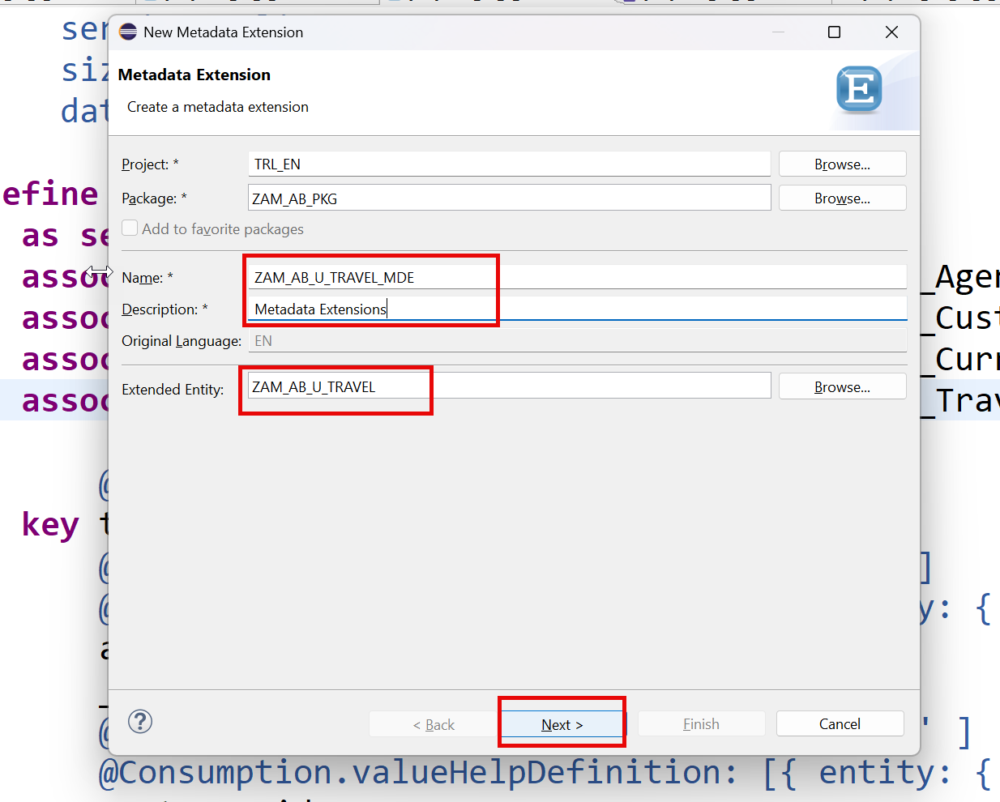

# Day 17 - Completing the Unmanaged Scenario

> **Service definition and binding, MDE, draft on unmanaged, and the full handler implementation**

> Phase F - Advanced RAP (Days 16-19) - Unmanaged RAP, external services, approver flow, attachments, clean core.

**🎯 Goal of the day.** Finish the unmanaged app, add and then deliberately remove draft, and see exactly how much work managed RAP saves you.

---

## 📋 Cheat Sheet - keep this open

### Today's quick reference

| Thing | Value / Syntax |
|---|---|
| **Handler class** | `CLASS lhc_Travel DEFINITION INHERITING FROM cl_abap_behavior_handler.` |
| **Method shapes** | `FOR MODIFY IMPORTING entities FOR CREATE Travel` / `FOR READ IMPORTING keys FOR READ Travel RESULT result` / `FOR LOCK IMPORTING keys FOR LOCK Travel` |
| `Saver` | `CLASS lsc_ZAM_AB_U_TRAVEL DEFINITION INHERITING FROM cl_abap_behavior_saver.` with `save_modified`, `finalize`, `cleanup` |
| **Service definition** | `define service ZAM_AB_U_SD { expose ZAM_AB_U_TRAVEL as Travel; ... }` |
| **Draft on/off** | add or remove `with draft;` + `draft table` + `use draft;` and re-activate everything |

### Eclipse / ADT keys you will use constantly

| Key | Action |
|---|---|
| `Ctrl+Shift+A` | Search any object in the whole system |
| `Ctrl+F3` | Activate the current object |
| `Ctrl+1` | Quick fix - RAP generates code skeletons for you |
| `Ctrl+Space` | Code completion |
| `Ctrl+Click` | Navigate to the object under the cursor |
| `Ctrl+7` | Comment / uncomment a block |
| `F2` | Show a method signature |
| `F8` | Data preview (table / CDS entity) |
| `F9` | Run the class |

### The RAP layer cake (memorise this)

```text
Database tables            <- where the data really sits
   |
Interface CDS entity       <- stable, reusable model       (ZAM_AB_TRAVEL)
   |
Behavior Definition        <- the rulebook                 (.bdef)
   |
Projection CDS entity      <- one app's view of the model  (ZAM_AB_TRAVEL_PROCESSOR)
   |
Projection BDEF            <- which rules this app may use
   |
Metadata Extension (MDE)   <- the screen layout, @UI.*
   |
Service Definition         <- which entities are allowed out
   |
Service Binding            <- the actual OData V2 / V4 URL
   |
Fiori Elements app         <- built from the annotations, no JavaScript needed
```

---

## 🧱 What you will build today

- **Service definition** `ZAM_AB_U_SD` and its **service binding**.
- An **MDE** for the unmanaged Travel projection.
- **Draft** enabled on an unmanaged BO.
- The full **`lhc_Travel`** handler: `create`, `update`, `delete`, `read`, `lock`, `save`.
- A version with draft **removed** again, for comparison.

## 🧠 Concepts first, in plain English

Read this before touching the keyboard. Every idea is explained the way you would explain it to a school student.

**`cl_abap_behavior_handler`**

The base class of every RAP handler. Its `FOR MODIFY`, `FOR READ`, `FOR LOCK` method signatures are how RAP calls into your code.

**`FOR MODIFY` / `FOR READ` / `FOR LOCK`**

Three separate jobs. Modify changes the buffer, Read fills the UI, Lock stops two users editing the same row. In managed RAP all three are free.

**Saver class**

In unmanaged RAP a second local class handles `save_modified` / `finalize` / `cleanup`. It is the moment your buffer becomes real database rows.

**Why draft on unmanaged is painful**

Draft means RAP maintains a shadow copy for you - but in unmanaged mode *you* maintain the buffer. The two responsibilities collide, which is exactly why this chapter also shows how to take draft back out.

**The lesson of Days 16-17**

Count the lines. Managed RAP did the same job in Day 8 with a fraction of the code. Use unmanaged only when you truly have no choice.

---

## 🛠️ Hands-on, step by step

### Step 1. Create service definition and service binding







**📄 Service Definition** - copy the block below exactly as it is:

```cds
@EndUserText.label: 'Unamanged Service definition'
define service ZAM_AB_U_SD {
 expose ZAM_AB_U_TRAVEL         as Travel;
 expose ZAM_AB_U_AGENCY         as Agency;
 expose ZAM_AB_U_CUSTOMER       as Customer;
 expose /DMO/I_Travel_Status_VH as Status;
 expose I_Currency              as Currency;
}
```

<details>
<summary>💡 What the important lines mean (click to open)</summary>

| Line / keyword | What it does |
|---|---|
| `@EndUserText.label` | The human-readable description shown in tools and on screen. |
| `define service` | The guest list of your OData service: which entities may leave the system, and under which public names. |
| `expose <Entity> as <Name>` | Publishes one entity in the service under a public alias. The alias is what appears in the OData URL. |

</details>








### Step 2. Create MDE file







**📄 Metadata Extension (MDE)** - copy the block below exactly as it is:

```cds
@Metadata.layer: #CUSTOMER
@UI.headerInfo:{
   typeName: 'Travel',
   typeNamePlural: 'Travel Requests'  ,
   title: { value: 'TravelId' },
   description: { value: 'Memo' } 
}
annotate entity ZAM_AB_U_TRAVEL
   with
{
   --Second screen ( applies only and only on Object Page )
   @UI.facet: [
       {
           purpose: #STANDARD,
           type: #COLLECTION,
           id: 'spiderman',
           label: 'General Information',
           position: 10
       },
       {
           id: 'TravelBasic',
           purpose: #STANDARD,
           type: #IDENTIFICATION_REFERENCE,
           parentId: 'spiderman',
           position: 10,
           label: 'More Info'
       },
       {
           id: 'TravelDates',
           type: #FIELDGROUP_REFERENCE,
           purpose: #STANDARD,
           parentId: 'spiderman',
           label: 'Dates',
           position: 30,
           targetQualifier: 'superman'       
       },
       {
           id: 'Pricing',
           type: #FIELDGROUP_REFERENCE,
           purpose: #STANDARD,
           parentId: 'spiderman',
           label: 'Pricing',
           position: 20,
           targetQualifier: 'wonderwomen'       
       },
       {
           id: 'TotalPrice',
           purpose: #HEADER,
           type: #DATAPOINT_REFERENCE,
           position: 10,
           targetQualifier: 'MyTravelCost'
       },
       {
           id: 'TravelStatus',
           purpose: #HEADER,
           type: #DATAPOINT_REFERENCE,
           position: 20,
           targetQualifier: 'MyTravelStatus'
       }
   ]
   @UI.selectionField: [{ position: 10 }]
   @UI.lineItem: [{ position: 10 },
                  { type: #FOR_ACTION, dataAction: 'set_booked_status', label: 'Set Status' }]
   @UI.identification: [{ position: 10 }]
   TravelId;
   @UI.selectionField: [{ position: 20 }]
   @UI.lineItem: [{ position: 20 }]
   @UI.identification: [{ position: 20 }]   
   AgencyId;
   @UI.selectionField: [{ position: 30 }]
   @UI.lineItem: [{ position: 30, importance: #HIGH }]
   @UI.identification: [{ position: 30 }]
   CustomerId;
   @UI.selectionField: [{ position: 40 }]
   @UI.lineItem: [{ position: 40 }]
   @UI.fieldGroup: [{ position: 10, qualifier: 'superman' }]
   BeginDate;
   @UI.fieldGroup: [{ position: 20, qualifier: 'superman' }]
   EndDate;
   @UI.fieldGroup: [{ position: 20, qualifier: 'wonderwomen' }]
   BookingFee;
   @UI.lineItem: [{ position: 50 }]
   @UI.fieldGroup: [{ position: 10, qualifier: 'wonderwomen' }]
   @UI.dataPoint: { qualifier: 'MyTravelCost', title: 'Overall Cost' }
   TotalPrice;
   @UI.fieldGroup: [{ position: 30, qualifier: 'wonderwomen' }]
   CurrencyCode;
   @UI.identification: [{ position: 40 }]
   description;
   @UI.lineItem: [{ position: 60 }]
   @UI.fieldGroup: [{ position: 11, qualifier: 'wonderwomen' }]
   @UI.dataPoint: { qualifier: 'MyTravelStatus', title: 'Overall Status' }
   overallstatus;
//    CreatedBy;
//    CreatedAt;
//    LastChangedBy;
//    LastChangedAt;
  
}
```

<details>
<summary>💡 What the important lines mean (click to open)</summary>

| Line / keyword | What it does |
|---|---|
| `@Metadata.layer: #CUSTOMER` | Which annotation layer this MDE belongs to. `#CUSTOMER` overrides `#CORE`, so the higher layer wins. |
| `@UI.headerInfo` | The object page's title area: what to call one record, many records, and which fields become the title and subtitle. |
| `@UI.facet` | The **layout plan** of the object page. Each facet is a section: `#IDENTIFICATION_REFERENCE` = a field block, `#LINEITEM_REFERENCE` = a child table, `#FIELDGROUP_REFERENCE` = a group of fields, `#COLLECTION` = a container for other facets. |
| `@UI.lineItem` | 'Show this field as a **column in the list**.' `position` decides the order; leave gaps (10, 20, 30) so you can insert later. |
| `@UI.identification` | 'Show this field on the **object page** (detail screen).' |
| `@UI.selectionField` | 'Put this field on the **filter bar** at the top of the list.' |
| `@UI.fieldGroup` | Groups fields under one heading. The `qualifier` name must match the `targetQualifier` of a `#FIELDGROUP_REFERENCE` facet. |
| `@UI.dataPoint` | One highlighted value, usually a KPI in the header. `criticality` colours it: 1 red, 2 yellow, 3 green. |
| `@UI.lineItem: [{ type: #FOR_ACTION, dataAction: '...' }]` | Puts a **button** on the screen that calls a RAP action. `dataAction` is the action name; `label` is what the user reads. |

</details>

**📄 CDS View Entity** - copy the block below exactly as it is:

```cds
@AbapCatalog.viewEnhancementCategory: [#NONE]
@AccessControl.authorizationCheck: #NOT_REQUIRED
@EndUserText.label: 'Root Travel Business Object for unmanaged scenario'
@Metadata.ignorePropagatedAnnotations: true
@ObjectModel.usageType:{
   serviceQuality: #X,
   sizeCategory: #S,
   dataClass: #MIXED
}
@Metadata.allowExtensions: true
define root view entity ZAM_AB_U_TRAVEL
 as select from /dmo/travel as Travel
 association [1] to ZAM_AB_U_AGENCY         as _Agency       on $projection.AgencyId = _Agency.AgencyId
 association [1] to ZAM_AB_U_CUSTOMER       as _Customer     on $projection.CustomerId = _Customer.CustomerId
 association [1] to I_Currency              as _Currency     on $projection.CurrencyCode = _Currency.Currency
 association [1] to /DMO/I_Travel_Status_VH as _TravelStatus on $projection.Status = _TravelStatus.TravelStatus
{
     @ObjectModel.text.element: [ 'Memo' ]
 key travel_id                                                             as TravelId,
     @ObjectModel.text.element: [ 'AgencyName' ]
     @Consumption.valueHelpDefinition: [{ entity: { name: 'ZAM_AB_U_AGENCY', element: 'AgencyId' } }]
     agency_id                                                             as AgencyId,
     _Agency.Name                                                          as AgencyName,
     @ObjectModel.text.element: [ 'CustomerName' ]
     @Consumption.valueHelpDefinition: [{ entity: { name: 'ZAM_AB_U_CUSTOMER', element: 'CustomerId' } }]
     customer_id                                                           as CustomerId,
     _Customer.CustomerName                                                as CustomerName,
     begin_date                                                            as BeginDate,
     end_date                                                              as EndDate,
     @Semantics.amount.currencyCode: 'CurrencyCode'
     booking_fee                                                           as BookingFee,
     @Semantics.amount.currencyCode: 'CurrencyCode'
     total_price                                                           as TotalPrice,
     currency_code                                                         as CurrencyCode,
     description                                                           as Memo,
     @ObjectModel.text.element: [ 'TravelStatus' ]
     @Consumption.valueHelpDefinition: [{ entity: { name: '/DMO/I_Travel_Status_VH', element: 'Status' } }]
     status                                                                as Status,
     _TravelStatus._Text[Language = $session.system_language].TravelStatus as TravelStatus,
     createdby                                                             as Createdby,
     createdat                                                             as Createdat,
     lastchangedby                                                         as Lastchangedby,
     lastchangedat                                                         as Lastchangedat,
     _Agency,
     _Customer,
     _Currency,
     _TravelStatus
}
```

<details>
<summary>💡 What the important lines mean (click to open)</summary>

| Line / keyword | What it does |
|---|---|
| `@AbapCatalog.viewEnhancementCategory: [#NONE]` | Says whether other people may extend this view. `[#NONE]` = closed, `[#PROJECTION_LIST]` = fields may be added. |
| `@AccessControl.authorizationCheck: #NOT_REQUIRED` | Skip the DCL authorisation check. Fine while learning - **never** on real customer data. |
| `@EndUserText.label` | The human-readable description shown in tools and on screen. |
| `@Metadata.ignorePropagatedAnnotations` | `true` = ignore annotations inherited from the views underneath, so you start with a clean slate. |
| `@Metadata.allowExtensions: true` | Permits a separate Metadata Extension (MDE) file to attach `@UI` annotations to this entity. |
| `@ObjectModel.usageType` | Declares the view's role: `serviceQuality` (how polished it is), `sizeCategory` (expected row count), `dataClass` (master, transactional, mixed). |
| `define root view entity` | The **top** of a RAP business object tree. Only the root can be exposed as the main entity of a service. |
| `association [0..1] to ...` | A lazy join to a **related but independent** object. The database only joins it when a query actually asks for those fields. |
| `association to` | A reusable, lazily-evaluated relationship. Cheaper than a JOIN because it only runs when used. |

</details>

### Step 3. Enable Draft for the V4

**📄 Behavior Definition (BDEF)** - copy the block below exactly as it is:

```abap
unmanaged implementation in class zbp_am_ab_u_travel unique;
strict ( 2 );
with draft;
define behavior for ZAM_AB_U_TRAVEL alias Travel
//late numbering
lock master
total etag Lastchangedat
authorization master ( instance )
draft table zam_ab_utrav
etag master Lastchangedat
{
 field (readonly) TravelId;
 field (mandatory) AgencyId, CustomerId, BeginDate, EndDate;
 draft action Edit;
 draft action Resume;
 draft action Activate;
 draft action Discard;
 draft determine action Prepare;
 create;
 update;
 delete;
 action(features: instance) set_booked_status result[1] $self;
 mapping for /dmo/travel control /dmo/s_travel_intx
 {
   AgencyId = agency_id;
   BeginDate = begin_date;
   EndDate = end_date;
   CustomerId = customer_id;
   CurrencyCode = currency_code;
   BookingFee = booking_fee;
   TotalPrice = total_price;
   Status = status;
   Lastchangedat = lastchangedat;
   Createdat = createdat;
   TravelId = travel_id;
   Memo = description;
 }
}
```

<details>
<summary>💡 What the important lines mean (click to open)</summary>

| Line / keyword | What it does |
|---|---|
| `managed implementation in class ... unique` | RAP writes the INSERT/UPDATE/DELETE for you; your class only holds the special logic. |
| `unmanaged implementation in class ... unique` | **You** write every database operation yourself - create, update, delete, read, lock and save. |
| `strict ( 2 );` | Turns on the strictest syntax checks. It refuses code that would break in a future release - always switch it on. |
| `with draft;` | Switches on the draft (auto-save) mechanism for this entity. |
| `draft table <name>` | The shadow table that stores half-finished records. **Generate it with a quick fix and remember to activate it.** |
| `total etag <Field>` | The change-detection stamp. If someone else saved first, your save is rejected instead of silently overwriting them. |
| `lock master` | 'I am the root - I own the lock for this whole business object.' Children use `lock dependent by _Travel`. |
| `authorization master ( instance )` | 'I decide the permissions for this whole BO.' `( instance )` means the decision is made per record, in code. |
| `etag master` | Names the field used for optimistic locking on this entity. |

</details>

### Step 4. Create Implementation

**📄 Behavior Implementation (local handler class)** - copy the block below exactly as it is:

```abap
CLASS lhc_Travel DEFINITION INHERITING FROM cl_abap_behavior_handler.
  PRIVATE SECTION.

    METHODS get_instance_features FOR INSTANCE FEATURES
      IMPORTING keys REQUEST requested_features FOR Travel RESULT result.

    METHODS get_instance_authorizations FOR INSTANCE AUTHORIZATION
      IMPORTING keys REQUEST requested_authorizations FOR Travel RESULT result.

    METHODS create FOR MODIFY
      IMPORTING entities FOR CREATE Travel.

    METHODS update FOR MODIFY
      IMPORTING entities FOR UPDATE Travel.

    METHODS delete FOR MODIFY
      IMPORTING keys FOR DELETE Travel.

    METHODS read FOR READ
      IMPORTING keys FOR READ Travel RESULT result.

    METHODS lock FOR LOCK
      IMPORTING keys FOR LOCK Travel.

    METHODS set_booked_status FOR MODIFY
      IMPORTING keys FOR ACTION Travel~set_booked_status RESULT result.

        ""Custom reuse function, which will capture messages coming from
    ""old legacy code in the format what RAP understands
    types: tt_travel_failed TYPE table for failed ZAM_AB_U_TRAVEL,
           tt_travel_reported type table for REPORTED ZAM_AB_U_TRAVEL.

    METHODS map_messages
        IMPORTING
            cid type string OPTIONAL
            travel_id type /dmo/travel_id OPTIONAL
            messages type /dmo/t_message
        EXPORTING
            failed_added type abap_bool
        changing
            failed type tt_travel_failed
            reported type tt_travel_reported.

ENDCLASS.

CLASS lhc_Travel IMPLEMENTATION.

  METHOD get_instance_features.
  ENDMETHOD.

  METHOD get_instance_authorizations.
  ENDMETHOD.

  METHOD map_messages.

    failed_added = abap_false.

    LOOP AT messages INTO DATA(message).

      IF message-msgty = 'E' OR message-msgty = 'A'.
        APPEND VALUE #( %cid = cid
                        travelid = travel_id
                        %fail-cause = /dmo/cl_travel_auxiliary=>get_cause_from_message( msgid = message-msgid
                                                                              msgno = message-msgno is_dependend = abap_false )
                        ) TO failed.

        failed_added = abap_true.

      ENDIF.

      APPEND VALUE #( %msg = new_message(  id = message-msgid
                                           number = message-msgno
                                           v1 = message-msgv1
                                           v2 = message-msgv2
                                           v3 = message-msgv3
                                           v4 = message-msgv4
                                           severity = if_abap_behv_message=>severity-information
                                              )
                                              %cid = cid
                                              travelid = travel_id

       ) TO reported.

      ENDLOOP.

  ENDMETHOD.

  METHOD create.

    ""Step 1: Data declaration
    data: messages type /dmo/t_message,
           travel_in   type /dmo/travel,
           travel_out type /dmo/travel.

    "Loop at the incoming data from Fiori app/from EML
    loop at entities ASSIGNING FIELD-SYMBOL(<travel_Create>).
    ""Step 2: Get the incoming data in a structure which our legacy code understand
        travel_in = CORRESPONDING #( <travel_Create> mapping from entity using control ).
    ""Step 3: Call the Legacy code (old code) to set data to transaction buffer
        /dmo/cl_flight_legacy=>get_instance(  )->create_travel(
          EXPORTING
            is_travel             = CORRESPONDING /dmo/s_travel_in( travel_in )
         IMPORTING
             es_travel             = travel_out
            et_messages           = data(lt_messages)
        ).

    ""Step 4: Handle the incoming error messages
        /dmo/cl_flight_legacy=>get_instance(  )->convert_messages(
          EXPORTING
            it_messages = lt_messages
          IMPORTING
            et_messages = messages
        ).

    ""Step 5: Map the messages to the RAP output
        map_messages(
          EXPORTING
            cid          = <travel_create>-%cid
            travel_id    = <travel_create>-TravelId
            messages     = messages
          IMPORTING
            failed_added = data(data_failed)
          CHANGING
            failed       = failed-travel
            reported     = reported-travel
        ).

        if data_failed = abap_true.
            insert value #( %cid = <travel_create>-%cid
                                travelid =          <travel_create>-TravelId
            ) into table mapped-travel.
        ENDIF.

    ENDLOOP.

  ENDMETHOD.

  METHOD update.
  ENDMETHOD.

  METHOD delete.
  ENDMETHOD.

  METHOD read.
  ENDMETHOD.

  METHOD lock.
  ENDMETHOD.

  METHOD set_booked_status.
  ENDMETHOD.

ENDCLASS.

CLASS lsc_ZAM_AB_U_TRAVEL DEFINITION INHERITING FROM cl_abap_behavior_saver.
  PROTECTED SECTION.

    METHODS finalize REDEFINITION.

    METHODS check_before_save REDEFINITION.

    METHODS save REDEFINITION.

    METHODS cleanup REDEFINITION.

    METHODS cleanup_finalize REDEFINITION.

ENDCLASS.

CLASS lsc_ZAM_AB_U_TRAVEL IMPLEMENTATION.

  METHOD finalize.
  ENDMETHOD.

  METHOD check_before_save.
  ENDMETHOD.

  METHOD save.
    /dmo/cl_flight_legacy=>get_instance(  )->save( ).
  ENDMETHOD.

  METHOD cleanup.
   /dmo/cl_flight_legacy=>get_instance(  )->initialize(  ).
  ENDMETHOD.

  METHOD cleanup_finalize.
  ENDMETHOD.

ENDCLASS.
```

<details>
<summary>💡 What the important lines mean (click to open)</summary>

| Line / keyword | What it does |
|---|---|
| `corresponding { ... }` | Inside a mapping, maps the remaining fields by matching names. |
| `INHERITING FROM cl_abap_behavior_handler` | The base class of every RAP handler. Its `FOR MODIFY` / `FOR READ` / `FOR LOCK` methods are how RAP calls your code. |
| `INHERITING FROM cl_abap_behavior_saver` | The saver class. `save_modified` is the moment your buffer turns into real database rows. |
| `%cid` | *Content ID* - a temporary label for a record that does not have a key yet, so the caller can match responses to requests. |
| `%msg` | The message object you attach to a `reported` entry so the user sees a proper error text. |
| `failed-<alias>` | The table of records that could **not** be processed. RAP is a mass framework, so failures are per record, not one exception. |
| `reported-<alias>` | The table of messages to show the user. |
| `METHOD get_instance_features` | RAP calls this per record before drawing the screen: 'for *this* row, what should be enabled?' |
| `METHOD get_instance_authorizations` | RAP calls this per record: 'is this user allowed to touch *this* row?' |

</details>

### Step 5. Update MDE file to resolve Status issue

**📄 Metadata Extension (MDE)** - copy the block below exactly as it is:

```cds
@Metadata.layer: #CUSTOMER
@UI.headerInfo:{
   typeName: 'Travel',
   typeNamePlural: 'Travel Requests'  ,
   title: { value: 'TravelId' },
   description: { value: 'Memo' } 
}
annotate entity ZAM_AB_U_TRAVEL
   with
{
   --Second screen ( applies only and only on Object Page )
   @UI.facet: [
       {
           purpose: #STANDARD,
           type: #COLLECTION,
           id: 'spiderman',
           label: 'General Information',
           position: 10
       },
       {
           id: 'TravelBasic',
           purpose: #STANDARD,
           type: #IDENTIFICATION_REFERENCE,
           parentId: 'spiderman',
           position: 10,
           label: 'More Info'
       },
       {
           id: 'TravelDates',
           type: #FIELDGROUP_REFERENCE,
           purpose: #STANDARD,
           parentId: 'spiderman',
           label: 'Dates',
           position: 30,
           targetQualifier: 'superman'       
       },
       {
           id: 'Pricing',
           type: #FIELDGROUP_REFERENCE,
           purpose: #STANDARD,
           parentId: 'spiderman',
           label: 'Pricing',
           position: 20,
           targetQualifier: 'wonderwomen'       
       },
       {
           id: 'TotalPrice',
           purpose: #HEADER,
           type: #DATAPOINT_REFERENCE,
           position: 10,
           targetQualifier: 'MyTravelCost'
       },
       {
           id: 'TravelStatus',
           purpose: #HEADER,
           type: #DATAPOINT_REFERENCE,
           position: 20,
           targetQualifier: 'MyTravelStatus'
       }
   ]
   @UI.selectionField: [{ position: 10 }]
   @UI.lineItem: [{ position: 10 },
                  { type: #FOR_ACTION, dataAction: 'set_booked_status', label: 'Set Status' }]
   @UI.identification: [{ position: 10 }]
   TravelId;
   @UI.selectionField: [{ position: 20 }]
   @UI.lineItem: [{ position: 20 }]
   @UI.identification: [{ position: 20 }]   
   AgencyId;
   @UI.selectionField: [{ position: 30 }]
   @UI.lineItem: [{ position: 30, importance: #HIGH }]
   @UI.identification: [{ position: 30 }]
   CustomerId;
   @UI.selectionField: [{ position: 40 }]
   @UI.lineItem: [{ position: 40 }]
   @UI.fieldGroup: [{ position: 10, qualifier: 'superman' }]
   BeginDate;
   @UI.fieldGroup: [{ position: 20, qualifier: 'superman' }]
   EndDate;
   @UI.fieldGroup: [{ position: 20, qualifier: 'wonderwomen' }]
   BookingFee;
   @UI.lineItem: [{ position: 50 }]
   @UI.fieldGroup: [{ position: 10, qualifier: 'wonderwomen' }]
   @UI.dataPoint: { qualifier: 'MyTravelCost', title: 'Overall Cost' }
   TotalPrice;
   @UI.fieldGroup: [{ position: 30, qualifier: 'wonderwomen' }]
   CurrencyCode;
   @UI.identification: [{ position: 40 }]
   Memo;
   @UI.lineItem: [{ position: 60 }]
   @UI.fieldGroup: [{ position: 11, qualifier: 'wonderwomen' }]
   @UI.dataPoint: { qualifier: 'MyTravelStatus', title: 'Overall Status' }
   Status;
//    CreatedBy;
//    CreatedAt;
//    LastChangedBy;
//    LastChangedAt;
  
}
```

<details>
<summary>💡 What the important lines mean (click to open)</summary>

| Line / keyword | What it does |
|---|---|
| `@Metadata.layer: #CUSTOMER` | Which annotation layer this MDE belongs to. `#CUSTOMER` overrides `#CORE`, so the higher layer wins. |
| `@UI.headerInfo` | The object page's title area: what to call one record, many records, and which fields become the title and subtitle. |
| `@UI.facet` | The **layout plan** of the object page. Each facet is a section: `#IDENTIFICATION_REFERENCE` = a field block, `#LINEITEM_REFERENCE` = a child table, `#FIELDGROUP_REFERENCE` = a group of fields, `#COLLECTION` = a container for other facets. |
| `@UI.lineItem` | 'Show this field as a **column in the list**.' `position` decides the order; leave gaps (10, 20, 30) so you can insert later. |
| `@UI.identification` | 'Show this field on the **object page** (detail screen).' |
| `@UI.selectionField` | 'Put this field on the **filter bar** at the top of the list.' |
| `@UI.fieldGroup` | Groups fields under one heading. The `qualifier` name must match the `targetQualifier` of a `#FIELDGROUP_REFERENCE` facet. |
| `@UI.dataPoint` | One highlighted value, usually a KPI in the header. `criticality` colours it: 1 red, 2 yellow, 3 green. |
| `@UI.lineItem: [{ type: #FOR_ACTION, dataAction: '...' }]` | Puts a **button** on the screen that calls a RAP action. `dataAction` is the action name; `label` is what the user reads. |

</details>

### Step 6. Implementation

**📄 Behavior Implementation (local handler class)** - copy the block below exactly as it is:

```abap
CLASS lhc_Travel DEFINITION INHERITING FROM cl_abap_behavior_handler.
  PRIVATE SECTION.

    METHODS get_instance_features FOR INSTANCE FEATURES
      IMPORTING keys REQUEST requested_features FOR Travel RESULT result.

    METHODS get_instance_authorizations FOR INSTANCE AUTHORIZATION
      IMPORTING keys REQUEST requested_authorizations FOR Travel RESULT result.

    METHODS create FOR MODIFY
      IMPORTING entities FOR CREATE Travel.

    METHODS update FOR MODIFY
      IMPORTING entities FOR UPDATE Travel.

    METHODS delete FOR MODIFY
      IMPORTING keys FOR DELETE Travel.

    METHODS read FOR READ
      IMPORTING keys FOR READ Travel RESULT result.

    METHODS lock FOR LOCK
      IMPORTING keys FOR LOCK Travel.

    METHODS set_booked_status FOR MODIFY
      IMPORTING keys FOR ACTION Travel~set_booked_status RESULT result.

        ""Custom reuse function, which will capture messages coming from
    ""old legacy code in the format what RAP understands
    types: tt_travel_failed TYPE table for failed ZAM_AB_U_TRAVEL,
           tt_travel_reported type table for REPORTED ZAM_AB_U_TRAVEL.

    METHODS map_messages
        IMPORTING
            cid type string OPTIONAL
            travel_id type /dmo/travel_id OPTIONAL
            messages type /dmo/t_message
        EXPORTING
            failed_added type abap_bool
        changing
            failed type tt_travel_failed
            reported type tt_travel_reported.

ENDCLASS.

CLASS lhc_Travel IMPLEMENTATION.

  METHOD get_instance_features.
  ENDMETHOD.

  METHOD get_instance_authorizations.
  ENDMETHOD.

  METHOD map_messages.

    failed_added = abap_false.

    LOOP AT messages INTO DATA(message).

      IF message-msgty = 'E' OR message-msgty = 'A'.
        APPEND VALUE #( %cid = cid
                        travelid = travel_id
                        %fail-cause = /dmo/cl_travel_auxiliary=>get_cause_from_message( msgid = message-msgid
                                                                              msgno = message-msgno is_dependend = abap_false )
                        ) TO failed.

        failed_added = abap_true.

      ENDIF.

      APPEND VALUE #( %msg = new_message(  id = message-msgid
                                           number = message-msgno
                                           v1 = message-msgv1
                                           v2 = message-msgv2
                                           v3 = message-msgv3
                                           v4 = message-msgv4
                                           severity = if_abap_behv_message=>severity-information
                                              )
                                              %cid = cid
                                              travelid = travel_id

       ) TO reported.

      ENDLOOP.

  ENDMETHOD.

  METHOD create.

    ""Step 1: Data declaration
    data: messages type /dmo/t_message,
           travel_in   type /dmo/travel,
           travel_out type /dmo/travel.

    "Loop at the incoming data from Fiori app/from EML
    loop at entities ASSIGNING FIELD-SYMBOL(<travel_Create>).
    ""Step 2: Get the incoming data in a structure which our legacy code understand
        travel_in = CORRESPONDING #( <travel_Create> mapping from entity using control ).
    ""Step 3: Call the Legacy code (old code) to set data to transaction buffer
        /dmo/cl_flight_legacy=>get_instance(  )->create_travel(
          EXPORTING
            is_travel             = CORRESPONDING /dmo/s_travel_in( travel_in )
         IMPORTING
             es_travel             = travel_out
            et_messages           = data(lt_messages)
        ).

    ""Step 4: Handle the incoming error messages
        /dmo/cl_flight_legacy=>get_instance(  )->convert_messages(
          EXPORTING
            it_messages = lt_messages
          IMPORTING
            et_messages = messages
        ).

    ""Step 5: Map the messages to the RAP output
        map_messages(
          EXPORTING
            cid          = <travel_create>-%cid
            travel_id    = <travel_create>-TravelId
            messages     = messages
          IMPORTING
            failed_added = data(data_failed)
          CHANGING
            failed       = failed-travel
            reported     = reported-travel
        ).

        if data_failed = abap_true.
            insert value #( %cid = <travel_create>-%cid
                                travelid =          <travel_create>-TravelId
            ) into table mapped-travel.
        ENDIF.

    ENDLOOP.

  ENDMETHOD.

  METHOD update.

  ""Step 1: Data declaration
    data: messages type /dmo/t_message,
           travel_in   type /dmo/travel,
           travel_u   type /dmo/s_travel_inx.

    "Loop at the incoming data from Fiori app/from EML
    loop at entities ASSIGNING FIELD-SYMBOL(<travel_update>).
    ""Step 2: Get the incoming data in a structure which our legacy code understand
        travel_in = CORRESPONDING #( <travel_update> mapping from entity using control ).

        travel_u-travel_id = travel_in-travel_id.
        travel_u-_intx = CORRESPONDING #( <travel_update> MAPPING from ENTITY ).

    ""Step 3: Call the Legacy code (old code) to set data to transaction buffer
        /dmo/cl_flight_legacy=>get_instance(  )->update_travel(
          EXPORTING
            is_travel              = CORRESPONDING /dmo/s_travel_in(  travel_in )
            is_travelx             = travel_u
          IMPORTING
            et_messages            = data(lt_messages)
        ).

    ""Step 4: Handle the incoming error messages
        /dmo/cl_flight_legacy=>get_instance(  )->convert_messages(
          EXPORTING
            it_messages = lt_messages
          IMPORTING
            et_messages = messages
        ).

    ""Step 5: Map the messages to the RAP output
        map_messages(
          EXPORTING
            cid          = <travel_update>-%cid_ref
            travel_id    = <travel_update>-TravelId
            messages     = messages
          IMPORTING
            failed_added = data(data_failed)
          CHANGING
            failed       = failed-travel
            reported     = reported-travel
        ).

    ENDLOOP.

  ENDMETHOD.

  METHOD delete.

    data : messages type /dmo/t_message.

    loop at keys ASSIGNING FIELD-SYMBOL(<travel_delete>).
        /dmo/cl_flight_legacy=>get_instance(  )->delete_travel(
          EXPORTING
            iv_travel_id = <travel_delete>-TravelId
          IMPORTING
            et_messages  = data(lt_messages)
        ).

            ""Step 4: Handle the incoming error messages
        /dmo/cl_flight_legacy=>get_instance(  )->convert_messages(
          EXPORTING
            it_messages = lt_messages
          IMPORTING
            et_messages = messages
        ).

    ""Step 5: Map the messages to the RAP output
        map_messages(
          EXPORTING
            cid          = <travel_delete>-%cid_ref
            travel_id    = <travel_delete>-TravelId
            messages     = messages
          IMPORTING
            failed_added = data(data_failed)
          CHANGING
            failed       = failed-travel
            reported     = reported-travel
        ).

    ENDLOOP.

  ENDMETHOD.

  METHOD read.

           data : travel_out type /dmo/travel,
               messages type /dmo/t_message,
               lv_failed type abap_boolean.

        loop at keys ASSIGNING FIELD-SYMBOL(<travel_to_read>) GROUP BY <travel_to_read>-TravelId.

            /dmo/cl_flight_legacy=>get_instance(  )->get_travel(
              EXPORTING
                iv_travel_id           = <travel_to_read>-TravelId
                iv_include_buffer      = abap_false
              IMPORTING
                es_travel              =  travel_out
                et_messages            = data(lt_messages)
            ).

        /dmo/cl_flight_legacy=>get_instance(  )->convert_messages(
          EXPORTING
            it_messages = lt_messages
          IMPORTING
            et_messages = messages
        ).

        map_messages(
          EXPORTING
            travel_id    = <travel_to_read>-TravelId
            messages     = messages
          IMPORTING
            failed_added = data(data_failed)
          CHANGING
            failed       = failed-travel
            reported     = reported-travel
        ).

          if data_failed = abap_false.
            insert CORRESPONDING #( travel_out mapping to entity ) into table result.
          ENDIF.

        ENDLOOP.

  ENDMETHOD.

  METHOD lock.
  ENDMETHOD.

  METHOD set_booked_status.

    DATA : messages                  TYPE /dmo/t_message,
           travel_out                     TYPE /dmo/travel,
           travel_set_status_booked LIKE LINE OF result.

    CLEAR result.

    LOOP AT keys ASSIGNING FIELD-SYMBOL(<travel_set_status_booked>).
      DATA(travel_id) = <travel_set_status_booked>-TravelId.

      /dmo/cl_flight_legacy=>get_instance(  )->set_status_to_booked(
        EXPORTING
          iv_travel_id = travel_id
        IMPORTING
          et_messages  = DATA(lt_messages)
      ).

      /dmo/cl_flight_legacy=>get_instance(  )->convert_messages(
        EXPORTING
          it_messages = lt_messages
        IMPORTING
          et_messages = messages
      ).

      map_messages(
        EXPORTING
*          cid          =
          travel_id    = travel_id
          messages     = messages
        IMPORTING
          failed_added = DATA(lv_failed)
        CHANGING
          failed       = failed-travel
          reported     = reported-travel
      ).

      IF lv_failed = abap_false.

        /dmo/cl_flight_legacy=>get_instance(  )->get_travel(
          EXPORTING
            iv_travel_id           = travel_id
            iv_include_buffer      = abap_false
*          iv_include_temp_buffer =
          IMPORTING
            es_travel              = travel_out
*          et_booking             =
*          et_booking_supplement  =
*          et_messages            =
        ).
      ENDIF.

      travel_set_status_booked-%param = CORRESPONDING #( travel_out  MAPPING TO ENTITY ).
      travel_set_status_booked-TravelId =   travel_id.
      travel_set_status_booked-%param-TravelId = travel_id.
      APPEND travel_set_status_booked TO result.
    ENDLOOP.

  ENDMETHOD.

ENDCLASS.

CLASS lsc_ZAM_AB_U_TRAVEL DEFINITION INHERITING FROM cl_abap_behavior_saver.
  PROTECTED SECTION.

    METHODS finalize REDEFINITION.

    METHODS check_before_save REDEFINITION.

    METHODS save REDEFINITION.

    METHODS cleanup REDEFINITION.

    METHODS cleanup_finalize REDEFINITION.

ENDCLASS.

CLASS lsc_ZAM_AB_U_TRAVEL IMPLEMENTATION.

  METHOD finalize.
  ENDMETHOD.

  METHOD check_before_save.
  ENDMETHOD.

  METHOD save.
    /dmo/cl_flight_legacy=>get_instance(  )->save( ).
  ENDMETHOD.

  METHOD cleanup.
   /dmo/cl_flight_legacy=>get_instance(  )->initialize(  ).
  ENDMETHOD.

  METHOD cleanup_finalize.
  ENDMETHOD.

ENDCLASS.
```

<details>
<summary>💡 What the important lines mean (click to open)</summary>

| Line / keyword | What it does |
|---|---|
| `corresponding { ... }` | Inside a mapping, maps the remaining fields by matching names. |
| `INHERITING FROM cl_abap_behavior_handler` | The base class of every RAP handler. Its `FOR MODIFY` / `FOR READ` / `FOR LOCK` methods are how RAP calls your code. |
| `INHERITING FROM cl_abap_behavior_saver` | The saver class. `save_modified` is the moment your buffer turns into real database rows. |
| `%cid` | *Content ID* - a temporary label for a record that does not have a key yet, so the caller can match responses to requests. |
| `%msg` | The message object you attach to a `reported` entry so the user sees a proper error text. |
| `failed-<alias>` | The table of records that could **not** be processed. RAP is a mass framework, so failures are per record, not one exception. |
| `reported-<alias>` | The table of messages to show the user. |
| `METHOD get_instance_features` | RAP calls this per record before drawing the screen: 'for *this* row, what should be enabled?' |
| `METHOD get_instance_authorizations` | RAP calls this per record: 'is this user allowed to touch *this* row?' |

</details>

### Step 7. Remove Draft in BDEF

**📄 Behavior Definition (BDEF)** - copy the block below exactly as it is:

```abap
unmanaged implementation in class zbp_am_ab_u_travel unique;
strict ( 2 );
//with draft;
define behavior for ZAM_AB_U_TRAVEL alias Travel
//late numbering
lock master
//total etag Lastchangedat
authorization master ( instance )
//draft table zam_ab_utrav
etag master Lastchangedat
{
 field (readonly) TravelId;
 field (mandatory) AgencyId, CustomerId, BeginDate, EndDate;
//  draft action Edit;
//  draft action Resume;
//  draft action Activate;
//  draft action Discard;
//  draft determine action Prepare;
 create;
 update;
 delete;
 action(features: instance) set_booked_status result[1] $self;
 mapping for /dmo/travel control /dmo/s_travel_intx
 {
   AgencyId = agency_id;
   BeginDate = begin_date;
   EndDate = end_date;
   CustomerId = customer_id;
   CurrencyCode = currency_code;
   BookingFee = booking_fee;
   TotalPrice = total_price;
   Status = status;
   Lastchangedat = lastchangedat;
   Createdat = createdat;
   TravelId = travel_id;
   Memo = description;
 }
}
```

<details>
<summary>💡 What the important lines mean (click to open)</summary>

| Line / keyword | What it does |
|---|---|
| `managed implementation in class ... unique` | RAP writes the INSERT/UPDATE/DELETE for you; your class only holds the special logic. |
| `unmanaged implementation in class ... unique` | **You** write every database operation yourself - create, update, delete, read, lock and save. |
| `strict ( 2 );` | Turns on the strictest syntax checks. It refuses code that would break in a future release - always switch it on. |
| `with draft;` | Switches on the draft (auto-save) mechanism for this entity. |
| `draft table <name>` | The shadow table that stores half-finished records. **Generate it with a quick fix and remember to activate it.** |
| `total etag <Field>` | The change-detection stamp. If someone else saved first, your save is rejected instead of silently overwriting them. |
| `lock master` | 'I am the root - I own the lock for this whole business object.' Children use `lock dependent by _Travel`. |
| `authorization master ( instance )` | 'I decide the permissions for this whole BO.' `( instance )` means the decision is made per record, in code. |
| `etag master` | Names the field used for optimistic locking on this entity. |

</details>

---

## 📦 Objects in your package after today

```text
$Z_AM_AB  (your package - replace _AB_ with your own initials)
  ├── ZAM_AB_U_SD                         Service definition
  ├── ZAM_AB_U_TRAVEL                     CDS root entity
```

---

## ✅ Final version of all code from Day 17

Everything below is the **complete, unmodified** source from the training material, gathered in one place so you can copy it straight into Eclipse.

### 1. Create service definition and service binding - _Service Definition_

```cds
@EndUserText.label: 'Unamanged Service definition'
define service ZAM_AB_U_SD {
 expose ZAM_AB_U_TRAVEL         as Travel;
 expose ZAM_AB_U_AGENCY         as Agency;
 expose ZAM_AB_U_CUSTOMER       as Customer;
 expose /DMO/I_Travel_Status_VH as Status;
 expose I_Currency              as Currency;
}
```

### 2. Create MDE file - _Metadata Extension (MDE)_

```cds
@Metadata.layer: #CUSTOMER
@UI.headerInfo:{
   typeName: 'Travel',
   typeNamePlural: 'Travel Requests'  ,
   title: { value: 'TravelId' },
   description: { value: 'Memo' } 
}
annotate entity ZAM_AB_U_TRAVEL
   with
{
   --Second screen ( applies only and only on Object Page )
   @UI.facet: [
       {
           purpose: #STANDARD,
           type: #COLLECTION,
           id: 'spiderman',
           label: 'General Information',
           position: 10
       },
       {
           id: 'TravelBasic',
           purpose: #STANDARD,
           type: #IDENTIFICATION_REFERENCE,
           parentId: 'spiderman',
           position: 10,
           label: 'More Info'
       },
       {
           id: 'TravelDates',
           type: #FIELDGROUP_REFERENCE,
           purpose: #STANDARD,
           parentId: 'spiderman',
           label: 'Dates',
           position: 30,
           targetQualifier: 'superman'       
       },
       {
           id: 'Pricing',
           type: #FIELDGROUP_REFERENCE,
           purpose: #STANDARD,
           parentId: 'spiderman',
           label: 'Pricing',
           position: 20,
           targetQualifier: 'wonderwomen'       
       },
       {
           id: 'TotalPrice',
           purpose: #HEADER,
           type: #DATAPOINT_REFERENCE,
           position: 10,
           targetQualifier: 'MyTravelCost'
       },
       {
           id: 'TravelStatus',
           purpose: #HEADER,
           type: #DATAPOINT_REFERENCE,
           position: 20,
           targetQualifier: 'MyTravelStatus'
       }
   ]
   @UI.selectionField: [{ position: 10 }]
   @UI.lineItem: [{ position: 10 },
                  { type: #FOR_ACTION, dataAction: 'set_booked_status', label: 'Set Status' }]
   @UI.identification: [{ position: 10 }]
   TravelId;
   @UI.selectionField: [{ position: 20 }]
   @UI.lineItem: [{ position: 20 }]
   @UI.identification: [{ position: 20 }]   
   AgencyId;
   @UI.selectionField: [{ position: 30 }]
   @UI.lineItem: [{ position: 30, importance: #HIGH }]
   @UI.identification: [{ position: 30 }]
   CustomerId;
   @UI.selectionField: [{ position: 40 }]
   @UI.lineItem: [{ position: 40 }]
   @UI.fieldGroup: [{ position: 10, qualifier: 'superman' }]
   BeginDate;
   @UI.fieldGroup: [{ position: 20, qualifier: 'superman' }]
   EndDate;
   @UI.fieldGroup: [{ position: 20, qualifier: 'wonderwomen' }]
   BookingFee;
   @UI.lineItem: [{ position: 50 }]
   @UI.fieldGroup: [{ position: 10, qualifier: 'wonderwomen' }]
   @UI.dataPoint: { qualifier: 'MyTravelCost', title: 'Overall Cost' }
   TotalPrice;
   @UI.fieldGroup: [{ position: 30, qualifier: 'wonderwomen' }]
   CurrencyCode;
   @UI.identification: [{ position: 40 }]
   description;
   @UI.lineItem: [{ position: 60 }]
   @UI.fieldGroup: [{ position: 11, qualifier: 'wonderwomen' }]
   @UI.dataPoint: { qualifier: 'MyTravelStatus', title: 'Overall Status' }
   overallstatus;
//    CreatedBy;
//    CreatedAt;
//    LastChangedBy;
//    LastChangedAt;
  
}
```

### 3. Create MDE file - _CDS View Entity_

```cds
@AbapCatalog.viewEnhancementCategory: [#NONE]
@AccessControl.authorizationCheck: #NOT_REQUIRED
@EndUserText.label: 'Root Travel Business Object for unmanaged scenario'
@Metadata.ignorePropagatedAnnotations: true
@ObjectModel.usageType:{
   serviceQuality: #X,
   sizeCategory: #S,
   dataClass: #MIXED
}
@Metadata.allowExtensions: true
define root view entity ZAM_AB_U_TRAVEL
 as select from /dmo/travel as Travel
 association [1] to ZAM_AB_U_AGENCY         as _Agency       on $projection.AgencyId = _Agency.AgencyId
 association [1] to ZAM_AB_U_CUSTOMER       as _Customer     on $projection.CustomerId = _Customer.CustomerId
 association [1] to I_Currency              as _Currency     on $projection.CurrencyCode = _Currency.Currency
 association [1] to /DMO/I_Travel_Status_VH as _TravelStatus on $projection.Status = _TravelStatus.TravelStatus
{
     @ObjectModel.text.element: [ 'Memo' ]
 key travel_id                                                             as TravelId,
     @ObjectModel.text.element: [ 'AgencyName' ]
     @Consumption.valueHelpDefinition: [{ entity: { name: 'ZAM_AB_U_AGENCY', element: 'AgencyId' } }]
     agency_id                                                             as AgencyId,
     _Agency.Name                                                          as AgencyName,
     @ObjectModel.text.element: [ 'CustomerName' ]
     @Consumption.valueHelpDefinition: [{ entity: { name: 'ZAM_AB_U_CUSTOMER', element: 'CustomerId' } }]
     customer_id                                                           as CustomerId,
     _Customer.CustomerName                                                as CustomerName,
     begin_date                                                            as BeginDate,
     end_date                                                              as EndDate,
     @Semantics.amount.currencyCode: 'CurrencyCode'
     booking_fee                                                           as BookingFee,
     @Semantics.amount.currencyCode: 'CurrencyCode'
     total_price                                                           as TotalPrice,
     currency_code                                                         as CurrencyCode,
     description                                                           as Memo,
     @ObjectModel.text.element: [ 'TravelStatus' ]
     @Consumption.valueHelpDefinition: [{ entity: { name: '/DMO/I_Travel_Status_VH', element: 'Status' } }]
     status                                                                as Status,
     _TravelStatus._Text[Language = $session.system_language].TravelStatus as TravelStatus,
     createdby                                                             as Createdby,
     createdat                                                             as Createdat,
     lastchangedby                                                         as Lastchangedby,
     lastchangedat                                                         as Lastchangedat,
     _Agency,
     _Customer,
     _Currency,
     _TravelStatus
}
```

### 4. Enable Draft for the V4 - _Behavior Definition (BDEF)_

```abap
unmanaged implementation in class zbp_am_ab_u_travel unique;
strict ( 2 );
with draft;
define behavior for ZAM_AB_U_TRAVEL alias Travel
//late numbering
lock master
total etag Lastchangedat
authorization master ( instance )
draft table zam_ab_utrav
etag master Lastchangedat
{
 field (readonly) TravelId;
 field (mandatory) AgencyId, CustomerId, BeginDate, EndDate;
 draft action Edit;
 draft action Resume;
 draft action Activate;
 draft action Discard;
 draft determine action Prepare;
 create;
 update;
 delete;
 action(features: instance) set_booked_status result[1] $self;
 mapping for /dmo/travel control /dmo/s_travel_intx
 {
   AgencyId = agency_id;
   BeginDate = begin_date;
   EndDate = end_date;
   CustomerId = customer_id;
   CurrencyCode = currency_code;
   BookingFee = booking_fee;
   TotalPrice = total_price;
   Status = status;
   Lastchangedat = lastchangedat;
   Createdat = createdat;
   TravelId = travel_id;
   Memo = description;
 }
}
```

### 5. Create Implementation - _Behavior Implementation (local handler class)_

```abap
CLASS lhc_Travel DEFINITION INHERITING FROM cl_abap_behavior_handler.
  PRIVATE SECTION.

    METHODS get_instance_features FOR INSTANCE FEATURES
      IMPORTING keys REQUEST requested_features FOR Travel RESULT result.

    METHODS get_instance_authorizations FOR INSTANCE AUTHORIZATION
      IMPORTING keys REQUEST requested_authorizations FOR Travel RESULT result.

    METHODS create FOR MODIFY
      IMPORTING entities FOR CREATE Travel.

    METHODS update FOR MODIFY
      IMPORTING entities FOR UPDATE Travel.

    METHODS delete FOR MODIFY
      IMPORTING keys FOR DELETE Travel.

    METHODS read FOR READ
      IMPORTING keys FOR READ Travel RESULT result.

    METHODS lock FOR LOCK
      IMPORTING keys FOR LOCK Travel.

    METHODS set_booked_status FOR MODIFY
      IMPORTING keys FOR ACTION Travel~set_booked_status RESULT result.

        ""Custom reuse function, which will capture messages coming from
    ""old legacy code in the format what RAP understands
    types: tt_travel_failed TYPE table for failed ZAM_AB_U_TRAVEL,
           tt_travel_reported type table for REPORTED ZAM_AB_U_TRAVEL.

    METHODS map_messages
        IMPORTING
            cid type string OPTIONAL
            travel_id type /dmo/travel_id OPTIONAL
            messages type /dmo/t_message
        EXPORTING
            failed_added type abap_bool
        changing
            failed type tt_travel_failed
            reported type tt_travel_reported.

ENDCLASS.

CLASS lhc_Travel IMPLEMENTATION.

  METHOD get_instance_features.
  ENDMETHOD.

  METHOD get_instance_authorizations.
  ENDMETHOD.

  METHOD map_messages.

    failed_added = abap_false.

    LOOP AT messages INTO DATA(message).

      IF message-msgty = 'E' OR message-msgty = 'A'.
        APPEND VALUE #( %cid = cid
                        travelid = travel_id
                        %fail-cause = /dmo/cl_travel_auxiliary=>get_cause_from_message( msgid = message-msgid
                                                                              msgno = message-msgno is_dependend = abap_false )
                        ) TO failed.

        failed_added = abap_true.

      ENDIF.

      APPEND VALUE #( %msg = new_message(  id = message-msgid
                                           number = message-msgno
                                           v1 = message-msgv1
                                           v2 = message-msgv2
                                           v3 = message-msgv3
                                           v4 = message-msgv4
                                           severity = if_abap_behv_message=>severity-information
                                              )
                                              %cid = cid
                                              travelid = travel_id

       ) TO reported.

      ENDLOOP.

  ENDMETHOD.

  METHOD create.

    ""Step 1: Data declaration
    data: messages type /dmo/t_message,
           travel_in   type /dmo/travel,
           travel_out type /dmo/travel.

    "Loop at the incoming data from Fiori app/from EML
    loop at entities ASSIGNING FIELD-SYMBOL(<travel_Create>).
    ""Step 2: Get the incoming data in a structure which our legacy code understand
        travel_in = CORRESPONDING #( <travel_Create> mapping from entity using control ).
    ""Step 3: Call the Legacy code (old code) to set data to transaction buffer
        /dmo/cl_flight_legacy=>get_instance(  )->create_travel(
          EXPORTING
            is_travel             = CORRESPONDING /dmo/s_travel_in( travel_in )
         IMPORTING
             es_travel             = travel_out
            et_messages           = data(lt_messages)
        ).

    ""Step 4: Handle the incoming error messages
        /dmo/cl_flight_legacy=>get_instance(  )->convert_messages(
          EXPORTING
            it_messages = lt_messages
          IMPORTING
            et_messages = messages
        ).

    ""Step 5: Map the messages to the RAP output
        map_messages(
          EXPORTING
            cid          = <travel_create>-%cid
            travel_id    = <travel_create>-TravelId
            messages     = messages
          IMPORTING
            failed_added = data(data_failed)
          CHANGING
            failed       = failed-travel
            reported     = reported-travel
        ).

        if data_failed = abap_true.
            insert value #( %cid = <travel_create>-%cid
                                travelid =          <travel_create>-TravelId
            ) into table mapped-travel.
        ENDIF.

    ENDLOOP.

  ENDMETHOD.

  METHOD update.
  ENDMETHOD.

  METHOD delete.
  ENDMETHOD.

  METHOD read.
  ENDMETHOD.

  METHOD lock.
  ENDMETHOD.

  METHOD set_booked_status.
  ENDMETHOD.

ENDCLASS.

CLASS lsc_ZAM_AB_U_TRAVEL DEFINITION INHERITING FROM cl_abap_behavior_saver.
  PROTECTED SECTION.

    METHODS finalize REDEFINITION.

    METHODS check_before_save REDEFINITION.

    METHODS save REDEFINITION.

    METHODS cleanup REDEFINITION.

    METHODS cleanup_finalize REDEFINITION.

ENDCLASS.

CLASS lsc_ZAM_AB_U_TRAVEL IMPLEMENTATION.

  METHOD finalize.
  ENDMETHOD.

  METHOD check_before_save.
  ENDMETHOD.

  METHOD save.
    /dmo/cl_flight_legacy=>get_instance(  )->save( ).
  ENDMETHOD.

  METHOD cleanup.
   /dmo/cl_flight_legacy=>get_instance(  )->initialize(  ).
  ENDMETHOD.

  METHOD cleanup_finalize.
  ENDMETHOD.

ENDCLASS.
```

### 6. Update MDE file to resolve Status issue - _Metadata Extension (MDE)_

```cds
@Metadata.layer: #CUSTOMER
@UI.headerInfo:{
   typeName: 'Travel',
   typeNamePlural: 'Travel Requests'  ,
   title: { value: 'TravelId' },
   description: { value: 'Memo' } 
}
annotate entity ZAM_AB_U_TRAVEL
   with
{
   --Second screen ( applies only and only on Object Page )
   @UI.facet: [
       {
           purpose: #STANDARD,
           type: #COLLECTION,
           id: 'spiderman',
           label: 'General Information',
           position: 10
       },
       {
           id: 'TravelBasic',
           purpose: #STANDARD,
           type: #IDENTIFICATION_REFERENCE,
           parentId: 'spiderman',
           position: 10,
           label: 'More Info'
       },
       {
           id: 'TravelDates',
           type: #FIELDGROUP_REFERENCE,
           purpose: #STANDARD,
           parentId: 'spiderman',
           label: 'Dates',
           position: 30,
           targetQualifier: 'superman'       
       },
       {
           id: 'Pricing',
           type: #FIELDGROUP_REFERENCE,
           purpose: #STANDARD,
           parentId: 'spiderman',
           label: 'Pricing',
           position: 20,
           targetQualifier: 'wonderwomen'       
       },
       {
           id: 'TotalPrice',
           purpose: #HEADER,
           type: #DATAPOINT_REFERENCE,
           position: 10,
           targetQualifier: 'MyTravelCost'
       },
       {
           id: 'TravelStatus',
           purpose: #HEADER,
           type: #DATAPOINT_REFERENCE,
           position: 20,
           targetQualifier: 'MyTravelStatus'
       }
   ]
   @UI.selectionField: [{ position: 10 }]
   @UI.lineItem: [{ position: 10 },
                  { type: #FOR_ACTION, dataAction: 'set_booked_status', label: 'Set Status' }]
   @UI.identification: [{ position: 10 }]
   TravelId;
   @UI.selectionField: [{ position: 20 }]
   @UI.lineItem: [{ position: 20 }]
   @UI.identification: [{ position: 20 }]   
   AgencyId;
   @UI.selectionField: [{ position: 30 }]
   @UI.lineItem: [{ position: 30, importance: #HIGH }]
   @UI.identification: [{ position: 30 }]
   CustomerId;
   @UI.selectionField: [{ position: 40 }]
   @UI.lineItem: [{ position: 40 }]
   @UI.fieldGroup: [{ position: 10, qualifier: 'superman' }]
   BeginDate;
   @UI.fieldGroup: [{ position: 20, qualifier: 'superman' }]
   EndDate;
   @UI.fieldGroup: [{ position: 20, qualifier: 'wonderwomen' }]
   BookingFee;
   @UI.lineItem: [{ position: 50 }]
   @UI.fieldGroup: [{ position: 10, qualifier: 'wonderwomen' }]
   @UI.dataPoint: { qualifier: 'MyTravelCost', title: 'Overall Cost' }
   TotalPrice;
   @UI.fieldGroup: [{ position: 30, qualifier: 'wonderwomen' }]
   CurrencyCode;
   @UI.identification: [{ position: 40 }]
   Memo;
   @UI.lineItem: [{ position: 60 }]
   @UI.fieldGroup: [{ position: 11, qualifier: 'wonderwomen' }]
   @UI.dataPoint: { qualifier: 'MyTravelStatus', title: 'Overall Status' }
   Status;
//    CreatedBy;
//    CreatedAt;
//    LastChangedBy;
//    LastChangedAt;
  
}
```

### 7. Implementation - _Behavior Implementation (local handler class)_

```abap
CLASS lhc_Travel DEFINITION INHERITING FROM cl_abap_behavior_handler.
  PRIVATE SECTION.

    METHODS get_instance_features FOR INSTANCE FEATURES
      IMPORTING keys REQUEST requested_features FOR Travel RESULT result.

    METHODS get_instance_authorizations FOR INSTANCE AUTHORIZATION
      IMPORTING keys REQUEST requested_authorizations FOR Travel RESULT result.

    METHODS create FOR MODIFY
      IMPORTING entities FOR CREATE Travel.

    METHODS update FOR MODIFY
      IMPORTING entities FOR UPDATE Travel.

    METHODS delete FOR MODIFY
      IMPORTING keys FOR DELETE Travel.

    METHODS read FOR READ
      IMPORTING keys FOR READ Travel RESULT result.

    METHODS lock FOR LOCK
      IMPORTING keys FOR LOCK Travel.

    METHODS set_booked_status FOR MODIFY
      IMPORTING keys FOR ACTION Travel~set_booked_status RESULT result.

        ""Custom reuse function, which will capture messages coming from
    ""old legacy code in the format what RAP understands
    types: tt_travel_failed TYPE table for failed ZAM_AB_U_TRAVEL,
           tt_travel_reported type table for REPORTED ZAM_AB_U_TRAVEL.

    METHODS map_messages
        IMPORTING
            cid type string OPTIONAL
            travel_id type /dmo/travel_id OPTIONAL
            messages type /dmo/t_message
        EXPORTING
            failed_added type abap_bool
        changing
            failed type tt_travel_failed
            reported type tt_travel_reported.

ENDCLASS.

CLASS lhc_Travel IMPLEMENTATION.

  METHOD get_instance_features.
  ENDMETHOD.

  METHOD get_instance_authorizations.
  ENDMETHOD.

  METHOD map_messages.

    failed_added = abap_false.

    LOOP AT messages INTO DATA(message).

      IF message-msgty = 'E' OR message-msgty = 'A'.
        APPEND VALUE #( %cid = cid
                        travelid = travel_id
                        %fail-cause = /dmo/cl_travel_auxiliary=>get_cause_from_message( msgid = message-msgid
                                                                              msgno = message-msgno is_dependend = abap_false )
                        ) TO failed.

        failed_added = abap_true.

      ENDIF.

      APPEND VALUE #( %msg = new_message(  id = message-msgid
                                           number = message-msgno
                                           v1 = message-msgv1
                                           v2 = message-msgv2
                                           v3 = message-msgv3
                                           v4 = message-msgv4
                                           severity = if_abap_behv_message=>severity-information
                                              )
                                              %cid = cid
                                              travelid = travel_id

       ) TO reported.

      ENDLOOP.

  ENDMETHOD.

  METHOD create.

    ""Step 1: Data declaration
    data: messages type /dmo/t_message,
           travel_in   type /dmo/travel,
           travel_out type /dmo/travel.

    "Loop at the incoming data from Fiori app/from EML
    loop at entities ASSIGNING FIELD-SYMBOL(<travel_Create>).
    ""Step 2: Get the incoming data in a structure which our legacy code understand
        travel_in = CORRESPONDING #( <travel_Create> mapping from entity using control ).
    ""Step 3: Call the Legacy code (old code) to set data to transaction buffer
        /dmo/cl_flight_legacy=>get_instance(  )->create_travel(
          EXPORTING
            is_travel             = CORRESPONDING /dmo/s_travel_in( travel_in )
         IMPORTING
             es_travel             = travel_out
            et_messages           = data(lt_messages)
        ).

    ""Step 4: Handle the incoming error messages
        /dmo/cl_flight_legacy=>get_instance(  )->convert_messages(
          EXPORTING
            it_messages = lt_messages
          IMPORTING
            et_messages = messages
        ).

    ""Step 5: Map the messages to the RAP output
        map_messages(
          EXPORTING
            cid          = <travel_create>-%cid
            travel_id    = <travel_create>-TravelId
            messages     = messages
          IMPORTING
            failed_added = data(data_failed)
          CHANGING
            failed       = failed-travel
            reported     = reported-travel
        ).

        if data_failed = abap_true.
            insert value #( %cid = <travel_create>-%cid
                                travelid =          <travel_create>-TravelId
            ) into table mapped-travel.
        ENDIF.

    ENDLOOP.

  ENDMETHOD.

  METHOD update.

  ""Step 1: Data declaration
    data: messages type /dmo/t_message,
           travel_in   type /dmo/travel,
           travel_u   type /dmo/s_travel_inx.

    "Loop at the incoming data from Fiori app/from EML
    loop at entities ASSIGNING FIELD-SYMBOL(<travel_update>).
    ""Step 2: Get the incoming data in a structure which our legacy code understand
        travel_in = CORRESPONDING #( <travel_update> mapping from entity using control ).

        travel_u-travel_id = travel_in-travel_id.
        travel_u-_intx = CORRESPONDING #( <travel_update> MAPPING from ENTITY ).

    ""Step 3: Call the Legacy code (old code) to set data to transaction buffer
        /dmo/cl_flight_legacy=>get_instance(  )->update_travel(
          EXPORTING
            is_travel              = CORRESPONDING /dmo/s_travel_in(  travel_in )
            is_travelx             = travel_u
          IMPORTING
            et_messages            = data(lt_messages)
        ).

    ""Step 4: Handle the incoming error messages
        /dmo/cl_flight_legacy=>get_instance(  )->convert_messages(
          EXPORTING
            it_messages = lt_messages
          IMPORTING
            et_messages = messages
        ).

    ""Step 5: Map the messages to the RAP output
        map_messages(
          EXPORTING
            cid          = <travel_update>-%cid_ref
            travel_id    = <travel_update>-TravelId
            messages     = messages
          IMPORTING
            failed_added = data(data_failed)
          CHANGING
            failed       = failed-travel
            reported     = reported-travel
        ).

    ENDLOOP.

  ENDMETHOD.

  METHOD delete.

    data : messages type /dmo/t_message.

    loop at keys ASSIGNING FIELD-SYMBOL(<travel_delete>).
        /dmo/cl_flight_legacy=>get_instance(  )->delete_travel(
          EXPORTING
            iv_travel_id = <travel_delete>-TravelId
          IMPORTING
            et_messages  = data(lt_messages)
        ).

            ""Step 4: Handle the incoming error messages
        /dmo/cl_flight_legacy=>get_instance(  )->convert_messages(
          EXPORTING
            it_messages = lt_messages
          IMPORTING
            et_messages = messages
        ).

    ""Step 5: Map the messages to the RAP output
        map_messages(
          EXPORTING
            cid          = <travel_delete>-%cid_ref
            travel_id    = <travel_delete>-TravelId
            messages     = messages
          IMPORTING
            failed_added = data(data_failed)
          CHANGING
            failed       = failed-travel
            reported     = reported-travel
        ).

    ENDLOOP.

  ENDMETHOD.

  METHOD read.

           data : travel_out type /dmo/travel,
               messages type /dmo/t_message,
               lv_failed type abap_boolean.

        loop at keys ASSIGNING FIELD-SYMBOL(<travel_to_read>) GROUP BY <travel_to_read>-TravelId.

            /dmo/cl_flight_legacy=>get_instance(  )->get_travel(
              EXPORTING
                iv_travel_id           = <travel_to_read>-TravelId
                iv_include_buffer      = abap_false
              IMPORTING
                es_travel              =  travel_out
                et_messages            = data(lt_messages)
            ).

        /dmo/cl_flight_legacy=>get_instance(  )->convert_messages(
          EXPORTING
            it_messages = lt_messages
          IMPORTING
            et_messages = messages
        ).

        map_messages(
          EXPORTING
            travel_id    = <travel_to_read>-TravelId
            messages     = messages
          IMPORTING
            failed_added = data(data_failed)
          CHANGING
            failed       = failed-travel
            reported     = reported-travel
        ).

          if data_failed = abap_false.
            insert CORRESPONDING #( travel_out mapping to entity ) into table result.
          ENDIF.

        ENDLOOP.

  ENDMETHOD.

  METHOD lock.
  ENDMETHOD.

  METHOD set_booked_status.

    DATA : messages                  TYPE /dmo/t_message,
           travel_out                     TYPE /dmo/travel,
           travel_set_status_booked LIKE LINE OF result.

    CLEAR result.

    LOOP AT keys ASSIGNING FIELD-SYMBOL(<travel_set_status_booked>).
      DATA(travel_id) = <travel_set_status_booked>-TravelId.

      /dmo/cl_flight_legacy=>get_instance(  )->set_status_to_booked(
        EXPORTING
          iv_travel_id = travel_id
        IMPORTING
          et_messages  = DATA(lt_messages)
      ).

      /dmo/cl_flight_legacy=>get_instance(  )->convert_messages(
        EXPORTING
          it_messages = lt_messages
        IMPORTING
          et_messages = messages
      ).

      map_messages(
        EXPORTING
*          cid          =
          travel_id    = travel_id
          messages     = messages
        IMPORTING
          failed_added = DATA(lv_failed)
        CHANGING
          failed       = failed-travel
          reported     = reported-travel
      ).

      IF lv_failed = abap_false.

        /dmo/cl_flight_legacy=>get_instance(  )->get_travel(
          EXPORTING
            iv_travel_id           = travel_id
            iv_include_buffer      = abap_false
*          iv_include_temp_buffer =
          IMPORTING
            es_travel              = travel_out
*          et_booking             =
*          et_booking_supplement  =
*          et_messages            =
        ).
      ENDIF.

      travel_set_status_booked-%param = CORRESPONDING #( travel_out  MAPPING TO ENTITY ).
      travel_set_status_booked-TravelId =   travel_id.
      travel_set_status_booked-%param-TravelId = travel_id.
      APPEND travel_set_status_booked TO result.
    ENDLOOP.

  ENDMETHOD.

ENDCLASS.

CLASS lsc_ZAM_AB_U_TRAVEL DEFINITION INHERITING FROM cl_abap_behavior_saver.
  PROTECTED SECTION.

    METHODS finalize REDEFINITION.

    METHODS check_before_save REDEFINITION.

    METHODS save REDEFINITION.

    METHODS cleanup REDEFINITION.

    METHODS cleanup_finalize REDEFINITION.

ENDCLASS.

CLASS lsc_ZAM_AB_U_TRAVEL IMPLEMENTATION.

  METHOD finalize.
  ENDMETHOD.

  METHOD check_before_save.
  ENDMETHOD.

  METHOD save.
    /dmo/cl_flight_legacy=>get_instance(  )->save( ).
  ENDMETHOD.

  METHOD cleanup.
   /dmo/cl_flight_legacy=>get_instance(  )->initialize(  ).
  ENDMETHOD.

  METHOD cleanup_finalize.
  ENDMETHOD.

ENDCLASS.
```

### 8. Remove Draft in BDEF - _Behavior Definition (BDEF)_

```abap
unmanaged implementation in class zbp_am_ab_u_travel unique;
strict ( 2 );
//with draft;
define behavior for ZAM_AB_U_TRAVEL alias Travel
//late numbering
lock master
//total etag Lastchangedat
authorization master ( instance )
//draft table zam_ab_utrav
etag master Lastchangedat
{
 field (readonly) TravelId;
 field (mandatory) AgencyId, CustomerId, BeginDate, EndDate;
//  draft action Edit;
//  draft action Resume;
//  draft action Activate;
//  draft action Discard;
//  draft determine action Prepare;
 create;
 update;
 delete;
 action(features: instance) set_booked_status result[1] $self;
 mapping for /dmo/travel control /dmo/s_travel_intx
 {
   AgencyId = agency_id;
   BeginDate = begin_date;
   EndDate = end_date;
   CustomerId = customer_id;
   CurrencyCode = currency_code;
   BookingFee = booking_fee;
   TotalPrice = total_price;
   Status = status;
   Lastchangedat = lastchangedat;
   Createdat = createdat;
   TravelId = travel_id;
   Memo = description;
 }
}
```

---

## ⚠️ Traps and tips

- Unmanaged handlers must fill `failed` and `reported` themselves for every key. Managed RAP did this for you.
- After removing draft, re-activate the BDEF, the projection BDEF **and** the service binding, or the app keeps offering an Edit button that no longer works.

---

[⬅️ Day 16](Day16_Custom_Entities_And_Unmanaged_RAP.md) | [🏠 Summary](00_SUMMARY.md) | [📋 Master Cheat Sheet](00_MASTER_CHEAT_SHEET.md) | [Day 18 ➡️](Day18_Approver_Scenario_And_Attachments.md)
