# Day 18 - The Approver Scenario and Attachments

> **A second app on the same model, with feature-controlled actions and file upload**

> Phase F - Advanced RAP (Days 16-19) - Unmanaged RAP, external services, approver flow, attachments, clean core.

**🎯 Goal of the day.** Prove the value of the projection layer by building a completely different app on the *same* business object - then add file attachments.

---

## 📋 Cheat Sheet - keep this open

### Today's quick reference

| Thing | Value / Syntax |
|---|---|
| **Action with features** | `action ( features : instance ) acceptTravel result [1] $self;` |
| **Feature method** | `METHOD get_instance_features` -> fill `result` with `%features-%action-acceptTravel = if_abap_behv=>fc-o-enabled` |
| **New app layers** | projection CDS -> projection BDEF -> MDE -> service definition -> service binding |
| **Attachment field** | `attachment : zam_ab_dte_attach;` (`abap.rawstring`) |
| **LOB annotations** | `@Semantics.largeObject: { mimeType: 'Filetype', fileName: 'Filename', contentDispositionPreference: #INLINE }` |
| **MIME type field** | `@Semantics.mimeType: true` on `Filetype` |
| **UUID key** | `key id : sysuuid_x16 not null;` |

### Eclipse / ADT keys you will use constantly

| Key | Action |
|---|---|
| `Ctrl+Shift+A` | Search any object in the whole system |
| `Ctrl+F3` | Activate the current object |
| `Ctrl+1` | Quick fix - RAP generates code skeletons for you |
| `Ctrl+Space` | Code completion |
| `Ctrl+Click` | Navigate to the object under the cursor |
| `Ctrl+7` | Comment / uncomment a block |
| `F2` | Show a method signature |
| `F8` | Data preview (table / CDS entity) |
| `F9` | Run the class |

### The RAP layer cake (memorise this)

```text
Database tables            <- where the data really sits
   |
Interface CDS entity       <- stable, reusable model       (ZAM_AB_TRAVEL)
   |
Behavior Definition        <- the rulebook                 (.bdef)
   |
Projection CDS entity      <- one app's view of the model  (ZAM_AB_TRAVEL_PROCESSOR)
   |
Projection BDEF            <- which rules this app may use
   |
Metadata Extension (MDE)   <- the screen layout, @UI.*
   |
Service Definition         <- which entities are allowed out
   |
Service Binding            <- the actual OData V2 / V4 URL
   |
Fiori Elements app         <- built from the annotations, no JavaScript needed
```

---

## 🧱 What you will build today

- New BDEF **actions** (`acceptTravel`, `rejectTravel`) with **instance feature control**.
- **`get_instance_features`** and **`acceptTravel`** implementations.
- A complete **approver stack**: `ZAM_AB_TRAVEL_APPROVER`, `ZAM_AB_BOOKING_approver`, their BDEFs, MDEs, service definition `ZAM_AB_SD_TRAVEL_APPROVER` and binding.
- An **attachment table** `zam_ab_attach`, entity `ZAM_AB_M_ATTACH`, draft table, and the `ZAM_AB_ATTACH_PROCESSOR` projection.

## 🧠 Concepts first, in plain English

Read this before touching the keyboard. Every idea is explained the way you would explain it to a school student.

**Two apps, one model**

The Processor app and the Approver app read the same `ZAM_AB_TRAVEL`. Different projections, different BDEFs, different MDEs, different service bindings - **zero duplicated business logic**. This is the single best argument for the projection layer.

**Feature-controlled actions**

The Approve button should only be clickable when the status is *Open*. `action ( features : instance ) acceptTravel` plus `get_instance_features` does that.

**`%tky`**

*Transactional key* - the full key of one instance including its draft indicator. Inside handlers you match records on `%tky`, not on the plain ID.

**Attachment / LOB fields**

The file bytes go in an `abap.rawstring` field. Three annotations make the UI render an upload control: `@Semantics.largeObject` with `mimeType` and `fileName`.

**Why the filename is stored separately**

The binary blob has no name and no type. You store `filename` and `filetype` in normal fields, and point `@Semantics.largeObject` at them so the browser knows what it is downloading.

**`sysuuid_x16` key**

Attachments have no natural business key, so a generated 16-byte UUID is used. Same idea as a random ticket number.

---

## 🛠️ Hands-on, step by step

The Approver Scenario

### Step 1. Change the BDEF to add new actions with feature control

**📄 Behavior Definition (BDEF)** - copy the block below exactly as it is:

```abap
managed implementation in class zbp_am_ab_travel unique;
//guideline to be followed which runs the BDEF in strict mode
strict ( 2 );
//add draft feature at BO level
with draft;
define behavior for ZAM_AB_TRAVEL alias Travel
//this is the table where RAP will insert our data
persistent table /dmo/travel_m
//control the enqueue and dequeue
lock master
//mandatory to use total etag
total etag LastChangedAt
//who can modify, create, update, delete our data using this BDEF
authorization master ( instance )
//concurrency control - automatic
etag master LastChangedAt
//a draft table where temp data will keep saving
draft table zam_ab_trav_d
//automatic management of travel id from sequence generator
early numbering
{
 //enabling RAP to generate code for us for create, update, delete
 create (precheck);
 update (precheck);
 delete;
 field ( readonly ) TravelId;
 field ( mandatory ) BeginDate, EndDate, AgencyId, CustomerId;
 field (features:instance) OverallStatus;
 association _Booking { create ( features: instance ) ; with draft; }
 //to fulfil the ego of RAP framework
 //adding the draft actions
 draft determine action Prepare;
 draft action Edit;
 draft action Resume;
 draft action Activate;
 draft action Discard;
 //Adding a instance based factory data action to copy my travel
 //itinerary based on exisiting travel
 factory action copyTravel [1];
 //non factory actions which will change the state of the BO instance
 action (features : instance) acceptTravel result[1] $self;
 action (features : instance) rejectTravel result[1] $self;
 //its a piece of code which is intented to be only
 //consumed within our RAP BO
 internal action reCalcTotalPrice;
 //Define determination to execute the code when
 //booking fee or curr code changes so we calc total price
 determination calculateTotalPrice on modify
           { create; field BookingFee, CurrencyCode; }
  //create a new determine action
 determine action validationCustomer { validation validateHeaderData; }
 //Adding side-effect which inform RAP to reaload the total price if the booking
 //fee has been changed on the Frontend
 //Side effects
 side effects {
   field BookingFee affects field TotalPrice;
   field CurrencyCode affects field TotalPrice;
   determine action validationCustomer executed on field CustomerId affects messages;
 }
 //Checking custom business object rules
 validation validateHeaderData on save {create; field CustomerId, BeginDate, EndDate;}
 //Since we use alias name in MDE (fiori sends) table has _ we need mapping
 mapping for /dmo/travel_m{
   TravelId = travel_id;
   AgencyId = agency_id;
   CustomerId = customer_id;
   BeginDate = begin_date;
   EndDate = end_date;
   TotalPrice = total_price;
   BookingFee = booking_fee;
   CurrencyCode = currency_code;
   Description = description;
   OverallStatus = overall_status;
   CreatedBy = created_by;
   LastChangedBy = last_changed_by;
   CreatedAt = created_at;
   LastChangedAt = last_changed_at;
 }
}
define behavior for ZAM_AB_BOOKING alias Booking
persistent table /dmo/booking_m
//child entities depends on the lock of root entity
lock dependent by _Travel
//auth depedent on the root entity
authorization dependent by _Travel
//concurrency at booking
etag master LastChangedAt
//add booking draft table and use quick fix to create
draft table zam_ab_book_d
//automatic management of booking id from sequence generator
early numbering
{
 update;
 delete;
 field ( readonly ) TravelId, BookingId;
 association _Travel;
 association _BookingSuppl { create; with draft; }
 mapping for /dmo/booking_m{
   TravelId = travel_id;
   BookingId = booking_id;
   BookingDate = booking_date;
   CustomerId = customer_id;
   CarrierId = carrier_id;
   ConnectionId = connection_id;
   FlightDate = flight_date;
   FlightPrice = flight_price;
   CurrencyCode = currency_code;
   BookingStatus = booking_status;
   LastChangedAt = last_changed_at;
 }
}
define behavior for ZAM_AB_BOOKSUPPL alias BookingSuppl
persistent table /dmo/booksuppl_m
//child entities depends on the lock of root entity
lock dependent by _Travel
authorization dependent by _Travel
etag master LastChangedAt
draft table zam_ab_books_d
{
 update;
 delete;
 field ( readonly ) TravelId, BookingId;
 association _Travel;
 association _Booking;
 mapping for /dmo/booksuppl_m{
   TravelId = travel_id;
   BookingId = booking_id;
   BookingSupplementId = booking_supplement_id;
   SupplementId = supplement_id;
   Price = price;
   CurrencyCode = currency_code;
   LastChangedAt = last_changed_at;
 }
}
```

<details>
<summary>💡 What the important lines mean (click to open)</summary>

| Line / keyword | What it does |
|---|---|
| `association to` | A reusable, lazily-evaluated relationship. Cheaper than a JOIN because it only runs when used. |
| `managed implementation in class ... unique` | RAP writes the INSERT/UPDATE/DELETE for you; your class only holds the special logic. |
| `strict ( 2 );` | Turns on the strictest syntax checks. It refuses code that would break in a future release - always switch it on. |
| `with draft;` | Switches on the draft (auto-save) mechanism for this entity. |
| `draft table <name>` | The shadow table that stores half-finished records. **Generate it with a quick fix and remember to activate it.** |
| `total etag <Field>` | The change-detection stamp. If someone else saved first, your save is rejected instead of silently overwriting them. |
| `lock master` | 'I am the root - I own the lock for this whole business object.' Children use `lock dependent by _Travel`. |
| `lock dependent by` | 'I do not own a lock; ask my parent.' Standard for every child entity. |
| `authorization master ( instance )` | 'I decide the permissions for this whole BO.' `( instance )` means the decision is made per record, in code. |

</details>

### Step 2. Activate and Quick fix

**📄 ABAP Method Implementation** - copy the block below exactly as it is:

```abap
 METHOD get_instance_features.
   "Step 1: Read the travel data with status
   READ ENTITIES OF zam_ab_travel in local mode
       ENTITY travel
           FIELDS ( travelid overallstatus AgencyId )
           with     CORRESPONDING #( keys )
       RESULT data(travels)
       FAILED failed.
   "Step 2: return the result with booking creation possible or not
   read table travels into data(ls_travel) index 1.
   if ( ls_travel-OverallStatus = 'X' ).
       data(lv_allow) = if_abap_behv=>fc-o-disabled.
   else.
       lv_allow = if_abap_behv=>fc-o-enabled.
   ENDIF.
   result = value #( for travel in travels
                       ( %tky = travel-%tky
                         %assoc-_Booking = lv_allow
                         %action-acceptTravel = COND #( WHEN ls_travel-OverallStatus = 'A'
                                                           then if_abap_behv=>fc-o-disabled
                                                           else if_abap_behv=>fc-o-enabled
                         )
                         %action-rejectTravel = COND #( WHEN ls_travel-OverallStatus = 'X'
                                                           then if_abap_behv=>fc-o-disabled
                                                           else if_abap_behv=>fc-o-enabled
                         )
                         %field-OverallStatus = COND #( WHEN ls_travel-AgencyId = '070033'
                                                           then if_abap_behv=>fc-o-disabled
                                                           else if_abap_behv=>fc-o-enabled
                         )
                       )
                   ).
 ENDMETHOD.
```

<details>
<summary>💡 What the important lines mean (click to open)</summary>

| Line / keyword | What it does |
|---|---|
| `corresponding { ... }` | Inside a mapping, maps the remaining fields by matching names. |
| `READ ENTITIES OF ... ENTITY ... FIELDS ( ... ) WITH ...` | EML read. Always a **mass** operation: you pass a *table* of keys and get a *table* of results, plus `FAILED` and `REPORTED`. |
| `IN LOCAL MODE` | Skip authorisation and feature checks. Correct inside a behavior implementation, because RAP already checked before calling you. |
| `%tky` | *Transactional key* - the complete key of one instance, including its draft flag. Match records on this inside handlers. |
| `if_abap_behv=>fc-o-enabled / -disabled` | Feature-control constants for **operations and actions** (`o` = operation). |
| `METHOD get_instance_features` | RAP calls this per record before drawing the screen: 'for *this* row, what should be enabled?' |

</details>

**📄 ABAP Method Implementation** - copy the block below exactly as it is:

```abap
 METHOD acceptTravel.
   ""Perform the change of BO instance to change status
   MODIFY ENTITIES OF zAM_AB_travel
       ENTITY travel
           UPDATE FIELDS ( OverallStatus )
           WITH VALUE #( for key in keys ( %tky = key-%tky
                                           %is_draft = key-%is_draft
                                           OverallStatus = 'A'
            )  ).
   ""Read the BO instance on which we want to make the changes
   READ ENTITIES OF zAM_AB_travel
       ENTITY Travel
           ALL FIELDS
               WITH CORRESPONDING #( keys )
                   RESULT data(lt_results).
   result = value #( for travel in lt_results ( %tky = travel-%tky
                                                %param = travel
   ) ).
 ENDMETHOD.
 METHOD rejectTravel.
""Perform the change of BO instance to change status
   MODIFY ENTITIES OF zAM_AB_travel
       ENTITY travel
           UPDATE FIELDS ( OverallStatus )
           WITH VALUE #( for key in keys ( %tky = key-%tky
                                                       %is_draft = key-%is_draft
                                                       OverallStatus = 'X'
            )  ).
   ""Read the BO instance on which we want to make the changes
   READ ENTITIES OF zAM_AB_travel
       ENTITY Travel
           ALL FIELDS
               WITH CORRESPONDING #( keys )
                   RESULT data(lt_results).
   result = value #( for travel in lt_results ( %tky = travel-%tky
                                                         %param = travel
   ) ).
 ENDMETHOD.
```

<details>
<summary>💡 What the important lines mean (click to open)</summary>

| Line / keyword | What it does |
|---|---|
| `corresponding { ... }` | Inside a mapping, maps the remaining fields by matching names. |
| `READ ENTITIES OF ... ENTITY ... FIELDS ( ... ) WITH ...` | EML read. Always a **mass** operation: you pass a *table* of keys and get a *table* of results, plus `FAILED` and `REPORTED`. |
| `MODIFY ENTITIES OF ... ENTITY ... CREATE/UPDATE/DELETE` | EML write. Goes through the business object, so every validation and determination still runs. |
| `%tky` | *Transactional key* - the complete key of one instance, including its draft flag. Match records on this inside handlers. |

</details>

### Step 3. Now we create the approver projection views


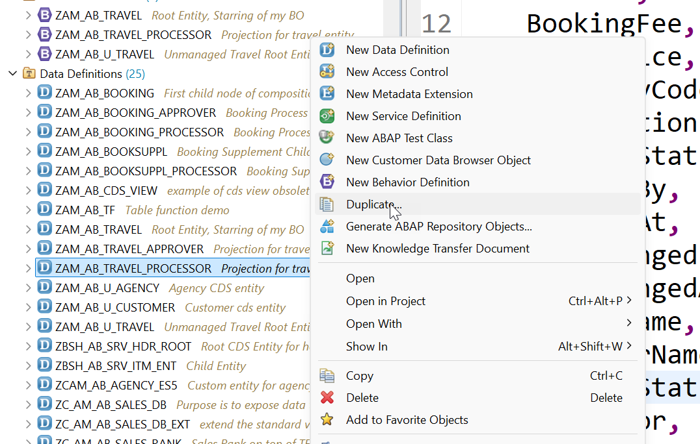

**📄 CDS Projection View** - copy the block below exactly as it is:

```cds
@AccessControl.authorizationCheck: #NOT_REQUIRED
@EndUserText.label: 'Projection for travel entity'
@Metadata.ignorePropagatedAnnotations: false
@Metadata.allowExtensions: true
define root view entity ZAM_AB_TRAVEL_APPROVER as projection on ZAM_AB_TRAVEL
{
   key TravelId,
   AgencyId,
   CustomerId,
   BeginDate,
   EndDate,
   BookingFee,
   TotalPrice,
   CurrencyCode,
   Description,
   OverallStatus,
   CreatedBy,
   CreatedAt,
   LastChangedBy,
   LastChangedAt,
   AgencyName,
   CustomerName,
   OverallStatusText,
   IconColor,
   _Agency,
   _Booking: redirected to composition child ZAM_AB_BOOKING_APPROVER,
   _Currency,
   _Customer,
   _OverallStatus
}
```

<details>
<summary>💡 What the important lines mean (click to open)</summary>

| Line / keyword | What it does |
|---|---|
| `@AccessControl.authorizationCheck: #NOT_REQUIRED` | Skip the DCL authorisation check. Fine while learning - **never** on real customer data. |
| `@EndUserText.label` | The human-readable description shown in tools and on screen. |
| `@Metadata.ignorePropagatedAnnotations` | `true` = ignore annotations inherited from the views underneath, so you start with a clean slate. |
| `@Metadata.allowExtensions: true` | Permits a separate Metadata Extension (MDE) file to attach `@UI` annotations to this entity. |
| `define root view entity` | The **top** of a RAP business object tree. Only the root can be exposed as the main entity of a service. |
| `as projection on` | A window onto another entity: same data, but you choose which fields to expose. This is the projection layer. |

</details>

**📄 CDS Projection View** - copy the block below exactly as it is:

```cds
@AccessControl.authorizationCheck: #NOT_REQUIRED
@EndUserText.label: 'Booking Process projection entity'
@Metadata.ignorePropagatedAnnotations: false
@Metadata.allowExtensions: true
define view entity ZAM_AB_BOOKING_approver as projection on ZAM_AB_BOOKING
{
   key TravelId,
   key BookingId,
   BookingDate,
   CustomerId,
   CarrierId,
   ConnectionId,
   FlightDate,
   FlightPrice,
   CurrencyCode,
   BookingStatus,
   LastChangedAt,
   /* Associations */
   _BookingStatus,
   _Carrier,
   _Connection,
   _Customer,
   _Travel :  redirected to parent ZAM_AB_TRAVEL_APPROVER
}
```

<details>
<summary>💡 What the important lines mean (click to open)</summary>

| Line / keyword | What it does |
|---|---|
| `@AccessControl.authorizationCheck: #NOT_REQUIRED` | Skip the DCL authorisation check. Fine while learning - **never** on real customer data. |
| `@EndUserText.label` | The human-readable description shown in tools and on screen. |
| `@Metadata.ignorePropagatedAnnotations` | `true` = ignore annotations inherited from the views underneath, so you start with a clean slate. |
| `@Metadata.allowExtensions: true` | Permits a separate Metadata Extension (MDE) file to attach `@UI` annotations to this entity. |
| `define view entity` | The modern CDS entity - one object, one name, faster and stricter than the old `define view`. |
| `define view` | The **obsolete** CDS View. Kept here only so you can see the difference. |
| `as projection on` | A window onto another entity: same data, but you choose which fields to expose. This is the projection layer. |

</details>


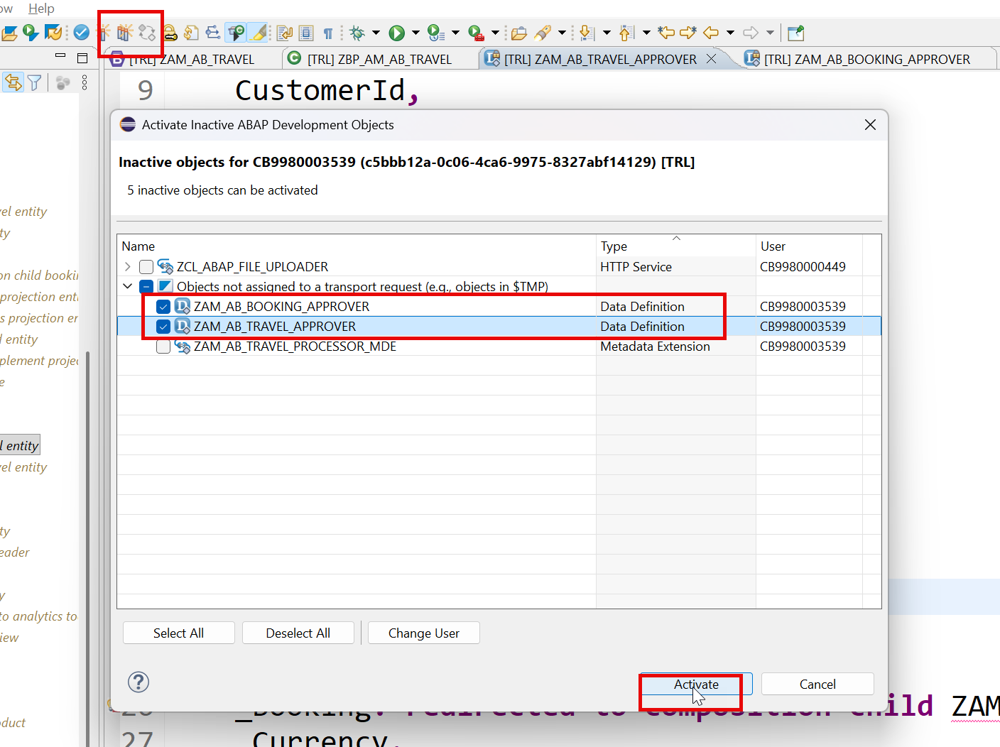

### Step 4. We create the BDEF projection for Approver


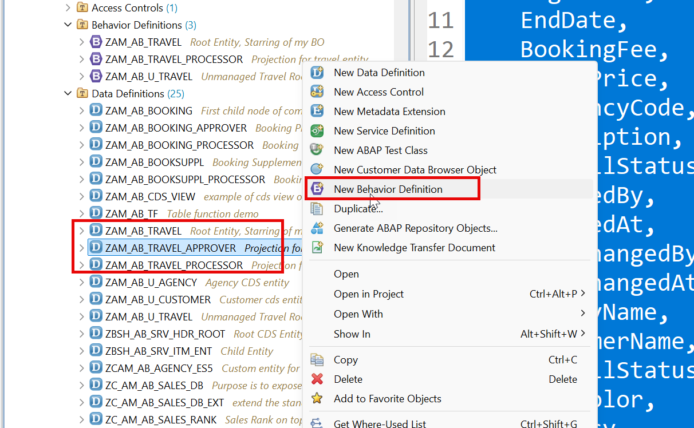

### Step 5. BDEF for approver

**📄 Behavior Definition - projection (BDEF)** - copy the block below exactly as it is:

```abap
projection;
strict ( 2 );
use draft;
define behavior for ZAM_AB_TRAVEL_APPROVER alias Travel
{
 //use create;
 use update;
 field (readonly) AgencyId, CustomerId, BeginDate, EndDate,
                  OverallStatus, TotalPrice, Description;
 //use delete;
 //use action copyTravel;
 use action acceptTravel;
 use action rejectTravel;
 //use action validationCustomer;
 use action Prepare;
 use action Edit;
 use action Resume;
 use action Activate;
 use action Discard;
 use association _Booking ;
}
define behavior for ZAM_AB_BOOKING_approver alias Booking
{
 //use update;
 //use delete;
 use association _Travel;
}
```

<details>
<summary>💡 What the important lines mean (click to open)</summary>

| Line / keyword | What it does |
|---|---|
| `association to` | A reusable, lazily-evaluated relationship. Cheaper than a JOIN because it only runs when used. |
| `projection;` | This BDEF describes a **projection** layer. It can only re-publish (`use`) what the interface BDEF already allows. |
| `strict ( 2 );` | Turns on the strictest syntax checks. It refuses code that would break in a future release - always switch it on. |
| `use draft;` | Re-publishes the draft mechanism in the projection so the app gets Edit / Save / Cancel. |
| `use action <Name>` | Re-publishes an action in the projection. Without this line the button never appears, even if the action exists. |
| `use association _Child { create; with draft; }` | Re-publishes a child in the projection and says whether the app may create children and whether they take part in the draft. |
| `define behavior for <Entity> alias <Alias>` | Opens the rulebook for one entity. The `alias` is the short name you use everywhere else in the BDEF. |

</details>

### Step 6. MDE for Approver


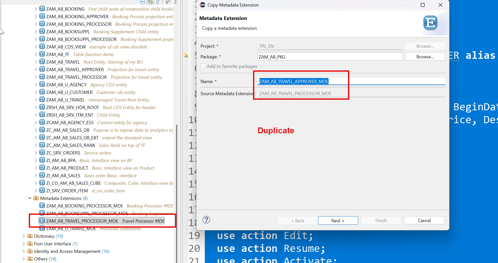

**📄 Metadata Extension (MDE)** - copy the block below exactly as it is:

```cds
@Metadata.layer: #CUSTOMER
@UI.headerInfo:{
   typeName: 'Travel',
   typeNamePlural: 'Travel Requests'  ,
   title: { value: 'TravelId' },
   description: { value: 'Description' } 
}
annotate entity ZAM_AB_TRAVEL_APPROVER
   with
{
   --Second screen ( applies only and only on Object Page )
   @UI.facet: [
       {
           purpose: #STANDARD,
           type: #COLLECTION,
           id: 'spiderman',
           label: 'General Information',
           position: 10
       },
       {
           id: 'TravelBasic',
           purpose: #STANDARD,
           type: #IDENTIFICATION_REFERENCE,
           parentId: 'spiderman',
           position: 10,
           label: 'More Info'
       },
       {
           id: 'TravelDates',
           type: #FIELDGROUP_REFERENCE,
           purpose: #STANDARD,
           parentId: 'spiderman',
           label: 'Dates',
           position: 30,
           targetQualifier: 'superman'       
       },
       {
           id: 'Pricing',
           type: #FIELDGROUP_REFERENCE,
           purpose: #STANDARD,
           parentId: 'spiderman',
           label: 'Pricing',
           position: 20,
           targetQualifier: 'wonderwomen'       
       },
       {
           id: 'TotalPrice',
           purpose: #HEADER,
           type: #DATAPOINT_REFERENCE,
           position: 10,
           targetQualifier: 'MyTravelCost'
       },
       {
           id: 'TravelStatus',
           purpose: #HEADER,
           type: #DATAPOINT_REFERENCE,
           position: 20,
           targetQualifier: 'MyTravelStatus'
       },
       {
           id: 'bookingDetails',
           label: 'Bookings',
           purpose: #STANDARD,
           type: #LINEITEM_REFERENCE,
           targetElement: '_Booking',
           position: 20
       }
   ]
   @UI.selectionField: [{ position: 10 }]
   @UI.lineItem: [{ position: 10 },
                  { type: #FOR_ACTION, dataAction: 'acceptTravel', label: 'Approve' },
                  { type: #FOR_ACTION, dataAction: 'rejectTravel', label: 'Reject' }]
   @UI.identification: [{ position: 10 }]
   TravelId;
   @UI.selectionField: [{ position: 20 }]
   @UI.lineItem: [{ position: 20 }]
   @UI.identification: [{ position: 20 }]   
   AgencyId;
   @UI.selectionField: [{ position: 30 }]
   @UI.lineItem: [{ position: 30, importance: #HIGH }]
   @UI.identification: [{ position: 30 }]
   CustomerId;
   @UI.selectionField: [{ position: 40 }]
   @UI.lineItem: [{ position: 40 }]
   @UI.fieldGroup: [{ position: 10, qualifier: 'superman' }]
   BeginDate;
   @UI.fieldGroup: [{ position: 20, qualifier: 'superman' }]
   EndDate;
   @UI.fieldGroup: [{ position: 20, qualifier: 'wonderwomen' }]
   BookingFee;
   @UI.lineItem: [{ position: 50 }]
   @UI.fieldGroup: [{ position: 10, qualifier: 'wonderwomen' }]
   @UI.dataPoint: { qualifier: 'MyTravelCost', title: 'Overall Cost' }
   TotalPrice;
   @UI.fieldGroup: [{ position: 30, qualifier: 'wonderwomen' }]
   CurrencyCode;
   @UI.identification: [{ position: 40 }]
   Description;
   @UI.lineItem: [{ position: 60, criticality: 'IconColor' }]
   @UI.fieldGroup: [{ position: 11, qualifier: 'wonderwomen' }]
   @UI.dataPoint: { qualifier: 'MyTravelStatus', title: 'Overall Status' }
   OverallStatus;
  
}
```

<details>
<summary>💡 What the important lines mean (click to open)</summary>

| Line / keyword | What it does |
|---|---|
| `@Metadata.layer: #CUSTOMER` | Which annotation layer this MDE belongs to. `#CUSTOMER` overrides `#CORE`, so the higher layer wins. |
| `@UI.headerInfo` | The object page's title area: what to call one record, many records, and which fields become the title and subtitle. |
| `@UI.facet` | The **layout plan** of the object page. Each facet is a section: `#IDENTIFICATION_REFERENCE` = a field block, `#LINEITEM_REFERENCE` = a child table, `#FIELDGROUP_REFERENCE` = a group of fields, `#COLLECTION` = a container for other facets. |
| `@UI.lineItem` | 'Show this field as a **column in the list**.' `position` decides the order; leave gaps (10, 20, 30) so you can insert later. |
| `@UI.identification` | 'Show this field on the **object page** (detail screen).' |
| `@UI.selectionField` | 'Put this field on the **filter bar** at the top of the list.' |
| `@UI.fieldGroup` | Groups fields under one heading. The `qualifier` name must match the `targetQualifier` of a `#FIELDGROUP_REFERENCE` facet. |
| `@UI.dataPoint` | One highlighted value, usually a KPI in the header. `criticality` colours it: 1 red, 2 yellow, 3 green. |
| `@UI.lineItem: [{ type: #FOR_ACTION, dataAction: '...' }]` | Puts a **button** on the screen that calls a RAP action. `dataAction` is the action name; `label` is what the user reads. |

</details>

**📄 Metadata Extension (MDE)** - copy the block below exactly as it is:

```cds
@Metadata.layer: #CUSTOMER
@UI.headerInfo:{
   typeName: 'Booking',
   typeNamePlural: 'Bookings',
   title: { value: 'BookingId' },
   description: { value: '_Carrier.Name' }
}
annotate entity ZAM_AB_BOOKING_approver
   with
{
   @UI.facet: [
               {
                   purpose: #STANDARD,
                   type: #IDENTIFICATION_REFERENCE,
                   label: 'Booking Info',
                   position: 10
                }
   ]
   @UI.lineItem: [{ position: 10 }]
   @UI.identification: [{ position: 10 }]
   BookingId;
   @UI.lineItem: [{ position: 20 }]
   @UI.identification: [{ position: 20 }]
   BookingDate;
   @UI.lineItem: [{ position: 30 }]
   @UI.identification: [{ position: 30 }]
   CustomerId;
   @UI.lineItem: [{ position: 40 }]
   @UI.identification: [{ position: 40 }]
   CarrierId;
   @UI.lineItem: [{ position: 50 }]
   @UI.identification: [{ position: 50 }]
   ConnectionId;
   @UI.lineItem: [{ position: 60 }]
   @UI.identification: [{ position: 60 }]
   FlightDate;
   @UI.lineItem: [{ position: 70 }]
   @UI.identification: [{ position: 70 }]
   FlightPrice;
   @UI.identification: [{ position: 80 }]
   CurrencyCode;
   @UI.lineItem: [{ position: 80 }]
   @UI.identification: [{ position: 90 }]
   BookingStatus;
   @UI.identification: [{ position: 100 }]
   LastChangedAt;   
  
}
```

<details>
<summary>💡 What the important lines mean (click to open)</summary>

| Line / keyword | What it does |
|---|---|
| `@Metadata.layer: #CUSTOMER` | Which annotation layer this MDE belongs to. `#CUSTOMER` overrides `#CORE`, so the higher layer wins. |
| `@UI.headerInfo` | The object page's title area: what to call one record, many records, and which fields become the title and subtitle. |
| `@UI.facet` | The **layout plan** of the object page. Each facet is a section: `#IDENTIFICATION_REFERENCE` = a field block, `#LINEITEM_REFERENCE` = a child table, `#FIELDGROUP_REFERENCE` = a group of fields, `#COLLECTION` = a container for other facets. |
| `@UI.lineItem` | 'Show this field as a **column in the list**.' `position` decides the order; leave gaps (10, 20, 30) so you can insert later. |
| `@UI.identification` | 'Show this field on the **object page** (detail screen).' |
| `annotate entity <X> with { ... }` | The MDE header: 'the `@UI` annotations below belong to that entity'. Keeping them in a separate file keeps UI decisions out of the data model. |

</details>

### Step 7. Service Definition for approver


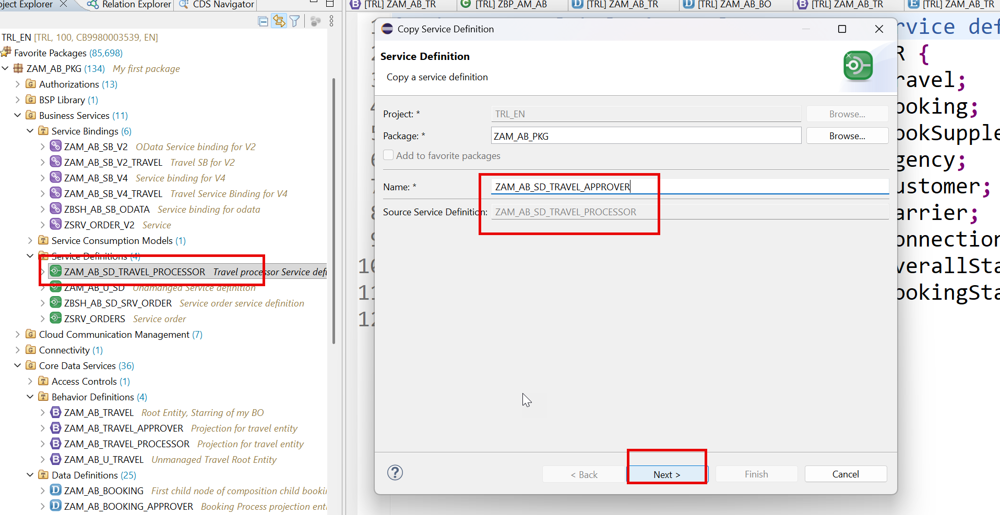

**📄 Service Definition** - copy the block below exactly as it is:

```cds
@EndUserText.label: 'Travel processor Service definition'
define service ZAM_AB_SD_TRAVEL_APPROVER {
 expose ZAM_AB_TRAVEL_APPROVER   as Travel;
 expose ZAM_AB_BOOKING_approver  as Booking;
 expose /DMO/I_Agency            as Agency;
 expose /DMO/I_Customer          as Customer;
 expose /DMO/I_Carrier           as Carrier;
 expose /DMO/I_Connection        as Connection;
 expose /DMO/I_Overall_Status_VH as OverallStatus;
 expose /DMO/I_Booking_Status_VH as BookingStatus;
}
```

<details>
<summary>💡 What the important lines mean (click to open)</summary>

| Line / keyword | What it does |
|---|---|
| `@EndUserText.label` | The human-readable description shown in tools and on screen. |
| `define service` | The guest list of your OData service: which entities may leave the system, and under which public names. |
| `expose <Entity> as <Name>` | Publishes one entity in the service under a public alias. The alias is what appears in the OData URL. |

</details>

### Step 8. Service Binding


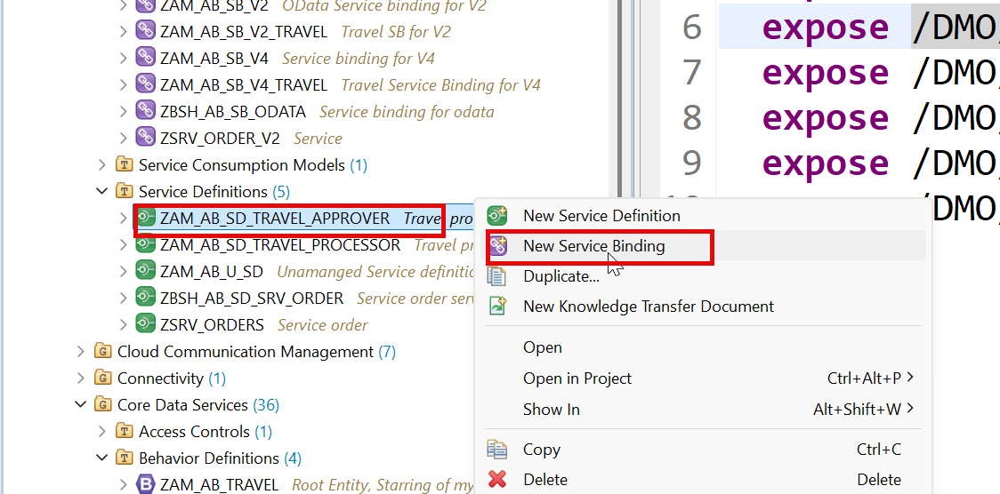


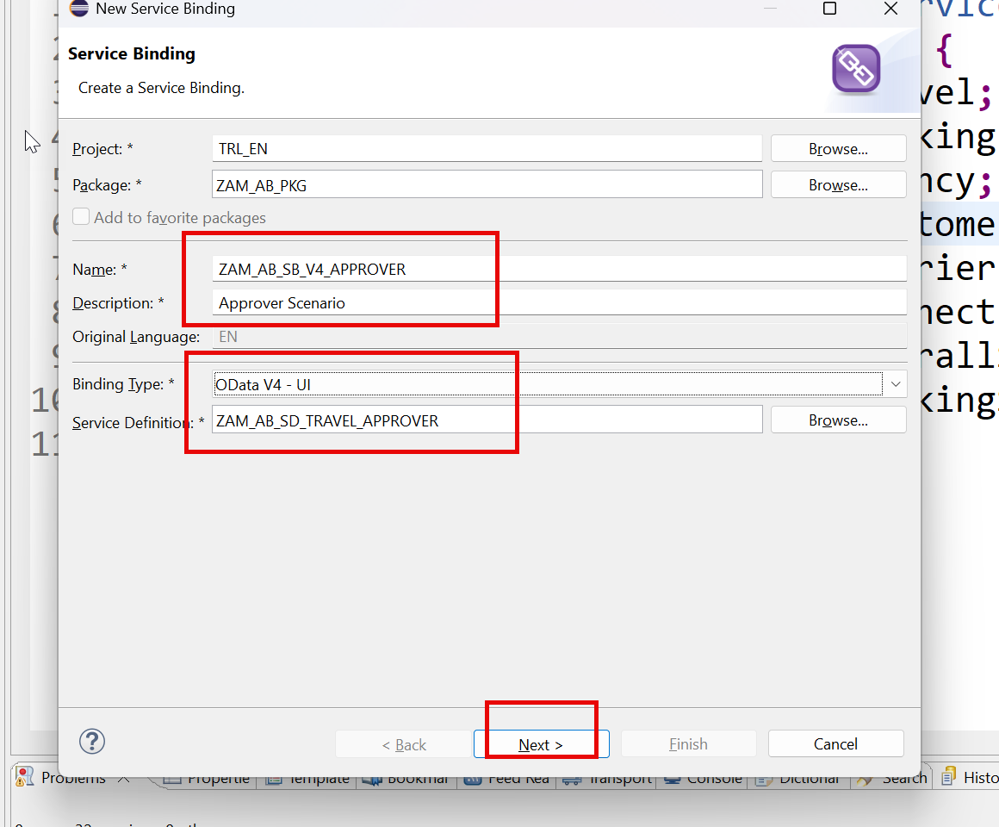

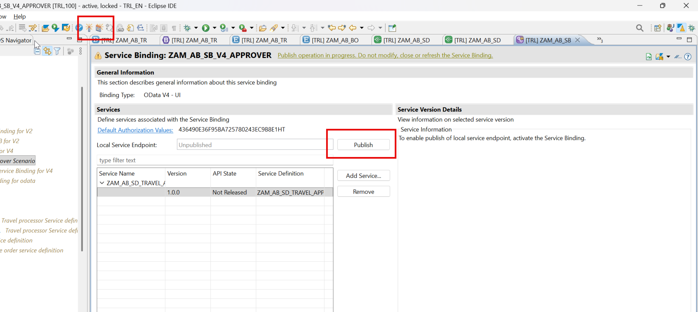

Finally Preview the App

### Step 9. Adding attachment features


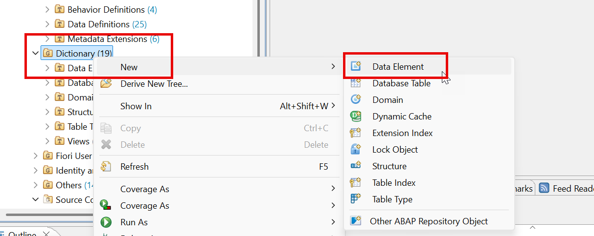


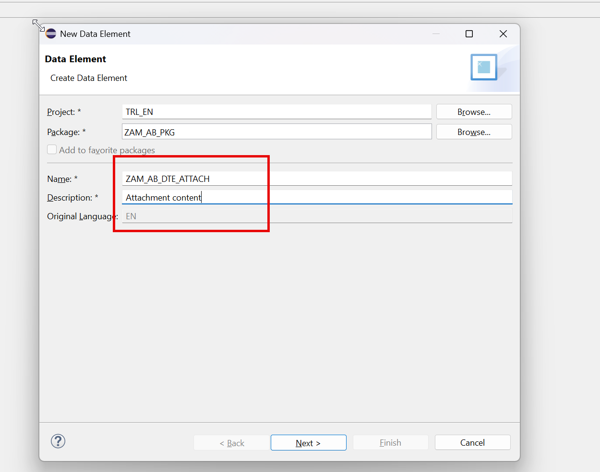

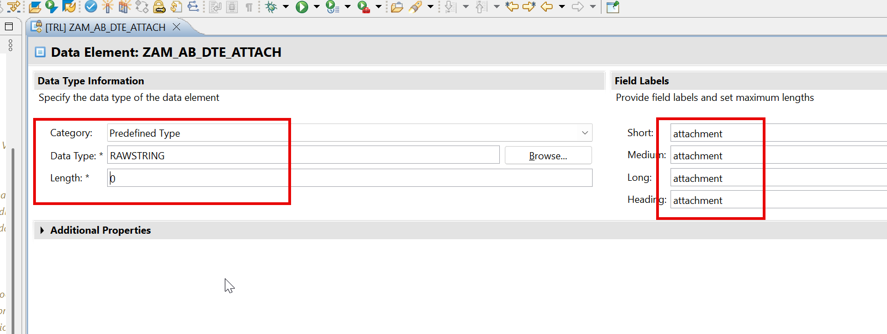

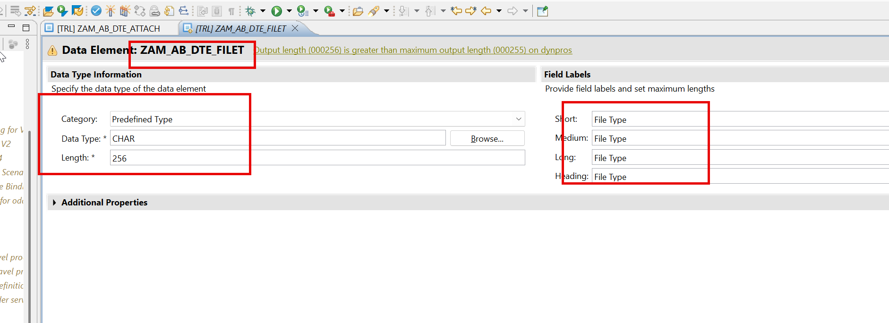

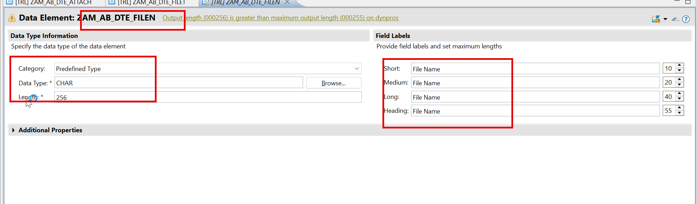

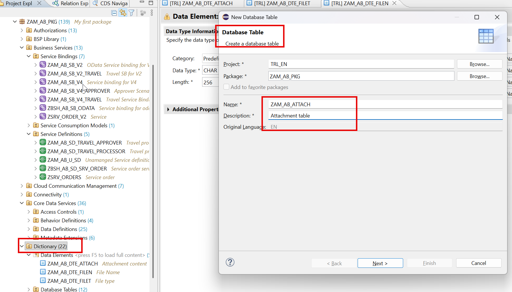

**📄 Database Table (DDL)** - copy the block below exactly as it is:

```cds
@EndUserText.label : 'Attachment table'
@AbapCatalog.enhancement.category : #NOT_EXTENSIBLE
@AbapCatalog.tableCategory : #TRANSPARENT
@AbapCatalog.deliveryClass : #A
@AbapCatalog.dataMaintenance : #RESTRICTED
define table zam_ab_attach {
 key client            : abap.clnt not null;
 key travel_id         : /dmo/travel_id not null;
 key id                : sysuuid_x16 not null;
 memo                  : abap.char(80);
 attachment            : zam_ab_dte_attach;
 filename              : zam_ab_dte_filen;
 filetype              : zam_ab_dte_filet;
 local_created_by      : abp_creation_user;
 local_created_at      : abp_creation_tstmpl;
 local_last_changed_by : abp_locinst_lastchange_user;
 local_last_changed_at : abp_locinst_lastchange_tstmpl;
 last_changed_at       : abp_lastchange_tstmpl;
}
```

<details>
<summary>💡 What the important lines mean (click to open)</summary>

| Line / keyword | What it does |
|---|---|
| `@AbapCatalog.tableCategory : #TRANSPARENT` | A normal database table - one table in ABAP means one table in HANA. |
| `@AbapCatalog.deliveryClass : #A` | 'A' = application data. It tells SAP this table holds business records, so system copies do not wipe it. |
| `@AbapCatalog.dataMaintenance : #RESTRICTED` | Controls whether anyone may edit rows with the generic table editor. `#RESTRICTED` keeps casual hands out. |
| `@AbapCatalog.enhancement.category : #NOT_EXTENSIBLE` | Nobody may bolt extra fields onto this table later. Declaring this is mandatory. |
| `define table` | Creates a real database table in HANA the moment you activate it. |
| `key client : abap.clnt not null` | The client (tenant) column. SAP can host several companies in one system, and this keeps their rows apart. Always the first key. |
| `abap.clnt` | The client data type (a 3-character tenant number). |
| `sysuuid_x16` | A 16-byte generated unique ID. Used when a record has no natural business key. |
| `@EndUserText.label` | The human-readable description shown in tools and on screen. |

</details>

### Step 10. Now create the entity and link with Travel

**📄 CDS View Entity** - copy the block below exactly as it is:

```cds
@AccessControl.authorizationCheck: #NOT_REQUIRED
@EndUserText.label: 'managed attachment entity'
@Metadata.ignorePropagatedAnnotations: true
define view entity ZAM_AB_M_ATTACH as select from zam_ab_attach
association to parent ZAM_AB_TRAVEL as _Travel
   on $projection.TravelId = _Travel.TravelId
    
{
   key travel_id as TravelId,
   @EndUserText.label: 'Attachment ID'
   key id as Id,
   @EndUserText.label: 'Comments'
   memo as Memo,
   @Semantics.largeObject: {
       mimeType: 'Filetype',
       fileName: 'Filename',
       contentDispositionPreference: #INLINE,
       acceptableMimeTypes: [ 'application/pdf' ]
   }
   @EndUserText.label: 'Attachment'
   attachment as Attachment,
   @EndUserText.label: 'File Name'
   filename as Filename,
   @EndUserText.label: 'File Type'
   @Semantics.mimeType: true
   filetype as Filetype,
   @Semantics.user.createdBy: true
   local_created_by as LocalCreatedBy,
   @Semantics.systemDateTime.createdAt: true
   local_created_at as LocalCreatedAt,
   @Semantics.user.lastChangedBy: true
   local_last_changed_by as LocalLastChangedBy,
   @Semantics.systemDateTime.localInstanceLastChangedAt: true
   local_last_changed_at as LocalLastChangedAt,
    @Semantics.systemDateTime.lastChangedAt: true
   last_changed_at as LastChangedAt,
   _Travel
}
```

<details>
<summary>💡 What the important lines mean (click to open)</summary>

| Line / keyword | What it does |
|---|---|
| `@AccessControl.authorizationCheck: #NOT_REQUIRED` | Skip the DCL authorisation check. Fine while learning - **never** on real customer data. |
| `@EndUserText.label` | The human-readable description shown in tools and on screen. |
| `@Metadata.ignorePropagatedAnnotations` | `true` = ignore annotations inherited from the views underneath, so you start with a clean slate. |
| `define view entity` | The modern CDS entity - one object, one name, faster and stricter than the old `define view`. |
| `define view` | The **obsolete** CDS View. Kept here only so you can see the difference. |
| `association to parent` | The child's pointer back up to its parent. Every child in a RAP BO needs exactly one. |
| `association to` | A reusable, lazily-evaluated relationship. Cheaper than a JOIN because it only runs when used. |
| `$projection.<Field>` | Refers to a field of the view you are currently writing (rather than of the joined source). |
| `@Semantics.largeObject` | Marks a binary field as a file, and points at the fields holding its MIME type and file name so the browser can render an upload/download control. |

</details>

**📄 CDS View Entity** - copy the block below exactly as it is:

```cds
@AccessControl.authorizationCheck: #NOT_REQUIRED
@EndUserText.label: 'Root Entity, Starring of my BO'
@Metadata.ignorePropagatedAnnotations: true
@VDM.viewType: #COMPOSITE
define root view entity ZAM_AB_TRAVEL as select from /dmo/travel_m
composition[0..*] of ZAM_AB_BOOKING as _Booking
composition[0..*] of ZAM_AB_M_ATTACH as _Attachment
--associations - lose coupling to get dependent data
association[1] to /DMO/I_Agency as _Agency on
   $projection.AgencyId = _Agency.AgencyID
association[1] to /DMO/I_Customer as _Customer on
   $projection.CustomerId = _Customer.CustomerID
association[1] to I_Currency as _Currency on
   $projection.CurrencyCode = _Currency.Currency
association[1..1] to /DMO/I_Overall_Status_VH as _OverallStatus on
   $projection.OverallStatus = _OverallStatus.OverallStatus
{
   @ObjectModel.text.element: [ 'Description' ]
   key travel_id as TravelId,
   @ObjectModel.text.element: [ 'AgencyName' ]
   @Consumption.valueHelpDefinition: [{
       entity.name: 'ZCAM_AB_AGENCY_ES5',
       entity.element: 'Agency_Id'
   }]
   agency_id as AgencyId,
   _Agency.Name as AgencyName,
   @ObjectModel.text.element: [ 'CustomerName' ]
   @Consumption.valueHelpDefinition: [{
       entity.name: '/DMO/I_Customer',
       entity.element: 'CustomerID'
   }]
   customer_id as CustomerId,
   _Customer.LastName as CustomerName,
   begin_date as BeginDate,
   end_date as EndDate,
   @Semantics.amount.currencyCode: 'CurrencyCode'
   booking_fee as BookingFee,
   @Semantics.amount.currencyCode: 'CurrencyCode'
   total_price as TotalPrice,
   @Consumption.valueHelpDefinition: [{
       entity.name: 'I_Currency',
       entity.element: 'Currency'
   }]
   currency_code as CurrencyCode,
   description as Description,
   @Consumption.valueHelpDefinition: [{
       entity.name: '/DMO/I_Overall_Status_VH',
       entity.element: 'OverallStatus'
   }]
   --@ObjectModel.foreignKey.association: '_OverallStatus'
   @ObjectModel.text.element: [ 'OverallStatusText' ]
   overall_status as OverallStatus,
   @Semantics.user.createdBy: true
   created_by as CreatedBy,
   @Semantics.systemDateTime.createdAt: true
   created_at as CreatedAt,
   @Semantics.user.lastChangedBy: true
   last_changed_by as LastChangedBy,
   @Semantics.systemDateTime.lastChangedAt: true
   last_changed_at as LastChangedAt,
   case overall_status
       when 'O' then 'Open'
       when 'A' then 'Approved'
       when 'X' then 'Rejected'
       when 'R' then 'Released'
       else 'Unknown'
       end as OverallStatusText,
   case overall_status
       when 'O' then 2
       when 'A' then 3
       when 'X' then 1
       when 'R' then 3
       else 1
       end as IconColor,
   _Booking,
    _Agency,
   _Customer,
   _Currency,
   _OverallStatus,
   _Attachment
   --_association_name // Make association public
}
```

<details>
<summary>💡 What the important lines mean (click to open)</summary>

| Line / keyword | What it does |
|---|---|
| `@AccessControl.authorizationCheck: #NOT_REQUIRED` | Skip the DCL authorisation check. Fine while learning - **never** on real customer data. |
| `@EndUserText.label` | The human-readable description shown in tools and on screen. |
| `@Metadata.ignorePropagatedAnnotations` | `true` = ignore annotations inherited from the views underneath, so you start with a clean slate. |
| `@VDM.viewType` | Where the view sits in SAP's *Virtual Data Model*: `#BASIC` (raw), `#COMPOSITE` (combined), `#CONSUMPTION` (for a UI or report). |
| `define root view entity` | The **top** of a RAP business object tree. Only the root can be exposed as the main entity of a service. |
| `association to` | A reusable, lazily-evaluated relationship. Cheaper than a JOIN because it only runs when used. |
| `$projection.<Field>` | Refers to a field of the view you are currently writing (rather than of the joined source). |
| `@ObjectModel.text.element` | 'The readable name for this code lives in that field.' The UI shows the word, but still stores and filters on the code. |
| `@ObjectModel.foreignKey.association` | Tells the framework which association validates this foreign-key field. |

</details>

### Step 11. Enhance Existing Travel BDEF

**📄 Behavior Definition (BDEF)** - copy the block below exactly as it is:

```abap
managed implementation in class zbp_am_ab_travel unique;
//guideline to be followed which runs the BDEF in strict mode
strict ( 2 );
//add draft feature at BO level
with draft;
define behavior for ZAM_AB_TRAVEL alias Travel
//this is the table where RAP will insert our data
persistent table /dmo/travel_m
//control the enqueue and dequeue
lock master
//mandatory to use total etag
total etag LastChangedAt
//who can modify, create, update, delete our data using this BDEF
authorization master ( instance )
//concurrency control - automatic
etag master LastChangedAt
//a draft table where temp data will keep saving
draft table zam_ab_trav_d
//automatic management of travel id from sequence generator
early numbering
{
 //enabling RAP to generate code for us for create, update, delete
 create (precheck);
 update (precheck);
 delete;
 field ( readonly ) TravelId;
 field ( mandatory ) BeginDate, EndDate, AgencyId, CustomerId;
 field (features:instance) OverallStatus;
 association _Booking { create ( features: instance ) ; with draft; }
 association _Attachment { create ; with draft; }
 //to fulfil the ego of RAP framework
 //adding the draft actions
 draft determine action Prepare;
 draft action Edit;
 draft action Resume;
 draft action Activate;
 draft action Discard;
 //Adding a instance based factory data action to copy my travel
 //itinerary based on exisiting travel
 factory action copyTravel [1];
 //non factory actions which will change the state of the BO instance
 action (features : instance) acceptTravel result[1] $self;
 action (features : instance) rejectTravel result[1] $self;
 //its a piece of code which is intented to be only
 //consumed within our RAP BO
 internal action reCalcTotalPrice;
 //Define determination to execute the code when
 //booking fee or curr code changes so we calc total price
 determination calculateTotalPrice on modify
           { create; field BookingFee, CurrencyCode; }
  //create a new determine action
 determine action validationCustomer { validation validateHeaderData; }
 //Adding side-effect which inform RAP to reaload the total price if the booking
 //fee has been changed on the Frontend
 //Side effects
 side effects {
   field BookingFee affects field TotalPrice;
   field CurrencyCode affects field TotalPrice;
   determine action validationCustomer executed on field CustomerId affects messages;
 }
 //Checking custom business object rules
 validation validateHeaderData on save {create; field CustomerId, BeginDate, EndDate;}
 //Since we use alias name in MDE (fiori sends) table has _ we need mapping
 mapping for /dmo/travel_m{
   TravelId = travel_id;
   AgencyId = agency_id;
   CustomerId = customer_id;
   BeginDate = begin_date;
   EndDate = end_date;
   TotalPrice = total_price;
   BookingFee = booking_fee;
   CurrencyCode = currency_code;
   Description = description;
   OverallStatus = overall_status;
   CreatedBy = created_by;
   LastChangedBy = last_changed_by;
   CreatedAt = created_at;
   LastChangedAt = last_changed_at;
 }
}
define behavior for ZAM_AB_BOOKING alias Booking
persistent table /dmo/booking_m
//child entities depends on the lock of root entity
lock dependent by _Travel
//auth depedent on the root entity
authorization dependent by _Travel
//concurrency at booking
etag master LastChangedAt
//add booking draft table and use quick fix to create
draft table zam_ab_book_d
//automatic management of booking id from sequence generator
early numbering
{
 update;
 delete;
 field ( readonly ) TravelId, BookingId;
 association _Travel;
 association _BookingSuppl { create; with draft; }
 mapping for /dmo/booking_m{
   TravelId = travel_id;
   BookingId = booking_id;
   BookingDate = booking_date;
   CustomerId = customer_id;
   CarrierId = carrier_id;
   ConnectionId = connection_id;
   FlightDate = flight_date;
   FlightPrice = flight_price;
   CurrencyCode = currency_code;
   BookingStatus = booking_status;
   LastChangedAt = last_changed_at;
 }
}
define behavior for ZAM_AB_BOOKSUPPL alias BookingSuppl
persistent table /dmo/booksuppl_m
//child entities depends on the lock of root entity
lock dependent by _Travel
authorization dependent by _Travel
etag master LastChangedAt
draft table zam_ab_books_d
{
 update;
 delete;
 field ( readonly ) TravelId, BookingId;
 association _Travel;
 association _Booking;
 mapping for /dmo/booksuppl_m{
   TravelId = travel_id;
   BookingId = booking_id;
   BookingSupplementId = booking_supplement_id;
   SupplementId = supplement_id;
   Price = price;
   CurrencyCode = currency_code;
   LastChangedAt = last_changed_at;
 }
}
//define the behavior for child entity
define behavior for ZAM_AB_m_attach alias Attachment
//make the behavior pool/implemetation for booking
//implementation in class zbp_ats_xx_attach unique
//telling the framework to insert data in this db table for booking
persistent table ZAM_AB_attach
lock dependent by _Travel
authorization dependent by _Travel
//draft table for the booking
draft table zam_ab_attachd
etag master LastChangedAt
{
 update;
 delete;
 field (numbering : managed) id;
 field ( readonly ) TravelId, id;
 //Reconfirm that booking will create with travel draft
 association _Travel { with draft; }
 mapping for ZAM_AB_attach{
   TravelId = travel_id;
   Id = Id;
   Attachment = attachment;
   Filename = filename;
   Filetype = filetype;
   Memo = memo;
   LastChangedAt = last_changed_at;
   LocalCreatedAt = local_created_at;
   LocalCreatedBy = local_created_by;
   LocalLastChangedAt = local_last_changed_at;
   LocalLastChangedBy = local_last_changed_by;
 }
}
```

<details>
<summary>💡 What the important lines mean (click to open)</summary>

| Line / keyword | What it does |
|---|---|
| `association to` | A reusable, lazily-evaluated relationship. Cheaper than a JOIN because it only runs when used. |
| `managed implementation in class ... unique` | RAP writes the INSERT/UPDATE/DELETE for you; your class only holds the special logic. |
| `strict ( 2 );` | Turns on the strictest syntax checks. It refuses code that would break in a future release - always switch it on. |
| `with draft;` | Switches on the draft (auto-save) mechanism for this entity. |
| `draft table <name>` | The shadow table that stores half-finished records. **Generate it with a quick fix and remember to activate it.** |
| `total etag <Field>` | The change-detection stamp. If someone else saved first, your save is rejected instead of silently overwriting them. |
| `lock master` | 'I am the root - I own the lock for this whole business object.' Children use `lock dependent by _Travel`. |
| `lock dependent by` | 'I do not own a lock; ask my parent.' Standard for every child entity. |
| `authorization master ( instance )` | 'I decide the permissions for this whole BO.' `( instance )` means the decision is made per record, in code. |

</details>

### Step 12. Use quick fix to create draft table


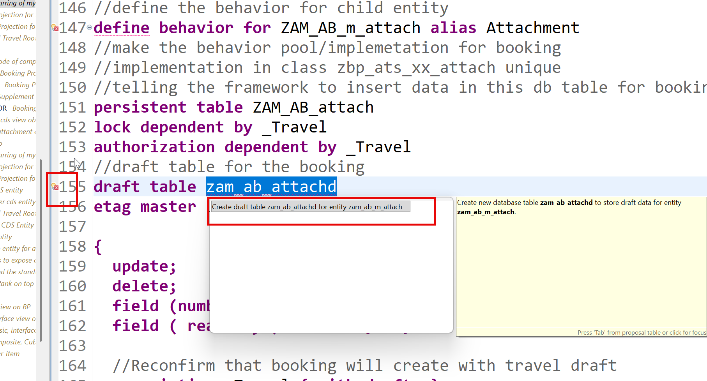

### Step 13. Activate Draft table


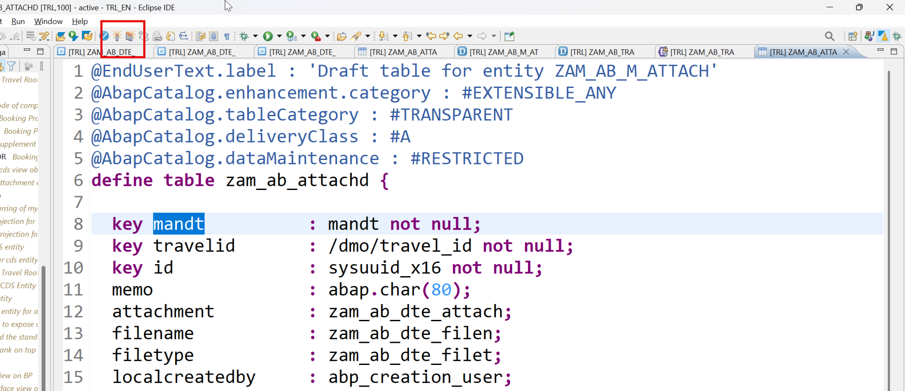

Activate the BDEF

### Step 14. Create Attachment Processor Projection Entity

**📄 CDS Projection View** - copy the block below exactly as it is:

```cds
@EndUserText.label: 'My Travel processor projection'
@AccessControl.authorizationCheck: #NOT_REQUIRED
@Metadata.allowExtensions: true
define view entity ZAM_AB_ATTACH_PROCESSOR as projection on ZAM_AB_M_ATTACH
{
   key TravelId,
   key Id,
   Memo,
   Attachment,
   Filetype,
   Filename,
   LastChangedAt,
   LocalCreatedAt,
   LocalCreatedBy,
   LocalLastChangedAt,
   LocalLastChangedBy,
   _Travel: redirected to parent ZAM_AB_TRAVEL_PROCESSOR
}
```

<details>
<summary>💡 What the important lines mean (click to open)</summary>

| Line / keyword | What it does |
|---|---|
| `@AccessControl.authorizationCheck: #NOT_REQUIRED` | Skip the DCL authorisation check. Fine while learning - **never** on real customer data. |
| `@EndUserText.label` | The human-readable description shown in tools and on screen. |
| `@Metadata.allowExtensions: true` | Permits a separate Metadata Extension (MDE) file to attach `@UI` annotations to this entity. |
| `define view entity` | The modern CDS entity - one object, one name, faster and stricter than the old `define view`. |
| `define view` | The **obsolete** CDS View. Kept here only so you can see the difference. |
| `as projection on` | A window onto another entity: same data, but you choose which fields to expose. This is the projection layer. |

</details>

### Step 15. Enhance Travel processor for attachment

**📄 CDS Projection View** - copy the block below exactly as it is:

```cds
@AccessControl.authorizationCheck: #NOT_REQUIRED
@EndUserText.label: 'Projection for travel entity'
@Metadata.ignorePropagatedAnnotations: false
@Metadata.allowExtensions: true
define root view entity ZAM_AB_TRAVEL_PROCESSOR as projection on ZAM_AB_TRAVEL
{
   key TravelId,
   AgencyId,
   CustomerId,
   BeginDate,
   EndDate,
   BookingFee,
   TotalPrice,
   CurrencyCode,
   Description,
   OverallStatus,
   CreatedBy,
   CreatedAt,
   LastChangedBy,
   LastChangedAt,
   AgencyName,
   CustomerName,
   OverallStatusText,
   IconColor,
   @ObjectModel.virtualElementCalculatedBy: 'ABAP:ZCL_AM_AB_VE_CALC'
   @EndUserText.label: 'CO2 Tax'
   virtual CO2Tax : abap.int4,
   @ObjectModel.virtualElementCalculatedBy: 'ABAP:ZCL_AM_AB_VE_CALC'
   @EndUserText.label: 'Week Day'
   virtual dayOfTheFlight : abap.char( 9 ),
   /* Associations */
   _Agency,
   _Booking: redirected to composition child ZAM_AB_BOOKING_PROCESSOR,
   _Attachment: redirected to composition child ZAM_AB_ATTACH_PROCESSOR,
   _Currency,
   _Customer,
   _OverallStatus
}
```

<details>
<summary>💡 What the important lines mean (click to open)</summary>

| Line / keyword | What it does |
|---|---|
| `@AccessControl.authorizationCheck: #NOT_REQUIRED` | Skip the DCL authorisation check. Fine while learning - **never** on real customer data. |
| `@EndUserText.label` | The human-readable description shown in tools and on screen. |
| `@Metadata.ignorePropagatedAnnotations` | `true` = ignore annotations inherited from the views underneath, so you start with a clean slate. |
| `@Metadata.allowExtensions: true` | Permits a separate Metadata Extension (MDE) file to attach `@UI` annotations to this entity. |
| `define root view entity` | The **top** of a RAP business object tree. Only the root can be exposed as the main entity of a service. |
| `as projection on` | A window onto another entity: same data, but you choose which fields to expose. This is the projection layer. |
| `virtual <Field>` | A field that is **never stored**. An ABAP class calculates it each time the entity is read. |
| `@ObjectModel.virtualElementCalculatedBy` | Names the ABAP class that computes a virtual element at runtime. |

</details>

---

## 📦 Objects in your package after today

```text
$Z_AM_AB  (your package - replace _AB_ with your own initials)
  ├── ZAM_AB_TRAVEL_APPROVER              CDS root entity
  ├── ZAM_AB_BOOKING_approver             CDS entity
  ├── ZAM_AB_SD_TRAVEL_APPROVER           Service definition
  ├── zam_ab_attach                       Database table
  ├── ZAM_AB_M_ATTACH                     CDS entity
  ├── ZAM_AB_TRAVEL                       CDS root entity
  ├── ZAM_AB_ATTACH_PROCESSOR             CDS entity
  ├── ZAM_AB_TRAVEL_PROCESSOR             CDS root entity
```

---

## ✅ Final version of all code from Day 18

Everything below is the **complete, unmodified** source from the training material, gathered in one place so you can copy it straight into Eclipse.

### 1. Change the BDEF to add new actions with feature control - _Behavior Definition (BDEF)_

```abap
managed implementation in class zbp_am_ab_travel unique;
//guideline to be followed which runs the BDEF in strict mode
strict ( 2 );
//add draft feature at BO level
with draft;
define behavior for ZAM_AB_TRAVEL alias Travel
//this is the table where RAP will insert our data
persistent table /dmo/travel_m
//control the enqueue and dequeue
lock master
//mandatory to use total etag
total etag LastChangedAt
//who can modify, create, update, delete our data using this BDEF
authorization master ( instance )
//concurrency control - automatic
etag master LastChangedAt
//a draft table where temp data will keep saving
draft table zam_ab_trav_d
//automatic management of travel id from sequence generator
early numbering
{
 //enabling RAP to generate code for us for create, update, delete
 create (precheck);
 update (precheck);
 delete;
 field ( readonly ) TravelId;
 field ( mandatory ) BeginDate, EndDate, AgencyId, CustomerId;
 field (features:instance) OverallStatus;
 association _Booking { create ( features: instance ) ; with draft; }
 //to fulfil the ego of RAP framework
 //adding the draft actions
 draft determine action Prepare;
 draft action Edit;
 draft action Resume;
 draft action Activate;
 draft action Discard;
 //Adding a instance based factory data action to copy my travel
 //itinerary based on exisiting travel
 factory action copyTravel [1];
 //non factory actions which will change the state of the BO instance
 action (features : instance) acceptTravel result[1] $self;
 action (features : instance) rejectTravel result[1] $self;
 //its a piece of code which is intented to be only
 //consumed within our RAP BO
 internal action reCalcTotalPrice;
 //Define determination to execute the code when
 //booking fee or curr code changes so we calc total price
 determination calculateTotalPrice on modify
           { create; field BookingFee, CurrencyCode; }
  //create a new determine action
 determine action validationCustomer { validation validateHeaderData; }
 //Adding side-effect which inform RAP to reaload the total price if the booking
 //fee has been changed on the Frontend
 //Side effects
 side effects {
   field BookingFee affects field TotalPrice;
   field CurrencyCode affects field TotalPrice;
   determine action validationCustomer executed on field CustomerId affects messages;
 }
 //Checking custom business object rules
 validation validateHeaderData on save {create; field CustomerId, BeginDate, EndDate;}
 //Since we use alias name in MDE (fiori sends) table has _ we need mapping
 mapping for /dmo/travel_m{
   TravelId = travel_id;
   AgencyId = agency_id;
   CustomerId = customer_id;
   BeginDate = begin_date;
   EndDate = end_date;
   TotalPrice = total_price;
   BookingFee = booking_fee;
   CurrencyCode = currency_code;
   Description = description;
   OverallStatus = overall_status;
   CreatedBy = created_by;
   LastChangedBy = last_changed_by;
   CreatedAt = created_at;
   LastChangedAt = last_changed_at;
 }
}
define behavior for ZAM_AB_BOOKING alias Booking
persistent table /dmo/booking_m
//child entities depends on the lock of root entity
lock dependent by _Travel
//auth depedent on the root entity
authorization dependent by _Travel
//concurrency at booking
etag master LastChangedAt
//add booking draft table and use quick fix to create
draft table zam_ab_book_d
//automatic management of booking id from sequence generator
early numbering
{
 update;
 delete;
 field ( readonly ) TravelId, BookingId;
 association _Travel;
 association _BookingSuppl { create; with draft; }
 mapping for /dmo/booking_m{
   TravelId = travel_id;
   BookingId = booking_id;
   BookingDate = booking_date;
   CustomerId = customer_id;
   CarrierId = carrier_id;
   ConnectionId = connection_id;
   FlightDate = flight_date;
   FlightPrice = flight_price;
   CurrencyCode = currency_code;
   BookingStatus = booking_status;
   LastChangedAt = last_changed_at;
 }
}
define behavior for ZAM_AB_BOOKSUPPL alias BookingSuppl
persistent table /dmo/booksuppl_m
//child entities depends on the lock of root entity
lock dependent by _Travel
authorization dependent by _Travel
etag master LastChangedAt
draft table zam_ab_books_d
{
 update;
 delete;
 field ( readonly ) TravelId, BookingId;
 association _Travel;
 association _Booking;
 mapping for /dmo/booksuppl_m{
   TravelId = travel_id;
   BookingId = booking_id;
   BookingSupplementId = booking_supplement_id;
   SupplementId = supplement_id;
   Price = price;
   CurrencyCode = currency_code;
   LastChangedAt = last_changed_at;
 }
}
```

### 2. Activate and Quick fix - _ABAP Method Implementation_

```abap
 METHOD get_instance_features.
   "Step 1: Read the travel data with status
   READ ENTITIES OF zam_ab_travel in local mode
       ENTITY travel
           FIELDS ( travelid overallstatus AgencyId )
           with     CORRESPONDING #( keys )
       RESULT data(travels)
       FAILED failed.
   "Step 2: return the result with booking creation possible or not
   read table travels into data(ls_travel) index 1.
   if ( ls_travel-OverallStatus = 'X' ).
       data(lv_allow) = if_abap_behv=>fc-o-disabled.
   else.
       lv_allow = if_abap_behv=>fc-o-enabled.
   ENDIF.
   result = value #( for travel in travels
                       ( %tky = travel-%tky
                         %assoc-_Booking = lv_allow
                         %action-acceptTravel = COND #( WHEN ls_travel-OverallStatus = 'A'
                                                           then if_abap_behv=>fc-o-disabled
                                                           else if_abap_behv=>fc-o-enabled
                         )
                         %action-rejectTravel = COND #( WHEN ls_travel-OverallStatus = 'X'
                                                           then if_abap_behv=>fc-o-disabled
                                                           else if_abap_behv=>fc-o-enabled
                         )
                         %field-OverallStatus = COND #( WHEN ls_travel-AgencyId = '070033'
                                                           then if_abap_behv=>fc-o-disabled
                                                           else if_abap_behv=>fc-o-enabled
                         )
                       )
                   ).
 ENDMETHOD.
```

### 3. Activate and Quick fix - _ABAP Method Implementation_

```abap
 METHOD acceptTravel.
   ""Perform the change of BO instance to change status
   MODIFY ENTITIES OF zAM_AB_travel
       ENTITY travel
           UPDATE FIELDS ( OverallStatus )
           WITH VALUE #( for key in keys ( %tky = key-%tky
                                           %is_draft = key-%is_draft
                                           OverallStatus = 'A'
            )  ).
   ""Read the BO instance on which we want to make the changes
   READ ENTITIES OF zAM_AB_travel
       ENTITY Travel
           ALL FIELDS
               WITH CORRESPONDING #( keys )
                   RESULT data(lt_results).
   result = value #( for travel in lt_results ( %tky = travel-%tky
                                                %param = travel
   ) ).
 ENDMETHOD.
 METHOD rejectTravel.
""Perform the change of BO instance to change status
   MODIFY ENTITIES OF zAM_AB_travel
       ENTITY travel
           UPDATE FIELDS ( OverallStatus )
           WITH VALUE #( for key in keys ( %tky = key-%tky
                                                       %is_draft = key-%is_draft
                                                       OverallStatus = 'X'
            )  ).
   ""Read the BO instance on which we want to make the changes
   READ ENTITIES OF zAM_AB_travel
       ENTITY Travel
           ALL FIELDS
               WITH CORRESPONDING #( keys )
                   RESULT data(lt_results).
   result = value #( for travel in lt_results ( %tky = travel-%tky
                                                         %param = travel
   ) ).
 ENDMETHOD.
```

### 4. Now we create the approver projection views - _CDS Projection View_

```cds
@AccessControl.authorizationCheck: #NOT_REQUIRED
@EndUserText.label: 'Projection for travel entity'
@Metadata.ignorePropagatedAnnotations: false
@Metadata.allowExtensions: true
define root view entity ZAM_AB_TRAVEL_APPROVER as projection on ZAM_AB_TRAVEL
{
   key TravelId,
   AgencyId,
   CustomerId,
   BeginDate,
   EndDate,
   BookingFee,
   TotalPrice,
   CurrencyCode,
   Description,
   OverallStatus,
   CreatedBy,
   CreatedAt,
   LastChangedBy,
   LastChangedAt,
   AgencyName,
   CustomerName,
   OverallStatusText,
   IconColor,
   _Agency,
   _Booking: redirected to composition child ZAM_AB_BOOKING_APPROVER,
   _Currency,
   _Customer,
   _OverallStatus
}
```

### 5. Now we create the approver projection views - _CDS Projection View_

```cds
@AccessControl.authorizationCheck: #NOT_REQUIRED
@EndUserText.label: 'Booking Process projection entity'
@Metadata.ignorePropagatedAnnotations: false
@Metadata.allowExtensions: true
define view entity ZAM_AB_BOOKING_approver as projection on ZAM_AB_BOOKING
{
   key TravelId,
   key BookingId,
   BookingDate,
   CustomerId,
   CarrierId,
   ConnectionId,
   FlightDate,
   FlightPrice,
   CurrencyCode,
   BookingStatus,
   LastChangedAt,
   /* Associations */
   _BookingStatus,
   _Carrier,
   _Connection,
   _Customer,
   _Travel :  redirected to parent ZAM_AB_TRAVEL_APPROVER
}
```

### 6. BDEF for approver - _Behavior Definition - projection (BDEF)_

```abap
projection;
strict ( 2 );
use draft;
define behavior for ZAM_AB_TRAVEL_APPROVER alias Travel
{
 //use create;
 use update;
 field (readonly) AgencyId, CustomerId, BeginDate, EndDate,
                  OverallStatus, TotalPrice, Description;
 //use delete;
 //use action copyTravel;
 use action acceptTravel;
 use action rejectTravel;
 //use action validationCustomer;
 use action Prepare;
 use action Edit;
 use action Resume;
 use action Activate;
 use action Discard;
 use association _Booking ;
}
define behavior for ZAM_AB_BOOKING_approver alias Booking
{
 //use update;
 //use delete;
 use association _Travel;
}
```

### 7. MDE for Approver - _Metadata Extension (MDE)_

```cds
@Metadata.layer: #CUSTOMER
@UI.headerInfo:{
   typeName: 'Travel',
   typeNamePlural: 'Travel Requests'  ,
   title: { value: 'TravelId' },
   description: { value: 'Description' } 
}
annotate entity ZAM_AB_TRAVEL_APPROVER
   with
{
   --Second screen ( applies only and only on Object Page )
   @UI.facet: [
       {
           purpose: #STANDARD,
           type: #COLLECTION,
           id: 'spiderman',
           label: 'General Information',
           position: 10
       },
       {
           id: 'TravelBasic',
           purpose: #STANDARD,
           type: #IDENTIFICATION_REFERENCE,
           parentId: 'spiderman',
           position: 10,
           label: 'More Info'
       },
       {
           id: 'TravelDates',
           type: #FIELDGROUP_REFERENCE,
           purpose: #STANDARD,
           parentId: 'spiderman',
           label: 'Dates',
           position: 30,
           targetQualifier: 'superman'       
       },
       {
           id: 'Pricing',
           type: #FIELDGROUP_REFERENCE,
           purpose: #STANDARD,
           parentId: 'spiderman',
           label: 'Pricing',
           position: 20,
           targetQualifier: 'wonderwomen'       
       },
       {
           id: 'TotalPrice',
           purpose: #HEADER,
           type: #DATAPOINT_REFERENCE,
           position: 10,
           targetQualifier: 'MyTravelCost'
       },
       {
           id: 'TravelStatus',
           purpose: #HEADER,
           type: #DATAPOINT_REFERENCE,
           position: 20,
           targetQualifier: 'MyTravelStatus'
       },
       {
           id: 'bookingDetails',
           label: 'Bookings',
           purpose: #STANDARD,
           type: #LINEITEM_REFERENCE,
           targetElement: '_Booking',
           position: 20
       }
   ]
   @UI.selectionField: [{ position: 10 }]
   @UI.lineItem: [{ position: 10 },
                  { type: #FOR_ACTION, dataAction: 'acceptTravel', label: 'Approve' },
                  { type: #FOR_ACTION, dataAction: 'rejectTravel', label: 'Reject' }]
   @UI.identification: [{ position: 10 }]
   TravelId;
   @UI.selectionField: [{ position: 20 }]
   @UI.lineItem: [{ position: 20 }]
   @UI.identification: [{ position: 20 }]   
   AgencyId;
   @UI.selectionField: [{ position: 30 }]
   @UI.lineItem: [{ position: 30, importance: #HIGH }]
   @UI.identification: [{ position: 30 }]
   CustomerId;
   @UI.selectionField: [{ position: 40 }]
   @UI.lineItem: [{ position: 40 }]
   @UI.fieldGroup: [{ position: 10, qualifier: 'superman' }]
   BeginDate;
   @UI.fieldGroup: [{ position: 20, qualifier: 'superman' }]
   EndDate;
   @UI.fieldGroup: [{ position: 20, qualifier: 'wonderwomen' }]
   BookingFee;
   @UI.lineItem: [{ position: 50 }]
   @UI.fieldGroup: [{ position: 10, qualifier: 'wonderwomen' }]
   @UI.dataPoint: { qualifier: 'MyTravelCost', title: 'Overall Cost' }
   TotalPrice;
   @UI.fieldGroup: [{ position: 30, qualifier: 'wonderwomen' }]
   CurrencyCode;
   @UI.identification: [{ position: 40 }]
   Description;
   @UI.lineItem: [{ position: 60, criticality: 'IconColor' }]
   @UI.fieldGroup: [{ position: 11, qualifier: 'wonderwomen' }]
   @UI.dataPoint: { qualifier: 'MyTravelStatus', title: 'Overall Status' }
   OverallStatus;
  
}
```

### 8. MDE for Approver - _Metadata Extension (MDE)_

```cds
@Metadata.layer: #CUSTOMER
@UI.headerInfo:{
   typeName: 'Booking',
   typeNamePlural: 'Bookings',
   title: { value: 'BookingId' },
   description: { value: '_Carrier.Name' }
}
annotate entity ZAM_AB_BOOKING_approver
   with
{
   @UI.facet: [
               {
                   purpose: #STANDARD,
                   type: #IDENTIFICATION_REFERENCE,
                   label: 'Booking Info',
                   position: 10
                }
   ]
   @UI.lineItem: [{ position: 10 }]
   @UI.identification: [{ position: 10 }]
   BookingId;
   @UI.lineItem: [{ position: 20 }]
   @UI.identification: [{ position: 20 }]
   BookingDate;
   @UI.lineItem: [{ position: 30 }]
   @UI.identification: [{ position: 30 }]
   CustomerId;
   @UI.lineItem: [{ position: 40 }]
   @UI.identification: [{ position: 40 }]
   CarrierId;
   @UI.lineItem: [{ position: 50 }]
   @UI.identification: [{ position: 50 }]
   ConnectionId;
   @UI.lineItem: [{ position: 60 }]
   @UI.identification: [{ position: 60 }]
   FlightDate;
   @UI.lineItem: [{ position: 70 }]
   @UI.identification: [{ position: 70 }]
   FlightPrice;
   @UI.identification: [{ position: 80 }]
   CurrencyCode;
   @UI.lineItem: [{ position: 80 }]
   @UI.identification: [{ position: 90 }]
   BookingStatus;
   @UI.identification: [{ position: 100 }]
   LastChangedAt;   
  
}
```

### 9. Service Definition for approver - _Service Definition_

```cds
@EndUserText.label: 'Travel processor Service definition'
define service ZAM_AB_SD_TRAVEL_APPROVER {
 expose ZAM_AB_TRAVEL_APPROVER   as Travel;
 expose ZAM_AB_BOOKING_approver  as Booking;
 expose /DMO/I_Agency            as Agency;
 expose /DMO/I_Customer          as Customer;
 expose /DMO/I_Carrier           as Carrier;
 expose /DMO/I_Connection        as Connection;
 expose /DMO/I_Overall_Status_VH as OverallStatus;
 expose /DMO/I_Booking_Status_VH as BookingStatus;
}
```

### 10. Adding attachment features - _Database Table (DDL)_

```cds
@EndUserText.label : 'Attachment table'
@AbapCatalog.enhancement.category : #NOT_EXTENSIBLE
@AbapCatalog.tableCategory : #TRANSPARENT
@AbapCatalog.deliveryClass : #A
@AbapCatalog.dataMaintenance : #RESTRICTED
define table zam_ab_attach {
 key client            : abap.clnt not null;
 key travel_id         : /dmo/travel_id not null;
 key id                : sysuuid_x16 not null;
 memo                  : abap.char(80);
 attachment            : zam_ab_dte_attach;
 filename              : zam_ab_dte_filen;
 filetype              : zam_ab_dte_filet;
 local_created_by      : abp_creation_user;
 local_created_at      : abp_creation_tstmpl;
 local_last_changed_by : abp_locinst_lastchange_user;
 local_last_changed_at : abp_locinst_lastchange_tstmpl;
 last_changed_at       : abp_lastchange_tstmpl;
}
```

### 11. Now create the entity and link with Travel - _CDS View Entity_

```cds
@AccessControl.authorizationCheck: #NOT_REQUIRED
@EndUserText.label: 'managed attachment entity'
@Metadata.ignorePropagatedAnnotations: true
define view entity ZAM_AB_M_ATTACH as select from zam_ab_attach
association to parent ZAM_AB_TRAVEL as _Travel
   on $projection.TravelId = _Travel.TravelId
    
{
   key travel_id as TravelId,
   @EndUserText.label: 'Attachment ID'
   key id as Id,
   @EndUserText.label: 'Comments'
   memo as Memo,
   @Semantics.largeObject: {
       mimeType: 'Filetype',
       fileName: 'Filename',
       contentDispositionPreference: #INLINE,
       acceptableMimeTypes: [ 'application/pdf' ]
   }
   @EndUserText.label: 'Attachment'
   attachment as Attachment,
   @EndUserText.label: 'File Name'
   filename as Filename,
   @EndUserText.label: 'File Type'
   @Semantics.mimeType: true
   filetype as Filetype,
   @Semantics.user.createdBy: true
   local_created_by as LocalCreatedBy,
   @Semantics.systemDateTime.createdAt: true
   local_created_at as LocalCreatedAt,
   @Semantics.user.lastChangedBy: true
   local_last_changed_by as LocalLastChangedBy,
   @Semantics.systemDateTime.localInstanceLastChangedAt: true
   local_last_changed_at as LocalLastChangedAt,
    @Semantics.systemDateTime.lastChangedAt: true
   last_changed_at as LastChangedAt,
   _Travel
}
```

### 12. Now create the entity and link with Travel - _CDS View Entity_

```cds
@AccessControl.authorizationCheck: #NOT_REQUIRED
@EndUserText.label: 'Root Entity, Starring of my BO'
@Metadata.ignorePropagatedAnnotations: true
@VDM.viewType: #COMPOSITE
define root view entity ZAM_AB_TRAVEL as select from /dmo/travel_m
composition[0..*] of ZAM_AB_BOOKING as _Booking
composition[0..*] of ZAM_AB_M_ATTACH as _Attachment
--associations - lose coupling to get dependent data
association[1] to /DMO/I_Agency as _Agency on
   $projection.AgencyId = _Agency.AgencyID
association[1] to /DMO/I_Customer as _Customer on
   $projection.CustomerId = _Customer.CustomerID
association[1] to I_Currency as _Currency on
   $projection.CurrencyCode = _Currency.Currency
association[1..1] to /DMO/I_Overall_Status_VH as _OverallStatus on
   $projection.OverallStatus = _OverallStatus.OverallStatus
{
   @ObjectModel.text.element: [ 'Description' ]
   key travel_id as TravelId,
   @ObjectModel.text.element: [ 'AgencyName' ]
   @Consumption.valueHelpDefinition: [{
       entity.name: 'ZCAM_AB_AGENCY_ES5',
       entity.element: 'Agency_Id'
   }]
   agency_id as AgencyId,
   _Agency.Name as AgencyName,
   @ObjectModel.text.element: [ 'CustomerName' ]
   @Consumption.valueHelpDefinition: [{
       entity.name: '/DMO/I_Customer',
       entity.element: 'CustomerID'
   }]
   customer_id as CustomerId,
   _Customer.LastName as CustomerName,
   begin_date as BeginDate,
   end_date as EndDate,
   @Semantics.amount.currencyCode: 'CurrencyCode'
   booking_fee as BookingFee,
   @Semantics.amount.currencyCode: 'CurrencyCode'
   total_price as TotalPrice,
   @Consumption.valueHelpDefinition: [{
       entity.name: 'I_Currency',
       entity.element: 'Currency'
   }]
   currency_code as CurrencyCode,
   description as Description,
   @Consumption.valueHelpDefinition: [{
       entity.name: '/DMO/I_Overall_Status_VH',
       entity.element: 'OverallStatus'
   }]
   --@ObjectModel.foreignKey.association: '_OverallStatus'
   @ObjectModel.text.element: [ 'OverallStatusText' ]
   overall_status as OverallStatus,
   @Semantics.user.createdBy: true
   created_by as CreatedBy,
   @Semantics.systemDateTime.createdAt: true
   created_at as CreatedAt,
   @Semantics.user.lastChangedBy: true
   last_changed_by as LastChangedBy,
   @Semantics.systemDateTime.lastChangedAt: true
   last_changed_at as LastChangedAt,
   case overall_status
       when 'O' then 'Open'
       when 'A' then 'Approved'
       when 'X' then 'Rejected'
       when 'R' then 'Released'
       else 'Unknown'
       end as OverallStatusText,
   case overall_status
       when 'O' then 2
       when 'A' then 3
       when 'X' then 1
       when 'R' then 3
       else 1
       end as IconColor,
   _Booking,
    _Agency,
   _Customer,
   _Currency,
   _OverallStatus,
   _Attachment
   --_association_name // Make association public
}
```

### 13. Enhance Existing Travel BDEF - _Behavior Definition (BDEF)_

```abap
managed implementation in class zbp_am_ab_travel unique;
//guideline to be followed which runs the BDEF in strict mode
strict ( 2 );
//add draft feature at BO level
with draft;
define behavior for ZAM_AB_TRAVEL alias Travel
//this is the table where RAP will insert our data
persistent table /dmo/travel_m
//control the enqueue and dequeue
lock master
//mandatory to use total etag
total etag LastChangedAt
//who can modify, create, update, delete our data using this BDEF
authorization master ( instance )
//concurrency control - automatic
etag master LastChangedAt
//a draft table where temp data will keep saving
draft table zam_ab_trav_d
//automatic management of travel id from sequence generator
early numbering
{
 //enabling RAP to generate code for us for create, update, delete
 create (precheck);
 update (precheck);
 delete;
 field ( readonly ) TravelId;
 field ( mandatory ) BeginDate, EndDate, AgencyId, CustomerId;
 field (features:instance) OverallStatus;
 association _Booking { create ( features: instance ) ; with draft; }
 association _Attachment { create ; with draft; }
 //to fulfil the ego of RAP framework
 //adding the draft actions
 draft determine action Prepare;
 draft action Edit;
 draft action Resume;
 draft action Activate;
 draft action Discard;
 //Adding a instance based factory data action to copy my travel
 //itinerary based on exisiting travel
 factory action copyTravel [1];
 //non factory actions which will change the state of the BO instance
 action (features : instance) acceptTravel result[1] $self;
 action (features : instance) rejectTravel result[1] $self;
 //its a piece of code which is intented to be only
 //consumed within our RAP BO
 internal action reCalcTotalPrice;
 //Define determination to execute the code when
 //booking fee or curr code changes so we calc total price
 determination calculateTotalPrice on modify
           { create; field BookingFee, CurrencyCode; }
  //create a new determine action
 determine action validationCustomer { validation validateHeaderData; }
 //Adding side-effect which inform RAP to reaload the total price if the booking
 //fee has been changed on the Frontend
 //Side effects
 side effects {
   field BookingFee affects field TotalPrice;
   field CurrencyCode affects field TotalPrice;
   determine action validationCustomer executed on field CustomerId affects messages;
 }
 //Checking custom business object rules
 validation validateHeaderData on save {create; field CustomerId, BeginDate, EndDate;}
 //Since we use alias name in MDE (fiori sends) table has _ we need mapping
 mapping for /dmo/travel_m{
   TravelId = travel_id;
   AgencyId = agency_id;
   CustomerId = customer_id;
   BeginDate = begin_date;
   EndDate = end_date;
   TotalPrice = total_price;
   BookingFee = booking_fee;
   CurrencyCode = currency_code;
   Description = description;
   OverallStatus = overall_status;
   CreatedBy = created_by;
   LastChangedBy = last_changed_by;
   CreatedAt = created_at;
   LastChangedAt = last_changed_at;
 }
}
define behavior for ZAM_AB_BOOKING alias Booking
persistent table /dmo/booking_m
//child entities depends on the lock of root entity
lock dependent by _Travel
//auth depedent on the root entity
authorization dependent by _Travel
//concurrency at booking
etag master LastChangedAt
//add booking draft table and use quick fix to create
draft table zam_ab_book_d
//automatic management of booking id from sequence generator
early numbering
{
 update;
 delete;
 field ( readonly ) TravelId, BookingId;
 association _Travel;
 association _BookingSuppl { create; with draft; }
 mapping for /dmo/booking_m{
   TravelId = travel_id;
   BookingId = booking_id;
   BookingDate = booking_date;
   CustomerId = customer_id;
   CarrierId = carrier_id;
   ConnectionId = connection_id;
   FlightDate = flight_date;
   FlightPrice = flight_price;
   CurrencyCode = currency_code;
   BookingStatus = booking_status;
   LastChangedAt = last_changed_at;
 }
}
define behavior for ZAM_AB_BOOKSUPPL alias BookingSuppl
persistent table /dmo/booksuppl_m
//child entities depends on the lock of root entity
lock dependent by _Travel
authorization dependent by _Travel
etag master LastChangedAt
draft table zam_ab_books_d
{
 update;
 delete;
 field ( readonly ) TravelId, BookingId;
 association _Travel;
 association _Booking;
 mapping for /dmo/booksuppl_m{
   TravelId = travel_id;
   BookingId = booking_id;
   BookingSupplementId = booking_supplement_id;
   SupplementId = supplement_id;
   Price = price;
   CurrencyCode = currency_code;
   LastChangedAt = last_changed_at;
 }
}
//define the behavior for child entity
define behavior for ZAM_AB_m_attach alias Attachment
//make the behavior pool/implemetation for booking
//implementation in class zbp_ats_xx_attach unique
//telling the framework to insert data in this db table for booking
persistent table ZAM_AB_attach
lock dependent by _Travel
authorization dependent by _Travel
//draft table for the booking
draft table zam_ab_attachd
etag master LastChangedAt
{
 update;
 delete;
 field (numbering : managed) id;
 field ( readonly ) TravelId, id;
 //Reconfirm that booking will create with travel draft
 association _Travel { with draft; }
 mapping for ZAM_AB_attach{
   TravelId = travel_id;
   Id = Id;
   Attachment = attachment;
   Filename = filename;
   Filetype = filetype;
   Memo = memo;
   LastChangedAt = last_changed_at;
   LocalCreatedAt = local_created_at;
   LocalCreatedBy = local_created_by;
   LocalLastChangedAt = local_last_changed_at;
   LocalLastChangedBy = local_last_changed_by;
 }
}
```

### 14. Create Attachment Processor Projection Entity - _CDS Projection View_

```cds
@EndUserText.label: 'My Travel processor projection'
@AccessControl.authorizationCheck: #NOT_REQUIRED
@Metadata.allowExtensions: true
define view entity ZAM_AB_ATTACH_PROCESSOR as projection on ZAM_AB_M_ATTACH
{
   key TravelId,
   key Id,
   Memo,
   Attachment,
   Filetype,
   Filename,
   LastChangedAt,
   LocalCreatedAt,
   LocalCreatedBy,
   LocalLastChangedAt,
   LocalLastChangedBy,
   _Travel: redirected to parent ZAM_AB_TRAVEL_PROCESSOR
}
```

### 15. Enhance Travel processor for attachment - _CDS Projection View_

```cds
@AccessControl.authorizationCheck: #NOT_REQUIRED
@EndUserText.label: 'Projection for travel entity'
@Metadata.ignorePropagatedAnnotations: false
@Metadata.allowExtensions: true
define root view entity ZAM_AB_TRAVEL_PROCESSOR as projection on ZAM_AB_TRAVEL
{
   key TravelId,
   AgencyId,
   CustomerId,
   BeginDate,
   EndDate,
   BookingFee,
   TotalPrice,
   CurrencyCode,
   Description,
   OverallStatus,
   CreatedBy,
   CreatedAt,
   LastChangedBy,
   LastChangedAt,
   AgencyName,
   CustomerName,
   OverallStatusText,
   IconColor,
   @ObjectModel.virtualElementCalculatedBy: 'ABAP:ZCL_AM_AB_VE_CALC'
   @EndUserText.label: 'CO2 Tax'
   virtual CO2Tax : abap.int4,
   @ObjectModel.virtualElementCalculatedBy: 'ABAP:ZCL_AM_AB_VE_CALC'
   @EndUserText.label: 'Week Day'
   virtual dayOfTheFlight : abap.char( 9 ),
   /* Associations */
   _Agency,
   _Booking: redirected to composition child ZAM_AB_BOOKING_PROCESSOR,
   _Attachment: redirected to composition child ZAM_AB_ATTACH_PROCESSOR,
   _Currency,
   _Customer,
   _OverallStatus
}
```

---

## ⚠️ Traps and tips

- Build the approver app in exactly this order: CDS projection, BDEF projection, MDE, service definition, service binding. Skip one and the next step will not activate.
- Do not forget the attachment **draft** table - and activate it.

---

[⬅️ Day 17](Day17_Unmanaged_RAP_Complete.md) | [🏠 Summary](00_SUMMARY.md) | [📋 Master Cheat Sheet](00_MASTER_CHEAT_SHEET.md) | [Day 19 ➡️](Day19_Attachments_RAP_Generator_Clean_Core.md)
